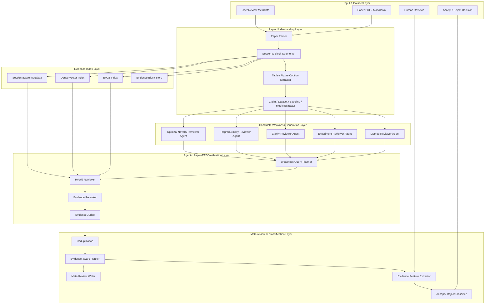
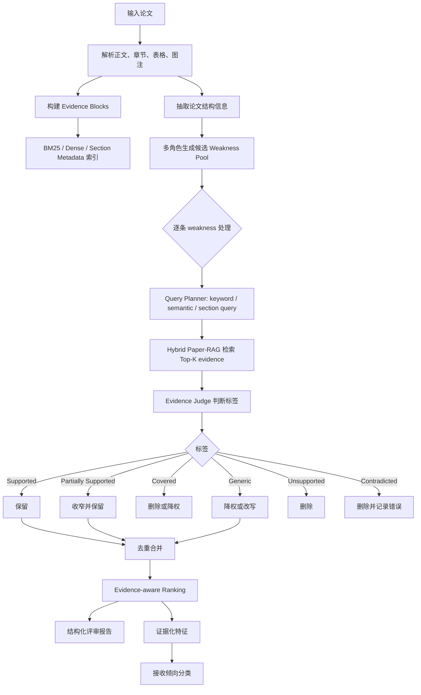
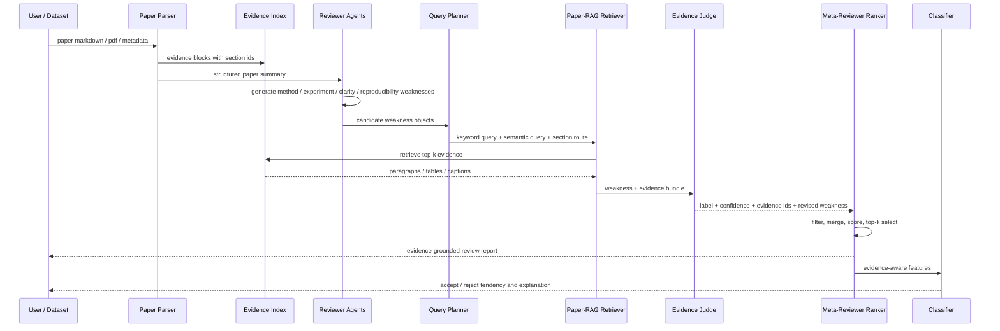

# EviReview-Lite 完整实验方案与系统架构流程设计

> 适用课题：基于证据校验的轻量级学术论文自动评审与接收倾向分类系统研究  
> 核心方向：Agentic RAG + weakness-level evidence verification + evidence-aware ranking + accept/reject tendency classification  
> 资料来源：新版开题报告、本地 `近三年_Agent_RAG_论文评审分类_相关论文/MinerU_md` 论文库、本地 PRISM/OpenReview ICLR 2024 样本。

## 1. 方案定位

EviReview-Lite 不以“替代人类审稿人”为目标，而是面向投稿前自检和审稿辅助，解决 LLM 自动评审中最容易出错的部分：**弱点评审意见是否具体、是否有证据、是否误读论文、是否可用于论文修改**。

本文将自动评审拆为五个可评估环节：

1. 从论文结构中生成候选弱点；
2. 将每条弱点转化为检索任务；
3. 在论文内部证据库中检索 evidence anchors；
4. 判断弱点与证据之间的支持、冲突或无证据关系；
5. 对有效弱点去重、排序，并提取证据化特征用于接收倾向分类。

系统主线可概括为：

```text
多角度生成候选弱点
    -> Paper-RAG 检索论文内部证据
    -> Evidence Judge 判断弱点是否成立
    -> Meta-Reviewer Ranker 保留高质量核心问题
    -> 分类器验证证据化弱点特征的解释价值
```

## 2. 文献证据与模块映射

本方案参考的 17 篇本地 Markdown 论文可归纳为四类。

| 类别 | 代表论文 | 对本课题的直接启发 | 本文采用方式 |
|---|---|---|---|
| 多智能体自动审稿 | MARG、ReviewAgents、AgentReview、Can LLMs be Trusted Paper Reviewers | 多角色 reviewer 可以提升覆盖度，但容易生成泛化或误判意见 | 只借鉴“候选弱点生成”思路，不把完整自动审稿作为最终目标 |
| 证据化评审与 review grounding | FactReview、ReviewGrounder、SubstanReview、RottenReviews | 自动评审需要 claim/comment 级证据支撑和细粒度质量指标 | 将 review weakness 作为最小验证单元，输出证据标签和 evidence anchor |
| 新颖性与外部文献上下文 | ScholarPeer、OpenNovelty、NoveltyAgent | 新颖性判断依赖外部文献、query expansion 和 evidence snippets | Literature-RAG 作为可选扩展，不作为主线必做 |
| RAG 与幻觉诊断 | RAGChecker、RefChecker、MA-RAG | RAG 评估应拆分 retrieval、claim entailment、generation quality；多 agent 可分解检索推理 | 设计 Query Planner、Hybrid Retriever、Evidence Judge 和指标分解 |

具体到系统模块：

| 本文模块 | 主要参考 | 采用的思想 | 简化策略 |
|---|---|---|---|
| Candidate Weakness Generator | MARG、ReviewAgents | 方法、实验、清晰度、复现性等多角色生成 | 不追求完整 review，只输出结构化 weaknesses |
| Weakness Query Planner | OpenNovelty、MA-RAG | 将复杂判断拆成 query、section route、entity route | 限制在论文内部章节优先路由 |
| Paper-RAG Retriever | RAGChecker、MA-RAG | 检索和生成分离，评价 retrieval quality | BM25 + dense retrieval + section rerank |
| Evidence Judge | FactReview、RefChecker、SubstanReview | claim/comment 级支持关系判断 | 标签控制为 6 类，人工可标注 |
| Review Quality Metrics | ReviewGrounder、RottenReviews | factuality、specificity、actionability、rubric quality | 只保留适合硕士实验的可量化指标 |
| Classification Head | DeepReview、ReviewGrounder | rating/decision prediction 与 review quality 相关 | 分类作为辅助实验，重点看可解释特征 |

## 3. 研究问题与实验假设

### 3.1 研究问题

**RQ1：** 多角色弱点生成是否比单模型直接生成更能覆盖人类评审中的主要弱点？

**RQ2：** Paper-RAG 证据校验能否过滤 LLM 生成的无证据、泛化、被论文已覆盖或与论文事实相矛盾的弱点？

**RQ3：** Evidence-aware Ranker 能否在 Top-K 输出中提高有效弱点比例、降低重复率，并提升人工偏好？

**RQ4：** 证据化弱点特征是否能为论文接收倾向分类提供可解释增益？

### 3.2 实验假设

| 编号 | 假设 | 验证方式 |
|---|---|---|
| H1 | 多角色生成比 Direct LLM 生成有更高 weakness recall | 与人工 review weakness 对齐，计算 Recall / Jaccard |
| H2 | 加入 Paper-RAG Verifier 后，保留弱点的 precision 和 evidence coverage 提升 | 标注 weakness 标签，计算 Supported Precision / Evidence Coverage |
| H3 | Hybrid Retriever 比 BM25-only 或 dense-only 更适合 weakness evidence retrieval | 人工 evidence 标注或弱监督证据对齐，计算 Evidence Recall@K |
| H4 | Evidence-aware Ranker 比 severity-only 排序更能把有效、具体、可操作问题排到前面 | Top-3/Top-5 Precision、人工偏好实验 |
| H5 | evidence-aware features 与文本特征融合后，分类结果更可解释，且可能提升 Macro-F1 | 分类消融、特征重要性分析 |

## 4. 总体系统架构

### 4.1 分层架构图



### 4.2 端到端流程图



### 4.3 Agent 协作时序图



## 5. 数据设计

### 5.1 数据来源

| 数据源 | 当前状态 | 用途 | 优先级 |
|---|---|---|---|
| 本地 PRISM/OpenReview ICLR 2024 sample | 已有 50 篇论文 Markdown、reviews、decision、manifest | 原型开发、Paper-RAG、弱点生成、分类小样本验证 | 最高 |
| OpenReview / PRISM 扩展样本 | 后续可按 API 扩展 | 扩大实验规模到 100-300 篇 | 高 |
| PeerRead | 可作为备选 | accept/reject 分类或历史对照 | 中 |
| DeepReview-13K / ReviewBench | 文献中常用 | 指标和 baseline 参考；若数据可得再扩展 | 中 |
| SubstanReview / RottenReviews | 质量评估参考 | 标签体系、质量指标设计 | 中 |

### 5.2 推荐实验规模

硕士毕设优先保证可完成，建议分三档设计：

| 档位 | 论文数 | weakness 数 | 目标 |
|---|---:|---:|---|
| Minimum Viable Experiment | 30 篇 | 240-360 条 | 跑通生成、检索、校验、Top-K 排序 |
| Main Experiment | 50 篇 | 400-600 条 | 使用本地 PRISM sample 完成主要实验 |
| Extended Experiment | 100-300 篇 | 800-3000 条 | 若 OpenReview 扩展顺利，用于分类和鲁棒性分析 |

### 5.3 数据切分

推荐使用分层切分，保证 accept/reject 比例平衡。

```text
Train / Dev / Test = 60% / 20% / 20%

Verifier 标注集：
- Dev：用于 prompt 和阈值调参
- Test：只用于最终报告指标

Classification：
- 使用 paper-level split
- 同一篇论文的所有 weakness 不得跨 train/test 泄漏
```

## 6. 数据结构与中间产物

### 6.1 Evidence Block

```json
{
  "paper_id": "iclr2024_001",
  "block_id": "p045",
  "section": "Experiments",
  "section_level": 2,
  "type": "paragraph",
  "text": "The paper reports results on ...",
  "prev_block_id": "p044",
  "next_block_id": "p046",
  "entities": {
    "datasets": ["..."],
    "baselines": ["..."],
    "metrics": ["Accuracy", "F1"]
  }
}
```

### 6.2 Candidate Weakness

```json
{
  "paper_id": "iclr2024_001",
  "weakness_id": "w003",
  "aspect": "experiment",
  "weakness": "The paper lacks ablation studies isolating the retrieval module.",
  "severity": 4,
  "target_sections": ["Experiments", "Ablation", "Results"],
  "suggestion": "Add ablations that remove or replace the retrieval module.",
  "generator": "experiment_reviewer"
}
```

### 6.3 Evidence Bundle

```json
{
  "paper_id": "iclr2024_001",
  "weakness_id": "w003",
  "queries": {
    "keyword_query": "ablation retrieval module remove replace",
    "semantic_query": "Does the paper isolate the contribution of the retrieval module through ablation studies?",
    "section_route": ["Experiments", "Ablation", "Results"]
  },
  "evidence": [
    {
      "evidence_id": "p045",
      "section": "Experiments",
      "text": "...",
      "bm25_score": 8.41,
      "dense_score": 0.78,
      "rerank_score": 0.83
    }
  ]
}
```

### 6.4 Verified Weakness

```json
{
  "paper_id": "iclr2024_001",
  "weakness_id": "w003",
  "label": "Supported",
  "confidence": 0.84,
  "evidence_ids": ["p045", "t002"],
  "reason": "The experiments report overall results but no ablation isolates the retrieval module.",
  "revised_weakness": "The experiment section reports overall performance but does not isolate the retrieval module through ablation.",
  "needs_human_check": false
}
```

## 7. 关键模块设计

### 7.1 Paper Processor

目标是把 Markdown/PDF 转成可检索的结构化证据库。

处理步骤：

1. 读取 Markdown 或 PDF 转换文本；
2. 根据标题层级识别章节；
3. 将正文切分为 paragraph-level blocks；
4. 保留 table caption、figure caption 和附近上下文；
5. 标记每个 block 的 section、type、order、前后邻居；
6. 抽取 dataset、baseline、metric、claim 等关键词。

建议切块策略：

| 内容类型 | 切分方式 | 原因 |
|---|---|---|
| 正文段落 | 自然段，过长时按 250-400 tokens 滑窗 | 保留语义完整性 |
| 表格 | caption + 表头 + 附近段落 | 实验弱点常依赖表格 |
| 图 | caption + 附近段落 | 方法结构和结果分析常在图注附近 |
| 附录 | 保留 section metadata | 复现性和补充实验可能在附录 |

### 7.2 Candidate Weakness Generator

建议使用四个必需 reviewer agent：

| Agent | 输入重点 | 输出重点 |
|---|---|---|
| Method Reviewer | Abstract、Introduction、Method | 方法假设、算法设计、理论解释不足 |
| Experiment Reviewer | Experiments、Results、Ablation、Tables | baseline、dataset、metric、ablation、显著性问题 |
| Clarity Reviewer | Method、Figures、Writing | 概念定义、结构清晰度、论证链问题 |
| Reproducibility Reviewer | Implementation、Appendix、Hyperparameters | 代码、超参数、训练设置、资源、复现实验问题 |

Novelty Reviewer 建议作为扩展 agent，只在 Literature-RAG 小样本实验中开启。

输出控制：

```text
每个 agent 输出 2-4 条 weakness。
每篇论文候选 weakness 总数控制在 8-12 条。
每条 weakness 必须包含 aspect、severity、target_sections、suggestion。
禁止输出只有“需要更多实验”“写得不清楚”这类无对象泛化句。
```

### 7.3 Weakness Query Planner

Query Planner 的目标是把 weakness 转换成可检索的证据需求。

| 输入 | 输出 |
|---|---|
| weakness text | semantic query |
| aspect | section route |
| key terms | keyword query |
| severity / suggestion | evidence need |

section route 规则：

| Weakness Aspect | 优先章节 |
|---|---|
| method | Method、Approach、Algorithm、Model |
| experiment | Experiments、Evaluation、Results、Ablation |
| clarity | Introduction、Method、Figures |
| reproducibility | Implementation、Training Details、Appendix |
| novelty | Introduction、Related Work、Conclusion |

### 7.4 Hybrid Paper-RAG Retriever

检索采用三阶段：

```text
BM25 Top-K1
Dense Retrieval Top-K2
    -> union
    -> section-aware rerank
    -> Top-K evidence bundle
```

建议参数：

| 参数 | 推荐值 |
|---|---:|
| BM25 Top-K | 8 |
| Dense Top-K | 8 |
| Rerank Top-K | 5 |
| Evidence window | block + previous + next |
| Section bonus | 0.05-0.15 |

rerank 公式：

```text
score(e, w) =
  0.45 * dense_similarity
+ 0.35 * normalized_bm25
+ 0.15 * section_match
+ 0.05 * entity_overlap
```

### 7.5 Evidence Judge

Evidence Judge 是核心模块，输入 weakness 和 evidence bundle，输出标签、置信度、理由和修订后的 weakness。

标签体系：

| 标签 | 定义 | 处理 |
|---|---|---|
| Supported | 论文证据支持该弱点成立 | 保留 |
| Partially Supported | 弱点方向成立，但表述过宽或缺少限定 | 收窄后保留 |
| Covered | 论文已经处理该问题，候选弱点误判 | 删除或降权 |
| Generic | 过于泛化，不能锚定具体论文内容 | 降权或改写 |
| Unsupported | 找不到证据支持，可能是幻觉或误读 | 删除 |
| Contradicted | 与论文证据相反 | 删除并记录为严重错误 |

判断原则：

```text
1. 没有证据，不允许判为 Supported。
2. 如果论文已在附录或表格中处理该问题，应判为 Covered。
3. 如果弱点正确但范围过大，应判为 Partially Supported，并生成 revised_weakness。
4. 如果检索结果与 weakness 无关，不得让模型凭常识补全。
5. Major Weakness 必须有至少一个 paragraph/table/figure evidence anchor。
```

### 7.6 Evidence-aware Ranker

Ranker 只处理 Verified Weakness，不重新生成新问题。

排序公式：

```text
rank_score(w) =
  0.30 * evidence_strength
+ 0.25 * severity
+ 0.20 * specificity
+ 0.15 * actionability
+ 0.10 * confidence
- 0.20 * redundancy_penalty
```

输出分组：

| 输出区块 | 内容 |
|---|---|
| Summary | 论文主题和贡献简述 |
| Strengths | 2-3 条优点 |
| Major Weaknesses | Top-3 evidence-grounded major weaknesses |
| Minor Weaknesses | 2-4 条次要问题 |
| Questions for Authors | 需要作者澄清的问题 |
| Needs Human Check | 低置信或依赖外部文献的问题 |
| Evidence Statistics | 各标签比例、证据覆盖率、unsupported rate |

### 7.7 Classification Head

分类模块用于验证证据化特征的下游价值，而不是代替审稿决策。

特征设计：

| 特征 | 含义 |
|---|---|
| valid_major_weakness_count | Supported / Partially Supported 的 major weakness 数 |
| unsupported_rate | Unsupported + Contradicted 比例 |
| generic_rate | Generic 比例 |
| covered_rate | Covered 比例 |
| evidence_coverage | 输出 weakness 中带 evidence anchor 的比例 |
| avg_evidence_strength | 保留弱点平均证据强度 |
| top3_rank_score | Top-3 弱点 rank score 均值 |
| method_weakness_score | 方法类弱点风险分 |
| experiment_weakness_score | 实验类弱点风险分 |
| reproducibility_weakness_score | 复现类弱点风险分 |
| novelty_risk_score | 新颖性风险分，可选 |

分类器建议：

1. Logistic Regression；
2. Linear SVM；
3. Random Forest；
4. text embedding + Logistic Regression；
5. text embedding + evidence features。

## 8. 实验方案

### 8.1 实验一：候选弱点生成质量

目的：验证多角色生成是否比单模型更能覆盖人类评审中的主要问题。

对比方法：

| 方法 | 描述 |
|---|---|
| Direct LLM Weakness | 单模型直接读取论文并输出弱点 |
| Structured Prompt | 单模型按 method / experiment / clarity / reproducibility 分项输出 |
| MARG-lite | 多角色生成 + 简单汇总 |
| MARG-lite + LLM Filter | 多角色生成后仅用 LLM 判断过滤 |
| Ours Candidate Generator | 多角色生成 + 结构化输出约束 |

评价指标：

| 指标 | 定义 |
|---|---|
| Weakness Recall | 覆盖人工 review 中主要弱点的比例 |
| Weakness Precision | 生成弱点中被人工标注为有效的比例 |
| Jaccard Similarity | 生成弱点集合与人工弱点集合的语义重叠 |
| Average Weakness Count | 每篇论文平均弱点数 |
| Generic Rate | 泛化弱点比例 |
| Redundancy Rate | 语义重复弱点比例 |

预期结果：MARG-lite 或多角色方法的 Recall 高于 Direct LLM，但 Precision 和 Generic Rate 可能较差，为后续证据校验提供必要性。

### 8.2 实验二：Paper-RAG 证据检索质量

目的：验证 Hybrid Paper-RAG 能否为 weakness 找到更相关的论文内部证据。

对比方法：

| 方法 | 描述 |
|---|---|
| BM25-only | 关键词检索 |
| Dense-only | 语义向量检索 |
| BM25 + Dense | 简单合并 |
| Hybrid + Section Rerank | 本文主方法 |
| Hybrid + Section + Entity Rerank | 加入 dataset/baseline/metric overlap |

评价指标：

| 指标 | 定义 |
|---|---|
| Evidence Recall@K | Top-K 是否包含人工认为相关的 evidence |
| Evidence Precision@K | Top-K 中相关 evidence 比例 |
| MRR | 第一个相关 evidence 的倒数排名 |
| Section Hit Rate | 检索结果是否命中目标章节 |
| Evidence Coverage | 可验证 weakness 中至少有一个有效 evidence 的比例 |

标注方式：从每篇论文抽取 5-8 条 weakness，对 Top-5 evidence 标注 relevant / partially relevant / irrelevant。

### 8.3 实验三：Evidence Verifier 标签预测

目的：验证系统能否正确判断弱点是否成立。

标签：

```text
Supported
Partially Supported
Covered
Generic
Unsupported
Contradicted
```

对比方法：

| 方法 | 描述 |
|---|---|
| LLM-only Verifier | 不给检索证据，让 LLM 判断 |
| BM25-RAG Verifier | 使用 BM25 evidence |
| Dense-RAG Verifier | 使用 dense evidence |
| Hybrid-RAG Verifier | 使用 hybrid evidence |
| Ours Full Verifier | Hybrid evidence + section/entity metadata + strict label rule |

评价指标：

| 指标 | 定义 |
|---|---|
| Accuracy | 总体标签准确率 |
| Macro-F1 | 六类标签平均 F1 |
| Supported Precision | 保留弱点中真正成立的比例 |
| Unsupported F1 | 识别无证据/幻觉弱点能力 |
| Covered F1 | 识别“论文已解决该问题”的能力 |
| Contradicted Count | 严重误判数量，越少越好 |

核心判定：即使总体 Accuracy 不极高，只要 Supported Precision、Unsupported F1 和 Evidence Coverage 明显优于 LLM-only，就能证明 Paper-RAG 证据校验的价值。

### 8.4 实验四：Top-K 排序与最终报告质量

目的：验证 Evidence-aware Ranker 是否能把最重要、最具体、最有证据的问题排到前面。

对比方法：

| 方法 | 描述 |
|---|---|
| Original Order | 保持生成顺序 |
| Severity-only | 只按生成器给出的严重性排序 |
| Evidence-only | 只按证据强度排序 |
| Confidence-only | 只按 verifier confidence 排序 |
| Evidence-aware Ranker | 综合证据、严重性、具体性、可操作性、置信度 |

评价指标：

| 指标 | 定义 |
|---|---|
| Top-3 Precision | Top-3 中 Supported / Partially Supported 比例 |
| Top-5 Precision | Top-5 中有效弱点比例 |
| Top-K Redundancy | Top-K 中语义重复比例 |
| Specificity Score | 是否指向具体章节、方法、实验、表格 |
| Actionability Score | 是否给出可执行修改建议 |
| Human Preference Win Rate | 人工比较两份报告时更偏好哪份 |

人工偏好实验建议：

```text
每篇论文展示两份匿名报告：
A = baseline report
B = EviReview-Lite report

评价维度：
1. 哪份更具体？
2. 哪份更有证据？
3. 哪份更能帮助作者修改论文？
4. 哪份更接近真实审稿人的 major concerns？
```

### 8.5 实验五：接收倾向分类辅助实验

目的：验证证据化弱点特征是否具有下游解释价值。

任务定义：

```text
Input:
  paper text / paper embedding
  generated weakness text
  verified weakness labels
  evidence-aware features

Output:
  accept / reject tendency
```

对比方法：

| 方法 | 输入 |
|---|---|
| Majority Class | 无 |
| TF-IDF + Logistic Regression | paper abstract/full text |
| TF-IDF + SVM | paper abstract/full text |
| Paper Embedding + Logistic Regression | paper embedding |
| Weakness Text Embedding | generated weaknesses |
| Evidence Features Only | evidence-aware numeric features |
| Text + Evidence Features | paper/text embedding + evidence-aware features |

评价指标：

| 指标 | 说明 |
|---|---|
| Accuracy | 整体准确率 |
| Macro-F1 | 类别不均衡时更可靠 |
| AUC | 排序能力 |
| Calibration Error | 分类置信度是否可靠 |
| Feature Importance | 哪些证据化特征最影响分类 |

解释方式：

```text
若 rejected paper 往往具有更高 valid_major_weakness_count、
experiment_weakness_score、unsupported_rate 或 lower evidence_coverage，
则说明证据化弱点特征能提供比黑箱文本 embedding 更直观的解释。
```

### 8.6 实验六：消融与案例分析

消融实验：

| 消融项 | 目的 |
|---|---|
| 去掉 section rerank | 验证论文结构信息价值 |
| 去掉 Evidence Judge strict rules | 验证严格标签规则价值 |
| 去掉 deduplication | 验证去重对 Top-K 质量影响 |
| 去掉 actionability | 验证排序是否变成只看证据而忽略可修改性 |
| 不使用 Partially Supported 改写 | 验证弱点收窄机制价值 |

案例分析建议选择 3 类论文：

1. 系统能正确过滤“论文已做 ablation”的误判弱点；
2. 系统能发现“baseline 缺失”且证据充分的真实弱点；
3. 系统失败案例，例如检索不到附录证据、表格解析错误或 novelty 需要外部文献。

## 9. 人工标注方案

### 9.1 标注对象

标注单位不是整篇 review，而是：

```text
(paper, candidate weakness, retrieved evidence bundle)
```

### 9.2 标注字段

| 字段 | 取值 |
|---|---|
| validity_label | Supported / Partially Supported / Covered / Generic / Unsupported / Contradicted |
| evidence_relevance | Relevant / Partially Relevant / Irrelevant |
| severity | 1-5 |
| specificity | 1-5 |
| actionability | 1-5 |
| evidence_anchor_correct | yes / no |
| human_note | 简短说明 |

### 9.3 标注指南

```text
Supported:
  evidence 明确支持 weakness，且 weakness 没有明显夸大。

Partially Supported:
  方向成立，但需要限定范围、降低语气或补充条件。

Covered:
  weakness 指出的问题已在正文、表格、附录中被处理。

Generic:
  weakness 可能适用于很多论文，缺少具体对象或证据锚点。

Unsupported:
  evidence 不支持该 weakness，也找不到论文内部依据。

Contradicted:
  evidence 显示 weakness 与论文事实相反。
```

### 9.4 质量控制

1. 随机抽取 20% 样本做双人标注；
2. 计算 Cohen's Kappa 或简单一致率；
3. 不一致样本由第三轮讨论形成 gold label；
4. 标注困难样本保留 `needs_human_check=true`，不强行归入 Supported。

## 10. 最终输出报告模板

```markdown
## Paper Summary
本文研究……主要贡献包括……

## Strengths
1. ...
2. ...

## Major Weaknesses
1. [Supported | confidence=0.84 | aspect=experiment]
   Weakness: ...
   Evidence:
   - Section 4.2, paragraph p045: ...
   - Table 2 caption, t002: ...
   Suggestion: ...

2. [Partially Supported | confidence=0.72 | aspect=method]
   Revised Weakness: ...
   Evidence:
   - Section 3.1, paragraph p031: ...
   Suggestion: ...

## Minor Weaknesses
- ...

## Questions for Authors
- ...

## Needs Human Check
- [Novelty] This issue requires external literature verification.

## Evidence Statistics
- Supported: 4
- Partially Supported: 2
- Covered: 1
- Generic: 2
- Unsupported: 3
- Contradicted: 0
- Evidence Coverage: 0.78
```

## 11. 预期结果呈现

### 11.1 主结果表

| 方法 | Weakness Precision | Weakness Recall | Generic Rate | Evidence Coverage | Top-3 Precision |
|---|---:|---:|---:|---:|---:|
| Direct LLM | 待实验 | 待实验 | 待实验 | 待实验 | 待实验 |
| Structured Prompt | 待实验 | 待实验 | 待实验 | 待实验 | 待实验 |
| MARG-lite | 待实验 | 待实验 | 待实验 | 待实验 | 待实验 |
| MARG-lite + LLM Filter | 待实验 | 待实验 | 待实验 | 待实验 | 待实验 |
| EviReview-Lite | 待实验 | 待实验 | 待实验 | 待实验 | 待实验 |

### 11.2 检索实验表

| Retriever | Evidence Recall@3 | Evidence Recall@5 | MRR | Section Hit Rate |
|---|---:|---:|---:|---:|
| BM25 | 待实验 | 待实验 | 待实验 | 待实验 |
| Dense | 待实验 | 待实验 | 待实验 | 待实验 |
| BM25 + Dense | 待实验 | 待实验 | 待实验 | 待实验 |
| Hybrid + Section Rerank | 待实验 | 待实验 | 待实验 | 待实验 |

### 11.3 Verifier 实验表

| Verifier | Accuracy | Macro-F1 | Supported Precision | Unsupported F1 | Covered F1 |
|---|---:|---:|---:|---:|---:|
| LLM-only | 待实验 | 待实验 | 待实验 | 待实验 | 待实验 |
| BM25-RAG | 待实验 | 待实验 | 待实验 | 待实验 | 待实验 |
| Dense-RAG | 待实验 | 待实验 | 待实验 | 待实验 | 待实验 |
| Hybrid-RAG | 待实验 | 待实验 | 待实验 | 待实验 | 待实验 |
| Ours Full | 待实验 | 待实验 | 待实验 | 待实验 | 待实验 |

### 11.4 分类实验表

| 输入特征 | Accuracy | Macro-F1 | AUC | 解释性 |
|---|---:|---:|---:|---|
| Majority | 待实验 | 待实验 | 待实验 | 无 |
| TF-IDF Paper | 待实验 | 待实验 | 待实验 | 低 |
| Paper Embedding | 待实验 | 待实验 | 待实验 | 低 |
| Weakness Text | 待实验 | 待实验 | 待实验 | 中 |
| Evidence Features | 待实验 | 待实验 | 待实验 | 高 |
| Text + Evidence Features | 待实验 | 待实验 | 待实验 | 高 |

## 12. 实现路线

| 阶段 | 任务 | 产出 |
|---|---|---|
| 第 1 阶段 | 整理本地 PRISM sample，统一 paper/review/decision manifest | 可复现实验数据表 |
| 第 2 阶段 | Paper Processor 与 evidence block schema | JSONL evidence blocks |
| 第 3 阶段 | BM25、dense、hybrid retriever | 检索模块与 Recall@K 评估脚本 |
| 第 4 阶段 | Direct / Structured / MARG-lite weakness generator | candidate weakness pool |
| 第 5 阶段 | Evidence Judge prompt 与标签输出 | verified weakness objects |
| 第 6 阶段 | 人工标注 300-600 条 weakness | verifier test set |
| 第 7 阶段 | Evidence-aware Ranker 与报告生成 | final review reports |
| 第 8 阶段 | 分类特征提取与分类实验 | accept/reject classification results |
| 第 9 阶段 | 消融、案例分析、失败分析 | 毕设论文实验章节素材 |

## 13. 风险与替代方案

| 风险 | 影响 | 替代方案 |
|---|---|---|
| PDF/Markdown 解析错误 | evidence block 不准确 | 优先使用本地 MinerU Markdown；表格只保留 caption 和附近段落 |
| MARG 完整复现成本高 | baseline 不稳定 | 使用 MARG-lite 多角色 prompt 作为主 baseline |
| 人工标注成本高 | verifier 指标不足 | 先标注 300 条，主实验用 Macro-F1 + case study |
| 外部文献检索不可复现 | novelty 判断不稳定 | Literature-RAG 只做小规模案例，不进入主指标 |
| 分类性能提升有限 | 分类贡献偏弱 | 将分类定位为“可解释性辅助实验”，重点分析 feature ablation |
| LLM 判断不稳定 | 实验可重复性差 | 固定 prompt、temperature=0、缓存所有中间输出 |

## 14. 写入毕业论文时的章节建议

建议把本方案拆入毕业论文：

```text
第 3 章 系统设计
  3.1 总体架构
  3.2 论文解析与证据索引
  3.3 多智能体弱点生成
  3.4 Weakness-oriented Paper-RAG
  3.5 证据校验与元评审排序
  3.6 接收倾向分类模块

第 4 章 实验设计
  4.1 数据集与预处理
  4.2 人工标注方案
  4.3 Baseline 设置
  4.4 评价指标
  4.5 弱点生成实验
  4.6 证据检索与校验实验
  4.7 排序与报告质量实验
  4.8 接收倾向分类实验
  4.9 消融和案例分析
```

## 15. 最终可交付物清单

| 类型 | 交付物 |
|---|---|
| 系统 | EviReview-Lite 原型，支持输入论文 Markdown 输出结构化评审报告 |
| 数据 | 论文 evidence block JSONL、candidate weakness JSONL、verified weakness JSONL |
| 标注 | 300-600 条 weakness-level gold labels |
| 实验 | 生成质量、检索质量、校验质量、排序质量、分类质量五组实验 |
| 图表 | 系统架构图、流程图、时序图、主结果表、消融表、案例图 |
| 论文材料 | 文献综述、系统设计、实验设计、结果分析、失败案例分析 |

## 16. 关键边界声明

本文应明确写出以下边界，避免答辩时被追问到不可完成方向：

1. 不训练或微调大语言模型；
2. 不声称替代人类审稿人；
3. 不把完整外部文献检索作为主线；
4. 不要求复现论文代码执行结果；
5. 不以 accept/reject 分类性能作为唯一贡献；
6. 核心贡献是 weakness-level evidence verification 和 evidence-aware review refinement。

这样的边界更符合硕士毕设可实现性，也更容易把实验做扎实。

## 17. 本地论文证据索引

本节记录本方案与本地 Markdown 论文的对应关系，后续写文献综述、系统设计和实验设计时可以直接追溯。

| 文件 | 论文方向 | 关键结论或可复用点 | 用于本文 |
|---|---|---|---|
| `01_MARG_Multi_Agent_Review_Generation_2024.md` | 多智能体评审生成 | MARG 用多 agent 专门处理实验、清晰度、新颖性等评论类型；其高召回版本会生成更多评论但 precision 偏低 | Candidate Weakness Generator 与 MARG-lite baseline |
| `02_FactReview_Evidence_Grounded_Reviews_2026.md` | 证据化审稿 | 以 claim 为最小单位，结合论文、相关文献和代码执行证据输出 Supported / Partially supported / In conflict 等标签 | Evidence Judge 标签体系与 evidence report 思路 |
| `03_DeepReview_DeepReview13K_2025.md` | 深度审稿数据与分类 | 将审稿过程拆为 novelty verification、multi-dimension evaluation、reliability verification；报告 rating MSE、decision accuracy、F1 | 接收倾向分类任务、DeepReview/ReviewBench 相关 baseline |
| `04_ScholarPeer_Context_Aware_Multi_Agent_Framework_2026.md` | 外部上下文多智能体审稿 | 使用 literature review、baseline scout、Q&A 和 review generator，强调外部文献上下文对 novelty/significance 判断的价值 | Literature-RAG 可选扩展与 novelty case study |
| `05_ReviewGrounder_existing.md` | rubric-guided grounded review | 构建 REVIEWBENCH，以 paper-specific rubrics 评价 review 的 contribution accuracy、results interpretation、evidence-based critique 等维度 | 评审质量指标、rubric-based 人工评价维度 |
| `06_RottenReviews_Review_Quality_Benchmark_2025.md` | 评审质量 benchmark | 使用 review length、reference、section-specific comments、raised questions 等可量化指标评估 review quality | Specificity、Actionability、Evidence Coverage 指标设计 |
| `07_ReviewAgents_Review_CoT_2025.md` | Review-CoT 与多步审稿 | 将审稿推理拆为 summarization、analysis、conclusion，并构建 Review-CoT 数据 | 结构化 reviewer agent 输出格式 |
| `08_AgentReview_EMNLP2024.md` | Peer review dynamics simulation | 模拟 reviewer、author、AC 多角色互动，说明 reviewer commitment、knowledgeability 等变量会影响决策 | 相关工作讨论；不作为主线复现对象 |
| `09_Can_LLMs_Provide_Useful_Feedback_2024.md` | LLM feedback empirical study | 大规模比较 LLM feedback 与人类反馈，指出 LLM 反馈常缺少具体、可操作、领域深入 critique | 研究动机：直接 LLM review 不可靠，需要证据化校验 |
| `10_SubstanReview_Review_Substantiation_2023.md` | review substantiation | 将 review 中的 claim-evidence pair 抽取为任务，并用专家标注评估 substantiation | Weakness-evidence pair 标注思想 |
| `11_OpenNovelty_Verifiable_Novelty_Assessment.md` | 可验证新颖性评估 | 抽取 contribution claims，生成 6-12 个 semantic queries，检索 prior work，并做 contribution-level comparison 与 evidence verification | Query Planner、query expansion、可选 Literature-RAG |
| `12_NoveltyAgent_Pointwise_Novelty_Analysis.md` | point-wise novelty analysis | 将论文拆成 novelty points，构建 related-paper database，并用 checklist-based evaluation 做自验证 | Novelty Reviewer 扩展模块与 checklist 评价 |
| `13_Can_LLMs_Be_Trusted_Paper_Reviewers_2025.md` | RAG + AutoGen 审稿可行性 | RAG、AutoGen multi-agent、CoT 可降低审稿成本，但与真实 accepted papers 的相似度仍有限，存在 hallucination 和 retrieval preference | 说明系统应定位为辅助工具，不替代人类审稿 |
| `14_RAGChecker_Fine_grained_RAG_Evaluation_2024.md` | 细粒度 RAG 评估 | 将 RAG 评价拆为 retriever 与 generator，并使用 claim entailment 进行细粒度诊断 | Evidence Recall@K、generator/verifier 分解评价 |
| `15_RefChecker_Fine_grained_Hallucination_Checker_2024.md` | 细粒度幻觉检测 | 将模型输出拆为 claim-triplets，再基于 reference 检查支持关系 | Weakness 分解与 Unsupported / Contradicted 判断 |
| `16_MA_RAG_Multi_Agent_RAG_2025.md` | 多智能体 RAG | Planner、Step Definer、Extractor、QA Agent 分工，提升复杂检索推理任务效果 | Query Planner、Evidence Extractor、Judge 分层设计 |
| `17_ReviewGrounder_arXiv_2026.md` | rubric + tool-integrated review grounding | 与 `05_ReviewGrounder_existing.md` 内容相近，强调 draft review generation、multi-dimensional grounding、rubric-guided synthesis | 作为 ReviewGrounder 版本补充，支撑分阶段 grounding 流程 |

本方案对这些论文的使用原则是：**借鉴可落地机制，不承诺复现高成本系统**。因此，MARG、ReviewAgents、MA-RAG 用于 agent 拆分；FactReview、SubstanReview、RefChecker 用于证据判断；ReviewGrounder、RottenReviews 用于质量指标；ScholarPeer、OpenNovelty、NoveltyAgent 只作为外部文献检索扩展依据。
