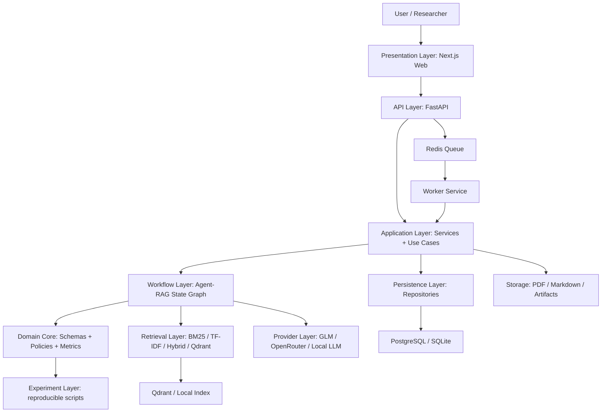

# Agent RAG 前后端重构架构设计

日期：2026-06-02

适用范围：EviReview-Lite 毕业设计系统重构、实验工程化、前后端演示系统建设。

本设计先对齐当前实验进度，再给出面向重构的前端、后端、Agent-RAG、实验层分层架构。目标不是把实验脚本立刻改造成复杂生产平台，而是把已经验证有效的链路沉淀成清晰、可测试、可展示、可写进论文的系统架构。

---

## 1. 现有进度对齐

### 1.1 研究定位

项目当前定位与开题报告一致：做“基于证据校验的轻量级学术论文自动评审辅助系统”，不是替代审稿人，也不是只做 accept/reject 分类。系统主线是：

```text
论文正文 / OpenReview 数据
  -> 候选弱点抽取或生成
  -> Paper-RAG 证据检索
  -> Evidence Verifier
  -> Evidence-aware Ranker
  -> 结构化评审审计报告
  -> 辅助分类 / 案例分析
```

当前系统最稳定、最能支撑论文创新点的拆解是：

1. Candidate weakness generation：用 human weaknesses、rubric-agent、GLM-4.6V structured reviewer 形成候选弱点。
2. Paper-RAG retrieval：用 BM25、TF-IDF、hybrid、section-aware、hierarchical tools 检索论文内部证据。
3. Evidence verifier：判断 weakness 是否 Supported、Partially Supported、Mentioned but Not Problem、Generic / Vague、Unsupported 或 Contradicted。
4. Evidence-aware ranker：把 support、severity、category、generic penalty 转成 top weaknesses。
5. Auxiliary classifier：只作为辅助实验，不能作为主贡献。

### 1.2 已完成实验资产

| 模块 | 已完成内容 | 对重构的影响 |
| --- | --- | --- |
| 本地 OpenReview/PRISM | 50 papers、1463 human weaknesses、2597 evidence blocks | 作为端到端主应用数据源 |
| Retrieval baselines | BM25、TF-IDF、Hybrid、Section-aware Hybrid、Hierarchical Paper-RAG | 稳定逻辑应抽到核心 RAG 包 |
| 外部 ready-label 数据集 | SubstanReview、CLAIMCHECK、PeerReview Bench、PeerQA-XT | 作为实验层和验证层，不混入产品 API |
| Rubric-agent | 50 papers / 194 generated weaknesses | 作为可复现 reviewer baseline |
| GLM-4.6V reviewer | 10 papers / 27 weaknesses / clean JSON run | 作为小样本 provider diagnostic，密钥只走环境变量 |
| Ranker | generated weakness top-3 diagnostic | 作为 ranker service 的第一版公式来源 |
| 论文实验表格 | `thesis_experiment_tables.md` | 前端 dashboard 可直接读取或复刻这些指标 |

### 1.3 当前不足

1. 实验脚本已经能跑通，但模块边界混在 `code/experiments/evireview_a/src` 中，不利于前后端复用。
2. JSONL 数据契约已经形成，但没有统一 domain schema，后续 API、worker、实验脚本容易重复定义字段。
3. Retrieval / verifier / ranker 结果已经有报告，但缺少面向用户的 evidence workspace。
4. GLM、OpenRouter 等 provider 已接入实验，但密钥、重试、结构化输出错误处理需要成为独立 adapter，不能散落在脚本里。
5. 实验结论必须继续区分 gold、silver、proxy、diagnostic，前端和报告都要显示这个边界。

---

## 2. 架构方案取舍

### 2.1 方案 A：实验脚本继续堆叠

做法：继续在 `code/experiments/evireview_a/src` 添加脚本，把前端只做成读取报告的静态页面。

优点：最快，依赖最少。

缺点：无法体现前后端系统架构；API、任务状态、证据追踪、交互式工作区都不完整；后期论文系统章节会显得像实验集合，而不是系统设计。

结论：不推荐作为重构方向，只保留为短期实验沙盒。

### 2.2 方案 B：Python-first 分层全栈架构

做法：保留 Python 实验能力，把稳定逻辑抽到 `packages/evireview_core`；后端使用 FastAPI；worker 跑 ingestion、retrieval、verifier、ranker；前端使用 Next.js 做 evidence workspace 和 experiment dashboard。

优点：

1. 与现有实验代码语言一致，迁移成本可控。
2. 能清楚体现前端、API、任务编排、Agent-RAG 核心、实验层的边界。
3. 适合毕业设计答辩演示，也适合论文“系统设计与实现”章节。
4. 可先用 JSONL / SQLite / local index 起步，再升级到 PostgreSQL / Qdrant。

缺点：比纯脚本多一层工程建设，但可以分阶段做。

结论：推荐采用。

### 2.3 方案 C：直接上完整 RAG 平台式架构

做法：接近 Dify / RAGFlow 的平台级结构，包含多租户、工作流编辑器、向量库管理、多知识库、多 provider 管理等。

优点：系统感强。

缺点：工作量过大，会偏离开题报告的 evidence-grounded review audit 主线；平台功能会挤压实验验证时间。

结论：不推荐。只借鉴 workflow、document parsing、citation trace、RAG engine 分层思想。

### 2.4 推荐结论

采用方案 B：Python-first 分层全栈架构。

重构原则：

1. `code/experiments/evireview_a` 继续作为研究沙盒，不强行一次性搬空。
2. 通过 `packages/evireview_core` 固化稳定的 domain schema、retrieval、verification、ranking、reporting 逻辑。
3. `services/api` 只负责 HTTP、校验、资源管理和任务触发。
4. `services/worker` 负责长任务，调用同一套 core，不复制实验脚本。
5. `apps/web` 做论文工作区、证据查看、弱点排序、实验 dashboard。
6. 所有 provider key 只从环境变量读取，不进入代码、日志、报告或 durable docs。

---

## 3. 技术栈选型

### 3.1 前端

| 能力 | 技术 | 选择原因 |
| --- | --- | --- |
| 应用框架 | Next.js + React + TypeScript | 适合 dashboard、workspace、报告页；生态成熟 |
| 样式 | Tailwind CSS | 快速做密集型科研工具界面 |
| 组件 | shadcn/ui | 表格、弹窗、tabs、form、tooltip 组件成熟 |
| 数据请求 | TanStack Query | 适合 job 状态、指标、报告等 server state |
| 表格 | TanStack Table | weakness / evidence / experiment metrics 都依赖高密度表格 |
| 本地 UI 状态 | Zustand | 保存当前 paper、选中 weakness、证据面板状态 |
| 表单校验 | React Hook Form + Zod | 上传、run config、filter 配置需要校验 |
| Markdown 报告 | react-markdown | 渲染审计报告和实验报告 |
| PDF 预览 | 浏览器 PDF viewer 或 react-pdf | 支持 paper workspace 中查看原文 |

前端不是营销页，而是工作台。第一屏应是项目 / 实验 dashboard 或 paper workspace。

### 3.2 后端

| 能力 | 技术 | 选择原因 |
| --- | --- | --- |
| API | FastAPI | 与 Python 实验代码兼容，Pydantic schema 明确 |
| Schema | Pydantic v2 | 请求、响应、domain DTO 可复用 |
| 数据库 ORM | SQLAlchemy + Alembic | 可维护的关系数据和迁移 |
| 数据库 | PostgreSQL；开发期可 SQLite | paper、weakness、run、report 等关系清晰 |
| 任务队列 | Redis + RQ 或 Celery | ingestion / retrieval / verifier 是长任务 |
| 日志 | Python logging + JSON formatter | 保留 run_id、paper_id、job_id，便于追踪 |
| 配置 | pydantic-settings + `.env.example` | 密钥只从环境变量读取 |
| 流式状态 | Server-Sent Events，轮询 fallback | 前端展示 job progress 和 agent trace |

优先建议 RQ，而不是一开始就 Celery。原因是本项目 worker 任务数量有限，RQ 配置更轻，足够支撑论文演示和本地实验。若后续任务并发和调度复杂度上升，再迁移 Celery。

### 3.3 Agent-RAG 核心

| 能力 | 技术 | 选择原因 |
| --- | --- | --- |
| Agent 编排 | LangGraph 风格状态图 | 评审审计不是一次 chain，而是多阶段可追踪状态机 |
| 稀疏检索 | BM25 / rank-bm25 或现有实现 | 当前实验已证明 BM25 是强 baseline |
| 词面向量 baseline | TF-IDF | 无依赖、可解释，保留为实验对照 |
| Dense retrieval | Qdrant + embedding adapter | B 版或规模扩大后启用 |
| Hybrid fusion | RRF + section prior | 与当前 hierarchical Paper-RAG 结果对齐 |
| LLM provider | MiniMax / GLM / OpenRouter / local-compatible adapter | 所有模型接入走统一 provider interface |
| 报告 | Markdown + JSON summary | 论文材料和前端展示都能复用 |

核心架构不把 LangChain / LlamaIndex 作为必须依赖。可以借鉴其数据抽象，但先保持本项目的 domain schema 自主可控，避免为了框架而重写实验。

### 3.4 存储

| 数据类型 | 存储 | 说明 |
| --- | --- | --- |
| app metadata | PostgreSQL / SQLite | projects、papers、runs、jobs、reports |
| evidence chunks | PostgreSQL + local JSONL；后续 Qdrant payload | 开发期先不强制向量库 |
| vector embeddings | Qdrant | B 版启用，用 `paper_id`、`section_type`、`run_id` filter |
| raw PDFs / Markdown | local object store | 先用 `storage/`，后续可换 MinIO/S3 |
| experiment artifacts | `code/experiments/.../data` 和 `reports` | 保持可复现，不让 web 写入实验 gold 数据 |
| job cache | Redis | 任务进度、短期状态 |

---

## 4. 总体分层架构



### 4.1 Presentation Layer

职责：

1. 上传或选择论文、数据集、实验 run。
2. 展示 paper outline、weakness table、evidence candidates、verifier label、ranked findings。
3. 展示实验 dashboard：Local OpenReview、SubstanReview、CLAIMCHECK、PeerReview Bench、PeerQA-XT、GLM diagnostic。
4. 导出审计报告和论文实验表格。

不负责：

1. 不在前端计算 verifier / ranker。
2. 不保存 raw secret。
3. 不把 proxy metric 包装成 gold metric。

### 4.2 API Layer

职责：

1. HTTP 路由、请求校验、响应 schema。
2. 创建 project、paper、review、run、report。
3. 触发 worker job。
4. 暴露 job progress 和 agent trace。

不负责：

1. 不直接写复杂 SQL。
2. 不直接调用 provider。
3. 不复制 experiment script 逻辑。

### 4.3 Application Layer

职责：

1. 编排用例：导入论文、构建 evidence blocks、运行 retrieval、运行 verifier、生成 report。
2. 统一 run lifecycle：created、queued、running、succeeded、failed、cancelled。
3. 管理 artifact path、license guardrail、provider config。
4. 把 core 输出映射到数据库和报告。

### 4.4 Workflow Layer

职责：

用状态图表达 Agent-RAG 流程：

```text
START
  -> ingest_paper
  -> build_evidence_blocks
  -> generate_or_import_weaknesses
  -> plan_weakness_queries
  -> retrieve_evidence
  -> verify_support
  -> rank_findings
  -> compose_report
  -> END
```

每个节点输入输出都应能保存为 JSON fixture，便于回归测试。

### 4.5 Domain Core

职责：

定义不可随便变化的核心对象：

1. `Paper`
2. `PaperSection`
3. `EvidenceBlock`
4. `Review`
5. `Weakness`
6. `WeaknessQuery`
7. `RetrievalCandidate`
8. `EvidenceBundle`
9. `VerificationResult`
10. `RankedFinding`
11. `ReviewAuditReport`
12. `ExperimentRun`

Domain core 不依赖 FastAPI、数据库、Qdrant 或具体 LLM provider。

### 4.6 Retrieval Layer

职责：

1. 同一篇论文内 top-k evidence retrieval。
2. 支持 BM25、TF-IDF、section-aware hybrid、hierarchical tools。
3. 保留每条 evidence 的 `block_id`、`paper_id`、`section_path`、`section_type`、score、rank、retriever_name。
4. 支持 RRF merge 和 section prior。

当前应先工程化已有无依赖检索和 hierarchical Paper-RAG，dense / Qdrant 作为第二阶段。

### 4.7 Provider Layer

职责：

1. 统一 MiniMax、GLM、OpenRouter、本地 OpenAI-compatible provider。
2. 统一 structured JSON output schema。
3. 处理 retry、JSON repair、timeout、rate limit、redaction。
4. 所有密钥只通过环境变量，例如 `GLM_API_KEY` 或 `ZAI_API_KEY`。

provider 输出必须标注：

1. `provider_name`
2. `model_name`
3. `prompt_version`
4. `schema_version`
5. `is_silver`
6. `generation_error`

### 4.8 Experiment Layer

职责：

1. 保留可复现实验脚本和 metrics JSON。
2. 把实验数据源、license、raw text 提交边界写清楚。
3. 通过 adapter 调用 core，而不是让 core 反向依赖实验目录。
4. 继续把 gold、silver、proxy、diagnostic 分开。

---

## 5. Agent-RAG 流程设计

### 5.1 State Schema

```python
class ReviewAuditState(TypedDict):
    project_id: str
    paper_id: str
    run_id: str
    source_mode: Literal["human_review", "rubric_agent", "glm_reviewer"]
    sections: list[PaperSection]
    evidence_blocks: list[EvidenceBlock]
    weaknesses: list[Weakness]
    queries: dict[str, list[WeaknessQuery]]
    retrieval: dict[str, list[RetrievalCandidate]]
    verification: dict[str, VerificationResult]
    ranked_findings: list[RankedFinding]
    report_markdown: str | None
    trace: list[WorkflowEvent]
    errors: list[WorkflowError]
```

### 5.2 Agent Nodes

| 节点 | 输入 | 输出 | 当前实验来源 |
| --- | --- | --- | --- |
| `ingest_paper` | PDF / Markdown / OpenReview JSON | `Paper`、`PaperSection` | `prepare_manifest.py`、MinerU markdown |
| `build_evidence_blocks` | `PaperSection` | `EvidenceBlock[]` | `build_evidence_blocks.py` |
| `generate_or_import_weaknesses` | paper + mode | `Weakness[]` | human parser、rubric-agent、GLM reviewer |
| `plan_weakness_queries` | weakness | keyword / semantic / section query | hierarchical retrieval scripts |
| `retrieve_evidence` | queries + index | candidates | BM25、TF-IDF、section-aware、RRF |
| `verify_support` | weakness + evidence | label + score + rationale | rule-based / feature / LLM verifier |
| `rank_findings` | weaknesses + verification | top-k findings | generated weakness ranker |
| `compose_report` | findings + trace | Markdown / JSON report | report renderers |

### 5.3 Verifier Label Contract

| Label | 含义 | 前端显示 |
| --- | --- | --- |
| Supported | 证据明确支持该 weakness | 保留，高置信 |
| Partially Supported | 证据部分支持，需要人工复核 | 保留，提示复核 |
| Mentioned but Not Problem | 论文提到相关内容，但证据不足以证明是问题 | 降权 |
| Generic / Vague | weakness 空泛，无法被具体证据验证 | 降权或删除 |
| Unsupported | top-k 证据不支持 | 删除或低优先级 |
| Contradicted | 证据与 weakness 相反 | 删除并记录错误 |

### 5.4 Ranker 第一版公式

当前 ranker 可先使用可解释公式：

```text
rank_score =
  (0.45 + support_score)
  * verifier_label_weight
  * severity_weight
  * category_weight
  * generic_penalty
  * redundancy_penalty
```

初始权重来源于已有 generated weakness ranker 诊断。后续若人工 gold labels 完成，再用 gold label 评估 Top-3 Supported Precision、NDCG@3、MAP。

---

## 6. 后端 API 设计

### 6.1 Resource API

```text
GET    /api/projects
POST   /api/projects
GET    /api/projects/{project_id}

GET    /api/papers
POST   /api/papers/import
GET    /api/papers/{paper_id}
GET    /api/papers/{paper_id}/sections
GET    /api/papers/{paper_id}/evidence-blocks

GET    /api/reviews/{review_id}
GET    /api/weaknesses?paper_id=...
GET    /api/weaknesses/{weakness_id}

POST   /api/runs/review-audit
GET    /api/runs/{run_id}
GET    /api/runs/{run_id}/trace
GET    /api/runs/{run_id}/findings

GET    /api/reports/{report_id}
GET    /api/reports/{report_id}/markdown

GET    /api/experiments/summary
GET    /api/experiments/{experiment_name}/metrics
```

### 6.2 Job API

```text
GET    /api/jobs/{job_id}
GET    /api/jobs/{job_id}/events
POST   /api/jobs/{job_id}/cancel
```

`/events` 使用 SSE；前端断线后可退回轮询。

### 6.3 Run Config

```json
{
  "paper_id": "001",
  "source_mode": "glm_reviewer",
  "retriever": "hierarchical_rrf",
  "verifier": "heuristic_v1",
  "ranker": "evidence_aware_v0",
  "top_k": 5,
  "provider": {
    "name": "glm",
    "model": "glm-4.6v"
  },
  "write_artifacts": true
}
```

API 只接收 provider name 和 model name，不接收 API key。key 由 worker 运行环境读取。

---

## 7. 数据模型

### 7.1 核心表

| 表 | 关键字段 | 说明 |
| --- | --- | --- |
| `projects` | id、name、created_at | 项目集合 |
| `papers` | id、project_id、title、decision、source_dataset、artifact_uri | 论文 |
| `paper_sections` | id、paper_id、section_path、section_type、start_offset、end_offset | 章节 |
| `evidence_blocks` | id、paper_id、section_id、section_type、text_hash、artifact_ref | 证据块 |
| `reviews` | id、paper_id、reviewer_id、source | human / generated review |
| `weaknesses` | id、paper_id、review_id、text_hash、category、severity、source | 弱点 |
| `retrieval_runs` | id、run_id、retriever_name、config_json | 检索 run |
| `retrieval_candidates` | id、retrieval_run_id、weakness_id、block_id、rank、score | 检索候选 |
| `verification_results` | id、run_id、weakness_id、label、support_score、rationale_ref | 验证结果 |
| `ranked_findings` | id、run_id、weakness_id、rank、rank_score | 排序结果 |
| `reports` | id、run_id、report_type、artifact_uri | 报告 |
| `jobs` | id、run_id、status、progress、error | 后台任务 |
| `experiment_runs` | id、name、dataset、metric_artifact_uri、status | 实验摘要 |

### 7.2 Artifact 原则

1. 数据库保存元数据、hash、artifact URI，不强制保存大段 raw text。
2. 无 license 的外部 raw text 不进入 git，也不进入公开报告。
3. 报告中可展示聚合指标和短证据引用，但要遵守数据许可。
4. 每个 run 保存 config、schema_version、prompt_version，方便论文复现实验。

---

## 8. 前端页面设计

### 8.1 信息架构

```text
/projects
/projects/[projectId]
/papers/[paperId]
/papers/[paperId]/workspace
/runs/[runId]
/experiments
/experiments/[experimentName]
/reports/[reportId]
```

### 8.2 Paper Workspace

布局：

```text
左侧：Paper Outline / Section Filter
中间：Evidence Viewer / Markdown Section / PDF Preview
右侧：Weakness Detail / Retrieval Trace / Verifier Result / Rank Score
底部：Run Timeline / Error Trace
```

关键交互：

1. 点击 weakness，自动高亮 top-k evidence blocks。
2. 切换 retriever，比较 section-aware 与 hierarchical top-k。
3. 显示 label 口径：gold、silver、proxy、diagnostic。
4. 一键导出当前 paper 的 audit report。

### 8.3 Experiment Dashboard

展示：

1. Local OpenReview retrieval metrics。
2. PeerQA-XT Paper-RAG QA metrics。
3. SubstanReview verifier floor。
4. CLAIMCHECK grounded weakness retrieval / ranker。
5. PeerReview Bench evidence-aware feature baseline。
6. Rubric-agent vs GLM-4.6V clean 10-paper diagnostic。

dashboard 必须标注指标性质：

| 类型 | 含义 |
| --- | --- |
| gold | 人工标注或公开 benchmark label |
| silver | 规则或模型生成的诊断标签 |
| proxy | section alignment、coverage 等间接指标 |
| diagnostic | 小样本或 provider 接入诊断 |

---

## 9. 分层目录结构

推荐目录：

```text
apps/
  web/
    app/
      projects/
      papers/
      runs/
      experiments/
      reports/
      layout.tsx
      page.tsx
    components/
      common/
      project/
      paper/
      weakness/
      evidence/
      verifier/
      ranker/
      experiments/
      reports/
    features/
      paper-workspace/
      experiment-dashboard/
      review-audit/
    lib/
      api-client.ts
      query-client.ts
      routes.ts
      formatters.ts
    stores/
      workspace-store.ts
    styles/
    package.json

services/
  api/
    app/
      main.py
      core/
        config.py
        logging.py
        errors.py
      api/
        deps.py
        routes/
          projects.py
          papers.py
          reviews.py
          weaknesses.py
          runs.py
          jobs.py
          reports.py
          experiments.py
      schemas/
      services/
        project_service.py
        paper_service.py
        review_audit_service.py
        experiment_service.py
        report_service.py
      repositories/
        project_repository.py
        paper_repository.py
        run_repository.py
        report_repository.py
      db/
        session.py
        migrations/
    pyproject.toml

  worker/
    worker.py
    tasks/
      ingest.py
      index.py
      generate.py
      retrieve.py
      verify.py
      rank.py
      report.py
      experiments.py
    pyproject.toml

packages/
  evireview_core/
    pyproject.toml
    evireview_core/
      domain/
        papers.py
        reviews.py
        weaknesses.py
        evidence.py
        runs.py
        reports.py
      parsing/
        markdown_sections.py
        openreview_reviews.py
      retrieval/
        bm25.py
        tfidf.py
        section_prior.py
        hierarchical.py
        fusion.py
      generation/
        rubric_agent.py
        structured_reviewer_schema.py
      verification/
        labels.py
        heuristic_verifier.py
        feature_verifier.py
        llm_verifier.py
      ranking/
        evidence_aware_ranker.py
        redundancy.py
      workflow/
        state.py
        graph.py
        nodes.py
      providers/
        base.py
        glm.py
        openrouter.py
        local_openai.py
      evaluation/
        metrics.py
        dataset_adapters/
          substanreview.py
          claimcheck.py
          peerreview_bench.py
          peerqa_xt.py
      reporting/
        markdown_report.py
        experiment_tables.py

infra/
  docker-compose.yml
  Dockerfile.api
  Dockerfile.worker
  Dockerfile.web
  postgres/
  qdrant/
  nginx/

storage/
  papers/
  parsed/
  reports/
  indexes/

docs/
  design/
  progress/
  research/
  api/

code/
  dataset/
  experiments/
    evireview_a/
      src/
      data/
      reports/
      annotation/
```

### 9.1 当前实验目录保留规则

`code/experiments/evireview_a` 不删除，不立即搬空。它继续承担：

1. 可复现实验脚本。
2. 已落盘 metrics 和 reports。
3. 论文实验章节表格来源。
4. 外部数据集 license / raw-text guardrail。

稳定逻辑按以下顺序迁移：

1. `common.py` 中路径、JSONL、summary helpers -> `evireview_core.reporting` 和 `evireview_core.evaluation`。
2. `build_evidence_blocks.py` 中章节切块 -> `evireview_core.parsing`。
3. `retrieve_*` -> `evireview_core.retrieval`。
4. `verify_*` -> `evireview_core.verification`。
5. `rank_generated_weaknesses.py` -> `evireview_core.ranking`。
6. `run_glm_reviewer_experiment.py` 中 provider 调用 -> `evireview_core.providers.glm`；MiniMax 已先按相同 contract 接入。

---

## 10. 重构阶段计划

### Phase 0：冻结实验事实

目标：确保当前实验结果不被重构破坏。

输出：

1. 保留 `thesis_experiment_tables.md`。
2. 标记每个指标的 gold / silver / proxy / diagnostic 属性。
3. 建立 fixtures：抽取 2 篇 paper、若干 weaknesses、evidence blocks、retrieval candidates。

### Phase 1：抽取 Domain Core

目标：让 API、worker、实验脚本共用同一套 schema。

输出：

1. `packages/evireview_core/domain/*`
2. `packages/evireview_core/retrieval/*`
3. `packages/evireview_core/verification/*`
4. `packages/evireview_core/ranking/*`
5. 单元测试覆盖 JSONL fixture。

### Phase 2：后端 API + Worker

目标：把一次 review audit run 变成可触发、可追踪、可恢复的任务。

输出：

1. FastAPI app。
2. RQ worker。
3. `/api/runs/review-audit`。
4. `/api/jobs/{job_id}/events`。
5. 本地 SQLite dev mode。

当前后端阶段已继续细分到 Phase 2H：

- Phase 2H-A：统一 experiment manifest runs 与历史实验 JSON 的指标契约和 JSON/CSV/Markdown 导出。
- Phase 2H-B：在统一导出契约稳定后，执行 validator-gated 实验复跑与优化。

### Phase 3：前端 Paper Workspace

目标：把“弱点 -> 检索证据 -> verifier -> ranker”变成可视化工作流。

输出：

1. 项目列表和论文列表。
2. Paper workspace 三栏视图。
3. Weakness table。
4. Evidence viewer。
5. Run trace 和 report export。

### Phase 4：Experiment Dashboard

目标：把当前实验结果转成可展示、可答辩的 dashboard。

输出：

1. 本地 OpenReview 检索指标表。
2. PeerQA-XT 表。
3. SubstanReview / CLAIMCHECK / PeerReview Bench 表。
4. Rubric-agent vs GLM-4.6V 表。
5. 每张表标注指标性质。

### Phase 5：Dense / Qdrant 增强

目标：在系统可跑通后再引入向量库。

输出：

1. Qdrant adapter。
2. embedding provider adapter。
3. hybrid retrieval 对比实验。
4. 不覆盖现有 BM25 / TF-IDF baseline。

---

## 11. 测试与验证策略

### 11.1 Core 测试

1. JSONL fixture round-trip。
2. Evidence block chunking 输出稳定。
3. BM25 / TF-IDF top-k 在固定 fixture 上可复现。
4. Verifier label mapping 不漂移。
5. Ranker 对固定输入输出固定 top-k。

### 11.2 API 测试

1. request / response schema。
2. paper import。
3. run creation。
4. job state transition。
5. report fetch。

### 11.3 Worker 测试

1. ingestion job 成功写 artifact。
2. retrieval job 只检索同一 paper 内 evidence。
3. provider 缺少 API key 时不覆盖已有输出。
4. JSON parse failure 有 retry 和 error record。

### 11.4 前端测试

1. Paper workspace 不因空 evidence / empty weakness 崩溃。
2. Weakness table 长文本不撑破布局。
3. Job running / failed / succeeded 三种状态清楚。
4. Gold / silver / proxy / diagnostic 标签可见。

---

## 12. 风险与边界

| 风险 | 处理 |
| --- | --- |
| 工程化拖慢论文实验 | 分阶段迁移，先 core + dashboard，不一次性平台化 |
| silver label 被误写成 final result | schema、前端、报告均强制显示 label source |
| provider 调用不稳定 | provider adapter 中统一 retry、cache、error record |
| API key 泄漏 | 只读环境变量，secret scan 作为提交前验证 |
| 向量库引入过早 | Phase 5 才上 Qdrant，当前 BM25 / TF-IDF baseline 保留 |
| 实验数据 license 不清楚 | raw text guardrail 保持，报告只提交聚合指标 |
| 分类任务被过度包装 | 明确写成 auxiliary，不进入主贡献链路 |

---

## 13. 与开题报告和实验计划的对齐

| 开题目标 | 架构落点 |
| --- | --- |
| 轻量级自动评审辅助 | 不做完整审稿平台，做 weakness-level audit workspace |
| 多智能体弱点生成 | `generation` + `workflow.generate_or_import_weaknesses` |
| Paper-RAG 证据检索 | `retrieval` + hierarchical tools + evidence viewer |
| Weakness Evidence Verifier | `verification` + verifier result panel |
| Evidence-aware Ranker | `ranking` + top finding report |
| 接收倾向分类辅助 | `evaluation` + experiment dashboard，不作为主 API 首版 |
| 不训练大模型 | provider adapter 调用现有模型；core 保持可复现 baseline |
| 无新增人工标注优先 | SubstanReview、CLAIMCHECK、PeerReview Bench、PeerQA-XT 在 experiment layer |

---

## 14. 下一步建议

最合适的下一步不是继续扩实验，而是写实施计划并按阶段重构：

1. 先建 `packages/evireview_core`，抽取 domain schema、retrieval、verifier、ranker。
2. 用 2 篇本地 OpenReview paper 做 fixture，锁住当前行为。
3. 再建 FastAPI `/api/runs/review-audit`，只跑已有 deterministic pipeline。
4. 前端先做 paper workspace 和 experiment dashboard，直接读取已有 metrics。
5. GLM / Qdrant 等增强放在系统跑通后再接，避免重构第一阶段被 provider 和向量库复杂度拖慢。

这条路线能同时服务三件事：论文系统设计章节、答辩演示、后续实验复用。
