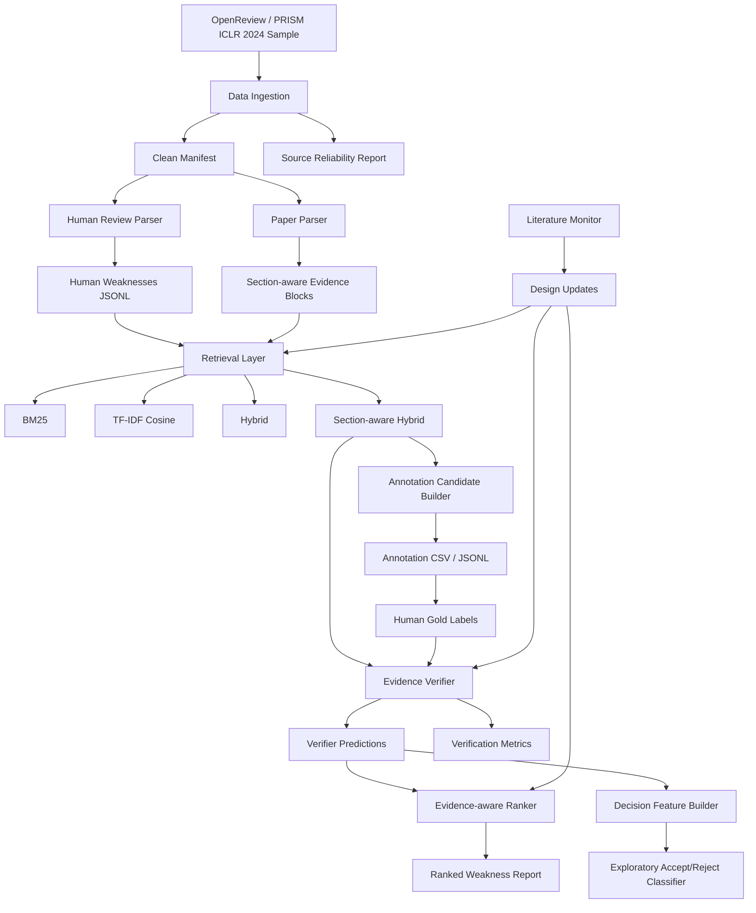

# EviReview-Lite 技术设计方案

版本：A-version experiment design  
日期：2026-05-30  
定位：毕业设计实验系统，不是生产级投稿评审平台。

---

## 1. 设计目标

EviReview-Lite 的目标是构建一个面向学术论文评审辅助的 evidence-grounded review audit pipeline。系统不直接替代人类审稿人，也不把 accept/reject 作为核心自动化目标，而是把论文评审拆成可评估的中间任务：

1. 从真实人类 review 中抽取 weaknesses/questions。
2. 从论文 Markdown 中构建 section-aware evidence blocks。
3. 对每条 weakness 检索论文内证据。
4. 判断 weakness 是否被证据支持、部分支持、空泛、无支持或被反驳。
5. 根据 evidence support、severity、category、redundancy 对 weaknesses 排序。
6. 将 evidence-aware features 作为探索性 accept/reject 分类信号。

这个定位来自近两年 automated peer review 与 RAG evaluation 文献的共同约束：

- RAGChecker 强调 RAG 要分模块诊断，而不是只看最终回答质量：https://arxiv.org/abs/2408.08067
- RAGCap-Bench 强调 agentic RAG 的中间能力评估：https://arxiv.org/abs/2510.13910
- ReviewGrounder 强调 rubric-guided grounding 可以提升 review substantiveness：https://arxiv.org/abs/2604.14261
- FactReview 明确主张 LLM reviewers 应 audit empirical claims，而不是直接做 accept/reject decisions：https://arxiv.org/abs/2604.04074
- Stop Automating Peer Review Without Rigorous Evaluation 提醒自动评审存在同质化和可操纵风险：https://arxiv.org/abs/2605.03202

---

## 2. 技术架构



---

## 3. 模块划分

### 3.1 Data Ingestion

职责：

- 读取 `papers_manifest.csv`。
- 检查 Markdown、review text、OpenReview JSON 是否存在。
- 通过 OpenReview API 校验本地数据来源可靠性。

当前实现：

- `prepare_manifest.py`
- `validate_openreview_source.py`

输入：

- `code/dataset/prism_iclr2024_sample/papers_manifest.csv`
- `code/dataset/prism_iclr2024_sample/openreview_json/*.json`
- `code/dataset/prism_iclr2024_sample/reviews_txt/*.md`
- `code/dataset/prism_iclr2024_sample/md_mineru_v4/*.md`

输出：

- `manifest_clean.csv`
- `dataset_audit.json`
- `source_reliability_report.json`
- `source_reliability_report.md`

### 3.2 Human Review Parser

职责：

- 从人工 review 中解析 `Weaknesses` 与 `Questions`。
- 将长段落拆成可核验的 weakness statements。
- 给每条 weakness 增加 rule-based category 与 severity hint。

当前实现：

- `extract_human_weaknesses.py`

输出：

- `human_weaknesses.jsonl`
- `human_weaknesses_summary.json`

### 3.3 Evidence Block Builder

职责：

- 将论文 Markdown 按 heading 和 token window 切分。
- 为每个 block 标记 section path 与 section type。
- 为 Paper-RAG 检索提供可追溯证据块。

当前实现：

- `build_evidence_blocks.py`

输出：

- `evidence_blocks.jsonl`
- `evidence_blocks_summary.json`

### 3.4 Retrieval Layer

职责：

- 对每条 weakness 在同一篇论文内检索 top-k evidence blocks。
- 比较不同检索策略。
- 在人工 gold label 完成前提供 proxy diagnostics。

当前实现：

- `retrieve_bm25.py`
- `retrieve_tfidf.py`
- `retrieve_hybrid_section.py`
- `evaluate_retrieval_proxy.py`

检索策略：

| Retriever | 说明 | 是否 A 版必做 |
| --- | --- | --- |
| BM25 | 关键词稀疏检索，可解释强 | 是 |
| TF-IDF cosine | 依赖少的向量空间 baseline | 是 |
| Hybrid | BM25 + TF-IDF 分数融合 | 是 |
| Section-aware Hybrid | Hybrid + category-section prior | 是，主方法 |
| Neural Dense | embedding 检索 | B 版或后续增强 |

### 3.5 Annotation Layer

职责：

- 从检索结果中生成 240 条 weakness-evidence annotation candidates。
- 输出 CSV/JSONL，便于人工标注。
- 明确 gold label schema。

当前实现：

- `build_annotation_candidates.py`

本轮新增：

- `export_annotation_sheet.py`
- `bootstrap_silver_labels.py`

标签体系：

| Label | 含义 |
| --- | --- |
| Supported | 证据明确支持该 weakness |
| Partially Supported | 证据部分支持，仍需人工判断 |
| Mentioned but Not Problem | 论文提到相关内容，但不足以证明这是问题 |
| Generic / Vague | weakness 过于空泛，无法验证 |
| Unsupported | top-k 证据不支持 |
| Contradicted | 证据与 weakness 相反 |

### 3.6 Evidence Verifier

职责：

- 输入 weakness + top-k evidence。
- 输出证据状态、support score、rationale。
- 在 gold label 完成前先输出 silver/verifier baseline，作为流程调试与错误分析材料。

A 版策略：

1. Rule-based verifier baseline：无 LLM、可复现。
2. LLM verifier：后续接入，用人工 gold label 评估。
3. Ablation：LLM-only vs RAG verifier vs section-aware verifier。

### 3.7 Ranker

职责：

- 综合 severity、evidence support、category、redundancy、generic penalty。
- 输出 Top-3/Top-5 重点 weaknesses。

A 版指标：

- Top-3 Supported Precision
- Top-5 Human Weakness Recall
- Generic@5
- Redundancy@5

### 3.8 Decision Classifier

职责：

- 使用 evidence-aware features 做探索性 accept/reject classification。

限制：

- A 版只有 50 篇，分类结果只能作为辅助信号，不能作为系统主要贡献。

---

## 4. 技术栈

### 4.1 当前 A 版技术栈

| 层 | 技术 | 选择原因 |
| --- | --- | --- |
| 语言 | Python 3 | 数据处理、实验脚本、可复现性强 |
| 数据格式 | CSV / JSON / JSONL / Markdown | 简单、可审计、适合论文实验 |
| 文档解析 | MinerU Markdown outputs | 已完成 50 篇 PDF 到 Markdown 转换 |
| 检索 | BM25 / TF-IDF / Hybrid | 无新依赖、可解释、适合 A 版 baseline |
| 评估 | 自定义 Python scripts | 指标透明，方便写入论文 |
| 报告 | Markdown | 方便追踪与论文材料复用 |
| 版本管理 | Git + GitHub | 每一步实验代码和结果提交远端 |

### 4.2 后续可选技术栈

| 能力 | 可选技术 | 使用时机 |
| --- | --- | --- |
| Dense Retrieval | sentence-transformers / OpenAI embeddings / bge-m3 | 人工 gold label 完成后 |
| 向量库 | FAISS / Chroma | 文档规模从 50 篇扩展到数百篇后 |
| LLM Verifier | OpenAI API / local vLLM | 需要自然语言 rationale 和弱点判断时 |
| Web UI | FastAPI + React / Streamlit | 论文实验稳定后做演示系统 |
| 标注工具 | CSV / Label Studio | 若人工标注规模超过 300 条 |
| 实验跟踪 | MLflow / plain JSON reports | B 版多模型比较时 |

当前不引入这些依赖，避免 A 版实验被工程复杂度拖慢。

---

## 5. 数据流与文件契约

```text
papers_manifest.csv
  -> manifest_clean.csv
  -> human_weaknesses.jsonl
  -> evidence_blocks.jsonl
  -> retrieval_*_top5.jsonl
  -> annotation_candidates_section_hybrid.jsonl
  -> annotation_sheet_section_hybrid.csv
  -> weakness_evidence_gold.jsonl
  -> verifier_predictions.jsonl
  -> verification_metrics.json
  -> ranked_review_report.jsonl
```

核心 JSONL 契约：

### weakness

```json
{
  "weakness_id": "001_r1_weaknesses_001",
  "paper_id": "xnUIMz5u2s",
  "decision": "Reject",
  "weakness_text": "...",
  "category_rule": "experiment",
  "severity_hint": "major"
}
```

### evidence block

```json
{
  "block_id": "001_b0001",
  "paper_id": "xnUIMz5u2s",
  "section_path": "Method > Dataset",
  "section_type": "method",
  "text": "..."
}
```

### verifier output

```json
{
  "annotation_id": "ann_0001",
  "weakness_id": "001_r1_weaknesses_001",
  "pred_label": "Partially Supported",
  "support_score": 0.64,
  "evidence_block_ids": ["001_b0010", "001_b0011"],
  "rationale": "..."
}
```

---

## 6. 实验路线

### 已完成

1. 数据源可靠性校验：OpenReview API 50/50 匹配。
2. Human weaknesses 抽取：1463 条，覆盖 50/50 篇。
3. Evidence blocks 构建：2597 个，覆盖 50/50 篇。
4. Retrieval baselines：
   - BM25
   - TF-IDF cosine
   - Hybrid
   - Section-aware Hybrid
5. Proxy diagnostics：section-aware hybrid 的 Top-1 section alignment 提升到 0.7021。
6. 外部人标验证集路线：接入 SubstanReview，把人工标注的 Eval/Jus span pair 转成 claim-level substantiation gold labels，用于先验证 verifier 层。
7. CLAIMCHECK 路线：接入 paper-claim grounded weakness benchmark，只提交聚合指标，不提交无许可证的原始文本。
8. CLAIMCHECK claim retrieval：新增 BM25、TF-IDF、char trigram、hybrid 等无依赖检索基线，验证 paper-claim grounding 的词面方法上限。
9. OpenRouter 免费 embedding：使用 `nvidia/llama-nemotron-embed-vl-1b-v2:free` 在 CLAIMCHECK 上跑 semantic retrieval，main Hit@3 从 char trigram 的 0.375 提升到 0.500。
10. CLAIMCHECK verifier diagnostics：OpenRouter max-similarity verifier 在 pilot threshold 下仍退化为 majority baseline；无泄漏 feature-fusion verifier 在 grouped CV 下把 Ungrounded F1 从 train-fold embedding threshold 的 0.3056 提升到 0.3551，但总体 Macro-F1 仍只有 0.5076，说明 verifier 必须独立于 retrieval 建模。
11. CLAIMCHECK evidence-aware ranker diagnostic：在 24 个同时包含 Grounded/Ungrounded 的 paper-review group 上，BM25 max similarity 的 MAP=0.7771、Top-1 grounded rate=0.625，优于当前 out-of-fold feature verifier probability；排序层当前应以检索相关性为主，verifier probability 暂不作为主排序信号。
10. OpenRouter chat reranker/verifier 诊断：免费 chat reranker 当前受 429 限速影响；embedding max-similarity verifier 的 pilot-selected main Macro-F1 仍为 0.4106，说明 embedding 适合 retrieval，但不能单独承担 verifier。

### 当前阶段

1. 先用已有人工标注数据集验证 substantiation/verifier 能力。
2. 保留本地 OpenReview ICLR 2024 样本作为端到端 evidence retrieval + weakness audit 应用实验。
3. 继续把 silver labels 限定为 pipeline debugging，不作为最终实验结论。
4. OpenRouter 免费 chat reranker 受上游 429 限速影响，暂不作为全量主线；下一步只做小样本 evidence-aware LLM verifier，或回退到本地人工 gold label 流程。
5. 数据集路线以 `docs/research/evireview_dataset_registry_2026-05-31.md` 为准：A 版使用本地 OpenReview、SubstanReview、CLAIMCHECK；PeerRead、NLPeer、OpenReview Raw 作为 B 版扩展。
4. 用外部人标 benchmark 的结果决定是否接入更强的 LLM verifier。

### 下一阶段

1. 跑 SubstanReview train/test 转换与 verifier baseline。
2. 跑 CLAIMCHECK paper-claim grounding 诊断，作为后续 LLM/embedding verifier 的主 benchmark。
3. 设计更稳的 verifier：embedding top-k retrieval + LLM pairwise judgment / feature-based classifier，而不是单阈值 max similarity。
4. 做 evidence-aware ranking。
5. 对本地 OpenReview 样本做补充人工标注，而不是把它作为第一验证来源。

---

## 7. 工程原则

1. 每个实验脚本必须可从 repo root 单独运行。
2. 每个脚本输出 JSON/JSONL summary，便于复现。
3. 每一步代码完成后运行验证，再 commit + push。
4. 不把 proxy metric 当作 gold metric。
5. 不把 accept/reject classifier 当作自动评审主目标。
6. 不提交大体积 PDF；保留 URL 与 Markdown/JSON/summary。

---

## 8. 后续系统演示形态

若 A 版实验稳定，可以做一个轻量 demo：

```text
Upload / Select Paper
  -> show extracted sections
  -> show generated or human weaknesses
  -> retrieve evidence
  -> show verifier label + rationale
  -> rank issues
  -> export review audit report
```

建议技术栈：

- Backend: FastAPI
- Frontend: Streamlit 或 React
- Storage: local JSONL / SQLite
- Retrieval: current Python retrievers first; later replace with FAISS

这部分只适合在核心实验完成后做展示，不应抢占当前实验时间。
