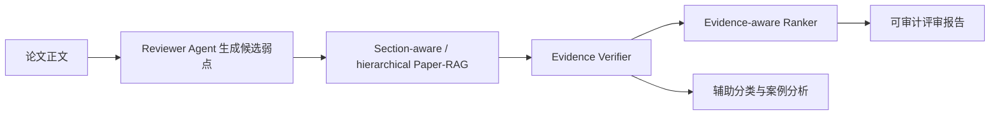

# EviReview-Lite 开题路线对齐更新

日期：2026-05-31

## 1. 当前对齐结论

开题报告中的系统目标应继续表述为“基于证据校验的学术论文自动评审辅助系统”。当前实验不支持把系统写成“自动替代审稿人”或“主要做 accept/reject 分类器”。更稳妥、也更有实验支撑的路线是：

## 2. 本轮新增实验

新增 `GLM-4.6V reviewer` 与 `rubric-agent` 在同一 3 篇论文 overlap 上的公平对比：

| 指标 | Rubric-agent | GLM-4.6V reviewer |
| --- | ---: | ---: |
| Generated weaknesses | 11 | 8 |
| Coverage recall @ 0.18 | 0.3738 | 0.5047 |
| Mean paper recall @ 0.18 | 0.3412 | 0.5166 |
| Mean support score | 0.2030 | 0.3448 |
| Partially-supported-or-better rate | 0.0000 | 0.2500 |

解释：

- rubric-agent 适合保留为可复现、可解释、低成本的结构风险 baseline。
- GLM-4.6V 在小样本上更像可用的候选弱点生成器，但仍必须经过 evidence retrieval 和 verifier。
- 当前样本太小，不能写成最终模型优劣结论；下一步扩到 5-10 篇后复跑同一 paired comparison。

## 3. 近两年 Agentic RAG 文献带来的路线修正

| 文献方向 | 对本项目的修正 |
| --- | --- |
| Agentic RAG SoK / taxonomy | 把系统写成有状态的 sequential decision process，而不是一次性 prompt。 |
| A-RAG hierarchical retrieval | 后续把 Paper-RAG 从 section-aware rerank 升级为 keyword search / semantic search / chunk read 三类工具。 |
| RAGCap-Bench / InfoDeepSeek | 评价指标要覆盖中间能力：检索决策、证据压缩、utility、compactness，而不是只看最终报告。 |
| RAGCHECKER / VERITAS | 主贡献应强调 weakness-level / claim-level traceability 和 faithfulness，而不是生成文本流畅度。 |
| ReviewGrounder / FactReview / CLAIMCHECK | 论文评审场景的核心风险是 critique 是否 grounded 和 methodologically sound。 |

## 4. 创新点优化

建议开题报告和论文正文中的创新点收敛为三条：

1. 面向论文结构的 Agentic Paper-RAG：按 abstract / method / experiment / related work / limitation 等 section 建模，并支持后续 hierarchical retrieval tools。
2. 面向评审弱点的 evidence verifier：不直接相信 reviewer agent，而是对每条 weakness 做 evidence retrieval、support labeling、rationale trace。
3. Evidence-aware reviewer ranking：综合 severity、support score、section prior、redundancy，输出可审计 top weaknesses，而不是生成一篇不可拆解的完整评审。

辅助创新点只放在次要位置：

- accept/reject classification 作为案例分析和辅助任务。
- 前端系统作为流程展示，不抢主实验贡献。

## 5. 下一步实验计划

优先级如下：

1. 将 GLM-4.6V reviewer 扩到 5-10 篇，复跑 paired comparison。
2. 把 paired comparison 的指标固定为 coverage、generic rate、redundancy、verifier label distribution、support score。
3. 扩充本地 weakness-evidence gold labels 到 200-300 条，用于替代 silver verifier 的关键结论。
4. 设计 hierarchical Paper-RAG 工具接口：keyword search、semantic search、section/chunk read。
5. 在开题报告实验章节中明确写出：retrieval、verifier、ranker 是三个独立实验模块，分类只是辅助实验。

## 6. 仍未完成

- GLM-4.6V 还没有 5-10 篇稳定样本。
- Evidence verifier 仍以 silver / heuristic 诊断为主，缺少足够人工 gold labels。
- 前后端工程化尚未开始。
- 还没有把 hierarchical retrieval tools 落成可运行 agent graph。
