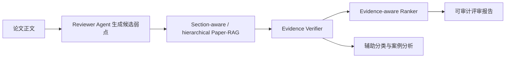
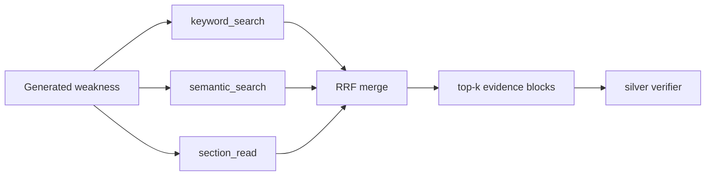

# EviReview-Lite 开题路线对齐更新

日期：2026-05-31

## 1. 当前对齐结论

开题报告中的系统目标应继续表述为“基于证据校验的学术论文自动评审辅助系统”。当前实验不支持把系统写成“自动替代审稿人”或“主要做 accept/reject 分类器”。更稳妥、也更有实验支撑的路线是：

## 2. 本轮新增实验

新增 `GLM-4.6V reviewer` 与 `rubric-agent` 在同一 3 篇论文 overlap 上的公平对比：

| 指标 | Rubric-agent | GLM-4.6V reviewer |
| --- | ---: | ---: |
| Generated weaknesses | 11 | 8 |
| Coverage recall @ 0.18 | 0.3738 | 0.5047 |
| Mean paper recall @ 0.18 | 0.3412 | 0.5166 |
| Mean support score | 0.2030 | 0.3448 |
| Partially-supported-or-better rate | 0.0000 | 0.2500 |

解释：

- rubric-agent 适合保留为可复现、可解释、低成本的结构风险 baseline。
- GLM-4.6V 在小样本上更像可用的候选弱点生成器，但仍必须经过 evidence retrieval 和 verifier。
- 当前样本太小，不能写成最终模型优劣结论；下一步扩到 5-10 篇后复跑同一 paired comparison。

## 3. 本轮新增架构实验：Hierarchical Paper-RAG

为了把 A-RAG / Agentic RAG 文献中的 hierarchical retrieval 思路落到当前系统，本轮新增了一个透明的 Paper-RAG 工具接口：

当前工具定义：

- `keyword_search`：按 weakness 关键词与 evidence block 词项重叠检索。
- `semantic_search`：按 lexical cosine + char n-gram similarity 检索。
- `section_read`：按 weakness category 读取 expected sections，例如 experiment -> experiment/method/limitation。
- `RRF merge`：用 reciprocal rank fusion 合并三个工具结果，再加入 lexical、char、section prior。

结果：

| Source | Weaknesses | Top-1 section align | Mean support | Partially-supported-or-better |
| --- | ---: | ---: | ---: | ---: |
| GLM-4.6V reviewer | 8 | 1.0000 | 0.4411 | 0.6250 |
| Rubric-agent | 194 | 1.0000 | 0.1999 | 0.0258 |

解释：

- GLM 样本在 hierarchical Paper-RAG 下的 support score 从原先 0.3448 提升到 0.4411，Partially Supported-or-better 从 0.2500 提升到 0.6250。
- Rubric-agent 也有小幅提升，但大部分仍为 Unsupported / Mentioned，说明它仍是结构风险 baseline，不是最终 reviewer。
- 这个结果支持将“section-aware Paper-RAG”升级为“hierarchical Paper-RAG tools”作为论文创新点，但目前 verifier 仍是 silver label，不能夸大为最终真实性指标。

继续推进到 human reviewer weaknesses 后，已新增全量 1463 条人工 weakness 的 hierarchical retrieval 诊断与 300 条人工标注对比队列：

| 项目 | 结果 |
| --- | ---: |
| Human weaknesses | 1463 |
| Hierarchical non-empty retrieval | 1.0000 |
| Hierarchical Top-1 section align | 0.9993 |
| Hierarchical Top-3 section align | 1.0000 |
| Section-aware vs hierarchical Top-1 disagreement | 0.6138 |
| Section-aware vs hierarchical Top-3 disagreement | 0.9645 |
| Selected comparison annotation rows | 300 |

这一步的意义是：不再只用 generated weaknesses 做架构诊断，而是把检索对比推进到开题报告核心数据源，即真实人工 reviewer weaknesses。由于 Top-1 / Top-3 disagreement 很高，300 条对比队列适合作为下一阶段 gold labels 标注入口。

已补齐评估闭环脚手架：

- `import_retrieval_comparison_gold.py`：从 300 条 CSV 队列导入人工填写的 `gold_best_retriever`、`gold_label`、`gold_evidence_block_ids`。
- `evaluate_retrieval_comparison_gold.py`：在 gold rows 存在后计算 section-aware 与 hierarchical 的 Hit@1/3/5 和 best-retriever 分布。
- 当前状态为 `needs_labels`，gold rows = 0；因此仍不能写最终 retriever 胜负结论。

## 4. 近两年 Agentic RAG 文献带来的路线修正

| 文献方向 | 对本项目的修正 |
| --- | --- |
| Agentic RAG SoK / taxonomy | 把系统写成有状态的 sequential decision process，而不是一次性 prompt。 |
| A-RAG hierarchical retrieval | 已开始把 Paper-RAG 从 section-aware rerank 升级为 keyword search / semantic search / section_read 三类工具。 |
| AgenticRAG enterprise retrieval | 强化“search / open / in-document navigation”式工具化检索，而不是把所有 grounding 压给一次性 top-k 检索。 |
| RAGCap-Bench / InfoDeepSeek | 评价指标要覆盖中间能力：检索决策、证据压缩、utility、compactness，而不是只看最终报告。 |
| RAGCHECKER / VERITAS | 主贡献应强调 weakness-level / claim-level traceability 和 faithfulness，而不是生成文本流畅度。 |
| LongTraceRL / trajectory supervision | 支持把检索轨迹和 rubric rationale 当作可评估过程，但 A 版只做评估与标注，不做 RL 训练。 |
| ReviewGrounder / FactReview / CLAIMCHECK | 论文评审场景的核心风险是 critique 是否 grounded 和 methodologically sound。 |

## 5. 创新点优化

建议开题报告和论文正文中的创新点收敛为三条：

1. 面向论文结构的 Agentic Paper-RAG：按 abstract / method / experiment / related work / limitation 等 section 建模，并实现 keyword_search / semantic_search / section_read 的 hierarchical retrieval tools，后续扩展为 search / open / read 的 in-document navigation。
2. 面向评审弱点的 evidence verifier：不直接相信 reviewer agent，而是对每条 weakness 做 evidence retrieval、support labeling、rationale trace。
3. Evidence-aware reviewer ranking：综合 severity、support score、section prior、redundancy，输出可审计 top weaknesses，而不是生成一篇不可拆解的完整评审。

辅助创新点只放在次要位置：

- accept/reject classification 作为案例分析和辅助任务。
- 前端系统作为流程展示，不抢主实验贡献。

## 6. 下一步实验计划

优先级如下：

1. PeerReview Bench 已扩展到完整 3,881 expert annotations，并加入 balanced NB / context NB / evidence-aware feature logistic；evidence Macro-F1 从 0.5318 提升到 0.5730，下一步要做 LLM verifier 或更强特征，继续提升 correctness/evidence 少数类 recall。
2. PeerQA-XT 已扩展到 500-row Paper-RAG QA baseline，并完成 section-aware / hierarchical / domain-aware query decomposition variants；当前 section-aware 是最稳 non-oracle 方法，但只小幅超过 lexical floor，手写 query/domain expansion 下降，下一步要做数据驱动/LLM 子查询。
3. 将 GLM-4.6V reviewer 扩到 5-10 篇，复跑 paired comparison。
4. 把 paired comparison 的指标固定为 coverage、generic rate、redundancy、verifier label distribution、support score。
5. 本地 `retrieval_comparison_annotation_queue.csv` 的 300 条队列保留为系统特定 gold label；只有当外部 ready-label 数据集无法覆盖论文内证据块选择时再优先标注。
6. 在开题报告实验章节中明确写出：retrieval、verifier、ranker 是三个独立实验模块，分类只是辅助实验。

## 7. 仍未完成

- PeerReview Bench 已扩展到完整 3,881 expert annotations，并完成 evidence-aware feature baseline；当前缺口仍是少数类 recall，尤其 evidence 的 `Requires More` 仍只有 0.2381。
- PeerQA-XT 已有 500-row question-only、section-aware、hierarchical、domain-aware query decomposition Paper-RAG QA baseline；结构先验还没有显著超过 lexical floor。
- GLM-4.6V 还没有 5-10 篇稳定样本。
- Evidence verifier 仍以 silver / heuristic 诊断为主，缺少足够人工 gold labels。
- 前后端工程化尚未开始。
- Hierarchical retrieval tools 已有 generated weakness 与 human weakness 两条诊断脚本，但还没有落成完整 LangGraph-style agent graph。
