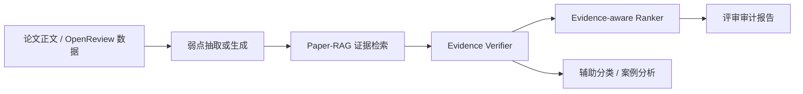

# EviReview-Lite 当前完成进度与下一步实验计划

日期：2026-05-30

## 1. 当前定位

本项目当前路线与开题报告保持一致：做“基于证据校验的学术论文自动评审辅助系统”，不是替代人类审稿人，也不是只做 accept/reject 分类。主线是：

目前实验优先级已经从“直接生成完整评审”调整为“先验证 RAG + verifier 是否能判断弱点是否有证据”。这个调整来自近期文献和已跑实验的共同结论：自动评审系统最容易出问题的地方不是文本流畅性，而是 critique 是否 grounded、是否 sound、是否抗 prompt injection。

## 2. 已完成内容

### 2.1 技术设计与架构文档

- 已完成全栈前后端分离架构：`docs/design/fullstack_agent_rag_architecture.md`
- 已完成 A 版技术设计：`docs/design/evireview_lite_technical_design.md`
- 已完成 A 版实验计划：`docs/superpowers/plans/2026-05-30-evireview-lite-a-version-experiments.md`

当前推荐技术栈：

| 层 | 技术栈 | 当前状态 |
| --- | --- | --- |
| 前端 | Next.js + TypeScript + Tailwind CSS + shadcn/ui + TanStack Query/Table | 已设计，未开始实现 |
| 后端 | FastAPI + Pydantic + SQLAlchemy + PostgreSQL + Redis + Worker | 已设计，未开始实现 |
| Agent | LangGraph 风格状态图，节点包括 weakness extraction、retrieval、verification、ranking、report | 已设计，实验代码先行 |
| RAG | BM25 + dense embedding + hybrid + section-aware rerank，后续接 Qdrant | 已完成实验基线，未工程化 |
| 实验 | Python 脚本 + JSON/Markdown 报告 | 已持续推进 |

### 2.2 本地 OpenReview / PRISM 样本实验

数据：`code/dataset/prism_iclr2024_sample`

已完成：

- 验证 50 篇样本数据完整性：50/50 匹配。
- 决策标签分布：25 Accept / 25 Reject。
- 抽取人工弱点：50 篇论文共 1463 条 human weaknesses。
- 构建 paper evidence blocks：50 篇论文共 2597 个证据块。
- 建立检索基线：BM25、TF-IDF、Hybrid、Section-aware Hybrid。

检索 proxy 结果：

| 方法 | Top-1 section alignment | Top-3 section alignment |
| --- | ---: | ---: |
| BM25 | 0.6151 | 0.8341 |
| TF-IDF | 0.6247 | 0.8238 |
| Hybrid | 0.6164 | 0.8300 |
| Section-aware Hybrid | 0.7021 | 0.8618 |

结论：section-aware 检索对论文评审场景有效，支持开题报告里的“面向论文结构的 Paper-RAG”创新点。

### 2.3 SubstanReview 人工标注数据验证

数据：SubstanReview，Apache-2.0 license，已提交 license。

已完成：

- Train：440 reviews / 2225 Eval claims。
- Test：110 reviews / 552 Eval claims。
- 将 Eval/Jus span pair 转成 Supported / Unsupported substantiation labels。

Test baseline：

| 方法 | Accuracy | Macro-F1 |
| --- | ---: | ---: |
| Majority | - | 0.3604 |
| Context cue | - | 0.5090 |
| Multinomial Naive Bayes | 0.6467 | 0.6411 |

结论：review-internal substantiation 可以用已有人工标注数据验证，适合作为 verifier 层的监督下限。

### 2.4 CLAIMCHECK paper-grounded weakness 实验

数据：CLAIMCHECK。由于上游仓库未检测到 LICENSE，本项目只提交脚本、聚合指标、报告，不提交原始文本或 row-level 文本。

已完成：

- Pilot：5 paper-review pairs / 13 weaknesses。
- Main：55 paper-review pairs / 155 weaknesses。
- Label：Grounded 108 / Ungrounded 47。

检索实验：

| 方法 | Hit@3 | Hit@5 | MRR |
| --- | ---: | ---: | ---: |
| Token overlap | 0.3194 | 0.4306 | 0.3106 |
| Char trigram | 0.3750 | 0.5139 | 0.3340 |
| TF-IDF | 0.3472 | - | - |
| BM25 | 0.3611 | - | - |
| LSA/SVD 128 | 0.2778 | - | - |
| OpenRouter free embedding | 0.5000 | 0.6944 | 0.4067 |

OpenRouter embedding 模型：

- `nvidia/llama-nemotron-embed-vl-1b-v2:free`
- 嵌入文本数：1696
- 结果：CLAIMCHECK main Hit@3 从 char trigram 的 0.3750 提升到 0.5000。

Verifier 实验：

| 方法 | Accuracy | Macro-F1 | Grounded F1 | Ungrounded F1 |
| --- | ---: | ---: | ---: | ---: |
| Majority / lexical verifier | 0.6968 | 0.4106 | 0.8213 | 0.0000 |
| OpenRouter max-sim pilot threshold | 0.6968 | 0.4106 | 0.8213 | 0.0000 |
| OpenRouter max-sim oracle diagnostic | 0.6839 | 0.5524 | 0.7950 | 0.3099 |
| Feature-fusion verifier, grouped CV | 0.5548 | 0.5076 | 0.6601 | 0.3551 |

本轮新增的 feature-fusion verifier 使用：

- OpenRouter embedding top-k similarity。
- lexical / char ngram / TF-IDF / BM25 max similarity。
- candidate claim count。
- weakness token length。
- rule-based weakness category。

防泄漏控制：

- 按 `paper_review_id` 分组做 5-fold CV。
- 不使用 target claim text。
- 不使用 target claim count。
- 不使用 annotation confidence。
- 不使用人工 weakness type annotation。

结论：embedding 很适合做 retrieval，不足以单独做 verifier。无泄漏 feature fusion 能把 Ungrounded F1 从 train-fold embedding threshold 的 0.3056 提升到 0.3551，但不能作为最终验证器；下一步要做 evidence-aware LLM verifier 或扩大人工标注。

Ranker 诊断实验：

| 方法 | Groups | MAP | NDCG@3 | Top-1 grounded | Bottom-1 ungrounded |
| --- | ---: | ---: | ---: | ---: | ---: |
| OpenRouter embedding max similarity | 24 | 0.7502 | 0.7632 | 0.5833 | 0.5833 |
| BM25 max similarity | 24 | 0.7771 | 0.7934 | 0.6250 | 0.6667 |
| Out-of-fold feature verifier probability | 24 | 0.7424 | 0.7828 | 0.5833 | 0.5417 |
| Candidate claim count | 24 | 0.7597 | 0.7806 | 0.5833 | 0.6250 |

结论：当前 ranker 不能简单使用 verifier probability 排序。BM25 在 paper-review group 内更适合做第一版排序信号，verifier 仍然作为独立判定模块使用。

### 2.5 OpenRouter 免费模型实验状态

已使用 OpenRouter 免费 embedding 完成主实验。

OpenRouter chat reranker 已实现脚本，但全量实验受免费模型上游 429 rate limit 阻塞，当前只保留为可选小样本诊断，不作为主线。

### 2.6 本地 OpenReview Accept/Reject 辅助分类实验

数据：本地 50 篇 ICLR 2024 OpenReview 样本，25 Accept / 25 Reject。

定位：探索性辅助实验，不作为主贡献。当前使用 metadata、人工 reviewer weakness 上界特征和 silver evidence proxy；还不是 agent-generated weakness 的最终分类结果。

| 方法 | Accuracy | Macro-F1 | ROC-AUC |
| --- | ---: | ---: | ---: |
| Majority baseline | 0.5000 | 0.4505 | 0.5000 |
| Metadata baseline | 0.6800 | 0.6800 | 0.6896 |
| Human weakness upper-bound | 0.6200 | 0.6198 | 0.6512 |
| Silver evidence proxy | 0.4400 | 0.4253 | 0.4480 |
| Metadata + human weakness | 0.6400 | 0.6400 | 0.6736 |
| Metadata + silver evidence | 0.6000 | 0.5994 | 0.6704 |
| Fusion proxy | 0.5800 | 0.5785 | 0.6496 |

结论：当前分类结果支持“分类只能作为辅助实验”的写法。metadata baseline 最强，silver evidence proxy 单独表现较弱，说明在没有人工 gold evidence labels 和 agent-generated weaknesses 之前，不能把 evidence-aware features 夸大为分类贡献。

### 2.7 Rubric-agent weakness generation baseline

定位：先实现一个可复现、可解释的本地 reviewer agent baseline，验证 Agent -> Paper-RAG -> Verifier/Ranker 的接口。该 baseline 不依赖 OpenRouter 免费 chat 模型，因此不会被 429 限流阻塞。

方法：

- 按 experiment、method、related work、reproducibility、limitation、clarity rubric 检查论文 evidence blocks。
- 根据 section 长度、ablation/baseline/reproducibility/limitation 关键词等信号触发候选 weakness。
- 输出结构化字段：`weakness_text`、`category`、`severity`、`confidence`、`reviewer_role`、`evidence_block_ids`。
- 用词法 + char ngram overlap 与人工 reviewer weaknesses 做 coverage proxy。

结果：

| 指标 | 数值 |
| --- | ---: |
| Papers | 50 |
| Generated weaknesses | 194 |
| Mean generated per paper | 3.88 |
| Generic rate | 0.1804 |
| Redundancy rate | 0.1531 |
| Coverage recall @ 0.12 | 0.8243 |
| Coverage recall @ 0.18 | 0.4805 |
| Coverage recall @ 0.24 | 0.0834 |
| Generated weaknesses with retrieval | 194 / 194 |
| Top-1 section-prior hit rate | 1.0000 |
| Verifier Unsupported | 121 |
| Verifier Mentioned but Not Problem | 70 |
| Verifier Partially Supported | 3 |
| Ranked top-3 items | 141 |

结论：rubric-agent 已经把 Step 4 的生成接口跑通，并能进入 section-aware retrieval、heuristic verifier 和 top-3 ranker。当前 verifier 结果偏 Unsupported / Mentioned，说明它更像“结构风险提示器”，不是最终 LLM reviewer；下一步应做 GLM-4.6V 小样本 structured reviewer 与 rubric-agent 对比，并重点降低 unsupported/generated-generic 问题。

### 2.8 GLM-4.6V structured reviewer 小样本接入

定位：验证 GLM-4.6V 能否作为结构化 reviewer provider 接入现有 Agent -> Paper-RAG -> Verifier/Ranker 流程。API key 只通过环境变量读取，不写入仓库。

当前小样本结果：

| 指标 | 数值 |
| --- | ---: |
| Selected papers | 3 |
| Generated weaknesses | 8 |
| Papers with generation | 3 |
| Generic rate | 0.1250 |
| Coverage recall @ 0.12 | 0.7757 |
| Coverage recall @ 0.18 | 0.5047 |
| Coverage recall @ 0.24 | 0.1308 |
| Verifier Mentioned but Not Problem | 4 |
| Verifier Partially Supported | 2 |
| Verifier Unsupported | 2 |
| Mean support score | 0.3448 |

结论：GLM-4.6V 已经跑通结构化生成与后续检索/验证链路；相较 deterministic rubric-agent，小样本中的 support distribution 更好，但样本只有 3 篇，不能写成最终性能结论。下一步应扩展到 5-10 篇，与 rubric-agent 按 coverage、generic rate、redundancy、verifier label distribution 做同一套对比。

### 2.9 GLM overlap 上的 reviewer 公平对比

定位：在不重新调用外部 API 的前提下，先把 GLM 已生成的 3 篇论文与 rubric-agent 限定在同一批论文上比较，避免“GLM 小样本 vs rubric 全量 50 篇”的不公平对照。

重叠样本：3 篇论文 / 107 条 human weaknesses。

| 指标 | Rubric-agent | GLM-4.6V reviewer |
| --- | ---: | ---: |
| Generated weaknesses | 11 | 8 |
| Mean generated per paper | 3.6667 | 2.6667 |
| Generic rate | 0.0909 | 0.0000 |
| Redundancy rate | 0.1091 | 0.0000 |
| Coverage recall @ 0.18 | 0.3738 | 0.5047 |
| Mean paper recall @ 0.18 | 0.3412 | 0.5166 |
| Mean support score | 0.2030 | 0.3448 |
| Partially-supported-or-better rate | 0.0000 | 0.2500 |

结论：在 GLM overlap 上，GLM-4.6V 生成更少，但 coverage proxy、support score、Partially Supported 比例均高于 rubric-agent。这个结果支持“rubric-agent 是可解释结构风险 baseline，GLM/LLM reviewer 是候选生成器，但必须进入 evidence verifier”的实验路线。下一步仍然不能直接写成 GLM 优于 rubric 的最终结论，需要扩到 5-10 篇后再复跑同一套 paired report。

### 2.10 Hierarchical Paper-RAG retrieval tools

定位：把近两年 Agentic RAG 文献中的 hierarchical retrieval interface 落到本项目实验链路中。该实验不重新调用 LLM，只对已有 generated weaknesses 重新做 evidence retrieval，并继续使用 silver verifier 做诊断。

工具接口：

- `keyword_search`：exact term overlap + section prior。
- `semantic_search`：lexical cosine + char n-gram similarity + section prior。
- `section_read`：按 weakness category 读取 expected sections，例如 experiment -> experiment/method/limitation。
- `RRF merge`：用 reciprocal rank fusion 合并三个工具结果。

结果：

| Source | Weaknesses | Top-1 section align | Top-3 section align | Mean support | Partially-supported-or-better |
| --- | ---: | ---: | ---: | ---: | ---: |
| GLM-4.6V reviewer | 8 | 1.0000 | 1.0000 | 0.4411 | 0.6250 |
| Rubric-agent | 194 | 1.0000 | 1.0000 | 0.1999 | 0.0258 |

对比原 retrieval/verifier：

- GLM 原 mean support score 为 0.3448，hierarchical retrieval 后为 0.4411。
- GLM 原 Partially Supported-or-better rate 为 0.2500，hierarchical retrieval 后为 0.6250。
- Rubric-agent 原 verifier 标签中 Partially Supported 为 3/194，hierarchical retrieval 后为 5/194，改善有限。

结论：hierarchical Paper-RAG 对 GLM 这类更具体的 weakness 生成结果更有帮助；对 rubric-agent 的泛化结构风险提示帮助有限。这支持把系统架构从“section-aware rerank”升级为“可审计 hierarchical retrieval tools”，但最终结论仍需人工 gold labels 验证。

### 2.11 Human weakness hierarchical retrieval and comparison queue

定位：把 hierarchical Paper-RAG 从 generated weaknesses 诊断推进到真实 human reviewer weaknesses，并为“section-aware retrieval vs hierarchical retrieval”的人工 gold 对比准备标注队列。

已完成脚本：

- `retrieve_human_hierarchical.py`：对 1463 条 human weaknesses 运行 keyword_search / semantic_search / section_read / RRF merge。
- `build_retrieval_comparison_annotation_queue.py`：把 section-aware top-k 与 hierarchical top-k 配对，按 retriever disagreement、decision、category 分层抽取 300 条标注队列。
- `import_retrieval_comparison_gold.py`：导入人工填写后的 retrieval comparison gold labels。
- `evaluate_retrieval_comparison_gold.py`：基于 gold labels 计算 best-retriever 分布和 Evidence Hit@1/3/5。

结果：

| 指标 | 数值 |
| --- | ---: |
| Human weaknesses | 1463 |
| Hierarchical non-empty retrieval | 1.0000 |
| Hierarchical Top-1 section align | 0.9993 |
| Hierarchical Top-3 section align | 1.0000 |
| Top-1 tool mix: semantic / keyword / section_read | 807 / 567 / 89 |
| Section-aware vs hierarchical Top-1 disagreement | 0.6138 |
| Section-aware vs hierarchical Top-3 disagreement | 0.9645 |
| Comparison annotation queue | 300 |

标注队列分布：

| Category | Rows |
| --- | ---: |
| clarity | 43 |
| experiment | 54 |
| method | 54 |
| other | 54 |
| related_work | 53 |
| reproducibility | 18 |
| validity | 24 |

结论：hierarchical retrieval 的 section-alignment proxy 很高，但真正有价值的是它与 section-aware baseline 的证据块差异很大；这使 300 条队列适合作为下一阶段人工 gold labels 标注入口。正式论文结论仍应等待人工判断 `gold_best_retriever` 与 `gold_label` 后再写。

当前 gold 状态：

- `retrieval_comparison_gold_summary.json` 已生成。
- `retrieval_comparison_gold_metrics.json` 已生成 blocked 状态。
- Gold rows = 0，status = `needs_labels`。
- 这表示评估管线已经就绪，但还没有人工标签，不能报告 section-aware 与 hierarchical 的最终胜负。

### 2.12 Ready-label external datasets and PeerReview Bench baseline

根据“优先找不需要人工标注、能直接做实验的数据集”的新要求，本轮把数据集路线从“先做本地 300 条人工标注”调整为“先接入已有标签的公开数据集，再把本地标注作为补充”。

已完成脚本：

- `probe_ready_datasets.py`：通过 Hugging Face API 探测可直接使用的数据集、license、字段和样本 schema。
- `prepare_peerreview_bench.py`：拉取 PeerReview Bench 的 `expert_annotation` split，并只保存短 paper excerpt，避免提交完整论文正文。
- `evaluate_peerreview_bench_baseline.py`：在已有专家标签上跑 majority 与 no-dependency Naive Bayes baseline。

筛选出的 A/B 版数据集：

| 数据集 | 标签/字段 | 适配实验 | 决策 |
| --- | --- | --- | --- |
| PeerReview Bench | correctness / significance / evidence expert annotations | verifier、ranker、review-quality | A 版立即加入 |
| PeerQA-XT | full paper + peer-review-derived question + answer | Paper-RAG retrieval QA | A 版已加入 |
| RottenReviews | human review-quality annotations | review quality / ranker | B 版补充 |
| ReviewBench | 多会议 paper/review/rebuttal/decision/markdown | 泛化与扩容 | B 版补充 |
| SPECS Review Benchmark | injected flaw specs + detection verdicts | 鲁棒性 / flaw detection | B 版补充 |
| PeerCheck | human vs LLM reviews | reviewer generation 对比 | B 版补充 |

PeerReview Bench 已从 300-row probe 扩展到完整 3,881 条 expert annotations。当前使用按 `paper_id` 分组的 deterministic 80/20 split，避免同一论文的 review item 同时出现在 train/test。

| Task | Train | Test | Majority Macro-F1 | Review NB Macro-F1 | Balanced Review NB Macro-F1 | Context NB Macro-F1 | Balanced Context NB Macro-F1 |
| --- | ---: | ---: | ---: | ---: | ---: | ---: | ---: |
| correctness | 3079 | 802 | 0.4646 | 0.4901 | 0.4846 | 0.5601 | 0.5686 |
| significance | 2720 | 696 | 0.2486 | 0.3723 | 0.4207 | 0.3241 | 0.3205 |
| evidence | 2266 | 602 | 0.4819 | 0.4819 | 0.4801 | 0.5153 | 0.5318 |

Balanced context NB per-label recall：

| Task | Label | Support | Recall | F1 |
| --- | --- | ---: | ---: | ---: |
| correctness | Correct | 696 | 0.8649 | 0.8763 |
| correctness | Not Correct | 106 | 0.2830 | 0.2609 |
| significance | Marginally Significant | 188 | 0.2181 | 0.2405 |
| significance | Not Significant | 94 | 0.0000 | 0.0000 |
| significance | Significant | 414 | 0.8333 | 0.7210 |
| evidence | Requires More | 42 | 0.0714 | 0.1071 |
| evidence | Sufficient | 560 | 0.9804 | 0.9564 |

解释：

- accuracy 高但 Macro-F1 不高，说明标签明显不均衡；论文中应优先报告 Macro-F1 和 per-label recall。
- balanced review-item NB 将 significance Macro-F1 提升到 0.4207，说明 review item 文本对“重要性/排序优先级”有可学习信号，可作为 evidence-aware ranker 的外部 ready-label baseline。
- balanced context NB 将 correctness/evidence Macro-F1 提升到 0.5686 / 0.5318；因此 ranker priority 与 verifier/evidence 应分开建模。
- correctness 与 evidence 维度在严格 grouped split 下仍难以识别少数类，`Requires More` recall 只有 0.0714；下一步应加入更强的 evidence-aware features 或 LLM verifier，而不是继续依赖朴素词袋分类。
- 这条路线比本地人工标注更符合“直接拿来用的数据集做实验”的要求；本地 300 条队列保留为系统特定补充验证。

### 2.13 PeerQA-XT Paper-RAG QA baseline

为补齐开题报告中 Paper-RAG 检索实验的外部 ready-label 数据，本轮接入 PeerQA-XT。该数据集每条样本包含 peer-review-derived question、answer、full paper 和 domain，因此可以不新增人工标注就评估“问题能否从论文正文中检索到支持答案的信息”。

已完成脚本：

- `evaluate_peerqa_xt_retrieval.py`：通过 Hugging Face Dataset Viewer API 拉取 PeerQA-XT test split，运行 BM25、TF-IDF、Hybrid、section-aware、hierarchical、query decomposition、domain-aware retrieval 和 oracle answer-query diagnostic。

当前 500-row test probe 结果：

| Method | Rows | Hit@1 | Hit@3 | Hit@5 | Mean answer recall@5 |
| --- | ---: | ---: | ---: | ---: | ---: |
| bm25_question | 500 | 0.2400 | 0.5980 | 0.7940 | 0.5001 |
| tfidf_question | 500 | 0.2300 | 0.5920 | 0.7740 | 0.4906 |
| hybrid_question | 500 | 0.2420 | 0.5960 | 0.7920 | 0.4988 |
| section_aware_question | 500 | 0.2460 | 0.6060 | 0.8060 | 0.5005 |
| hierarchical_question | 500 | 0.2220 | 0.5900 | 0.7880 | 0.4995 |
| query_decomposed_question | 500 | 0.2080 | 0.5320 | 0.7340 | 0.4751 |
| domain_section_aware_question | 500 | 0.2080 | 0.5360 | 0.7420 | 0.4774 |
| domain_hierarchical_question | 500 | 0.2140 | 0.5260 | 0.7340 | 0.4752 |
| oracle_answer_query | 500 | 0.4960 | 0.9020 | 0.9660 | 0.6257 |

解释：

- PeerQA-XT 没有 gold evidence spans，因此当前 Hit@K 是 answer-token support proxy，不是最终证据精确率。
- question-only BM25/TF-IDF 已经能在 Top-5 找到较多 answer-support chunks，说明该数据集适合作为 Paper-RAG retrieval QA 的外部验证集。
- 扩展到 500 条后，`section_aware_question` 的 Hit@1/Hit@3/Hit@5 达到 0.2460/0.6060/0.8060，是当前最稳 non-oracle 方法，但相对 BM25/Hybrid 只小幅提升。
- 手写 query decomposition 与 domain-aware expansion 明显下降，说明 query expansion 不能靠静态规则硬加；下一步应尝试数据驱动/LLM 生成的子查询，或只保留 section-aware rerank 作为低风险结构先验。
- `oracle_answer_query` 只用于诊断上界，不能作为系统方法。
- 下一步应重点提高 Hit@1/Hit@3，而不是只看 Top-5。

## 3. 最新论文对实验路线的修正

本轮跟踪并写入 `memory/RESEARCH_LOG.md` 的论文包括：

| 论文 | 对项目的意义 |
| --- | --- |
| SoundnessBench: https://arxiv.org/abs/2605.30329 | 自动科研 agent 会对低 soundness 方案过度乐观，因此 verifier 要关注方法学 soundness，而不是只看语言质量。 |
| PRISM: https://arxiv.org/abs/2605.26730 | LLM reviewer 应按 depth、novelty、flaw identification、constructiveness 多维度评估，支持本项目模块化实验。 |
| LLM-as-a-Reviewer: https://arxiv.org/abs/2605.25415 | 评审模型存在人类偏差、评分校准和 prompt injection 风险，支持“生成后必须 evidence verify”。 |
| CLAIMCHECK: https://arxiv.org/abs/2503.21717 | 与本项目 paper-grounded weakness verification 最接近，作为当前主 benchmark。 |
| SubstanReview: https://aclanthology.org/2023.findings-emnlp.684/ | 给出了 peer review substantiation 的人工标注范式，作为 verifier 的监督基线。 |
| JETTS: https://proceedings.mlr.press/v267/zhou25af.html | LLM judge 需要单独评估，OpenRouter chat judge 不应直接当作真值。 |
| NLPeer: https://arxiv.org/abs/2211.06651 | 多领域论文与 review report，适合 B 版泛化实验。 |
| PeerRead: https://arxiv.org/abs/1804.09635 | 有 accept/reject 与专家评审，可作为辅助分类扩展。 |
| OpenReview Raw: https://huggingface.co/datasets/priorcomputers/openreview_raw | 大规模 OpenReview 数据来源，适合系统稳定后的扩容。 |
| ReviewGrounder: https://arxiv.org/abs/2604.14261 | 支持 rubric-guided、tool-integrated reviewer 设计，本轮 rubric-agent baseline 与它对齐。 |
| FactReview: https://arxiv.org/abs/2604.04074 | 支持将评审生成拆成 claim/evidence audit，而不是直接端到端生成最终 judgment。 |
| Physics Is All You Need?: https://arxiv.org/abs/2605.30353 | 说明科研 agent 仍需要领域专家监督，且普通 oracle tests 会漏掉科学软件错误；支持本项目把 reviewer agent 放在证据审计和人工 gold labels 约束下。 |
| RAGCap-Bench: https://arxiv.org/abs/2510.13910 | Agentic RAG 的中间能力需要单独测评；支持本项目把 weakness planning、retrieval、verification、ranking 拆成可诊断模块。 |
| InfoDeepSeek: https://arxiv.org/abs/2505.15872 | 动态信息搜寻式 Agentic RAG 需要 accuracy、utility、compactness 等细粒度指标；支持后续加入 evidence compactness / citation efficiency。 |
| RAGCHECKER: https://arxiv.org/abs/2408.08067 | RAG 评估应区分检索和生成，并用 claim-level entailment 诊断；支持当前“retrieval 好不等于 verifier 好”的实验结论。 |
| SoK Agentic RAG: https://arxiv.org/abs/2603.07379 | 把 Agentic RAG 形式化为带状态转移的 sequential decision-making 系统，支持本项目把评审流程写成状态图和可审计 trajectory。 |
| A-RAG: https://arxiv.org/abs/2602.03442 | 通过 keyword search、semantic search、chunk read 三层检索接口让模型参与检索决策，支持本项目后续把 section-aware Paper-RAG 升级为 hierarchical retrieval tools。 |
| AgenticRAG: https://arxiv.org/abs/2605.05538 | 企业知识库场景中 search / find / open / summarize 工具化检索显著优于单次检索，支持本项目把论文内证据检索写成可审计工具轨迹。 |
| Patho-AgenticRAG: https://arxiv.org/abs/2508.02258 | 高风险医学视觉场景中使用多轮检索和任务分解降低幻觉，作为 Agentic RAG grounding 动机的旁证；A 版不扩展到多模态。 |
| LongTraceRL: https://arxiv.org/abs/2605.31584 | 使用 search-agent trajectories 和 rubric rewards 监督长上下文证据推理；支持把 weakness -> retrieval trace -> verifier rationale 写成可评估过程轨迹，但 RL/training 放到 B 版。 |
| SPECTRA: https://arxiv.org/abs/2605.31575 | 合成 IR 测试集可控制 distractor density，适合未来 Paper-RAG 压力测试；A 版仍以真实论文评审和人工标签为核心。 |
| Beyond Correctness / VERITAS: https://arxiv.org/abs/2510.13272 | 强调 search agent 不能只看最终答案正确性，还要看 intermediate reasoning faithfulness；支持本项目把 weakness -> evidence -> verifier trace 作为主贡献证据。 |
| Fintech Agentic RAG: https://arxiv.org/abs/2510.25518 | 模块化 agentic RAG 在专业领域通过 query reformulation、sub-query decomposition、reranking 提升检索鲁棒性，但有延迟代价；支持本项目把多 agent workflow 写成质量优先而非低延迟系统。 |

与开题报告对齐后的结论：

1. 题目中的“分类”保留为辅助实验，不作为主贡献。
2. 主贡献写成“面向论文评审弱点的证据检索与证据校验”。
3. 创新点保持三条：section-aware Paper-RAG、evidence verifier、evidence-aware ranker。
4. Paper-RAG 创新点应从 section-aware retrieval 进一步写成 hierarchical Paper-RAG tools：keyword search、semantic search、section_read、RRF merge。
5. 系统展示可以做，但必须在核心实验稳定后再做。

## 4. 是否需要记忆与上下文管理系统

需要，但 A 版不需要做复杂长期记忆。

建议分三层：

| 层 | 用途 | A 版实现 |
| --- | --- | --- |
| Session memory | 单次评审流程中的 paper、weakness、evidence、verifier trace | LangGraph state / JSON state |
| Project memory | 一个项目下的论文、评审历史、实验结果、人工标注 | PostgreSQL + 文件索引 |
| Research memory | 文献监控、实验决策、失败原因、路线修正 | `memory/RESEARCH_LOG.md` + docs |

A 版最重要的是可追溯上下文，而不是“聊天机器人式长期记忆”。每条 weakness 都要能追溯到：

- 生成或抽取来源。
- 检索到的 evidence block。
- verifier 的判定理由。
- ranker 排名原因。
- 最终报告中的引用位置。

## 5. 还没做的内容

核心未完成：

- 本地 OpenReview 样本上的人工 gold labels 还没有完成最终标注；当前已生成 300 条 section-aware vs hierarchical retrieval 对比标注队列，并补齐导入/评估脚本。
- Agent weakness generation 已跑 rubric-agent 全量 baseline、GLM-4.6V 3-paper 小样本，以及 GLM overlap 上的 paired comparison，但还没有完成 5-10 篇 provider 对比。
- Rubric-agent generation baseline 已完成；GLM-4.6V 已接入并完成重叠样本公平对比，小样本仍需扩大后再作为正式 provider 结果。
- Hierarchical Paper-RAG tools 已有本地生成弱点诊断和 1463 条 human weakness 检索诊断，但还没有用人工 gold labels 做正式对比。
- Evidence-aware ranker 已有 CLAIMCHECK 诊断，但还没有进入本地端到端主实验。
- Accept/reject 分类已有探索性 baseline，但还没有使用 agent-generated weakness。
- 前端、后端、Agent/RAG 工程化目录还未落地。
- UI 展示、任务队列、数据库、Qdrant、报告页面还未实现。

风险：

- CLAIMCHECK 无 LICENSE，不能提交原始文本，只能提交聚合结果。
- OpenRouter 免费 chat 模型不稳定，容易 429。
- 小样本 verifier 指标不能夸大。
- 本地 50 篇数据足够做 A 版闭环，但不支持强泛化结论。

## 6. 下一步实验计划

优先顺序：

1. 做 CLAIMCHECK 小样本 evidence-aware LLM verifier：输入 weakness + top-k candidate claims/evidence，让免费 chat 模型只输出 Grounded/Ungrounded 与简短理由；由于 429，只跑小规模 stratified sample。
2. 如果 chat 模型继续限流，转为本地 OpenReview 的 rule-based / feature verifier 与人工标注流程，不阻塞主线。
3. 标注 300 条 retrieval comparison queue，先回答 section-aware 和 hierarchical retrieval 谁更适合 human reviewer weaknesses。
4. 把 feature-fusion verifier 的失败案例转成标注规范补充：哪些 weak criticism 是 generic，哪些需要 external literature。
5. 用人工 gold labels 对比 section-aware retrieval 与 hierarchical Paper-RAG，而不是只看 silver verifier 或 section-alignment proxy。
6. 做 evidence-aware ranker：支持度、严重性、section confidence、novelty category 综合排序。
7. 用 GLM-4.6V 跑 5-10 篇 structured reviewer 小样本，与 rubric-agent baseline 对比 coverage / generic rate / redundancy / verifier label distribution。

近期最小可交付：

- `CLAIMCHECK feature verifier` 报告已完成。
- 下一步做 `LLM evidence verifier small sample`。
- 然后更新开题报告实验章节，把“embedding 适合 retrieval，但 verifier 要独立建模”写进去。

## 7. 本轮新增文件

- `code/experiments/evireview_a/src/evaluate_claimcheck_feature_verifier.py`
- `code/experiments/evireview_a/src/render_claimcheck_feature_verifier_report.py`
- `code/experiments/evireview_a/data/claimcheck_feature_verifier_metrics.json`
- `code/experiments/evireview_a/reports/claimcheck_feature_verifier_report.md`
- `docs/progress/evireview_current_progress_2026-05-30.md`
- `memory/RESEARCH_LOG.md`
- `code/experiments/evireview_a/src/evaluate_claimcheck_evidence_ranker.py`
- `code/experiments/evireview_a/src/render_claimcheck_evidence_ranker_report.py`
- `code/experiments/evireview_a/data/claimcheck_evidence_ranker_metrics.json`
- `code/experiments/evireview_a/reports/claimcheck_evidence_ranker_report.md`
- `docs/research/evireview_dataset_registry_2026-05-31.md`
- `code/experiments/evireview_a/src/evaluate_local_decision_classifier.py`
- `code/experiments/evireview_a/src/render_local_decision_classifier_report.py`
- `code/experiments/evireview_a/data/local_decision_classifier_metrics.json`
- `code/experiments/evireview_a/reports/local_decision_classifier_report.md`
- `code/experiments/evireview_a/src/generate_rubric_agent_weaknesses.py`
- `code/experiments/evireview_a/src/evaluate_rubric_agent_coverage.py`
- `code/experiments/evireview_a/src/retrieve_rubric_agent_evidence.py`
- `code/experiments/evireview_a/src/render_rubric_agent_report.py`
- `code/experiments/evireview_a/data/rubric_agent_weaknesses.jsonl`
- `code/experiments/evireview_a/data/rubric_agent_coverage_metrics.json`
- `code/experiments/evireview_a/data/rubric_agent_retrieval_top5.jsonl`
- `code/experiments/evireview_a/data/rubric_agent_verified_weaknesses.jsonl`
- `code/experiments/evireview_a/data/rubric_agent_ranked_top3.jsonl`
- `code/experiments/evireview_a/data/rubric_agent_verifier_summary.json`
- `code/experiments/evireview_a/reports/rubric_agent_generation_report.md`
- `code/experiments/evireview_a/src/run_glm_reviewer_experiment.py`
- `code/experiments/evireview_a/src/render_experiment_dashboard.py`
- `code/experiments/evireview_a/data/glm_reviewer_weaknesses.jsonl`
- `code/experiments/evireview_a/data/glm_reviewer_weaknesses_summary.json`
- `code/experiments/evireview_a/data/glm_reviewer_coverage_metrics.json`
- `code/experiments/evireview_a/data/glm_reviewer_retrieval_top5.jsonl`
- `code/experiments/evireview_a/data/glm_reviewer_verified_weaknesses.jsonl`
- `code/experiments/evireview_a/data/glm_reviewer_verifier_summary.json`
- `code/experiments/evireview_a/reports/glm_reviewer_experiment_report.md`
- `code/experiments/evireview_a/reports/experiment_dashboard.md`
- `code/experiments/evireview_a/src/compare_generated_reviewers.py`
- `code/experiments/evireview_a/data/generated_reviewer_comparison_metrics.json`
- `code/experiments/evireview_a/reports/generated_reviewer_comparison_report.md`
- `code/experiments/evireview_a/src/retrieve_generated_hierarchical.py`
- `code/experiments/evireview_a/data/generated_hierarchical_retrieval_top5.jsonl`
- `code/experiments/evireview_a/data/generated_hierarchical_verified_weaknesses.jsonl`
- `code/experiments/evireview_a/data/generated_hierarchical_retrieval_summary.json`
- `code/experiments/evireview_a/reports/hierarchical_paper_rag_report.md`
