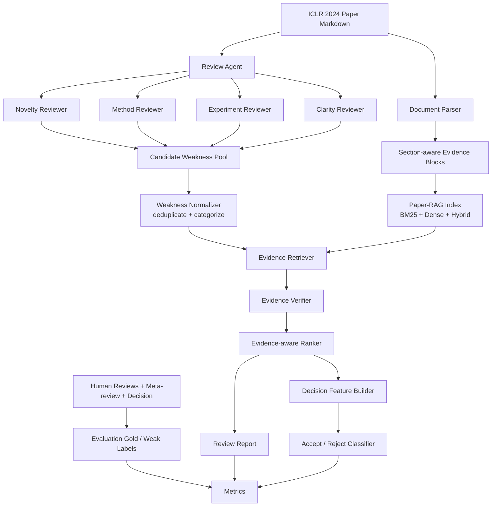
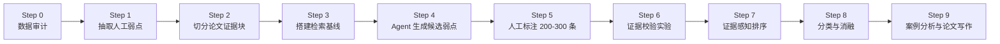

# EviReview-Lite A 版实验计划：基于本地 PRISM/OpenReview 标注数据的论文评审评估系统

生成日期：2026-05-30

工作结论：A 版先不复现某一篇论文的完整代码，也不先追求大规模训练。先围绕本地 `PRISM/OpenReview ICLR 2024 Sample` 做一个可解释、可评估、可写入毕设论文的最小闭环：论文正文 -> Agent 生成弱点评审 -> Paper-RAG 检索证据 -> 弱点证据校验 -> 证据感知排序 -> 辅助 accept/reject 分类。

---

## 1. 数据集选择结论

### 1.1 A 版主数据集

主数据集使用本地目录：

`/Users/qianye/Downloads/毕业设计/code/dataset/prism_iclr2024_sample`

该数据集已经满足 A 版实验的关键条件：

| 条件 | 当前状态 | 对实验的意义 |
| --- | --- | --- |
| 论文正文 | 50 篇 MinerU v4 Markdown，50 份 PDF | 可做 Paper-RAG 证据块切分与检索 |
| 人工评审 | 50 份 review markdown | 可抽取人类 reviewer 的 strengths / weaknesses / questions |
| 最终决策 | 25 Accept + 25 Reject | 可做 paper-level accept/reject 分类 |
| 元评审/decision note | 每篇 1 份 meta-review + 1 份 decision note | 可做弱监督解释与案例分析 |
| OpenReview JSON | 50 份 | 可回溯评分、评论、字段结构 |
| 主题相关性 | LLM、RAG、Agent、reasoning、benchmark、evaluation 相关样本 | 与毕设方向一致 |

已验证统计：

```text
manifest rows: 50
decision distribution: Accept 25, Reject 25
markdown papers: 50
review files: 50
openreview json: 50
pdf files: 50
metareview files: 50
decision-note files: 50
```

### 1.2 它有没有人工标注？

有，但要分层理解：

| 标注层级 | 是否已有 | 来源 | A 版用途 |
| --- | --- | --- | --- |
| 论文级标签 | 有 | OpenReview final decision: Accept / Reject | 分类评估 |
| 评审级标签 | 有 | 人工 reviewer 文本、评分、confidence、strengths、weaknesses | 生成质量对照 |
| 元评审标签 | 有 | meta-review / decision note | 案例分析与解释 |
| 弱点-证据支持标签 | 没有，需要补标 | 需要自己标注 200-300 条 | 证据校验核心实验 |

所以 A 版不是“没有标注数据”，而是已有 paper-level 与 review-level 标注，缺少 weakness-level evidence 标签。这个缺口可以变成你的主要创新点：构建一个小规模高质量的弱点证据校验标注集，评估系统是否能减少空泛、无证据或误伤式评审意见。

### 1.3 外部备选数据集

这些数据集不作为 A 版第一阶段主数据集，先作为论文综述、对比讨论、扩展实验候选。

| 数据集 | 适用性 | A 版定位 | 来源 |
| --- | --- | --- | --- |
| PeerRead | 有论文、人工评审、accept/reject，适合复现传统分类任务 | B 版扩展分类，不作为 A 版首选 | https://github.com/allenai/PeerRead |
| NLPeer | 多领域论文与 review report，结构化程度高 | B 版扩展 review generation / skimming | https://arxiv.org/abs/2211.06651 |
| SubstanReview | 针对 peer review 中 claim-evidence substantiation 的人工标注数据 | A 版标注规范参考，不直接替代本地数据 | https://arxiv.org/abs/2311.11967 |
| RottenReviews | 评审质量评价，有人类与 LLM 质量信号 | 可做 review quality 维度补充 | https://huggingface.co/datasets/Reviewerly/RottenReviews |
| DeepReview-13K | 大规模结构化评审训练数据 | 只作为相关工作和后续训练候选，注意使用限制 | https://huggingface.co/datasets/WestlakeNLP/DeepReview-13K/tree/main/data |
| OpenReview Raw / ICLR datasets | 大规模公开 OpenReview 原始数据 | B/C 版扩容来源 | https://huggingface.co/datasets/priorcomputers/openreview_raw |

---

## 2. A 版研究目标

A 版目标不是做一个“自动替代人类审稿人”的系统，而是做一个面向毕业设计可落地的“评审辅助与评审证据校验系统”。

核心研究问题：

1. Agent 生成的论文弱点评审，能否覆盖人工 reviewer 提到的主要问题？
2. Paper-RAG 能否为每条弱点找到论文正文中的证据？
3. 证据校验能否区分“有依据的问题”“部分有依据的问题”“空泛/无依据/错误的问题”？
4. 证据感知排序能否把更重要、更有证据的弱点排到前面？
5. 弱点证据特征是否能辅助 accept/reject 分类？

A 版交付物：

1. 一个可运行的轻量 EviReview-Lite pipeline。
2. 一个 200-300 条的人工 weakness-evidence 标注集。
3. 至少 4 组核心实验：生成覆盖、RAG 检索、证据校验、证据感知排序。
4. 一个探索性 accept/reject 分类实验。
5. 一组可写入论文的消融实验与案例分析。

---

## 3. 系统架构



---

## 4. A 版实验流程



### Step 0：数据审计

目标：把 50 篇论文的元数据、正文路径、review 路径、decision 标签整理成统一 manifest。

输入：

- `papers_manifest.csv`
- `md_mineru_v4/*.md`
- `reviews_txt/*.md`
- `openreview_json/*.json`

输出：

- `code/experiments/evireview_a/data/manifest_clean.csv`
- `code/experiments/evireview_a/data/dataset_audit.json`

检查项：

1. 每篇是否有 paper markdown。
2. 每篇是否有 review text。
3. 每篇是否有 decision。
4. 每篇 review 是否能解析出 review / metareview / decision note。
5. 论文正文是否包含 title / abstract / method / experiment / conclusion 等关键 section。

### Step 1：抽取人工 reviewer 弱点

目标：从人工评审文本中抽取 weakness statements，作为“人类评审问题集合”的弱监督基准。

处理方式：

1. 优先解析 `Weaknesses`、`Limitations`、`Questions`、`Concerns` 等显式段落。
2. 对没有清晰标题的文本，按句子切分并用规则/LLM 分类为 weakness / non-weakness。
3. 将过长弱点拆成原子问题，例如“实验不充分且缺少 ablation”拆为两条。
4. 合并重复问题，保留 source reviewer、原文 span、paper_id。

输出字段：

| 字段 | 含义 |
| --- | --- |
| weakness_id | 弱点编号 |
| paper_id | 论文编号 |
| source | review / metareview / decision |
| weakness_text | 原始或规范化弱点 |
| category | novelty / method / experiment / baseline / clarity / citation / reproducibility / ethics / other |
| severity_hint | major / minor / unknown |
| original_span | review 原文片段 |

### Step 2：论文证据块构建

目标：构建可检索的 paper evidence blocks。

切分策略：

1. 按 Markdown heading 识别 section。
2. 对正文按 300-600 tokens 切块，overlap 50-100 tokens。
3. 每个块保留 section path、页码或标题上下文、公式/表格标记。
4. 对实验表格、ablation、limitation、related work 给予 section 类型标记。

输出字段：

| 字段 | 含义 |
| --- | --- |
| block_id | 证据块编号 |
| paper_id | 论文编号 |
| section_path | 章节路径 |
| block_text | 证据文本 |
| token_count | token 数 |
| block_type | abstract / method / experiment / table / limitation / related_work / other |

### Step 3：RAG 检索基线

目标：比较不同检索策略对 weakness evidence 的支持能力。

检索方法：

| 方法 | 描述 | A 版优先级 |
| --- | --- | --- |
| BM25 | 关键词匹配，强可解释 | 必做 |
| Dense Retrieval | embedding 相似度 | 必做 |
| Hybrid Retrieval | BM25 + dense 加权融合 | 必做 |
| Section-aware Hybrid | 对 experiment/method/limitation section 加权 | 核心创新实验 |

检索输入：

- weakness_text
- category
- paper title / abstract 可选

检索输出：

- top-k evidence blocks，k 取 3、5、10。

评估指标：

- Evidence Recall@K
- Section Hit@K
- MRR
- Top-1 evidence precision
- retrieval latency

### Step 4：Agent 弱点评审生成

目标：生成候选弱点，与人工 reviewer 弱点对齐。

基线设置：

| 系统 | 描述 | 目的 |
| --- | --- | --- |
| Direct LLM | 直接输入论文摘要/全文片段生成评审 | 最弱基线 |
| Structured Prompt Reviewer | 按 novelty/method/experiment/clarity 输出 | 结构化基线 |
| Multi-role Agent | 多 reviewer 角色分别评审后合并 | Agent 基线 |
| EviReview-Lite | Multi-role Agent + Paper-RAG + Evidence Verifier + Ranker | 你的方法 |

生成字段：

| 字段 | 含义 |
| --- | --- |
| generated_weakness_id | 生成弱点编号 |
| paper_id | 论文编号 |
| weakness_text | 弱点文本 |
| category | 弱点类别 |
| severity | major / minor |
| confidence | 模型自信度 |
| reviewer_role | novelty / method / experiment / clarity |

与人工弱点对齐：

1. embedding similarity 匹配。
2. LLM pairwise judge 验证是否同一问题。
3. 抽样人工复核。

评估指标：

- Human Weakness Recall@N：生成弱点能覆盖多少人工 reviewer 的主要弱点。
- Weakness Precision：生成问题中有多少是非空泛、可核验的。
- Redundancy Rate：重复弱点比例。
- Generic Weakness Rate：空泛模板化问题比例。
- Major Weakness Recall：major 问题覆盖率。

### Step 5：人工标注 weakness-evidence gold set

目标：为证据校验实验构建小规模人工标注集。

标注规模：

- A-min：20 篇论文，每篇 8-10 条弱点，约 160-200 条。
- A-standard：30 篇论文，每篇 8-10 条弱点，约 240-300 条。
- 建议采用 A-standard，因为结果更稳，但仍在毕业设计可承受范围内。

抽样策略：

1. Accept / Reject 各 15 篇。
2. 每篇抽取人工弱点 4-5 条、系统生成弱点 4-5 条。
3. 覆盖 novelty、method、experiment、clarity、reproducibility 等类别。
4. 优先抽 major weakness。

标注对象：

一条 weakness + top-5 retrieved evidence blocks。

标签体系：

| 标签 | 含义 |
| --- | --- |
| Supported | 论文证据明确支持该弱点 |
| Partially Supported | 论文证据部分支持，但结论需要补充判断 |
| Mentioned but Not Problem | 论文提到相关内容，但不足以支持该批评 |
| Generic / Vague | 弱点过于空泛，无法被具体证据验证 |
| Unsupported | 未找到支持证据 |
| Contradicted | 论文证据与弱点相反 |

辅助字段：

| 字段 | 含义 |
| --- | --- |
| evidence_block_ids | 支持判断的证据块 |
| rationale | 1-2 句中文说明 |
| severity_gold | major / minor |
| category_gold | 弱点类别 |
| annotator_confidence | high / medium / low |

标注规范：

1. 只判断“该弱点是否被论文正文证据支持”，不判断论文最终是否应该接收。
2. 如果弱点说“缺少 X”，证据可以是全文未出现 X、实验设置未包含 X、limitations 承认 X。
3. 如果弱点需要外部论文对比才能判断，A 版标为 Partially Supported，并备注“需要 Literature-RAG”。
4. 如果弱点只是“实验不够充分”但没有说明缺什么，标为 Generic / Vague。
5. 如果论文明确做了该实验，而弱点说没有做，标为 Contradicted。

### Step 6：证据校验实验

目标：评估 verifier 是否能判断生成弱点的证据状态。

实验组：

| 组别 | 输入 | 预期 |
| --- | --- | --- |
| LLM-only Verifier | weakness + paper abstract | 判断容易幻觉 |
| BM25-RAG Verifier | weakness + BM25 top-k evidence | 可解释但召回有限 |
| Dense-RAG Verifier | weakness + dense top-k evidence | 语义召回更强 |
| Hybrid-RAG Verifier | weakness + hybrid top-k evidence | 综合效果 |
| Section-aware Hybrid Verifier | weakness + section-aware top-k evidence | A 版主方法 |

指标：

- Accuracy
- Macro-F1
- Supported Precision
- Unsupported / Contradicted F1
- Calibration：模型 confidence 与正确率关系
- Hallucinated Support Rate：错误判为 Supported 的比例

最重要的论文表述：

“相较于直接让 LLM 判断评审意见，加入 Paper-RAG 证据块与 section-aware reranking 后，系统可以更可靠地区分有依据的批评与空泛/无依据批评。”

### Step 7：证据感知排序实验

目标：把最值得展示给用户的弱点排到前面。

排序特征：

| 特征 | 含义 |
| --- | --- |
| severity | 弱点严重程度 |
| evidence_support | 证据支持强度 |
| novelty/category | 弱点类别 |
| reviewer_agreement | 多 agent 是否一致 |
| human_overlap | 是否覆盖人工 reviewer 问题 |
| redundancy_penalty | 重复惩罚 |
| generic_penalty | 空泛惩罚 |

排序方法：

| 方法 | 描述 |
| --- | --- |
| Raw Order | 生成原始顺序 |
| Severity-only | 只按 major/minor |
| Evidence-only | 只按 evidence score |
| EviRank | severity + evidence + agreement + redundancy penalty |

评估指标：

- Top-3 Supported Precision
- Top-5 Human Weakness Recall
- Redundancy@5
- Generic@5
- 人工偏好胜率：抽样比较 EviRank vs baseline。

### Step 8：Accept / Reject 分类实验

目标：探索系统生成的 evidence-aware weakness features 是否能辅助预测最终 decision。

由于 A 版只有 50 篇样本，分类实验必须定位为“探索性实验”，不能夸大成强泛化结论。

实验组：

| 组别 | 特征 | 模型 |
| --- | --- | --- |
| Metadata baseline | abstract length、keyword score 等 | Logistic Regression |
| Text baseline | title + abstract embedding | Logistic Regression / SVM |
| Human-review upper-bound | 人工 review 文本或评分 | Logistic Regression |
| Weakness-only | generated weaknesses embedding | Logistic Regression |
| Evidence-aware features | supported major weakness count、unsupported rate、top weakness score 等 | Logistic Regression |
| Fusion | text + weakness + evidence features | Logistic Regression |

验证方式：

- 5-fold cross validation。
- 固定随机种子，报告均值和标准差。
- 指标：Accuracy、Macro-F1、ROC-AUC。

论文写法：

“分类任务不是系统的最终目的，而是用于检验证据校验特征是否能提供与最终接收/拒绝相关的信号。”

### Step 9：案例分析

至少选 4 个案例：

1. Accept 论文中被系统找到真实 minor weakness 的案例。
2. Reject 论文中系统找到与人工 reviewer 一致的 major weakness 的案例。
3. Direct LLM 产生空泛批评，但 EviReview-Lite 降权的案例。
4. Paper-RAG 检索失败或证据不足的失败案例。

每个案例写：

- paper_id / title / decision
- human reviewer weakness
- system weakness
- retrieved evidence
- verifier label
- ranking position
- 解释：为什么成功或失败

---

## 5. 实验矩阵

| 实验编号 | 实验名称 | 对照组 | 主要指标 | 是否 A 版必做 |
| --- | --- | --- | --- | --- |
| E1 | 人工弱点抽取质量 | 规则 vs LLM 辅助 | 抽样准确率 | 必做 |
| E2 | 弱点生成覆盖 | Direct / Structured / Multi-role / EviReview | Human Weakness Recall、Generic Rate | 必做 |
| E3 | 证据检索 | BM25 / Dense / Hybrid / Section-aware | Recall@K、MRR | 必做 |
| E4 | 证据校验 | LLM-only / RAG variants | Macro-F1、Hallucinated Support Rate | 必做 |
| E5 | 证据感知排序 | Raw / Severity / Evidence / EviRank | Top-3 Precision、Top-5 Recall | 必做 |
| E6 | 决策分类 | Text / Weakness / Evidence / Fusion | Acc、Macro-F1、AUC | 必做但写成探索性 |
| E7 | 消融实验 | 去掉 section rerank / verifier / ranker | 各主指标变化 | 必做 |
| E8 | 外部数据验证 | PeerRead / NLPeer / RottenReviews | 泛化讨论 | 可选 |

---

## 6. A 版目录与代码任务建议

建议新建独立实验目录，避免污染已有数据集。

```text
code/experiments/evireview_a/
  data/
    manifest_clean.csv
    dataset_audit.json
    human_weaknesses.jsonl
    evidence_blocks.jsonl
    annotation_candidates.jsonl
    weakness_evidence_gold.jsonl
  src/
    prepare_manifest.py
    extract_human_weaknesses.py
    build_evidence_blocks.py
    retrieval_bm25.py
    retrieval_dense.py
    retrieve_evidence.py
    generate_weaknesses.py
    verify_evidence.py
    rank_weaknesses.py
    classify_decision.py
    evaluate_generation.py
    evaluate_retrieval.py
    evaluate_verification.py
    evaluate_ranking.py
  outputs/
    generated_weaknesses/
    retrieved_evidence/
    verifier_predictions/
    ranking_results/
    classification_results/
  reports/
    tables/
    figures/
    case_studies/
```

---

## 7. 8 周执行计划

### 第 1 周：数据审计与人工 review 解析

目标：

- 生成 clean manifest。
- 从 50 份 review 中抽取 human weaknesses。
- 抽样检查 50-100 条弱点质量。

产物：

- `manifest_clean.csv`
- `human_weaknesses.jsonl`
- 数据集统计表。

验收标准：

- 50 篇全部通过路径检查。
- 每篇至少能抽取到若干人工 review 弱点或问题。
- Accept / Reject 分布表、review 数量表可用于论文。

### 第 2 周：论文证据块与检索系统

目标：

- 构建 evidence blocks。
- 实现 BM25 / Dense / Hybrid 检索。
- 对 10 篇论文进行人工检索 sanity check。

产物：

- `evidence_blocks.jsonl`
- 检索 demo 输出。
- 检索参数记录。

验收标准：

- 每篇论文证据块可检索。
- top-5 evidence 中能看到 method / experiment / limitation 等关键段落。

### 第 3 周：Agent 弱点评审生成

目标：

- 实现 Direct、Structured、Multi-role 三个生成基线。
- 生成每篇 8-12 条候选弱点。
- 初步计算 generic / duplicate 统计。

产物：

- `generated_weaknesses/*.jsonl`
- generation baseline 表。

验收标准：

- 50 篇全部有输出。
- 每条弱点包含 category、severity、role、confidence。

### 第 4 周：人工标注 gold set

目标：

- 选 30 篇论文。
- 每篇抽 8-10 条 weakness。
- 标注 240-300 条 weakness-evidence。

产物：

- `annotation_candidates.jsonl`
- `weakness_evidence_gold.jsonl`
- `annotation_guideline.md`

验收标准：

- 标签分布不极端。
- 每条 gold 都有 rationale。
- 抽样复核一致性可接受。

### 第 5 周：证据检索与证据校验实验

目标：

- 跑 E3、E4。
- 比较 LLM-only、BM25-RAG、Dense-RAG、Hybrid-RAG、Section-aware Hybrid。

产物：

- retrieval metrics 表。
- verifier metrics 表。
- hallucinated support 错误案例。

验收标准：

- 至少能说明 RAG 相比 LLM-only 的优势或边界。
- 至少有一张主结果表可写进论文。

### 第 6 周：排序、报告质量与分类实验

目标：

- 跑 E5、E6。
- 做 ranking ablation。
- 做 accept/reject exploratory classification。

产物：

- ranking 表。
- classification 表。
- EviReview-Lite 评审报告样例。

验收标准：

- Top-3/Top-5 结果清晰。
- 分类实验不夸大，但能服务论文论证。

### 第 7 周：消融、案例分析、失败分析

目标：

- 跑 E7。
- 写 4 个案例。
- 总结失败类型。

失败类型建议：

1. 论文正文解析缺失导致证据找不到。
2. 弱点需要外部文献对比，Paper-RAG 不够。
3. 弱点过于笼统，无法验证。
4. 检索到相关段落但 verifier 误判。

产物：

- ablation 表。
- case studies。
- limitations 小节素材。

### 第 8 周：论文写作与架构迭代

目标：

- 固化系统架构图。
- 写实验设置、数据集、指标、结果、消融、案例。
- 根据结果修正创新点表述。

产物：

- 毕设论文实验章节初稿。
- 系统架构图终版。
- 实验复现说明。

---

## 8. 是否需要复现论文代码？

A 版不建议完整复现某篇论文代码，原因：

1. 你的题目是系统设计与评估，不是复现实验论文。
2. 最新 automated peer review / agentic RAG 论文的数据、评测协议、模型调用成本和开放程度不一致，完整复现风险高。
3. 毕设更需要可控、可解释、可验证的实验闭环。

建议采取“思想复用 + 基线重建 + 局部对照”的方式：

| 论文/方向 | 复用内容 | 是否复现代码 |
| --- | --- | --- |
| SubstanReview | claim-evidence substantiation 标注思想 | 不复现，借鉴标签体系 |
| ReviewGrounder / ReviewBench | rubric-guided、tool-integrated review 评价思路 | 不复现，借鉴 rubric 和维度 |
| FactReview | evidence-grounded review、claim verification 思路 | 不复现，借鉴 evidence report |
| DeepReview | structured review generation / deep thinking pipeline | 不复现，作为多角色/结构化 baseline 参考 |
| PeerRead / NLPeer 传统任务 | accept/reject、review generation 数据任务 | 可选复现简单 baseline |

---

## 9. 持续文献跟踪与架构优化规则

后续每发现一篇新论文，只按以下 5 个问题判断是否改变 A 版设计：

1. 它是否提供更适合的公开标注数据？
2. 它是否提供更合理的 review quality / evidence grounding 指标？
3. 它是否证明当前 automated peer review 存在新的失败模式？
4. 它是否提供轻量可实现的 Agent / RAG 模块？
5. 它是否能支撑你的创新点表述？

当前应重点跟踪：

| 论文 | 对 A 版的影响 |
| --- | --- |
| ReviewGrounder: Improving Review Substantiveness with Rubric-Guided, Tool-Integrated Agents | 强化 rubric-guided review 与 grounded review 设计 |
| FactReview: Evidence-Grounded Reviews with Literature Positioning and Execution-Based Claim Verification | 支撑“证据收集工具，而非自动裁判”的定位 |
| Stop Automating Peer Review Without Rigorous Evaluation | 支撑谨慎定位：系统是辅助评审，不替代人类 |
| SubstanReview | 支撑 weakness-evidence 标签体系 |
| RottenReviews | 可补充 review quality 评价维度 |
| PeerQA | 可作为后续“从评审问题到论文证据问答”的扩展 |

---

## 10. A 版创新点表述

建议最终写成 3 个主创新点：

### 创新点 1：弱点级证据校验

不是只生成一篇完整评审，而是把评审拆成可验证的 weakness statements，并判断每条弱点是否被论文正文证据支持。

### 创新点 2：面向论文评审的 section-aware Paper-RAG

不是普通 RAG 问答，而是根据 weakness 类型对 method、experiment、ablation、limitation、related work 等 section 加权检索，提高证据定位能力。

### 创新点 3：证据感知的评审排序与决策辅助

不是让模型直接给 accept/reject，而是先计算 supported major weakness、unsupported weakness、generic weakness 等证据特征，再用于排序和探索性决策分类。

可选创新点：

### 创新点 4：小规模弱点-证据标注集

基于 OpenReview 真实论文与真实人工评审，构建 200-300 条 weakness-evidence 标注，可作为本系统评估依据。

---

## 11. A 版论文实验章节结构

建议实验章节按这个顺序写：

1. 数据集与任务定义
   - 本地 PRISM/OpenReview ICLR 2024 样本
   - 标注层级：paper decision、human review、weakness-evidence gold
2. 系统设置
   - Agent reviewer
   - Paper-RAG
   - Evidence verifier
   - Evidence-aware ranker
3. 实验问题
   - RQ1：弱点生成是否覆盖人工评审？
   - RQ2：RAG 是否能找证据？
   - RQ3：证据校验是否可靠？
   - RQ4：排序是否提升报告质量？
   - RQ5：证据特征是否帮助分类？
4. Baselines
   - Direct LLM
   - Structured Prompt
   - Multi-role Agent
   - LLM-only Verifier
   - BM25/Dense/Hybrid RAG
5. Metrics
   - Weakness Recall、Generic Rate
   - Evidence Recall@K、MRR
   - Verification Macro-F1
   - Top-k Supported Precision
   - Classification Macro-F1/AUC
6. Results
7. Ablation
8. Case Study
9. Limitations

---

## 12. 下一步具体执行

下一步从第 1 周开始，先写数据处理脚本，产出这 3 个文件：

1. `code/experiments/evireview_a/data/manifest_clean.csv`
2. `code/experiments/evireview_a/data/dataset_audit.json`
3. `code/experiments/evireview_a/data/human_weaknesses.jsonl`

完成这 3 个文件后，再进入 Paper-RAG evidence blocks，而不是先做模型评审。这样能保证后面的所有实验都围绕同一个可追溯数据底座展开。
