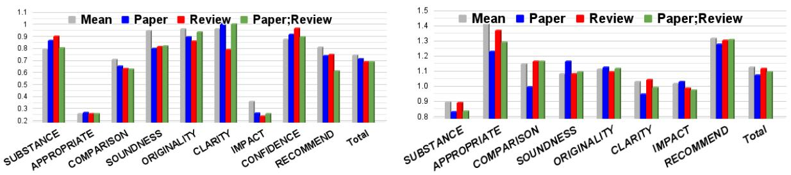
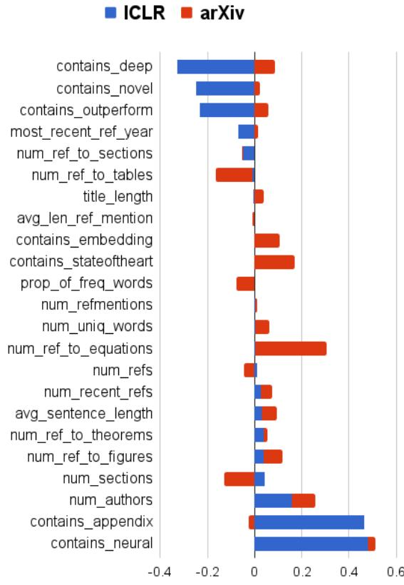

# A Dataset of Peer Reviews (PeerRead): Collection, Insights and NLP Applications

Dongyeop Kang1 Waleed Ammar2 Bhavana Dalvi Mishra2 Madeleine van Zuylen2 Sebastian Kohlmeier2 Eduard Hovy1 Roy Schwartz2,3 1School of Computer Science, Carnegie Mellon University, Pittsburgh, PA, USA 2Allen Institute for Artificial Intelligence, Seattle, WA, USA   
3Paul G. Allen Computer Science & Engineering, University of Washington, Seatte, WA, USA {dongyeok,hovy}@cs.cmu.edu {waleeda,bhavanad,madeleinev,sebastiank,roys}@allenai.org

# Abstract

Peer reviewing is a central component in the scientific publishing process. We present the first public dataset of scientific peer reviews available for research purposes (PeerRead v1),1 providing an opportunity to study this important artifact. The dataset consists of 14.7K paper drafts and the corresponding accept/reject decisions in top-tier venues including ACL, NIPS and ICLR. The dataset also includes 10.7K textual peer reviews written by experts for a subset of the papers. We describe the data collection process and report interesting observed phenomena in the peer reviews. We also propose two novel NLP tasks based on this dataset and provide simple baseline models. In the first task, we show that simple models can predict whether a paper is accepted with up to $21 \%$ error reduction compared to the majority baseline. In the second task, we predict the numerical scores of review aspects and show that simple models can outperform the mean baseline for aspects with high variance such as 'originality' and 'impact'.

# 1 Introduction

Prestigious scientific venues use peer reviewing to decide which papers to include in their journals or proceedings. While this process seems essential to scientific publication, it is often a subject of debate. Recognizing the important consequences of peer reviewing, several researchers studied various aspects of the process, including consistency, bias, author response and general review quality (e.g., Greaves et al., 2006; Ragone et al., 2011; De Silva and Vance, 2017). For example, the organizers of the NIPS 2014 conference assigned $10 \%$ of conference submissions to two different sets of reviewers to measure the consistency of the peer reviewing process, and observed that the two committees disagreed on the accept/reject decision for more than a quarter of the papers (Langford and Guzdial, 2015).

Despite these efforts, quantitative studies of peer reviews had been limited, for the most part, to the few individuals who had access to peer reviews of a given venue (e.g., journal editors and program chairs). The goal of this paper is to lower the barrier to studying peer reviews for the scientific community by introducing the first public dataset of peer reviews for research purposes: PeerRead.

We use three strategies to construct the dataset: (i) We collaborate with conference chairs and conference management systems to allow authors and reviewers to opt-in their paper drafts and peer reviews, respectively. (ii) We crawl publicly available peer reviews and annotate textual reviews with numerical scores for aspects such as 'clarity' and 'impact'. (iii) We crawl arXiv submissions which coincide with important conference submission dates and check whether a similar paper appears in proceedings of these conferences at a later date. In total, the dataset consists of 14.7K paper drafts and the corresponding accept/reject decisions, including a subset of 3K papers for which we have 10.7K textual reviews written by experts. We plan to make periodic releases of PeerRead, adding more sections for new venues every year. We provide more details on data collection in $\ S 2$ .

The PeerRead dataset can be used in a variety of ways. A quantitative analysis of the peer reviews can provide insights to help better understand (and potentially improve) various nuances of the review process. For example, in $\ S 3$ , we analyze correlations between the overall recommendation score and individual aspect scores (e.g., clarity, impact and originality) and quantify how reviews recommending an oral presentation differ from those recommending a poster. Other examples might include aligning review scores with authors to reveal gender or nationality biases. From a pedagogical perspective, the PeerRead dataset also provides inexperienced authors and first-time reviewers with diverse examples of peer reviews.

Table 1: The PeerRead dataset. Asp. indicates whether the reviews have aspect specific scores (e.g., clarity). Note that ICLR contains the aspect scores assigned by our annotators (see Section 2.4). $\mathbf { A c c / R e j }$ is the distribution of accepted/rejected papers. Note that NIPS provide reviews only for accepted papers.   

<table><tr><td></td><td>Section #Papers</td><td>#Reviews</td><td>Asp.</td><td>Acc / Rej</td></tr><tr><td>NIPS 20132017</td><td>2,420</td><td>9,152</td><td>×</td><td>2,420 / 0</td></tr><tr><td>ICLR 2017</td><td>427</td><td>1,304</td><td>✓</td><td>172 /255</td></tr><tr><td>ACL 2017</td><td>137</td><td>275</td><td>✓</td><td>88 / 49</td></tr><tr><td>CoNLL 2016</td><td>22</td><td>39</td><td>✓</td><td>11/11</td></tr><tr><td>arXiv 2007-2017</td><td>11,778</td><td>=</td><td>—</td><td>2,891 / 8,887</td></tr><tr><td>total</td><td>14,784</td><td>10,770</td><td></td><td></td></tr></table>

As an NLP resource, peer reviews raise interesting challenges, both from the realm of sentiment analysis—predicting various properties of the reviewed paper, e.g., clarity and novelty, as well as that of text generation—given a paper, automatically generate its review. Such NLP tasks, when solved with sufficiently high quality, might help reviewers, area chairs and program chairs in the reviewing process, e.g., by lowering the number of reviewers needed for some paper submission.

In $\ S 4$ , we introduce two new NLP tasks based on this dataset: (i) predicting whether a given paper would be accepted to some venue, and (ii) predicting the numerical score of certain aspects of a paper. Our results show that we can predict the accept/reject decisions with $6 - 2 1 \%$ error reduction compared to the majority reject-all baseline, in four different sections of PeerRead. Since the baseline models we use are fairly simple, there is plenty of room to develop stronger models to make better predictions.

# 2 Peer-Review Dataset (PeerRead)

Here we describe the collection and compilation of PeerRead, our scientific peer-review dataset. For an overview of the dataset, see Table 1.

# 2.1 Review Collection

Reviews in PeerRead belong to one of the two categories:

Opted-in reviews. We coordinated with the Softconf conference management system and the conference chairs for CoNLL $2 0 1 6 ^ { 2 }$ and ACL $2 0 1 7 ^ { 3 }$ conferences to allow authors and reviewers to opt-in their drafts and reviews, respectively, to be included in this dataset. A submission is included only if (i) the corresponding author opts-in the paper draft, and (ii) at least one of the reviewers opts-in their anonymous reviews. This resulted in 39 reviews for 22 CoNLL 2016 submissions, and 275 reviews for 137 ACL 2017 submissions. Reviews include both text and aspect scores (e.g., calrity) on a scale of 15.

Peer reviews on the web. In 2013, the NIPS conference4 began attaching all accepted papers with their anonymous textual review comments, as well as a confidence level on a scale of 13. We collected all accepted papers and their reviews for NIPS 20132017, a total of 9,152 reviews for 2,420 papers.

Another source of reviews is the OpenReview platform:5 a conference management system which promotes open access and open peer reviewing. Reviews include text, as well as numerical recommendations between 110 and confidence level between 15. We collected all submissions to the ICLR 2017 conference,6 a total of 1,304 official, anonymous reviews for 427 papers (177 accepted and 255 rejected).7

# 2.2 arXiv Submissions

arXiv8 is a popular platform for pre-publishing research in various scientific fields including physics, computer science and biology. While arXiv does not contain reviews, we automatically label a subset of arXiv submissions in the years 20072017 (inclusive)9 as accepted or probably-rejected, with respect to a group of top-tier NLP, ML and AI venues: ACL, EMNLP, NAACL, EACL, TACL, NIPS, ICML, ICLR and AAAI.

Accepted papers. In order to assign 'accepted' labels, we use the dataset provided by Sutton and Gong (2017) who matched arXiv submissions to their bibliographic entries in the DBLP directory10 by comparing titles and author names using Jaccard's distance. To improve our coverage, we also add an arXiv submission if its title matches an accepted paper in one of our target venues with a relative Levenshtein distance (Levenshtein, 1966) of $< 0 . 1$ . This results in a total of 2,891 accepted papers.

Probably-rejected papers. We use the following criteria to assign a 'probably-rejected' label for an arXiv submission:

•The paper wasn't accepted to any of the target venues. 11   
The paper was submitted to one of the arXiv categories cs.cl, cs.1g or cs.ai.12   
The paper wasn't cross-listed in any non-cs categories.   
The submission date13 was within one month of the submission deadlines of our target venues (before or after).   
The submission date coincides with at least one of the arXiv papers accepted for one of the target venues.

This process results in 8,887 'probably-rejected' papers.

Data quality. We did a simple sanity check in order to estimate the number of papers that we labeled as 'probably-rejected', but were in fact accepted to one of the target venues. Some authors add comments to their arXiv submissions to indicate the publication venue. We identified arXiv papers with a comment which matches the term "accept" along with any of our target venues (e.g., "nips"), but not the term "workshop". We found 364 papers which matched these criteria, 352 out of which were labeled as 'accepted'. Manual inspection of the remaining 12 papers showed that one of the papers was indeed a false negative (i.e., labeled as 'probably-rejected' but accepted to one of the target venues) due to a significant change in the paper title. The remaining 11 papers were not accepted to any of the target venues (e.g., "accepted at WMT@ACL 2014").

# 2.3 Organization and Preprocessing

We organize v1.0 of the PeerRead dataset in five sections: CoNLL 2016, ACL 2017, ICLR 2017, NIPS 20132017 and arXiv 20072017.14 Since the data collection varies across sections, different sections may have different license agreements. The papers in each section are further split into standard training, development and test sets with 0.9:0.05:0.05 ratios. In addition to the PDF file of each paper, we also extract its textual content using the Science Parse library.15 We represent each of the splits as a json-encoded text file with a list of paper objects, each of which consists of paper details, accept/reject/probably-reject decision, and a list of reviews.

# 2.4 Aspect Score Annotations

In many publication venues, reviewers assign numeric aspect scores (e.g., clarity, originality, substance) as part of the peer review. Aspect scores could be viewed as a structured summary of the strengths and weaknesses of a paper. While aspect scores assigned by reviewers are included in the opted-in sections in PeerRead, they are missing from the remaining reviews. In order to increase the utility of the dataset, we annotated 1.3K reviews with aspect scores, based on the corresponding review text. Annotations were done by two of the authors. In this subsection, we describe the annotation process in detail.

Feasibility study. As a first step, we verified the feasibility of the annotation task by annotating nine reviews for which aspect scores are available. The annotators were able to infer about half of the aspect scores from the corresponding review text (the other half was not discussed in the review text). This is expected since reviewer comments often focus on the key strengths or weaknesses of the paper and are not meant to be a comprehensive assessment of each aspect. On average, the absolute difference between our annotated scores and the gold scores originally provided by reviewers is 0.51 (on a 15 scale, considering only those cases where the aspect was discussed in the review text).

Data preprocessing. We used the official reviews in the ICLR 2017 section of the dataset for this annotation task. We excluded unofficial comments contributed by arbitrary members of the community, comments made by the authors in response to other comments, as well as "metareviews" which state the final decision on a paper submission. The remaining 1,304 official reviews are all written by anonymous reviewers assigned by the program committee to review a particular submission. We randomly reordered the reviews before annotation so that the annotator judgments based on one review are less affected by other reviews of the same paper.

Annotation guidelines. We annotated seven aspects for each review: appropriateness, clarity, originality, soundness/correctness, meaningful comparison, substance, and impact. For each aspect, we provided our annotators with the instructions given to ACL 2016 reviewers for this aspect.16 Our annotators' task was to read the detailed review text (346 words on average) and select a score between 15 (inclusive, integers only) for each aspect.17 When review comments do not address a specific aspect, we do not select any score for that aspect, and instead use a special "not discussed" value.

Data quality. In order to assess annotation consistency, the same annotators re-annotated a random sample consisting of 30 reviews. On average, $7 7 \%$ of the annotations were consistent (i.e., the re-annotation was exactly the same as the original annotation, or was off by 1 point) and $2 \%$ were inconsistent (i.e., the re-annotation was off by 2 points or more). In the remaining $21 \%$ , the aspect was marked as "not discussed" in one annotation but not in the other. We note that different aspects are discussed in the textual reviews at different rates. For example, about $49 \%$ of the reviews discussed the 'originality' aspect, while only $5 \%$ discussed 'appropriateness'.

# 3 Data-Driven Analysis of Peer Reviews

In this section, we showcase the potential of using PeerRead for data-driven analysis of peer reviews.

Overall recommendation vs. aspect scores. A critical part of each review is the overall recommendation score, a numeric value which best characterizes a reviewer's judgment of whether the draft should be accepted for publication in this venue. While aspect scores (e.g., clarity, novelty, impact) help explain a reviewer's assessment of the submission, it is not necessarily clear which aspects reviewers appreciate the most about a submission when considering their overall recommendation.

To address this question, we measure pair-wise correlations between the overall recommendation and various aspect scores in the ACL 2017 section of PeerRead and report the results in Table 2.

Table 2: Pearson's correlation coefficient $\rho$ between the overall recommendation and various aspect scores in the ACL 2017 section of PeerRead.   

<table><tr><td>Aspect</td><td>ρ</td></tr><tr><td>Substance</td><td>0.59</td></tr><tr><td>Clarity</td><td>0.42</td></tr><tr><td>Appropriateness Impact</td><td>0.30 0.16</td></tr><tr><td>Meaningful comparison</td><td>0.15</td></tr><tr><td>Originality</td><td>0.08</td></tr><tr><td>Soundness/Correctness</td><td>0.01</td></tr></table>

The aspects which correlate most strongly with the final recommendation are substance (which concerns the amount of work rather than its quality) and clarity. In contrast, soundness/correctness and originality are least correlated with the final recommendation. These observations raise interesting questions about what we collectively care about the most as a research community when evaluating paper submissions.

Oral vs. poster. In most NLP conferences, accepted submissions may be selected for an oral presentation or a poster presentation. The presentation format decision of accepted papers is based on recommendation by the reviewers. In the official blog of ACL 2017,18 the program chairs recommend that reviewers and area chairs make this decision based on the expected size of interested audience and whether the ideas can be grasped without backand-forth discussion. However, it remains unclear what criteria are used by reviewers to make this decision.

To address this question, we compute the mean aspect score in reviews which recommend an oral vs. poster presentation in the ACL 2017 section of

PeerRead, and report the results in Table 3. Notably, the average 'overall recommendation' score in reviews recommending an oral presentation is 0.9 higher than in reviews recommending a poster presentation, suggesting that reviewers tend to recommend oral presentation for submissions which are holistically stronger.

Table 3: Mean review scores for each presentation format (oral vs. poster). Raw scores range between 15. For reference, the last column shows the sample standard deviation based on all reviews.   

<table><tr><td colspan="3">Presentation format Oral Poster</td></tr><tr><td>Recommendation</td><td>3.83 2.92</td><td>stdev 0.90 0.89</td></tr><tr><td>Substance</td><td>3.91 3.29</td><td>0.62 0.84</td></tr><tr><td>Clarity</td><td>4.19 3.72</td><td>0.47 0.90</td></tr><tr><td>Meaningful comparison</td><td>3.60 3.36</td><td>0.24 0.82</td></tr><tr><td>Impact</td><td>3.27 3.09</td><td>0.18 0.54</td></tr><tr><td>Originality</td><td>3.91 3.88</td><td>0.02 0.87</td></tr><tr><td>Soundness/Correctness</td><td>3.93 4.18</td><td>-0.25 0.91</td></tr></table>

ACL 2017 vs. ICLR 2017. Table 4 reports the sample mean and standard deviation of various measurements based on reviews in the ACL 2017 and the ICLR 2017 sections of PeerRead. Most of the mean scores are similar in both sections, with a few notable exceptions. The comments in ACL 2017 reviews tend to be about $50 \%$ longer than those in the ICLR 2017 reviews. Since review length is often thought of as a measure of its quality, this raises interesting questions about the quality of reviews in ICLR vs. ACL conferences. We note, however, that ACL 2017 reviews were explicitly opted-in while the ICLR 2017 reviews include all official reviews, which is likely to result in a positive bias in review quality of the ACL reviews included in this study.

Another interesting observation is that the mean appropriateness score is lower in ICLR 2017 compared to ACL 2017. While this might indicate that ICLR 2017 attracted more irrelevant submissions, this is probably an artifact of our annotation process: reviewers probably only address appropriateness explicitly in their review if the paper is inappropriate, which leads to a strong negative bias against this category in our ICLR dataset.

# 4 NLP Tasks

Aside from quantitatively analyzing peer reviews, PeerRead can also be used to define interesting

Table 4: Mean $\pm$ standard deviation of various measurements on reviews in the ACL 2017 and ICLR 2017 sections of PeerRead. Note that ACL aspects were written by the reviewers themselves, while ICLR aspects were predicted by our annotators based on the review.   

<table><tr><td>Measurement</td><td>ACL&#x27;17</td><td>ICLR&#x27;17</td></tr><tr><td>Review length (words)</td><td>531±323</td><td>346±213</td></tr><tr><td>Appropriateness Meaningful comparison</td><td>4.9±0.4 3.5±0.8</td><td>2.6±1.3 2.9±1.1</td></tr><tr><td>Substance</td><td>3.6±0.8</td><td></td></tr><tr><td>Originality</td><td></td><td>3.0±0.9</td></tr><tr><td></td><td>3.9±0.9</td><td>3.3±1.1</td></tr><tr><td>Clarity</td><td>3.9±0.9</td><td>4.2±1.0</td></tr><tr><td>Impact Overall recommendation</td><td>3.2±0.5 3.3±0.9</td><td>3.4±1.0 3.3±1.4</td></tr></table>

NLP tasks. In this section, we introduce two novel tasks based on the PeerRead dataset. In the first task, given a paper draft, we predict whether the paper will be accepted to a set of target conferences. In the second task, given a textual review, we predict the aspect scores for the paper such as novelty, substance and meaningful comparison.19

Both these tasks are not only challenging from an NLP perspective, but also have potential applications. For example, models for predicting the accept/reject decisions of a paper draft might be used in recommendation systems for arXiv submissions. Also, a model trained to predict the aspect scores given review comments using thousands of training examples might result in better-calibrated scores.

# 4.1 Paper Acceptance Classification

Paper acceptance classification is a binary classification task: given a paper draft, predict whether the paper will be accepted or rejected for a predefined set of venues.

Models. We train a binary classifier to estimate the probability of accept vs. reject given a paper, i.e., P(accept=True | paper). We experiment with different types of classifiers: logistic regression, SVM with linear or RBF kernels, Random Forest, Nearest Neighbors, Decision Tree, Multilayer Perceptron, AdaBoost, and Naive Bayes. We use hand-engineered features, instead of neural models, because they are easier to interpret.

Table 5: Test accuracies $( \% )$ for acceptance classification. Our best model outperforms the majority classifiers in all cases.   

<table><tr><td colspan="4">ICLR cs.cl cs.1g cs.ai</td></tr><tr><td>Majority</td><td>57.6</td><td>68.9 67.9</td><td>92.1</td></tr><tr><td>Ours</td><td>65.3</td><td>75.7</td><td>92.6</td></tr><tr><td>(∆)</td><td>+7.7</td><td>+6.8</td><td>70.7 +2.8 +0.5</td></tr></table>

We use 22 coarse features, e.g., length of the title and whether jargon terms such as 'deep' and 'neural' appear in the abstract, as well as sparse and dense lexical features. The full feature set is detailed in Appendix A.

Experimental setup. We experiment with the ICLR 2017 and the arXiv sections of the PeerRead dataset. We train separate models for each of the arXiv category: cs.cl, cs.lg, and cs.ai. We use python's sklearn's implementation of all models (Pedregosa et al., 2011).20 We consider various regularization parameters for SVM and logistic regression (see Appendix A.1 for a detailed description of all hyperparameters). We use the standard test split and tune our hyperparameters using 5-fold cross validation on the training set.

Results. Table 5 shows our test accuracies for the paper acceptance task. Our best model outperforms the majority classifier in all cases, with up to $22 \%$ error reduction. Since our models lack the sophistication to assess the quality of the work discussed in the given paper, this might indicate that some of the features we define are correlated with strong papers, or bias reviewers' judgments.

We run an ablation study for this task for the ICLR and arXiv sections. We train only one model for all three categories in arXiv to simplify our analysis. Table 6 shows the absolute degradation in test accuracy of the best performing model when we remove one of the features. The table shows that some features have a large contribution on the classification decision: adding an appendix, a large number of theorems or equations, the average length of the text preceding a citation, the number of papers cited by this paper that were published in the five years before the submission of this paper, whether the abstract contains a phrase "state of the art" for ICLR or "neural" for arXiv, and length of title.21

<table><tr><td>ICLR</td><td>%</td></tr><tr><td>Best model</td><td>65.3</td></tr><tr><td> appendix</td><td>5.4</td></tr><tr><td> num_theorems</td><td>-3.8</td></tr><tr><td> num_equations</td><td>3.8</td></tr><tr><td> avg_len_ref</td><td>-3.8</td></tr><tr><td>abstractstate-of-the-art</td><td>3.5</td></tr><tr><td> #recent_refs</td><td>2.5</td></tr></table>

<table><tr><td>arXiv</td></tr><tr><td>Best model</td></tr><tr><td>79.1 avg_len_ref -1.4</td></tr><tr><td>num_uniq_words −1.1</td></tr><tr><td>num_theorems -1.0</td></tr><tr><td>abstractneural -1.0</td></tr><tr><td>num_refmentions -1.0</td></tr><tr><td>title_length -1.0</td></tr></table>

Table 6: The absolute $\%$ difference in accuracy on the paper acceptance prediction task when we remove only one feature from the full model. Features with larger negative differences are more salient, and we only show the six most salient features for each section. The features are num $X$ : number of $X$ (e.g., theorems or equations), avg_len_ref: average length of context before a reference, appendix: does paper have an appendix, abstractx: does the abstract contain the phrase $X$ , num_uniq_words: number of unique words, num_refmentions: number of reference mentions, and #recent_refs: number of cited papers published in the last five years.

# 4.2 Review Aspect Score Prediction

The second task is a multi-class regression task to predict scores for seven review aspects: 'impact', 'substance', 'appropriateness', 'comparison', 'soundness', 'originality' and 'clarity'. For this task, we use the two sections of PeerRead which include aspect scores: ACL 2017 and ICLR 2017.22

Models. We use a regression model which predicts a floating-point score for each aspect of interest given a sequence of tokens. We train three variants of the model to condition on (i) the paper text only, (ii) the review text only, or (ii) both paper and review text.

We use three neural architectures: convolutional neural networks (CNN, Zhang et al., 2015), recurrent neural networks (LSTM, Hochreiter and Schmidhuber, 1997), and deep averaging networks (DAN, Iyyer et al., 2015). In all three architectures, we use a linear output layer to make the final prediction. The loss function is the mean squared error between predicted and gold scores. We compare against a baseline which always predicts the mean score of an aspect, computed on the training set.23

Experimental setup. We train all models on the standard training set for 100 iterations, and select the best performing model on the standard development set. We use a single 100 dimension layer LSTM and CNN, and a single output layer of 100 dimensions for all models. We use GloVe 840B embeddings (Pennington et al., 2014) as input word representations, without tuning, and keep the 35K most frequent words and replace the rest with an UNK vector. The CNN model uses 128 filters and 5 kernels. We use an RMSProp optimizer (Tieleman and Hinton, 2012) with 0.001 learning rate, 0.9 decay rate, 5.0 gradient clipping, and a batch size of 32. Since scientific papers tend to be long, we only take the first 1000 and 200 tokens of each paper and review, respectively, and concatenate the two prefixes when the model conditions on both the paper and review text.24

  
Figure 1: Root mean squared error (RMSE, lower is better) on the test set for the aspect prediction task on the ACL 2017 (left) and the ICLR 2017 (right) sections of PeerRead.

Results. Figure 1 shows the test set root mean square error (RMSE) on the aspect prediction task (lower is better). For each section (ACL 2017 and ICLR 2017), and for each aspect, we report the results of four systems: 'Mean' (baseline), 'Paper', 'Review' and 'Paper;Review' (i.e., which information the model conditions on). For each variant, the model which performs best on the development set is selected.

We note that aspects with higher RMSE scores for the 'Mean' baseline indicate higher variance among the review scores for this aspect, so we focus our discussion on these aspects. In the ACL 2017 section, the two aspects with the highest variance are 'originality' and 'clarity'. In the ICLR 2017 section, the two aspects with the highest variance are 'appropriateness' and 'meaningful comparison'. Surprisingly, the 'Paper;Review' model outperforms the 'Mean' baseline in all four aspects, and the 'Review' model outperforms the 'Mean' baseline in three out of four. On average, all models slightly improve over the 'Mean' baseline.

# 5 Related Work

Several efforts have recently been made to collect peer reviews. Publons25 consolidates peer reviews data to build public reviewer profiles for participating reviewers. Crossref maintains the database of DOIs for its $4 0 0 0 +$ publisher members. They recently launched a service to add peer reviews as part of metadata for the scientific articles.26 Surprisingly, however, most of the reviews are not made publicly available. In contrast, we collected and organized PeerRead such that it is easy for other researchers to use it for research purposes, replicate experiments and make a fair comparison to previous results.

There have been several efforts to analyze the peer review process (e.g., Bonaccorsi et al., 2018; Rennie, 2016). Editors of the British Journal of Psychiatry found differences in courtesy between signed and unsigned reviews (Walsh et al., 2000). Ragone et al. (2011) and Birukou et al. (2011) analyzed ten CS conferences and found low correlation between review scores and the impact of papers in terms of future number of citations. Fang et al. (2016) presented similar observations for NIH grant application reviews and their productivity. Langford and Guzdial (2015) pointed to inconsistencies in the peer review process.

Several recent venues had single vs. double blind review experiments, which pointed to single-blind reviews leading to increased biases towards male authors (Roberts and Verhoef, 2016) and famous institutions (Tomkins et al., 2017). Further, Le Goues et al. (2017) showed that reviewers are unable to successfully guess the identity of the author in a double-blind review. Recently, there have been several initiatives by program chairs in major NLP conferences to study various aspects of the review process, mostly author response and general review quality.27 In this work, we provide a large scale dataset that would enable the wider scientific community to further study the properties of peer review, and potentially come up with enhancements to current peer review model.

Finally, the peer review process is meant to judge the quality of research work being disseminated to the larger research community. With the evergrowing rates of articles being submitted to toptier conferences in Computer Science and pre-print repositories (Sutton and Gong, 2017), there is a need to expedite the peer review process. Balachandran (2013) proposed a method for automatic analysis of conference submissions to recommend relevant reviewers. Also related to our acceptance predicting task are (Tsur and Rappoport, 2009) and Ashok et al. (2013), both of which focuses on predicting book reviews. Various automatic tools like Grammerly28 can assist reviewers in discovering grammar and spelling errors. Tools like Citeomatic29 (Bhagavatula et al., 2018) are especially useful in finding relevant articles not cited in the manuscript. We believe that the NLP tasks presented in this paper, predicting the acceptance of a paper and the aspect scores of a review, can potentially serve as useful tools for writing a paper, reviewing it, and deciding about its acceptance.

# 6 Conclusion

We introduced PeerRead, the first publicly available peer review dataset for research purposes, containing 14.7K papers and 10.7K reviews. We analyzed the dataset, showing interesting trends such as a high correlation between overall recommendation and recommending an oral presentation. We defined two novel tasks based on PeerRead: (i) predicting the acceptance of a paper based on textual features and (ii) predicting the score of each aspect in a review based on the paper and review contents. Our experiments show that certain properties of a paper, such as having an appendix, are correlated with higher acceptance rate. Our primary goal is to motivate other researchers to explore these tasks and develop better models that outperform the ones used in this work. More importantly, we hope that other researchers will identify novel opportunities which we have not explored to analyze the peer reviews in this dataset. As a concrete example, it would be interesting to study if the accept/reject decisions reflect author demographic biases (e.g. nationality).

# Acknowledgements

This work would not have been possible without the efforts of Rich Gerber and Paolo Gai (developers of the softconf . com conference management system), Stefan Riezler, Yoav Goldberg (chairs of CoNLL 2016), Min-Yen Kan, Regina Barzilay (chairs of ACL 2017) for allowing authors and reviewers to opt-in for this dataset during the official review process. We thank the openreview.net, arxiv.org and semanticscholar.org teams for their commitment to promoting transparency and openness in scientific communication. We also thank Peter Clark, Chris Dyer, Oren Etzioni, Matt Gardner, Nicholas FitzGerald, Dan Jurafsky, Hao Peng, Minjoon Seo, Noah A. Smith, Swabha Swayamdipta, Sam Thomson, Trang Tran, Vicki Zayats and Luke Zettlemoyer for their helpful comments.

# References

Vikas Ganjigunte Ashok, Song Feng, and Yejin Choi. 2013. Success with style: Using writing style to predict the success of novels. In Proc. of EMNLP. pages 17531764.   
Vipin Balachandran. 2013. Reducing human effort and improving quality in peer code reviews using automatic static analysis and reviewer recommendation. In Proc. of ICSE.   
Chandra Bhagavatula, Sergey Feldman, Russell Power, and Waleed Ammar. 2018. Content-based citation recommendation. In Proc. of NAACL.   
Aliaksandr Birukou, Joseph R. Wakeling, Claudio Bartolini, Fabio Casati, Maurizio Marchese, Katsiaryna Mirylenka, Nardine Osman, Azzurra Ragone, Carles Sierra, and Aalam Wassef. 2011. Alternatives to peer review: Novel approaches for research evaluation. In Front. Comput. Neurosci..   
Andrea Bonaccorsi, Antonio Ferrara, and Marco Mal-

garini. 2018. Journal ratings as predictors of article quality in arts, humanities, and social sciences: An analysis based on the italian research evaluation exercise. In The Evaluation of Research in Social Sciences and Humanities, Springer, pages 253267.

Pali UK De Silva and Candace K Vance. 2017. Preserving the quality of scientific research: Peer review of research articles. In Scientific Scholarly Communication, Springer, pages 7399.

Ferric C Fang, Anthony Bowen, and Arturo Casadevall. 2016. NIH peer review percentile scores are poorly predictive of grant productivity. eLife .

Sarah Greaves, Joanna Scott, Maxine Clarke, Linda Miller, Timo Hannay, Annette Thomas, and Philip Campbell. 2006. Nature's trial of open peer review. Nature 444(971):101038.

Sepp Hochreiter and Jürgen Schmidhuber. 1997. Long short-term memory. Neural computation 9(8):1735 1780.

Mohit Iyyer, Varun Manjunatha, Jordan Boyd-Graber, and Hal Daumé III. 2015. Deep unordered composition rivals syntactic methods for text classification. In Proc. of ACL-IJCNLP. volume 1, pages 1681 1691.

John Langford and Mark Guzdial. 2015. The arbitrariness of reviews, and advice for school administrators. Communications of the ACM Blog 58(4):12 13.

Claire Le Goues, Yuriy Brun, Sven Apel, Emery Berger, Sarfraz Khurshid, and Yannis Smaragdakis. 2017. Effectiveness of anonymization in doubleblind review. ArXiv:1709.01609.

Vladimir I. Levenshtein. 1966. Binary codes capable of correcting deletions, insertions, and reversals. Soviet physics doklady 10(8):707710.

Fabian Pedregosa, Gaël Varoquaux, Alexandre Gramfort, Vincent Michel, Bertrand Thirion, Olivier Grisel, Mathieu Blondel, Peter Prettenhofer, Ron Weiss, Vincent Dubourg, Jake Vanderplas, Alexandre Passos, David Cournapeau, Matthieu Brucher, Matthieu Perrot, and Édouard Duchesnay. 2011. Scikit-learn: Machine learning in Python. JMLR 12:28252830.

Jeffrey Pennington, Richard Socher, and Christopher D. Manning. 2014. Glove: Global vectors for word representation. In Empirical Methods in Natural Language Processing (EMNLP). pages 15321543. http://www.aclweb.org/anthology/D14-1162.

Azzurra Ragone, Katsiaryna Mirylenka, Fabio Casati, and Maurizio Marchese. 2011. A quantitative analysis of peer review. In Proc. of ISSI.

Drummond Rennie. 2016. Make peer review scientific: thirty years on from the first congress on peer review, drummond rennie reflects on the improvements brought about by research into the process and calls for more. Nature 535(7610):3134.

Seán G Roberts and Tessa Verhoef. 2016. Doubleblind reviewing at evolang 11 reveals gender bias. Journal of Language Evolution 1(2):163167.

Charles Sutton and Linan Gong. 2017. Popularity of arxiv.org within computer science. ArXiv:1710.05225.

Tijmen Tieleman and Geoffrey Hinton. 2012. Lecture 6.5-rmsprop: Divide the gradient by a running average of its recent magnitude. COURSERA: Neural networks for machine learning 4(2):2631.

Andrew Tomkins, Min Zhang, and William D Heavlin. 2017. Single versus double blind reviewing at wsdm 2017. ArXiv:1702.00502.

Oren Tsur and Ari Rappoport. 2009. Revrank: A fully unsupervised algorithm for selecting the most helpful book reviews. In Proc. of ICWSM.

E. Walsh, Michael W Rooney, Louis Appleby, and Greg Wilkinson. 2000. Open peer review: a randomised controlled trial. The British journal of psychiatry : the journal of mental science 176:4751.

Xiang Zhang, Junbo Zhao, and Yann LeCun. 2015. Character-level convolutional networks for text classification. In Proc. of NIPS.

# Appendices

# A Acceptance Classification Features

Table 7 shows the features used by our acceptance classification model. Figure 2 shows the coefficients of all our features as learned by our best classifier on both datasets.

# B Reviewer Instructions

Below is the list of instructions to ACL 2016 reviewers on how to assign aspect scores to reviewed papers.

# A.1 Hyperparameters

This section describes the hyperparameters used in our acceptance classification experiment. Unless stated otherwise, we used the sklearn default hyperparameters. For decision tree and random forest, we used maximum depth $^ { = 5 }$ For the latter, we also used max_features $_ { , = 1 }$ . For MLP, we used $\alpha = 1$ . For $k$ -nearest neighbors, we used $k = 3$ . For logistic regression, we considered both $l 1$ and $l 2$ penalty.

  
Figure 2: Coefficient values for coarse features in the paper acceptance classification, for ICLR and arXiv.

Table 7: List of coarse and lexical features used for acceptance classification task. $s p$ refers features extracted from science-parse.   

<table><tr><td rowspan=1 colspan=4>Features                   Description                     Labels</td></tr><tr><td rowspan=14 colspan=1>0</td><td rowspan=1 colspan=1>abstract_contains_X</td><td rowspan=1 colspan=1>Whether abstract contains keywords X deep, neural, embedding, outperform,outperform, novel, state_of_the_art</td><td rowspan=1 colspan=1>boolean</td></tr><tr><td rowspan=1 colspan=1>title_length</td><td rowspan=1 colspan=1>Length of title</td><td rowspan=1 colspan=1>integer</td></tr><tr><td rowspan=1 colspan=1>num_authors</td><td rowspan=1 colspan=1>Number of authors</td><td rowspan=1 colspan=1>integer</td></tr><tr><td rowspan=1 colspan=1>most_recent_refs_year</td><td rowspan=1 colspan=1>Most recent reference year</td><td rowspan=1 colspan=1>2001-2017</td></tr><tr><td rowspan=1 colspan=1>num_refs</td><td rowspan=1 colspan=1>Number of references (sp)</td><td rowspan=1 colspan=1>integer</td></tr><tr><td rowspan=1 colspan=1>num_refmentions</td><td rowspan=1 colspan=1>Number of reference mentioned (sp)</td><td rowspan=1 colspan=1>integer</td></tr><tr><td rowspan=1 colspan=1>avg_length_refs_mention</td><td rowspan=1 colspan=1>Average length of references mentioned (sp)</td><td rowspan=1 colspan=1>float</td></tr><tr><td rowspan=1 colspan=1>num_recent_refs</td><td rowspan=1 colspan=1>Number of recent referencessince the paper submitted (sp)</td><td rowspan=1 colspan=1>integer</td></tr><tr><td rowspan=1 colspan=1>num_ref_to_X</td><td rowspan=1 colspan=1>Number of X  figures, tables,sections, equations, theorems (sp)</td><td rowspan=1 colspan=1>integer</td></tr><tr><td rowspan=1 colspan=1>num_uniq_words</td><td rowspan=1 colspan=1>Number of unique words (sp)</td><td rowspan=1 colspan=1>integer</td></tr><tr><td rowspan=1 colspan=1>num_sections</td><td rowspan=1 colspan=1>Number of sections (sp)</td><td rowspan=1 colspan=1>integer</td></tr><tr><td rowspan=1 colspan=1>avg_sentence_length</td><td rowspan=1 colspan=1>Average sentence length (sp)</td><td rowspan=1 colspan=1>float</td></tr><tr><td rowspan=1 colspan=1>contains_appendix</td><td rowspan=1 colspan=1>Whether contains an appendix or not (sp)</td><td rowspan=1 colspan=1>boolean</td></tr><tr><td rowspan=1 colspan=1>prop_of_freq_words</td><td rowspan=1 colspan=1>Proportion of frequent words (sp)</td><td rowspan=1 colspan=1>float</td></tr><tr><td rowspan=4 colspan=1>2</td><td rowspan=1 colspan=1>BOW</td><td rowspan=1 colspan=1>Bag-of-words in abstract</td><td rowspan=1 colspan=1>integer</td></tr><tr><td rowspan=1 colspan=1>BOW+TFIDF</td><td rowspan=1 colspan=1>TFIDF weighted BOW in abstract</td><td rowspan=1 colspan=1>float</td></tr><tr><td rowspan=1 colspan=1>GloVe</td><td rowspan=1 colspan=1>Average of GloVe word embeddings in abstract</td><td rowspan=1 colspan=1>float</td></tr><tr><td rowspan=1 colspan=1>GloVe+TFIDF</td><td rowspan=1 colspan=1>TFIDF weighted averageof word embeddings in abstract</td><td rowspan=1 colspan=1>float</td></tr></table>

# APPROPRIATENESS (1-5)

Does the paper fit in ACL 2016? (Please answer this question in light of the desire to broaden the scope of the research areas represented at ACL.)

5: Certainly.   
4: Probably. W   
3: Unsure.   
2: Probably not.   
1: Certainly not.

# CLARITY (1-5)

For the reasonably well-prepared reader, is it clear what was done and why? Is the paper well-written and well-structured?

${ \mathfrak { H } } =$ Very clear.   
$4 =$ Understandable by most readers.   
$\mathfrak { z } =$ Mostly understandable to me with some effort.   
$_ { 2 } =$ Important questions were hard to resolve even with effort.   
$\ 1 \ =$ Much of the paper is confusing.

# ORIGINALITY (1-5)

How original is the approach? Does this paper break new ground in topic, methodology, or content? How exciting and innovative is the research it describes?   
Note that a paper could score high for originality even if the results do not show a convincing benefit. ${ \mathfrak { H } } =$ Surprising: Significant new problem, technique, methodology, or insight -- no prior research has attempted something similar.   
$4 =$ Creative: An intriguing problem, technique, or approach that is substantially different from previous research.   
$\mathfrak { z } =$ Respectable: A nice research contribution that represents a notable extension of prior approaches or methodologies.   
$_ { 2 } =$ Pedestrian: Obvious, or a minor improvement on familiar techniques.   
$\ 1 \ =$ Significant portions have actually been done before or done better.

# EMPIRICAL SOUNDNESS / CORRECTNESS (1-5)

First, is the technical approach sound and well-chosen? Second, can one trust the empirical claims of the paper -- are they supported by proper experiments and are the results of the experiments correctly interpreted?

${ \mathfrak { H } } =$ The approach is very apt, and the claims are convincingly supported.

$4 =$ Generally solid work, although there are some aspects of the approach or evaluation I am not sure about.   
$\mathfrak { z } =$ Fairly reasonable work. The approach is not bad, and at least the main claims are probably correct, but I am not entirely ready to accept them (based on the material in the paper). $_ { 2 } =$ Troublesome. There are some ideas worth salvaging here, but the work should really have been done or evaluated differently.   
$\ 1 \ =$ Fatally flawed.

# THEORETICAL SOUNDNESS / CORRECTNESS (1-5)

First, is the mathematical approach sound and well-chosen? Second, are the arguments in the paper cogent and well-supported?

${ \mathfrak { H } } =$ The mathematical approach is very apt, and the claims are convincingly supported. $4 =$ Generally solid work, although there are some aspects of the approach I am not sure about or the argument could be stronger.   
$\mathfrak { z } =$ Fairly reasonable work. The approach is not bad, and at least the main claims are probably correct, but I am not entirely ready to accept them (based on the material in the paper). $_ { 2 } =$ Troublesome. There are some ideas worth salvaging here, but the work should really have been done or argued differently.   
$\ 1 \ =$ Fatally flawed.

# MEANINGFUL COMPARISON (1-5)

Do the authors make clear where the problems and methods sit with respect to existing literature? Are the references adequate? For empirical papers, are the experimental results meaningfully compared with the best prior approaches?

${ \mathfrak { H } } =$ Precise and complete comparison with related work. Good job given the space constraints. $4 =$ Mostly solid bibliography and comparison, but there are some references missing. $\mathfrak { z } =$ Bibliography and comparison are somewhat helpful, but it could be hard for a reader to determine exactly how this work relates to previous work.   
$_ { 2 } =$ Only partial awareness and understanding of related work, or a flawed empirical   
comparison.   
$\ 1 \ =$ Little awareness of related work, or lacks necessary empirical comparison.

# SUBSTANCE (1-5)

Does this paper have enough substance, or would it benefit from more ideas or results? Note that this question mainly concerns the amount of work; its quality is evaluated in other categories.

${ \mathfrak { H } } =$ Contains more ideas or results than most publications in this conference; goes the extra mile.   
$4 =$ Represents an appropriate amount of work for a publication in this conference. (most submissions) $\mathfrak { z } =$ Leaves open one or two natural questions that should have been pursued within the paper. $_ { 2 } =$ Work in progress. There are enough good ideas, but perhaps not enough in terms of outcome.   
$\ 1 \ =$ Seems thin. Not enough ideas here for a full-length paper.

# IMPACT OF IDEAS OR RESULTS (1-5)

How significant is the work described? If the ideas are novel, will they also be useful or inspirational? Does the paper bring any new insights into the nature of the problem?

${ \mathfrak { H } } =$ Will affect the field by altering other people's choice of research topics or basic approach.   
$4 =$ Some of the ideas or results will substantially help other people's ongoing research.   
$\mathfrak { z } =$ Interesting but not too influential. The work will be cited, but mainly for comparison or as a source of minor contributions.   
$_ { 2 } =$ Marginally interesting. May or may not be cited.   
$\ 1 \ =$ Will have no impact on the field.

# IMPACT OF ACCOMPANYING SOFTWARE (1-5)

If software was submitted or released along with the paper, what is the expected impact of the software package? Will this software be valuable to others? Does it fill an unmet need? Is it at least sufficient to replicate or better understand the research in the paper?

${ \mathfrak { H } } =$ Enabling: The newly released software should affect other people's choice of research or development projects to undertake.   
$4 =$ Useful: I would recommend the new software to other researchers or developers for their ongoing work.   
$\mathfrak { z } =$ Potentially useful: Someone might find the new software useful for their work.   
$_ { 2 } =$ Documentary: The new software useful to study or replicate the reported research, although for other purposes they may have limited interest or limited usability. (Still a positive rating) $ 1 = N 0$ usable software released.

# IMPACT OF ACCOMPANYING DATASET (1-5)

If a dataset was submitted or released along with the paper, what is the expected impact of the dataset? Will this dataset be valuable to others in the form in which it is released? Does it fill an unmet need?

${ \mathfrak { H } } =$ Enabling: The newly released datasets should affect other people's choice of research or development projects to undertake.   
$4 =$ Useful: I would recommend the new datasets to other researchers or developers for their ongoing work.   
$\mathfrak { z } =$ Potentially useful: Someone might find the new datasets useful for their work. $_ { 2 } =$ Documentary: The new datasets are useful to study or replicate the reported research, although for other purposes they may have limited interest or limited usability. (Still a positive rating)   
$ 1 = N 0$ usable datasets submitted.

# RECOMMENDATION (1-5)

There are many good submissions competing for slots at ACL 2016; how important is it to feature this one? Will people learn a lot by reading this paper or seeing it presented?

In deciding on your ultimate recommendation, please think over all your scores above. But remember that no paper is perfect, and remember that we want a conference ful of interesting, diverse, and timely work. If a paper has some weaknesses, but you really got a lot out of it, feel free to fight for it. If a paper is solid but you could live without it, let us know that you're ambivalent. Remember also that the authors have a few weeks to address reviewer comments before the camera-ready deadline.

Should the paper be accepted or rejected?

${ \mathfrak { H } } =$ This paper changed my thinking on this topic and I'd fight to get it accepted;   
$4 = 1$ learned a lot from this paper and would like to see it accepted.   
$\mathfrak { z } =$ Borderline: I'm ambivalent about this one.   
$_ { 2 } =$ Leaning against: I'd rather not see it in the conference.   
$\ 1 \ =$ Poor: I'd fight to have it rejected.

# REVIEWER CONFIDENCE (1-5)

${ \mathfrak { H } } =$ Positive that my evaluation is correct. I read the paper very carefully and am familiar with related work.

$4 =$ Quite sure. I tried to check the important points carefully. It's unlikely, though conceivable, that I missed something that should affect my ratings.

$\mathfrak { z } =$ Pretty sure, but there's a chance I missed something. Although I have a good feel for this ar in general, I did not carefully check the paper's details,eg, the math, experimental desin, or novelty.

$_ { 2 } =$ Willing to defend my evaluation, but it is fairly likely that I missed some details, didn't understand some central points, or can't be sure about the novelty of the work.

$\ 1 \ =$ Not my area, or paper is very hard to understand. My evaluation is just an educated guess.