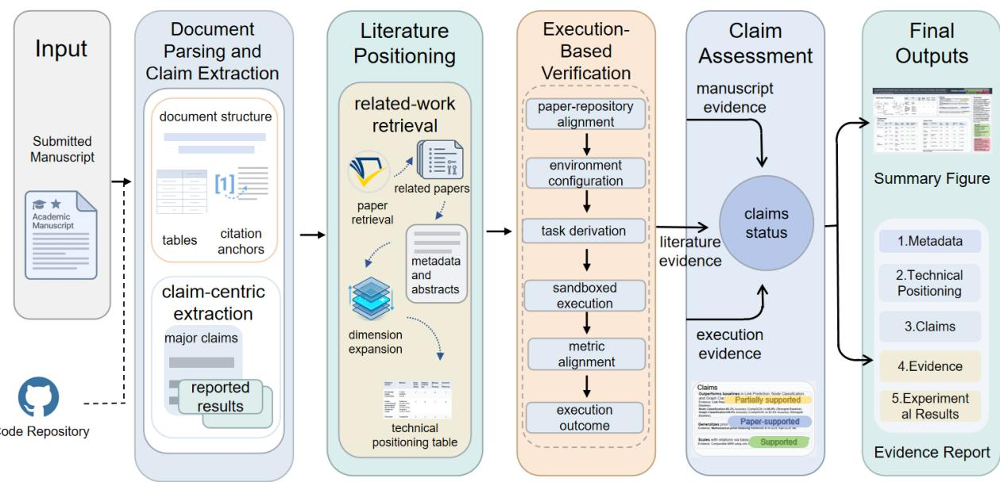
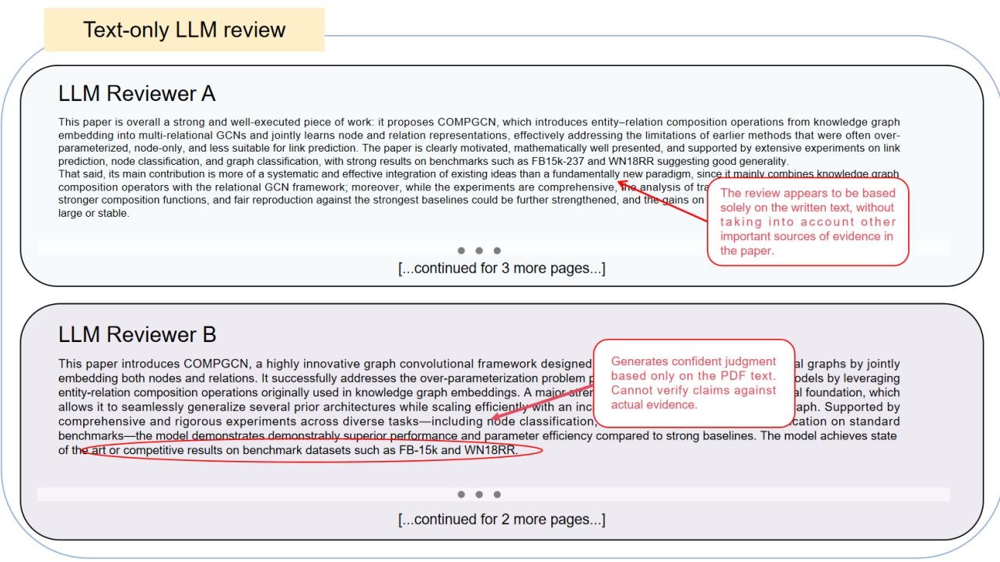
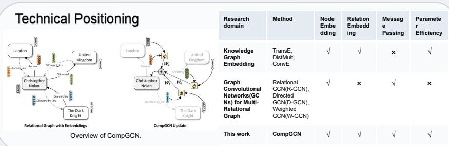
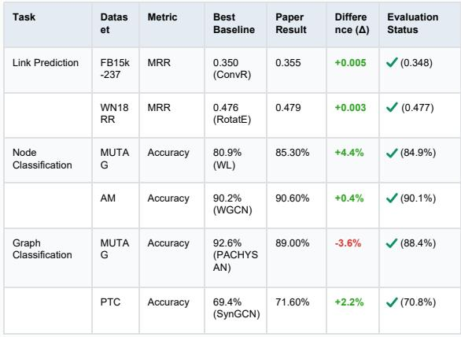

# FactReview: Evidence-Grounded Reviews with Literature Positioning and Execution-Based Claim Verification

Hang Xu $1 ^ { \circ }$ \*, Ling Yue $2 ^ { * }$ , Chaoqian Ouyang $^ { 3 ^ { * } }$ , Yuchen Liu $^ 4$ , Libin Zheng $^ 3$ , Shaowu Pan $^ { 2 \dagger }$ , Shimin Di $^ { 1 \dagger }$ , and Min-Ling Zhang $^ { - 1 }$

$^ { 1 }$ Southeast University $^ 2$ Rensselaer Polytechnic Institute $^ 3$ Sun Yat-sen University $^ 4$ The Hong Kong University of Science and Technology

# Abstract

Peer review in machine learning is under growing pressure from rising submission volume and limited reviewer time. Most LLM-based reviewing systems read only the manuscript and generate comments from the paper’s own narrative. This makes their outputs sensitive to presentation quality and leaves them weak when the evidence needed for review lies in related work or released code. We present FactReview, an evidence-grounded reviewing system that combines claim extraction, literature positioning, and execution-based claim verification. Given a submission, FactReview identifies major claims and reported results, retrieves nearby work to clarify the paper’s technical position, and, when code is available, executes the released repository under bounded budgets to test central empirical claims. It then produces a concise review and an evidence report that assigns each major claim one of five labels: Supported, Supported by the paper, Partially supported, In conflict, or Inconclusive. In a case study on CompGCN, FactReview reproduces results that closely match those reported for link prediction and node classification, yet also shows that the paper’s broader performance claim across tasks is not fully sustained: on MUTAG graph classification, the reproduced result is $8 8 . 4 \%$ , whereas the strongest baseline reported in the paper remains $9 2 . 6 \%$ . The claim is therefore only partially supported. More broadly, this case suggests that AI is most useful in peer review not as a final decision-maker, but as a tool for gathering evidence and helping reviewers produce more evidence-grounded assessments. The code is public at https://github.com/DEFENSE-SEU/FactReview.

# 1 Introduction

Peer review in machine learning asks reviewers to do more than summarize a paper. They must place the work relative to prior literature, judge whether the claimed contribution is substantial, assess whether the reported evidence supports the stated claims, and, when code is available, decide whether the released artifact reproduces the main empirical results. These checks take time, and they are becoming harder as submission volume grows (Pineau et al., 2020; Raff, 2019).

Recent AI-based reviewing systems show that large language models can summarize papers, draft critiques, and produce fluent review-like text (Liang et al., 2023; D’Arcy et al., 2024; Idahl & Ahmadi, 2024; Zhu et al., 2025b; Sahu et al., 2025; Zhuang et al., 2025). However, most of these systems still take the manuscript as the primary input and generate judgments mainly from the paper narrative itself (Liang et al., 2023; D’Arcy et al., 2024; Idahl & Ahmadi, 2024; Zhu et al., 2025b). This design has several weaknesses. The output can be overly sensitive to writing quality and rhetorical framing. It can also accept author claims before those claims are checked against outside evidence. Recent work further suggests that LLM-based reviewers may introduce their own biases and fairness risks when they are integrated more deeply into the research and review pipeline (Li et al., 2025). Finally, it is hard to inspect the basis of the review when the evidence that matters most lies outside the manuscript.

This limitation is especially important for empirical machine learning papers. A paper may claim better accuracy, better scalability, or strong reproducibility, yet the strongest test of those claims may require repository inspection, environment reconstruction, and actual execution (Raff, 2019; Pineau et al., 2020; Arbel $\&$ Zouaoui, 2024). Human reviewers rarely have time to perform these checks in a systematic way. More recent work on agentic reproduction and execution-heavy benchmarks reaches a similar conclusion from a different angle: connecting paper claims to code, environments, and outputs remains difficult even for advanced LLM-based systems (Starace et al., 2025; Zhao et al., 2025; Hua et al., 2025). Paper-only AI reviewers therefore inherit the same limitation: they can describe the paper, but they cannot reliably tell whether the main empirical claims hold once the artifact is examined.

We present FactReview, an evidence-grounded reviewing system designed to address part of this gap. FactReview first extracts review-relevant claims and reported results from the submission. It then retrieves nearby work to clarify the paper’s technical position and, when code is available, executes the released repository under bounded budgets to test central empirical claims. The system outputs a concise review plus a linked evidence report in which each major claim is assigned one of five labels: Supported, Supported by the paper, Partially supported, In conflict, or Inconclusive. In this sense, our formulation is closer to scientific claim verification and literature-grounded scientific assistance than to paper-only review generation (Wadden et al., 2020; Wang et al., 2025; L’ala et al., 2023; Asai et al., 2024).

The scope is intentionally limited. FactReview is not asked to make an accept-or-reject decision, and it is not meant to replace human judgment. Its role is to handle parts of reviewing that require substantial evidence work, take time, and are easy to skip under time pressure: claim extraction, comparison with nearby work, repository-grounded verification, and transparent linking between judgments and evidence.

Our contributions are as follows.

• We formulate automated reviewing as evidence-grounded claim assessment that combines manuscript analysis, literature positioning, and execution-based verification.   
• We design FactReview, a multi-stage workflow that produces a concise review together with linked evidence, without asking the model to make a final recommendation.   
• We present an end-to-end case study on CompGCN and controlled analyses of backend sensitivity and execution failure modes, showing how evidence-grounded reviewing can verify local findings, narrow broad claims, and reveal where verification breaks down.

# 2 Related work

LLM-based paper reviewing. Recent work has explored the use of large language models for automated paper reviewing, including direct feedback generation, specialized review models, and multi-stage or multiagent review frameworks (Liang et al., 2023; D’Arcy et al., 2024; Idahl & Ahmadi, 2024; Zhu et al., 2025b; Sahu et al., 2025; Zhuang et al., 2025). In the simplest setting, a general-purpose LLM can generate review drafts or scores directly from the manuscript, but the output remains grounded mainly in the paper itself (Liang et al., 2023). Systems such as MARG, OpenReviewer, DeepReview, and ReviewerToo improve on this baseline through multi-agent discussion, specialized fine-tuning, retrieval, or structured reasoning (D’Arcy et al., 2024; Idahl $\&$ Ahmadi, 2024; Zhu et al., 2025b; Sahu et al., 2025). These systems can produce more detailed and better organized feedback, but the main objective is still review generation rather than direct claim assessment tied to explicit external evidence. Recent work also raises fairness, bias, and security concerns for LLM reviewers, including prestige framing, assertion-strength sensitivity, rebuttal sycophancy, contextual poisoning, and hidden prompt-injection-style vulnerabilities (Li et al., 2025; Wang et al., 2026; Zhu et al., 2025a; Bergstrom & Bak-Coleman, 2025).

Peer review as a social or multi-agent process. Another line of work studies peer review as interaction among reviewers, authors, area chairs, or other agents. AgentReview models these interactions using LLM agents, while other work studies disagreement patterns in real peer reviews and highlights the prevalence of reviewer conflict and latent bias (Jin et al., 2024; Kumar et al., 2023). This perspective is

<table><tr><td>System</td><td>Manuscript Retrieved analysis</td><td></td><td>Claim</td><td>Review linked Execution-based Review-process literature assessment to evidence</td><td>verification</td><td>simulation</td><td>No final recommendation</td></tr><tr><td>General LLM reviewers</td><td>✓</td><td>×</td><td>×</td><td>×</td><td>×</td><td>×</td><td>×</td></tr><tr><td>MARG</td><td>✓</td><td>×</td><td>×</td><td>×</td><td>×</td><td>×</td><td>×</td></tr><tr><td>OpenReviewer</td><td>✓</td><td>×</td><td>×</td><td>×</td><td>×</td><td>×</td><td>×</td></tr><tr><td>AgentReview</td><td>✓</td><td>×</td><td>×</td><td>×</td><td>×</td><td>✓</td><td>×</td></tr><tr><td>DeepReview</td><td>✓</td><td>✓</td><td>∆</td><td>∆</td><td>×</td><td>×</td><td>×</td></tr><tr><td>ReviewerToo</td><td>✓</td><td>∆</td><td>∆</td><td>×</td><td>×</td><td>∆</td><td>×</td></tr><tr><td>FactReview (ours)</td><td>✓</td><td>✓</td><td>✓</td><td>✓</td><td>✓</td><td>×</td><td>✓</td></tr></table>

Table 1: Comparison with adjacent AI reviewing paradigms. FactReview combines literature retrieval, claim assessment, execution-based verification, and review text linked to evidence. $\bigtriangleup$ denotes partial or limited support rather than a central capability.

useful for understanding disagreement, deliberation, and decision dynamics. It is not our focus. We study the evidence available to a reviewer examining a submission, not committee behavior or the full decision process.

Scientific agents, scholarly document infrastructure, and claim verification. Work on scientific agents, literature-grounded assistants, and scientific document infrastructure is closer to our setting. Systems such as PaperQA, OpenScholar, and PT-RAG show that retrieval-augmented agents can answer scientific questions and synthesize prior literature with stronger provenance and structure awareness than paper-only prompting (L’ala et al., 2023; Asai et al., 2024; Yu et al., 2026). Resources and tools such as SciBERT, S2ORC, GROBID, and broader scholarly document processing work support structured analysis of scientific papers rather than treating them as plain text alone (Beltagy et al., 2019; Lo et al., 2020; Lopez, 2009; Kashyap et al., 2023). Domain-oriented scientific models and resources further suggest that future systems may benefit from grounding over richer scientific artifacts such as diagrams, metadata, and multimodal paper structure (Taylor et al., 2022; Zhang et al., 2026). Work on claim verification is especially relevant: SciFact and related evidence-retrieval approaches explicitly frame scientific reasoning as deciding whether retrieved evidence supports or refutes a claim (Wadden et al., 2020; Soleimani et al., 2019; Wang et al., 2025).

Reproducibility tools and execution-based evaluation. Work on scientific agents, reproducibility pipelines, and execution-based evaluation is also close to our setting. A substantial literature shows that retrieval, tool use, and controlled execution can reveal information that is not available in the paper, especially for empirical machine learning work (Raff, 2019; Pineau et al., 2020; Arbel & Zouaoui, 2024). Newer agentic benchmarks and reproduction systems reinforce this point by showing that repository-grounded execution, environment recovery, and result alignment remain hard even for advanced language-model-based systems (Starace et al., 2025; Zhao et al., 2025; Hua et al., 2025). More general repository-interface and tool-standardization systems demonstrate how language models can interact with code, tools, and standardized repository abstractions, but they are not designed to produce reviewer-facing claim labels and evidence reports (Lu et al., 2024; Di et al., 2026; Ouyang et al., 2025). Their outputs are logs, diagnostics, generated artifacts, or reproduction traces rather than a concise review organized around the paper’s main claims.

Position of our work. FactReview occupies a distinct position in the design space relative to prior AI reviewing systems and reproducibility agents. Its target is not overall paper scoring or review-process simulation, but the assessment of review-relevant claims. Its evidence is not limited to the manuscript; it combines evidence from the manuscript with nearby literature and, when available, execution traces from the released repository. Its output is not a free-form critique or a reproduction log, but a concise review whose judgments are decomposed into claim-level labels and linked supporting evidence. In this sense, FactReview is best understood as an evidence-grounded claim-assessment system for peer review, rather than as either a paper-only reviewer or a generic reproducibility tool. Table 1 summarizes these differences.

# 3 Method

The input to FactReview is a submission manuscript and, when available, links to executable artifacts. The output is a concise review backed by a linked evidence report. The claim is the core unit of analysis: every substantive judgment in the review should trace back to specific evidence from the paper, nearby literature, or execution traces. Figure 1 summarizes the workflow.

  
Figure 1: Overview of FactReview. The system parses the submission, extracts major claims and reported results, positions the paper relative to nearby literature, and, when code is available, executes the linked repository to verify central empirical claims before writing a concise review and linked evidence report.

# 3.1 Document ingestion and claim extraction

FactReview first parses the submission into a structured representation that preserves section boundaries, tables, equations, figure references, and result locations. Compared with raw manuscript text, this representation makes it easier for downstream agents to recover what was claimed, where it was claimed, and which evidence the paper itself presents.

For the claim-extraction component, we build on DeepReview v2 (Zhu et al., 2025b) and adapt its prompting strategy to our setting. Specifically, we revise the prompts to support schema-constrained extraction of major claims, reported results, datasets, baselines, metrics, and claim locations, as well as finer-grained decomposition of broad statements into verifiable claim units.

Each extracted claim stores its type, such as empirical, methodological, theoretical, or reproducibilityrelated, together with its scope and the evidence targets that matter for later assessment. Broad statements are decomposed into smaller units. For example, a claim of outperforming prior work across several tasks is split by task, dataset, and metric so that later verification can distinguish local successes from overstatement.

# 3.2 Literature positioning

FactReview next builds a local comparison set from cited methods, named baselines, and semantically similar papers. The goal is not to assign a generic novelty score. Instead, the system asks a narrower question: relative to nearby work, what technical role does this submission play?

The positioning module identifies neighboring method families, the design choices that separate them, and the extent to which the paper introduces a new mechanism, a new combination of existing components, or mainly an empirical improvement. This local map gives the later review a concrete basis for discussing technical position and claimed novelty.

# 3.3 Execution-based claim verification

When a repository is available, FactReview performs verification through a stateful workflow rather than a single generated shell script. The system resolves the artifact, creates a run-specific workspace, builds a controlled environment, and derives an explicit task list from README commands, configuration files, entry scripts, and repository structure. Evaluation starts from a fixed plan rather than ad hoc trial and error.

Each task is executed under explicit time and resource budgets. The system records commands, return codes, logs, intermediate outputs, and archived artifacts. The point is not only whether the repository runs, but whether the available outputs support a claim that matters for review.

To keep verification conservative, bounded repair is restricted to environment-level or wrapper-level fixes, such as dependency installation, path correction, minor launch-script fixes, or missing command arguments. FactReview does not change model architecture, loss definitions, evaluation logic, or reported baselines. After execution, the system aligns the resulting outputs with the claims and numbers extracted from the paper. When this alignment is weak or unavailable, the claim remains Inconclusive rather than being forced into a positive or negative verdict.

# 3.4 Claim labels and review synthesis

FactReview assigns one of five labels to each major claim. A claim is Supported when external evidence, such as execution traces or retrieved literature, directly supports it. It is Supported by the paper when the manuscript presents a plausible internal argument but no external verification is available. It is Partially supported when only part of the claim survives decomposition by task, dataset, or condition. It is In conflict when reliable evidence contradicts the claim. It is Inconclusive when the available evidence is insufficient.

Finally, the system writes a concise review organized around the claims, comparisons, and limitations that matter most for decision making. The paired evidence report links every judgment back to the paper, nearby literature, or execution artifacts so that a human reviewer can inspect and revise the system’s conclusion.

# 4 Evaluation

We study three questions. First, can the system produce a useful end-to-end evidence-grounded review for a real code-available machine learning paper? Second, when the workflow is fixed, how much does execution-based verification depend on the underlying language model? Third, when verification fails, what kinds of failures dominate?

# 4.1 Experimental setup

All experiments are conducted on a local server with eight NVIDIA GeForce RTX 4090 GPUs. Unless otherwise noted, the default backend is GPT-5.4 (OpenAI, 2026) with temperature 1.0. The same sandboxed workflow is used throughout, including repository grounding, task planning, bounded repair, execution tracing, and claim-level evidence packaging.

Because the contribution is a reviewing system rather than a benchmark of numerical reproduction, our evaluation centers on one end-to-end case study and two controlled analyses of the execution module. The target is CompGCN (Vashishth et al., 2019). A verification episode is counted as successful only if it produces evidence that can be linked to a claim that matters for review. Reported time is wall-clock time per episode.

# 4.2 CompGCN: End-to-end evidence-grounded review

CompGCN (Vashishth et al., 2019) is a useful test case because it combines several types of review-relevant claims. The paper proposes a specific architectural mechanism, reports results on multiple tasks, argues that the framework subsumes earlier multi-relational graph convolutional models, and claims that basis decomposition improves scalability while largely preserving performance. This mix lets us test whether FactReview can jointly handle technical positioning, empirical verification, and manuscript-only theoretical claims within one submission.

Rather than generating a long block of review prose, FactReview produces a short review summary backed by linked evidence. Figure 2 shows a standard text-only LLM review on the same paper, while Figure 3 shows the corresponding FactReview output.

On the paper-analysis side, FactReview positions CompGCN between two nearby lines of work: knowledge graph embedding methods that explicitly model relations, and multi-relational graph convolutional models that perform message passing over structured graphs. This placement is more useful than a generic summary because it shows the paper’s main design choice more clearly: it composes node and relation representations during message passing while using basis decomposition to control parameter growth.

  
Figure 2: Standard text-only LLM review on CompGCN. The review is fluent and well organized, but it makes its judgments from the manuscript alone and largely accepts the broad empirical claim as stated.

The claim extraction stage surfaces three high-impact claims. The first is an empirical claim that the method outperforms prior work across link prediction, node classification, and graph classification. The second is a theoretical claim that the framework subsumes prior multi-relational graph convolutional models. The third is a scalability claim that basis decomposition preserves effectiveness while reducing parameter growth.

Execution changes the reading of the first claim. For link prediction and node classification, the reproduced results are close to the reported numbers and preserve the paper’s local ranking pattern. On FB15k-237 (Toutanova $\&$ Chen, 2015), for example, the reproduced MRR is 0.352 versus 0.355 in the paper. On MUTAG (Debnath et al., 1991) node classification, the reproduced accuracy is $8 4 . 9 \%$ versus $8 5 . 3 \%$ .

However, the full-scope claim does not survive unchanged. On MUTAG graph classification, the paper reports $8 9 . 0 \%$ , the reproduced run gives $8 8 . 4 \%$ , and the strongest baseline listed in the paper remains ahead at $9 2 . 6 \%$ . The correct label for the global performance claim is therefore Partially supported, not Supported. The system does not dismiss the paper, but it does force a broad claim to become more precise.

# Claims

Outperforms basel i nes i n Li n k Pred iction , N ode Classification , and G raph Cl assifi cation . Partially supported Evidence : Li n k Pred iction : 0 .355 M RR (Com pGCN ) vs 0 .350 M RR (Strongest Base l i n e) .   
N ode C lass ification : 85.3% Accu racy (Com pGC N ) vs 80 .9% (Strongest Basel i ne) . G raph C lass ification : 89 .0% Accu racy (Com pGC N ) vs 92 . 6% Accu racy (Strongest Base l i n e) .

General izes prior m u lti-rel ational GC N s . Paper-supported Evidence : Mathematical proof red uci ng framework to R-GCN , Ki pf-GCN , etc.

# Supported

Evidence : Com parable M RR usi ng on ly B=5 vs F u l l relation em bedd i ngs .

# Summary

Th is paper proposes Com pGC N , a novel framework that joi ntly   
em beds nodes and relations usi ng various com position operators Its p ri m a ry stre n gth l i es i n co ntro l l i n g parameter com plexity via basis   
decom position wh i le   
mathematical ly general izi ng prior m u lti -relational GC Ns   
Conseq uently it ach ieves State-ofthe-Art performance i n Li n k   
Pred iction and N ode Classification and com parable performance i n G raph Cl assifi cation tasks . H owever, the mod el is l i m ited by its restri ction to non -parameterized operators and suffers from g raph i nflation   
d ue to expl icitly added i nverse and self-loop edges .

Ablation Result   

<table><tr><td rowspan=1 colspan=1>AblationDimension</td><td rowspan=1 colspan=1>Configuration</td><td rowspan=1 colspan=1>FullModel</td><td rowspan=1 colspan=1>PaperResult</td><td rowspan=1 colspan=1>Difference(∆)</td><td rowspan=1 colspan=1>Codevaluation</td></tr><tr><td rowspan=1 colspan=1>Optimal setup</td><td rowspan=1 colspan=1>CompGCN (Corr)</td><td rowspan=1 colspan=1>0.355</td><td rowspan=1 colspan=1>0.355</td><td rowspan=1 colspan=1>0</td><td rowspan=1 colspan=1>(0.352)</td></tr><tr><td rowspan=1 colspan=1>Encoderarchitecture</td><td rowspan=1 colspan=1>Switch to R-GCN</td><td rowspan=1 colspan=1>0.355</td><td rowspan=1 colspan=1>0.342</td><td rowspan=1 colspan=1>-0.013</td><td rowspan=1 colspan=1>(0.345)</td></tr><tr><td rowspan=1 colspan=1>Componentnecessity</td><td rowspan=1 colspan=1>Remove theencoder</td><td rowspan=1 colspan=1>0.355</td><td rowspan=1 colspan=1>0.325</td><td rowspan=1 colspan=1>-0.03</td><td rowspan=1 colspan=1>(0.321)</td></tr><tr><td rowspan=1 colspan=1>Operatorimpact</td><td rowspan=1 colspan=1>Switch to Sub</td><td rowspan=1 colspan=1>0.355</td><td rowspan=1 colspan=1>0.352</td><td rowspan=1 colspan=1>-0.003</td><td rowspan=1 colspan=1>(0.350)</td></tr><tr><td rowspan=1 colspan=1>Parameterscaling</td><td rowspan=1 colspan=1>B = 25 bases</td><td rowspan=1 colspan=1>0.355</td><td rowspan=1 colspan=1>0.348</td><td rowspan=1 colspan=1>-0.007</td><td rowspan=1 colspan=1>(0.343)</td></tr><tr><td rowspan=1 colspan=1>Decodersyynergy</td><td rowspan=1 colspan=1>DistMult decoder</td><td rowspan=1 colspan=1>0.355</td><td rowspan=1 colspan=1>0.335</td><td rowspan=1 colspan=1>-0.02</td><td rowspan=1 colspan=1>(0.338)</td></tr></table>

  
N ote : Al l abl ation resu lts are extracted and standard ized usi ng the M RR metric on the FB 1 5k-237 dataset.

# Strengths

• State-of-th e-Art pe rfo rma n ce i n Li n k Pred iction a nd N od e   
C l ass ifi catio n , with stro n g   
general ization to G ra ph   
C l ass ifi catio n .   
• J oi nt node-relation em bedd i ng . • Ge n e ra l izes existi n g m u lti  
re l atio n a l G C N s .   
• Li near scal i n g via basis   
d eco m pos itio n .

# Weaknesses

• Marg i nal performance gai ns over stro ng co m p l ex-d o m a i n base l i n es . • Restricted to non -parameterized co m pos itio n o pe rators .   
• G ra p h i n fl at i o n fro m exp l i ci tl y   
add i ng i nverse a nd self-loop edges . • Random seeds and s ig n ificance testi n g n ot re po rted .   
• Hardware specs, memory   
footp ri nt a n d tra i n i n g ti m e o m itted

Figure 3 : FactReview output on CompG CN . The system decomposes maj or claims , links them to manuscript , literature , and execution evidence , and marks the graph-classification portion of the broad performance claim as “Partially supported” based on sandboxed execution traces .

Table 2: Execution-based claim verification on a fixed CompGCN workflow. Success is the percentage of successful runs over 12 verification episodes. Time is the average wall-clock time per episode in minutes. Cost is the average API cost per episode in U.S. dollars.   

<table><tr><td>Model</td><td>Success (%)</td><td>Time (min)</td><td>Cost / Episode ($)</td></tr><tr><td>Claude Opus 4.6</td><td>83.3</td><td>24.1</td><td>0.68</td></tr><tr><td>GPT-5.4</td><td>75.0</td><td>25.7</td><td>0.55</td></tr><tr><td>Claude Sonnet 4.5</td><td>66.7</td><td>27.4</td><td>0.33</td></tr><tr><td>GPT-4.1</td><td>58.3</td><td>28.9</td><td>0.42</td></tr><tr><td>GPT-40</td><td>50.0</td><td>27.8</td><td>0.28</td></tr><tr><td>Claude Haiku 4.5</td><td>41.7</td><td>26.2</td><td>0.16</td></tr></table>

The other two claims show why the label set must separate external support from manuscript-only support. The generalization claim is labeled Supported by the paper because its main evidence is primarily theoretical and largely internal to the manuscript. The basis-decomposition claim is labeled Supported because both the paper analysis and the reproduced empirical trend suggest that fewer bases control parameter growth without changing the local empirical conclusion.

To show the value of explicit evidence grounding, we compare the FactReview output in Figure 3 with the standard text-only LLM review in Figure 2. The text-only review collapses extraction, interpretation, and judgment into a single undifferentiated generation step and largely accepts the broad original empirical claim as stated. FactReview isolates the claim, checks it against task-level evidence, and downgrades it when graph classification no longer supports the full statement.

Taken together, the case study shows the intended behavior of the system. FactReview does not simply produce a longer review. It produces a more precise one: a review that can verify some claims, narrow others, and show the basis of each judgment.

# 4.3 Backend sensitivity of execution-based claim verification

To isolate the effect of the code-evaluation backend, we fix the target repository to CompGCN and keep the orchestration, sandbox, task set, repair policy, and stopping rules unchanged while varying only the underlying language model. We compare three Claude-family backends (Opus 4.6 (Anthropic, 2026), Sonnet 4.5 (Anthropic, 2025b), and Haiku 4.5 (Anthropic, 2025a)) and three GPT-family backends (GPT-5.4 (OpenAI, 2026), GPT-4.1 (OpenAI, 2025), and GPT-4o (OpenAI, 2024)). Each model is evaluated on the same set of 12 verification episodes covering link prediction, node classification, graph classification, and basis-decomposition analysis. An episode is counted as successful only if it produces execution evidence that can be tied back to a claim that matters for review.

Table 2 shows that model choice substantially affects execution-based verification even when the surrounding workflow is fixed. Claude Opus 4.6 achieves the highest success rate and the shortest average completion time. GPT-5.4 is the closest competitor, but it is somewhat less stable on the more interpretation-heavy episodes. Mid-tier backends remain practically usable, yet their lower end-to-end success rates show that the task is not reducible to simple command generation. Lower-cost models reduce per-episode API cost, but this saving comes with noticeably weaker verification reliability.

The gap is largest on graph classification and basis-decomposition analysis, not on straightforward linkprediction runs. This pattern supports one of the paper’s main points: execution-based reviewing is not only a software automation problem. The model must connect repository interaction back to claim-level judgment.

Family-level scaling trends are also visible even within a single repository. Within the Claude family, performance declines from Opus to Sonnet to Haiku. Within the GPT family, GPT-5.4 outperforms GPT-4.1 and GPT-4o. The backend language model is therefore not a minor implementation detail; it shapes the quality of the final evidence.

<table><tr><td>Failure Type</td><td>Count</td><td>Failures (%)</td><td>All Episodes (%)</td></tr><tr><td>Artifact-level</td><td>8</td><td>29.6%</td><td>11.1%</td></tr><tr><td>Execution-level</td><td>14</td><td>51.9%</td><td>19.4%</td></tr><tr><td>Interpretation-level</td><td>5</td><td>18.5%</td><td>6.9%</td></tr><tr><td>Total</td><td>27</td><td>100.0%</td><td>37.5%</td></tr></table>

Table 3: Distribution of failure types in execution-based claim verification. Counts are aggregated over 72 verification episodes across six backends. Percentages are reported relative to failures and relative to episodes.

# 4.4 Failure analysis

Execution failures are not all the same. For review writing, it matters whether the system failed because the artifact was unclear, because the environment could not be recovered, or because the outputs could not be aligned with the paper’s claims. We therefore group failures into three categories: artifact-level, execution-level, and interpretation-level. Table 3 summarizes the distribution over all 72 verification episodes across six backends. Each failed episode is assigned a single primary failure type corresponding to the earliest factor that blocked claim-level evidence.

Execution-level failures are the largest category, followed by artifact-level failures; interpretation-level failures are less common but still important. Typical artifact-level failures include missing or ambiguous entry points. Execution-level failures are usually caused by dependency drift, unavailable data or checkpoints, or resource mismatches. Interpretation-level failures arise when outputs cannot be mapped cleanly to the tables, baselines, or scoped claims in the paper.

This breakdown matters because it lets FactReview distinguish negative evidence from missing evidence. A repository that is hard to locate or run is relevant to reproducibility, but it is not automatically evidence against the paper’s technical claims. More broadly, the result shows that execution-grounded reviewing needs more than a pass-or-fail status: it needs structured uncertainty about what went wrong and what, if anything, can still be concluded.

# 5 Conclusion and future work

We presented FactReview, an AI reviewer that generates concise reviews grounded in explicit evidence. Rather than relying on the manuscript alone, it combines claim extraction, literature positioning, and execution-based claim verification, and links its judgments to the supporting evidence. This design moves automated reviewing beyond paper-only summary toward claim-based assessment that human reviewers can inspect directly.

Our experiments support this formulation. In the CompGCN case study, FactReview reproduced results close to those reported for link prediction and node classification, clarified the paper’s technical position relative to nearby work, and revised a broad empirical claim after the graph-classification result no longer supported it in full. Across six backends under a fixed execution workflow, verification success ranged from $4 1 . 7 \%$ to $8 3 . 3 \%$ , showing that backend capability directly affects evidence quality in execution-based reviewing. Taken together, these findings suggest that AI is most useful in peer review not as a final decision-maker, but as a tool for helping reviewers check claims more efficiently and with clearer evidence.

Future work includes evaluation with active reviewers in more realistic settings, expansion to a larger and more diverse paper set, and stronger repository grounding, environment recovery, and result alignment for more complex empirical pipelines. A longer-term direction is to extend the framework beyond empirical machine learning papers to submissions centered on theory, datasets, or systems.

# References

Anthropic. Claude haiku 4.5 system card. Anthropic, 2025a. Official system card.

Anthropic. Claude sonnet 4.5 system card. Anthropic, 2025b. Official system card.

Anthropic. Claude opus 4.6 system card. Anthropic, 2026. Official system card.

Michael Arbel and Alexander Zouaoui. MLXP: A framework for conducting replicable experiments in Python. 2024.

Akari Asai, Jacqueline He, Rulin Shao, Weijia Shi, Amanpreet Singh, J. Chang, Kyle Lo, Luca Soldaini, Sergey Feldman, Mike D’Arcy, David Wadden, Matt Latzke, Minyang Tian, Pan Ji, Shengyan Liu, Hao Tong, Bohao Wu, Yanyu Xiong, Luke S. Zettlemoyer, Graham Neubig, Dan Weld, Doug Downey, Wen tau Yih, Pang Wei Koh, and Hanna Hajishirzi. Openscholar: Synthesizing scientific literature with retrieval-augmented lms. ArXiv, abs/2411.14199, 2024.

Iz Beltagy, Kyle Lo, and Arman Cohan. Scibert: A pretrained language model for scientific text. pp. 3613–3618, 2019.

Carl T Bergstrom and Joe Bak-Coleman. Ai, peer review and the human activity of science. Nature, 2025.

Mike D’Arcy, Tom Hope, Larry Birnbaum, and Doug Downey. Marg: Multi-agent review generation for scientific papers. ArXiv, abs/2401.04259, 2024.

Asim Kumar Debnath, Rosa L. Lopez de Compadre, Gargi Debnath, Alan J. Shusterman, and Corwin Hansch. Structure-activity relationship of mutagenic aromatic and heteroaromatic nitro compounds. correlation with molecular orbital energies and hydrophobicity. Journal of medicinal chemistry, 34 2:786–97, 1991. URL https://api.semanticscholar.org/CorpusID:19990980.

Shimin Di, Xujie Yuan, Hanghui Guo, Chaoqian Ouyang, Zhangze Chen, Ling Yue, Libin Zheng, Jia Zhu, Shaowu Pan, Jian Yin, et al. Toolrosetta: Bridging open-source repositories and large language model agents through automated tool standardization. arXiv preprint arXiv:2603.09290, 2026.

Tianyu Hua, Harper Hua, Violet Xiang, Benjamin Klieger, Sang T. Truong, Weixin Liang, Fan-Yun Sun, and Nick Haber. Researchcodebench: Benchmarking llms on implementing novel machine learning research code. ArXiv, abs/2506.02314, 2025.

Maximilian Idahl and Zahra Ahmadi. Openreviewer: A specialized large language model for generating critical scientific paper reviews. pp. 550–562, 2024.

Yiqiao Jin, Qinlin Zhao, Yiyang Wang, Hao Chen, Kaijie Zhu, Yijia Xiao, and Jindong Wang. Agentreview: Exploring peer review dynamics with llm agents. pp. 1208–1226, 2024.

Abhinav Ramesh Kashyap, Yajing Yang, and MingSung Kan. Scientific document processing: challenges for modern learning methods. International Journal on Digital Libraries, pp. 1 – 27, 2023.

Sandeep Kumar, Tirthankar Ghosal, and Asif Ekbal. When reviewers lock horns: Finding disagreements in scientific peer reviews. pp. 16693–16704, 2023.

Jakub L’ala, Odhran O’Donoghue, Aleksandar Shtedritski, Sam Cox, Samuel G. Rodriques, and Andrew D. White. Paperqa: Retrieval-augmented generative agent for scientific research. ArXiv, abs/2312.07559, 2023.

Rui Li, Jia-Chen Gu, Po-Nien Kung, Heming Xia, Junfeng Liu, Xiangwen Kong, Zhifang Sui, and Nanyun Peng. Llm-reval: Can we trust llm reviewers yet? ArXiv, abs/2510.12367, 2025.

Weixin Liang, Yuhui Zhang, Hancheng Cao, Binglu Wang, Daisy Ding, Xinyu Yang, Kailas Vodrahalli, Siyu He, D. Smith, Yian Yin, Daniel A. McFarland, and James Zou. Can large language models provide useful feedback on research papers? a large-scale empirical analysis. ArXiv, abs/2310.01783, 2023.

Kyle Lo, Lucy Lu Wang, Mark Neumann, Rodney Michael Kinney, and Daniel S. Weld. S2orc: The semantic scholar open research corpus. pp. 4969–4983, 2020.

Patrice Lopez. Grobid: Combining automatic bibliographic data recognition and term extraction for scholarship publications. pp. 473–474, 2009.

Chris Lu, Cong Lu, R. Lange, Jakob Foerster, Jeff Clune, and David Ha. The ai scientist: Towards fully automated open-ended scientific discovery. ArXiv, abs/2408.06292, 2024.

OpenAI. Gpt-4o system card. OpenAI, 2024. Official system card.

OpenAI. Introducing gpt-4.1 in the api. OpenAI, 2025. Official release page.

OpenAI. Introducing gpt-5.4. OpenAI, 2026. Official release page.

Chaoqian Ouyang, Ling Yue, Shimin Di, Libin Zheng, Linan Yue, Shaowu Pan, Jian Yin, and Min-Ling Zhang. Code2mcp: Transforming code repositories into mcp services. arXiv preprint arXiv:2509.05941, 2025.

Joelle Pineau, Philippe Vincent-Lamarre, Koustuv Sinha, V. Lariviere, A. Beygelzimer, Florence d’Alche Buc, E. Fox, and H. Larochelle. Improving reproducibility in machine learning research (a report from the neurips 2019 reproducibility program). J. Mach. Learn. Res., 22:164:1–164:20, 2020.

Edward Raff. A step toward quantifying independently reproducible machine learning research. ArXiv, abs/1909.06674, 2019.

Gaurav Sahu, H. Larochelle, Laurent Charlin, and Christopher Pal. Reviewertoo: Should ai join the program committee? a look at the future of peer review. ArXiv, abs/2510.08867, 2025.

Amir Soleimani, Christof Monz, and M. Worring. Bert for evidence retrieval and claim verification. Advances in Information Retrieval, 12036:359 – 366, 2019.

Giulio Starace, Oliver Jaffe, Dane Sherburn, J. Aung, Jun Shern Chan, Leon Maksin, Rachel Dias, E. Mays, Benjamin Kinsella, Wyatt Thompson, Johannes Heidecke, Amelia Glaese, and Tejal Patwardhan. Paperbench: Evaluating ai’s ability to replicate ai research. ArXiv, abs/2504.01848, 2025.

Ross Taylor, Marcin Kardas, Guillem Cucurull, Thomas Scialom, A. Hartshorn, Elvis Saravia, Andrew Poulton, Viktor Kerkez, and Robert Stojnic. Galactica: A large language model for science. ArXiv, abs/2211.09085, 2022.

Kristina Toutanova and Danqi Chen. Observed versus latent features for knowledge base and text inference. In Alexandre Allauzen, Edward Grefenstette, Karl Moritz Hermann, Hugo Larochelle, and Scott Wen-tau Yih (eds.), Proceedings of the 3rd Workshop on Continuous Vector Space Models and their Compositionality, pp. 57–66, Beijing, China, July 2015. Association for Computational Linguistics. doi: 10.18653/v1/W15-4007. URL https://aclanthology.org/W15-4007/.

Shikhar Vashishth, Soumya Sanyal, Vikram Nitin, and Partha Talukdar. Composition-based multi-relational graph convolutional networks. arXiv preprint arXiv:1911.03082, 2019.

David Wadden, Kyle Lo, Lucy Lu Wang, Shanchuan Lin, Madeleine van Zuylen, Arman Cohan, and Hannaneh Hajishirzi. Fact or fiction: Verifying scientific claims. ArXiv, abs/2004.14974, 2020.

Jialiang Wang, Yuchen Liu, Hang Xu, Kaichun Hu, Shimin Di, Wangze Ni, Linan Yue, Min-Ling Zhang, Kui Ren, and Lei Chen. When ai reviews science: Can we trust the referee? The Innovation Informatics, 2(1):100030, 2026. ISSN 3105-8515. doi: 10.59717/j.xinn-inform.2026.100030. URL https://www.the-innovation.org/informatics/article/id/69891cb8cf3295331f847960.

Siyuan Wang, James R. Foulds, Md. Osman Gani, and Shimei Pan. Llm-based corroborating and refuting evidence retrieval for scientific claim verification. ArXiv, abs/2503.07937, 2025.

Rui Yu, Tianyi Wang, Ruixia Liu, and Yinglong Wang. Pt-rag: Structure-fidelity retrieval-augmented generation for academic papers. arXiv preprint arXiv:2602.13647, 2026.

Tingwen Zhang, Ling Yue, Zhen Xu, and Shaowu Pan. Diagrambank: A large-scale dataset of diagram design exemplars with paper metadata for retrieval-augmented generation. February 2026. doi: 10.21203/rs.3. rs-8917857/v1. PREPRINT (Version 1) available at Research Square.

Xuanle Zhao, Zilin Sang, Yuxuan Li, Qi Shi, Weilun Zhao, Shuo Wang, Duzhen Zhang, Xu Han, Zhiyuan Liu, and Maosong Sun. Autoreproduce: Automatic ai experiment reproduction with paper lineage. ArXiv, abs/2505.20662, 2025.

Changjia Zhu, Junjie Xiong, Renkai Ma, Zhicong Lu, Yao Liu, and Lingyao Li. When your reviewer is an llm: Biases, divergence, and prompt injection risks in peer review, 2025a. URL https://arxiv.org/abs/ 2509.09912.

Minjun Zhu, Yixuan Weng, Linyi Yang, and Yue Zhang. DeepReview: Improving LLM-based paper review with human-like deep thinking process. In Wanxiang Che, Joyce Nabende, Ekaterina Shutova, and Mohammad Taher Pilehvar (eds.), Proceedings of the 63rd Annual Meeting of the Association for Computational Linguistics (Volume 1: Long Papers), pp. 29330–29355, Vienna, Austria, July 2025b. Association for Computational Linguistics. ISBN 979-8-89176-251-0. doi: 10.18653/v1/2025.acl-long.1420. URL https://aclanthology.org/2025.acl-long.1420/.

Zhenzhen Zhuang, Jiandong Chen, Hongfeng Xu, Yuwen Jiang, and Jialiang Lin. Large language models for automated scholarly paper review: A survey. ArXiv, abs/2501.10326, 2025.