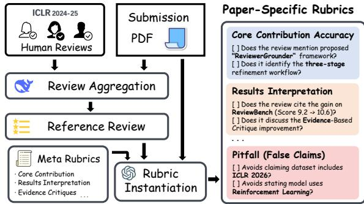
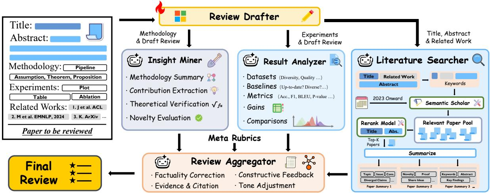
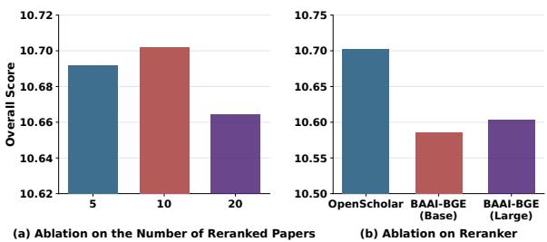
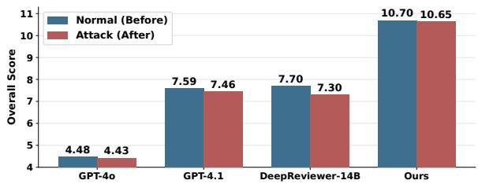
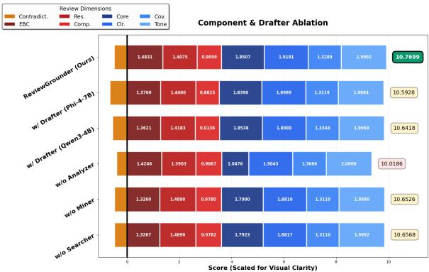
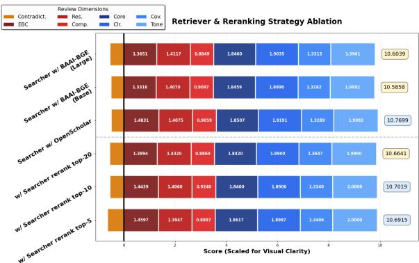

# REVIEWGROUNDER: Improving Review Substantiveness with Rubric-Guided, Tool-Integrated Agents

Zhuofeng $\mathbf { L i } ^ { 1 , * }$ Yi $\mathbf { L u } ^ { 2 , * }$ Dongfu Jiang2 Haoxiang Zhang3 Yuyang Bai1 Chuan $\mathbf { L i } ^ { 4 }$ Yu Wang5 Shuiwang $\mathbf { J i } ^ { 1 }$ Jianwen Xie4,† Yu Zhang1,† 1Texas A&M University 2University of Waterloo $^ { 3 } \mathrm { U C }$ San Diego 4Lambda 5University of Oregon

# Abstract

CLAIM: This work focuses on exploring how LLMs can assist human reviewers in the peer review process, rather than replacing them.

The rapid rise in AI conference submissions has driven increasing exploration of large language models (LLMs) for peer review support. However, LLM-based reviewers often generate superficial, formulaic comments lacking substantive, evidence-grounded feedback. We attribute this to the underutilization of two key components of human reviewing: explicit rubrics and contextual grounding in existing work. To address this, we introduce REVIEWBENCH, a benchmark evaluating review text according to paper-specific rubrics derived from official guidelines, the paper’s content, and human-written reviews. We further propose REVIEWGROUNDER, a rubricguided, tool-integrated multi-agent framework that decomposes reviewing into drafting and grounding stages, enriching shallow drafts via targeted evidence consolidation. Experiments on REVIEWBENCH show that REVIEW-GROUNDER, using a Phi-4-14B-based drafter and a GPT-OSS-120B-based grounding stage, consistently outperforms baselines with substantially stronger/larger backbones (e.g., GPT-4.1 and DeepSeek-R1-670B) in both alignment with human judgments and rubric-based review quality across 8 dimensions. The code is available here.

# 1 Introduction

Peer review is the primary mechanism through which the research community filters and improves new scientific work before publication. The rapid growth of submissions at major AI conferences (with counts at leading venues surpassing 10,000) has placed sustained pressure on peer review workflows originally designed for far smaller scales (Kim et al., 2025). Meanwhile, recent advances in LLMs have spurred growing interest in using them to assist or complement the peer review workflow (Zhang et al., 2024), for example, by drafting reviews (Tan et al., 2024; Zhu et al., 2025; Zeng et al., 2025), summarizing reviewer opinions (Du et al., 2024; Hossain et al., 2025), and providing feedback on review quality (Thakkar et al., 2025).

Despite these advances, prior work has highlighted notable shortcomings in existing LLMbased peer review frameworks: they produce routine, template-like critiques (e.g., “add experiments on more data sets”; Liang et al., 2024); accept authors’ claimed novelty or limitations without thorough verification (Du et al., 2024; Ye et al., 2024); and lack technical details, actionable suggestions, as well as justification grounded in the paper (Zhou et al., 2024; Du et al., 2024). Together, these limitations may lead to reviews that are superficial and formulaic, lack substantive content and critical insights, and prioritize syntax-level cues over the ability to deeply evaluate a paper’s contributions.

Fundamentally, these shortcomings can be traced to the underutilization of two crucial sources of external information: (1) Reviewer Guidelines and Rubrics. Top-tier NLP and machine learning venues (ARR, 2025; ICML, 2026; NeurIPS, 2025; ICLR, 2026) provide well-established peerreview guidelines that specify what to attend to in different review sections and which criteria to consider across evaluation dimensions. Compared with supervised fine-tuning solely on existing humanwritten reviews (Zhu et al., 2025), providing LLMs with clear, rubric-grounded instructions offers a more principled way to internalize how to produce substantive, content-rich reviews, especially since human reviews can be noisy and reviewers do not always follow official guidelines. (2) Context from Existing Work. Reviewing should not be treated as a task that takes the submission alone as input. In particular, assessing novelty inherently requires situating a paper relative to existing work. When this context is absent, LLM-based reviewers have been observed to systematically underemphasize novelty when identifying weaknesses (Shin et al., 2025). Addressing this limitation cannot be achieved by merely attaching retrieval-augmented generation (Lewis et al., 2020). Instead, it requires a rubric-guided, tool-integrated, agentic framework with clear role separation (e.g., literature search, targeted section-level understanding, and rubricguided synthesis) to support grounded evaluation.

Contributions. In this paper, we aim to overcome the above shortcomings by explicitly targeting review substantiveness. We first introduce REVIEW-BENCH, an evaluation benchmark that leverages reviewer rubrics in an explicit and systematic manner. REVIEWBENCH combines venue-provided generic guidelines with each paper’s content and human-written reviews to instantiate paper-specific rubrics, and evaluates whether the generated review satisfies these requirements. While agreement with human scores and decisions remains an important measure (and is therefore included), REVIEW-BENCH shifts the focus toward what ultimately benefits authors and the community: actionable, rubricgrounded, and evidence-based feedback rather than the outcome alone.

Moreover, we propose REVIEWGROUNDER, a rubric-guided, tool-integrated, multi-agent framework for producing grounded, content-rich reviews. A single-pass review generator trained only on human-written reviews often produces shallow, mechanically structured drafts. REVIEWGROUNDER addresses this by decomposing reviewing into collaborating agents: the drafter produces an initial draft, and subsequent grounding agents refine it using tools for literature search, section-level analysis, evidence consolidation, and information aggregation. This process substantiates critiques, contextualizes novelty, and generates actionable suggestions. Importantly, REVIEWGROUNDER operates without paper-specific rubrics at generation time, ensuring improvements reflect deeper paper understanding rather than evaluation leakage.

We conduct a comprehensive evaluation of RE-VIEWGROUNDER on REVIEWBENCH, measuring both review score and decision prediction alignment with human reviewers, as well as performance on 8 rubric-specified dimensions (e.g., EVIDENCE-BASED CRITIQUE, CONSTRUCTIVE

TONE). Across all tasks and metrics, REVIEW-GROUNDER with a Phi-4-14B-based drafter (Abdin et al., 2024) and a GPT-OSS-120B-based grounding stage (Agarwal et al., 2025) consistently outperforms competitive baselines, including AI Scientist (Lu et al., 2024), AgentReview (Jin et al., 2024), CycleReviewer (Weng et al., 2025), and DeepReviewer (Zhu et al., 2025) with the same or even stronger/larger backbones, such as GPT-4o (Hurst et al., 2024), GPT-4.1 (OpenAI, 2025), and DeepSeek-R1 (Guo et al., 2025).

The contributions of our work are as follows:

• We identify review substantiveness as a key limitation of existing LLM-based reviewers, and introduce REVIEWBENCH, a rubric-driven benchmark that evaluates whether generated reviews provide accurate, evidence-grounded feedback beyond score or decision prediction.

• To improve the substantiveness of reviews, we propose REVIEWGROUNDER, a rubric-guided, tool-integrated multi-agent framework that decomposes the paper reviewing task into drafting and grounding stages, transforming shallow drafts into coherent and actionable reviews through explicit consolidation.

• We conduct comprehensive experiments on RE-VIEWBENCH, which demonstrate that REVIEW-GROUNDER consistently produces more complete and more constructive reviews than competitive baselines, while achieving stronger alignment with human judgments.

# 2 Related Work

LLMs for Paper Review. Recent studies (D’Arcy et al., 2024; Tan et al., 2024; Du et al., 2024; Hossain et al., 2025) have explored the use of LLMs to automate and enhance academic peer review. For example, Reviewer2 (Gao et al., 2024) proposes a two-stage framework that first generates aspectspecific prompts and then synthesizes reviews, improving both coverage and specificity; AgentReview (Jin et al., 2024) employs a multi-agent framework to simulate the peer review process. More recently, DeepReview (Zhu et al., 2025) is trained via supervised fine-tuning (SFT) on long chainof-thought (CoT) data to enhance reasoning for review generation; ReviewRL (Zeng et al., 2025) introduces a reinforcement learning (RL) framework for producing scientific paper reviews. In practice, Review Feedback Agent (Thakkar et al., 2025) leverages multiple LLMs to improve review clarity and actionability at ICLR 2025. Despite this progress, LLM-generated reviews often remain superficial and formulaic, reflecting the underutilization of explicit rubrics and contextual grounding in existing work and consequently struggling to provide substantive, evidence-grounded feedback.

Automated Peer-Review Evaluation. Despite growing interest in LLM-generated paper reviews, systematic evaluation frameworks remain scarce. Existing approaches can be broadly categorized into two types: (1) metric-based evaluation, where prior work (Tan et al., 2024) relies on surface-level text similarity metrics such as ROUGE (Lin, 2004) and BLEU (Papineni et al., 2002), or regression metrics like Mean Absolute Error (MAE); and (2) LLM-as-a-Judge evaluation (Zhu et al., 2025), which employs LLMs to directly assess generated reviews. However, these approaches fail to adequately assess a review’s factual accuracy, reasoning depth, and consistency in ratings.

# 3 REVIEWBENCH

Similarity-based metrics and LLM-as-a-Judge approaches used by prior studies for evaluating LLMbased reviewers (Tan et al., 2024; Zhu et al., 2025; Zeng et al., 2025) either fail to capture fine-grained review competencies or rely on ambiguous evaluation criteria and exhibit limited alignment with human judgments. To address these issues, we introduce REVIEWBENCH, a benchmark built on DeepReview-13K (Zhu et al., 2025) that augments each paper $p$ and its human reviews $\mathsf { H } _ { p }$ with two derived artifacts: (1) an aggregated reference review $r _ { p } ^ { * }$ ; and (2) a set of paper-specific rubrics $\mathsf { R } _ { p } ^ { \mathsf { p a p e r } }$ . By leveraging the reference review $\boldsymbol { r } _ { p } ^ { * }$ and customized rubrics $\mathsf { R } _ { p } ^ { \mathsf { p a p e r } }$ alongside an evaluator $\mathcal { E }$ REVIEWBENCH enables accurate, multi-faceted, and human-aligned assessment of LLM-generated reviews. The overview of REVIEWBENCH is illustrated in Figure 1. We introduce the details of dataset construction in Section 3.1, followed by the description of the evaluation approach in Section 3.2 and Section 3.3. Implementation details are provided in $\ S _ { \mathrm { D } }$ and $\ S \mathrm { E . 1 }$ .

# 3.1 Dataset Construction

REVIEWBENCH is constructed from DeepReview-13K (Zhu et al., 2025), which contains ICLR submissions and reviews from 2024 to 2025.1

  
Figure 1: Overview of the REVIEWBENCH construction pipeline. For each paper, paper-specific rubrics are instantiated by an aggregated reference review, the submission PDF, and meta-rubrics.

Data Filtering. We retain only papers with nonempty PDF-to-text content. Specifically, we exclude (1) empty or incomplete submissions; (2) desk-rejected or withdrawn papers; (3) papers with fewer than three complete human reviews; and (4) papers missing mandatory review fields required for normalization, including textual sections and numeric scores (described below). After filtering, we obtain a curated pool of approximately 12K papers. Following prior work (Zhu et al., 2025; Zeng et al., 2025), we sample $N \approx 1 . 3 \mathsf { K }$ papers (about $1 0 \%$ of the dataset) from this pool using a fixed random seed of 42.

Human Review Normalization. For each paper $p$ , we normalize its human reviews $\mathsf { H } _ { p }$ into a unified schema aligned with the official ICLR review template (ICLR, 2026). Each review is represented by (1) Textual Assessments, including SUM-MARY, STRENGTHS, WEAKNESSES, and QUES-TIONS; and (2) Scores and Decisions, comprising an overall rating in [1, 10], categorical scores (Soundness, Presentation, Contribution, and Confidence) in [1, 5], and the final decision (Accept/Reject). This filtering ensures all retained papers can be mapped to a consistent schema without perpaper exception handling.

Reference Review Aggregation. For each paper $p$ , we construct an aggregated reference review $\boldsymbol { r } _ { p } ^ { * }$ by consolidating the textual content of its human-written reviews $\mathsf { H } _ { p }$ using DeepSeek-R1- Distill-Qwen-32B (Guo et al., 2025). We define the ground-truth rating $s _ { p }$ as the mean of the human overall ratings in $\mathsf { H } _ { p }$ and obtain the ground-truth decision $d _ { p }$ from the dataset metadata. To ensure structural completeness, we populate the rating and decision fields of $r _ { p } ^ { * }$ with $s _ { p }$ and $d _ { p }$ , respectively.

# 3.2 Rubric-based Evaluation

The pipeline consists of three components: (1) a set of paper-agnostic meta-rubrics $\mathsf { R } ^ { \mathrm { m e t a } }$ that define the multi-faceted criteria for high-quality reviews; (2) paper-specific rubrics $\mathsf { R } _ { p } ^ { \mathsf { p a p e r } }$ , instantiated from $\mathsf { R } ^ { \mathrm { m e t a } }$ using the reference review $\boldsymbol { r } _ { p } ^ { * }$ to enable finegrained, concrete evaluation of a candidate review $\hat { r } _ { p }$ ; and (3) a fixed evaluator $\mathcal { E }$ that applies these rubrics to model-generated review $\hat { r } _ { p }$ on a discrete ordinal scale to produce the final evaluation scores.

# 3.2.1 Meta-Rubrics

We define eight paper-agnostic meta-rubrics $\mathsf { R } ^ { \mathrm { m e t a } }$ $= \{ \mathsf { R } _ { 1 } ^ { \mathrm { { m e t a } } } , \ldots , \mathsf { R } _ { 8 } ^ { \mathrm { { m e t a } } } \}$ , each capturing a distinct dimension of review quality. This rubric set is derived from established peer-review standards, including reviewer guidelines from ICML, ICLR, and NeurIPS (ICML, 2026; ICLR, 2026; NeurIPS, 2025), and is iteratively refined with expert human feedback to ensure comprehensive coverage and operational clarity. The eight dimensions are: (1) CORE CONTRIBUTION ACCURACY, (2) RESULTS INTERPRETATION, (3) COMPARATIVE ANALYSIS, (4) EVIDENCE-BASED CRITIQUE, (5) CRITIQUE CLARITY, (6) COMPLETENESS COVERAGE, (7) CONSTRUCTIVE TONE, and (8) FALSE OR CON-TRADICTORY CLAIMS (pitfall). Each meta-rubric specifies (1) a polarity (positive vs. negative pitfall), (2) a concise checklist of key points, and (3) a scoring rule employed by the scoring model. Full meta rubric definitions are provided in $\ S _ { \mathrm { D . 1 } }$ .

# 3.2.2 Paper-specific Rubrics Construction

Meta-rubrics $\mathsf { R } ^ { \mathrm { m e t a } }$ define the general dimensions that decide a high-quality review without elaborating customized rubrics for a specific instance. Therefore, we instantiate each meta-rubric ${ \sf R } _ { i } ^ { \mathrm { m e t a } }$ using reference review $r _ { p } ^ { \ast }$ into a paper-specific rubric $\mathsf { R } _ { p , i } ^ { \mathsf { p a p e r } }$ and obtain

$$
\mathsf { R } _ { p } ^ { \mathrm { p a p e r } } = \{ \mathsf { R } _ { p , i } ^ { \mathrm { p a p e r } } \} _ { i = 1 } ^ { 8 } .
$$

Each Rpaperp,i i s a concise checklist of concrete, verifiable requirements grounded in the context of the paper, such as key claims, main results, or the most relevant comparisons for that work.

Instantiation Procedure. We generate the paperspecific rubric set Rpaperp u sing a fixed rubric instantiation model based on GPT-OSS-120B (Agarwal et al., 2025), conditioned on three inputs: the paper text $p$ , the meta-rubric set $\mathsf { R } ^ { \mathrm { m e t a } }$ , and the aggregated reference review $\boldsymbol { r } _ { p } ^ { * }$ (Sec. 3.1). To avoid human-phrase leakage, the reference review is used solely to ensure coverage of key issues raised by reviewers, not as a stylistic template. Consequently, each rubric item must be (1) grounded in verifiable evidence from the paper (e.g., a claim, section, table/figure, or comparison) and (2) independently checkable rather than copied from $\boldsymbol { r } _ { p } ^ { * }$ .

# 3.2.3 Scoring and Aggregation

Given a paper instance $p$ , a candidate review $\hat { r } _ { p }$ and the pre-generated customized rubrics $\mathsf { R } _ { p } ^ { \mathsf { p a p e r } }$ we use GPT-OSS-120B as an LLM-evaluator to assign a discrete score for each rubric dimension:

$$
s _ { p , i } = \mathrm { E v a l } \Big ( p , \hat { r } _ { p } , \mathsf { R } _ { p , i } ^ { \mathrm { p a p e r } } \Big ) , i \in \{ 1 , \ldots , 8 \} .
$$

The rubric set includes seven positive dimensions and one negative pitfall dimension. For positive dimensions, we use an ordinal scale $0 , 1 , 2$ corresponding to not satisfied, partially satisfied, and fully satisfied. For the negative pitfall dimension (i.e., FALSE OR CONTRADICTORY CLAIMS), we use $- 2 , - 1 , 0$ representing severe, mild, and none. Detailed scoring rules are provided in $\ S \mathrm { E . 1 . 1 }$ .

Overall Score. We define the overall content score as the sum of the individual dimension scores:

$$
S ( p , { \hat { r } } _ { p } ) = \sum _ { i = 1 } ^ { 8 } s _ { p , i } .
$$

We also provide the 8-dimensional score vector $( s _ { p , 1 } , \dotsc , s _ { p , 8 } )$ for diagnostic analysis.

# 3.3 Numeric-Field Evaluation

Besides our proposed rubrics-based evaluation above, we also adopt a numeric-field-based approach to evaluate the numerical rating and final decision in a candidate review $\hat { r } _ { p }$ . Each rating is compared to the ground-truth $s _ { p }$ (Sec. 3.1) using Mean Squared Error (MSE) and Mean Absolute Error (MAE), while the decision field is evaluated against the ground-truth $d _ { p }$ (Sec. 3.1) using Accuracy (ACC) and F1 score.

# 4 REVIEWGROUNDER

We now introduce REVIEWGROUNDER, a framework for producing grounded, substantive reviews. It casts reviewing as a staged process that progressively refines an initial draft via targeted analysis, external evidence, and structured synthesis. An overview of REVIEWGROUNDER is demonstrated in Figure 2. Below, we detail the stages and the functions of each agent, with implementation details provided in $\ S \mathrm { E } . 2$ .

  
Figure 2: Overview of the REVIEWGROUNDER. REVIEWGROUNDER decomposing reviewing into collaborating agents: (a) Review Drafter: Generates an initial draft based on the paper. (b) Multi-dimensional Grounding Agents. Literature Searcher: Retrieves and summarizes related work using external tools. Insight Miner: Verifies methodology and core contributions. Result Analyzer: Checks experimental results. (c) Review Aggregator: Synthesizes the draft and evidence into a coherent, accurate, and actionable review.

# 4.1 Stage I: Draft Review Generation

Given a paper $p$ , the first step is to produce a coherent and well-organized draft review that captures the basic structure and stylistic conventions commonly observed in human-written reviews. To this end, we fine-tune a pre-trained LLM on a subset of DeepReview-13K (Zhu et al., 2025) to obtain a Drafter $\mathcal { P }$ . Note that the training data is fully disjoint from REVIEWBENCH, and $\mathcal { P }$ primarily acquires shallow review patterns, such as sectionlevel organization and syntax-level cues, rather than grounded reasoning. Given $p$ , the Drafter $\mathcal { P }$ then generates an initial draft review $r ^ { ( 0 ) }$ .

# 4.2 Stage II: Multi-dimensional Review Grounding

The initial draft $r ^ { ( 0 ) }$ often lacks comparative context and evidential support. To address these gaps, we introduce three specialized agents that collaboratively enrich and consolidate the draft along key rubric-defined review dimensions. Each agent operationalizes a core reviewing capability that cannot be reliably captured by single-pass drafting alone. Specifically, the Literature Searcher $s$ situates the submission within contemporary literature to support grounded novelty assessment; the Insight Miner $\mathcal { M }$ consolidates conceptual understanding by analyzing the paper’s core contributions and technical claims; and the Result Analyzer $\mathcal { A }$ strengthens empirical grounding by examining experimental design, results, and quantitative evidence. Together, these agents operate in parallel to iteratively refine $r ^ { ( 0 ) }$ , producing an enriched review representation $\mathsf E ( p )$ that enhances review substantiveness.

Literature Searcher $\boldsymbol { \mathcal { S } }$ . Given the title, abstract, and related work of the submission $p$ , the Literature Searcher $s$ operates as a tool-integrated agent. It first extracts a set of representative keywords that capture the paper’s technical scope, and uses them to query the Semantic Scholar API (Kinney et al., 2023; Bragg et al., 2025), retrieving candidate papers published from 2023 onward. Retrieved papers are fed into an off-the-shelf reranker2, and the top-10 most relevant works are selected.

For each selected paper, $s$ produces a concise, structured debrief summarizing its core methodology, main findings, and experimental evidence most relevant to $p$ . This process explicitly grounds comparative analysis and supports informed assessment of $p$ ’s novelty and positioning.

Insight Miner $\mathcal { M }$ . The Insight Miner $\mathcal { M }$ targets the conceptual and methodological core of $p$ . It retrieves sections relevant to the technical approach, distills the central contributions, and evaluates the validity of the paper’s novelty claims and stated differences. Based on this analysis, $\mathcal { M }$ refines the method-focused parts of the draft review $r ^ { ( 0 ) }$ by providing actionable suggestions grounded in specific parts of the paper (e.g., sections or formulas). This process enhances the accuracy and substantiveness of discussions around model design, algorithmic formulation, optimization, and implementation, transforming vague or generic claims into precise, evidence-supported critiques.

Result Analyzer $\mathcal { A }$ . Complementary to $\mathcal { M }$ , the Result Analyzer $\mathcal { A }$ focuses exclusively on empirical evaluation. It extracts key experimental elements, including datasets, baselines, evaluation metrics, performance gains, and statistical comparisons. Using such signals, $\mathcal { A }$ refines the experiment-related components of $r ^ { ( 0 ) }$ , ensuring that claims about performance and effectiveness are faithful to the reported results and grounded in concrete tables, figures, and quantitative comparisons.

# 4.3 Stage III: Rubric-Guided Review Synthesis

In the final stage, an Aggregator $\mathcal { G }$ synthesizes the outputs of all upstream agents to produce a coherent, accurate, and actionable review. Specifically, $\mathcal { G }$ takes as input the paper $p$ , the initial draft $r ^ { ( 0 ) }$ , the grounded review representation $\mathsf E ( p )$ , and the generic meta-rubrics $\mathsf { R } ^ { \mathrm { m e t a } }$ , and performs a final round of consolidation and refinement. Note that paper-specific rubrics $\mathsf { R } _ { p } ^ { \mathrm { p a p e r } }$ used in REVIEW-BENCH are not exposed at generation time, preventing evaluation leakage.

The Aggregator $\mathcal { G }$ is designed to: (1) correct factual errors and ensure faithful characterization of the paper’s contributions and methodology; (2) strengthen critiques by anchoring them to specific parts of the paper, enabling grounded results interpretation, evidence-based critique, and comparative analysis; (3) translate grounded observations into clear, constructive, and actionable suggestions; and (4) produce a balanced and comprehensive assessment that aligns with rubric-level expectations on coverage, clarity, and tone.

# 5 Experiments

Experimental Setup. We conduct evaluation on REVIEWBENCH (Sec. 3) using two complementary families of metrics: (1) Rubric-based Evaluation, which assesses the textual quality of generated reviews across eight paper-specific rubric dimensions (Sec. 3.2); and (2) Numeric-field Evaluation, which measures predicted ratings with MSE/MAE and decisions with ACC/F1 (Sec. 3.3). To ensure fair comparison and prevent protocol leakage, we fix the paper-specific rubrics Rpaperp and the evaluator $\mathcal { E }$ across all methods. During review generation, models access only the paper text $p$ and are never exposed to the aggregated reference review $r _ { p } ^ { * }$ or the paper-specific rubrics $\mathsf { R } _ { p } ^ { \mathsf { p a p e r } }$ .

Baselines. We compare REVIEWGROUNDER against three categories of baselines: (1) Foundation Models, including Qwen3-32B (Yang et al., 2025), QWQ-32B (Qwen, 2025), GPT-4o (Hurst et al., 2024), and GPT-4.1 (OpenAI, 2025); (2) Agentic Reviewing Framework, including AI Scientist (Lu et al., 2024), AgentReview (Jin et al., 2024), which are instantiated with GPT-4o and GPT-4.1 as backbone models; and (2) Fine-tuned Reviewer Models, including CycleReviewer-8B/70B (Weng et al., 2025) and DeepReviewer-7B/14B (Zhu et al., 2025). More details on baseline implementations are in $\ S \mathrm { B } . 1$ .

Implementation Details. In our main experiments, Drafter is instantiated with Phi-4-14B (Abdin et al., 2024), while the remaining modules (i.e., the Literature Searcher, Insight Miner, Result Analyzer, and Aggregator) are instantiated with GPT-OSS-120B (Agarwal et al., 2025). Among these, only the Drafter is trainable. We train the model using a portion of the DeepReview-13K dataset. Further implementation details on REVIEWGROUNDER can be found in $\ S \mathbf { B } . 2$ .

# 5.1 Main Experiment Results

# 5.1.1 Rubric Evaluation Results

Our main rubric-based content evaluation results are presented in Table 1. Overall, REVIEW-GROUNDER consistently outperforms all baseline models by substantial margins across every rubric dimension. Relative to the best-performing foundation model, Qwen3-32B, REVIEWGROUNDER achieves an improvement of $38 \%$ . Against specialized agentic frameworks, our REVIEWGROUNDER surpasses AgentReview and AI Scientist (both based on GPT-4o) by $121 \%$ and $193 \%$ , respectively. Among fine-tuned models, REVIEWGROUNDER exceeds the top performer, DeepReviewer-14B, by $36 \%$ . Remarkably, REVIEWGROUNDER also outperforms the ${ \sim } 2 0 0 \mathrm { B }$ -parameter GPT-4o across all dimensions, with a gain of $135 \%$ . A detailed analysis is provided in $\ S { \bf C } . 1$ .

<table><tr><td>Method</td><td>Model</td><td>Core</td><td>Res.</td><td>Comp.</td><td>EBC</td><td>Clr.</td><td>Cov.</td><td>Tone</td><td>Contradict.</td><td>Overall</td><td>∆</td></tr><tr><td rowspan="4">Foundation Model</td><td>Qwen3-32B</td><td>1.6971</td><td>0.7642</td><td>0.5800</td><td>0.1437</td><td>1.6128</td><td>1.1537</td><td>1.9992</td><td>-0.1460</td><td>7.8047</td><td>↑ 38%</td></tr><tr><td>QWQ-32B</td><td>1.6901</td><td>0.6531</td><td>0.3513</td><td>0.1186</td><td>1.6792</td><td>0.9461</td><td>1.9969</td><td>-0.0836</td><td>7.3517</td><td>↑ 46%</td></tr><tr><td>ZPT-400</td><td>1.1969</td><td>0.1037</td><td>0.0302</td><td>0.0024</td><td>1.0499</td><td>0.3318</td><td>1.9840</td><td>-0.1233</td><td>4.5756</td><td>↑ 135%</td></tr><tr><td>GPT-4.1 GPT-40</td><td>1.7573</td><td>0.6966</td><td>0.3406</td><td>0.1074</td><td>1.6327</td><td>1.1675</td><td>1.9992</td><td>-0.0397</td><td>7.6616</td><td>↑41%</td></tr><tr><td>AgentReview</td><td>GPT-4.1 GPT-40</td><td>1.1300 1.0300 0.8500</td><td>0.1600 0.1300 0.0000</td><td>0.1100 0.1200</td><td>0.1250 0.0000</td><td>1.3400 1.4100</td><td>0.5900 0.6300</td><td>2.0000 1.9800</td><td>-0.1600 -0.1600</td><td>4.8675 4.9620</td><td>↑ 121% ↑ 117%</td></tr><tr><td>AI Scientist</td><td>GPT-4.1 Llama-3.1-8B</td><td>1.6700</td><td>0.4800</td><td>0.0200 0.3600</td><td>0.0000 00830</td><td>0.6700 1.5600</td><td>0.1800 1.1300</td><td>1.7600 1.9400</td><td>-0.1900 -0.0900</td><td>3.6800 7.0893</td><td>↑ 193% ↑ 52%</td></tr><tr><td rowspan="2">CycleReviewer</td><td>Llama-3.1-70B</td><td>0.9852 1.0187</td><td>0.1011 0.1633</td><td>0.0645 0.0980</td><td>0.0089 0.0109</td><td>0.5832 0.7698</td><td>0.1493 0.2551</td><td>1.6571 1.8476</td><td>-0.4504 -0.6412</td><td>3.0989 3.5220</td><td>↑ 248% ↑ 206%</td></tr><tr><td>Phi-4-7B</td><td></td><td></td><td></td><td>0.1311</td><td>1.3743</td><td></td><td></td><td></td><td></td><td></td></tr><tr><td>DeepReviewer</td><td>Phi-4-14B</td><td>1.4207 1.6306</td><td>0.4545 0.6532</td><td>0.3299 0.4977</td><td>0.3532</td><td>1.6772</td><td>1.0599 1.2877</td><td>1.9432 1.9930</td><td>-0.3953 -0.1922</td><td>6.3183 7.9004</td><td>↑ 70% ↑36%</td></tr><tr><td>ReviewGroundeR</td><td>Phi-4-14B</td><td>1.8507</td><td>1.4075</td><td>0.9059</td><td>1.4831</td><td>1.9191</td><td>1.3289</td><td>1.9992</td><td>-0.1245</td><td>10.7699</td><td>-</td></tr></table>

Table 1: Performance comparison of reviewer models on REVIEWBENCH under rubric-based evaluation. We visualize gains of REVIEWGROUNDER to each baseline in the $\Delta$ columns . Notes: Higher scores indicate better performance; Contradict. is a pitfall dimension scored in $- 2 , - 1 , 0$ , while others are scored in $0 , 1 , 2$ . Abbreviations: Core=CORE CONTRIBUTION ACCURACY, Res. $\equiv$ RESULTS INTERPRETATION, Comp. $\equiv$ COMPARATIVE ANALYSIS, EBC $\varXi$ EVIDENCE-BASED CRITIQUE, Clr. $\cdot =$ CRITIQUE CLARITY, Cov. ${ \bf \Phi } _ { \cdot } = { \bf \Phi } _ { \cdot }$ COMPLETENESS COVERAGE, Tone $: =$ CONSTRUCTIVE TONE, Contradict. $\displaystyle { \overline { { \cdot } } }$ FALSE OR CONTRADICTORY CLAIMS.

# 5.1.2 Numeric-Field Evaluation Results

We additionally report numerical rating and finaldecision evaluations in Table 2 for completeness and comparability with prior work (Zhu et al., 2025). Compared with all baselines, RE-VIEWGROUNDER achieves the lowest rating error (MSE: 1.1607, MAE: 0.8597) and the highest decision prediction accuracy (ACC: 0.6809, F1: 0.6699). Relative to the strongest AI Scientist variant (Gemini-2.0-Flash-Thinking), RE-VIEWGROUNDER improves ACC by $8 \%$ while reducing MSE by approximately $63 \%$ . Even when compared with strong fine-tuned models such as DeepReviewer-14B, REVIEWGROUNDER consistently improves both rating accuracy and decision quality, demonstrating its ability to produce more reliable and consistent paper assessments.

# 5.2 Analysis of Performance Gains

This section examines several factors influencing the performance of REVIEWGROUNDER on RE-VIEWBENCH under rubric-based evaluation.

# 5.2.1 Component Ablation

We conduct a comprehensive ablation study to assess the contribution of each agent in REVIEW-GROUNDER, as summarized in Table 3. Detailed analyses are provided in $\ S { \bf C } . 2$ .

Impact of Drafter Backbones. As shown in Table 3, when trained on the same SFT data, Qwen3- 4B consistently outperforms Phi-4-7B but remains inferior to Phi-4-14B, indicating that model capacity continues to play a critical role in draft review synthesis quality. Nevertheless, results with smaller Drafters (Phi-4-7B and Qwen3-4B) demonstrate that the framework remains effective (e.g., Qwen3-4B: 10.6418), suggesting that the proposed grounding and aggregation mechanisms substantially benefit smaller models, even though stronger backbones achieve superior overall performance.

Table 2: Performance comparison of reviewer models on REVIEWBENCH under numeric-field evaluation.   

<table><tr><td rowspan="2">Method</td><td rowspan="2">Model</td><td colspan="2">Decision</td><td colspan="2">Rating</td></tr><tr><td>ACC↑</td><td>F1↑</td><td>MSE↓</td><td>MAE↓</td></tr><tr><td rowspan="3">AgentReview</td><td>Claude-3-5-sonnet</td><td>0.2826</td><td>0.2541</td><td>2.8406</td><td>1.2989</td></tr><tr><td>Gemini-2.0-Flash-Thinking</td><td>0.4242</td><td>0.4242</td><td>2.6186</td><td>1.2170</td></tr><tr><td>DeepSeek-V3</td><td>0.3140</td><td>0.2506</td><td>1.9951</td><td>1.1017</td></tr><tr><td rowspan="5">AI Scientist</td><td>GPT-o1</td><td>0.4167</td><td>0.4157</td><td>4.3072</td><td>1.7917</td></tr><tr><td>Claude-3-5-sonnet</td><td>0.5579</td><td>0.4440</td><td>3.0992</td><td>1.3500</td></tr><tr><td>Gemini-2.0-Flash-Thinking</td><td>0.6139</td><td>0.4808</td><td>3.9232</td><td>1.6470</td></tr><tr><td>DeepSeek-V3</td><td>0.4059</td><td>0.3988</td><td>4.8006</td><td>1.8403</td></tr><tr><td>DeepSeek-R1</td><td>0.4259</td><td>0.4161</td><td>4.7719</td><td>1.8099</td></tr><tr><td rowspan="2">CycleReviewer</td><td>Llama-3.1-8B</td><td>0.2354</td><td>0.3988</td><td>3.1324</td><td>1.3663</td></tr><tr><td>Llama-3.1-70B</td><td>0.1545</td><td>0.4156</td><td>1.8440</td><td>1.0643</td></tr><tr><td rowspan="2">DeepReviewer</td><td>Phi-4-7B</td><td>0.6381</td><td>0.6068</td><td>1.4442</td><td>0.9416</td></tr><tr><td>Phi-4-14B</td><td>0.6667</td><td>05204</td><td>1.3527</td><td>0.9041</td></tr><tr><td>ReVIEWGROUNDER</td><td>Phi-4-14B</td><td>0.6939</td><td>0.6699</td><td>1.1607</td><td>0.8597</td></tr></table>

Table 3: Ablation Study of REVIEWGROUNDER under rubric-based evaluation.   

<table><tr><td>Drafter Phi-4-14B</td><td>Drafter Phi-4-7B</td><td>Drafter Qwen3-4B</td><td>Searcher</td><td>Miner</td><td>Analyzer</td><td>Overall</td></tr><tr><td></td><td></td><td>✓</td><td>v</td><td>✓</td><td>¸</td><td>10.6418</td></tr><tr><td></td><td>✓</td><td></td><td></td><td>✓</td><td></td><td>10.5928</td></tr><tr><td>¸</td><td></td><td></td><td></td><td>✓</td><td>✓</td><td>10.6568</td></tr><tr><td></td><td></td><td></td><td>✓</td><td></td><td>✓</td><td>10.6526</td></tr><tr><td>✓</td><td></td><td></td><td>✓</td><td>✓</td><td></td><td>10.0186</td></tr><tr><td>✓</td><td></td><td></td><td>✓</td><td>✓</td><td>✓</td><td>10.7699</td></tr></table>

Impact of Grounding Agents. We further evaluate the contribution of the three proposed grounding agents, the Literature Searcher $s$ , the Insight Miner $\mathcal { M }$ , and the Result Analyzer $\mathcal { A }$ , by individually removing each from the full pipeline, using Phi-4-

  
Figure 3: Ablation on Literature Searcher configurations under rubric-based evaluation.

  
Figure 4: Comparison with baselines under normal and attack scenarios via rubric-based evaluation.

14B as the Drafter. As shown in Table 3, omitting any agent leads to a performance degradation relative to the full model (10.7699), underscoring the importance of each component.

# 5.2.2 Hyperparameter Study

Additionally, we analyze the sensitivity of the Literature Searcher $s$ .

Number of Reranked Papers. As shown in Figure 3(a), offering Literature Searcher $s$ with 10 reranked papers per keyword (Sec. 4.2) yields the highest overall score. Using fewer papers (5) provides insufficient contextual information, whereas retrieving more papers (20) introduces additional noise that can distract the Drafter.

Reranker Selection. Figure 3(b) compares the impact of the reranking model used to reorder retrieved papers in $s$ . OpenScholar-Reranker (Asai et al., 2026), a variant of BAAI-BGE-Large (Xiao et al., 2024) fine-tuned for scientific literature synthesis, significantly outperforms BAAI-BGE in both its Base and Large versions. This result highlights the importance of domain-specific retrievers for accurately identifying relevant related work.

# 5.3 Defend Attacks Analysis

We evaluate the robustness of REVIEWGROUNDER against adversarial attacks (Ye et al., 2024) by injecting malicious instructions into input papers. For evaluation, we randomly sample 500 papers from REVIEWBENCH, with the rubric-based evaluation results presented in Figure 4. We can find that (1) Baseline vulnerability: Existing reviewer models are significantly affected by the attack; for instance, DeepReviewer-14B drops from 7.70 to 7.30, demonstrating clear susceptibility to adversarial instructions. (2) Robustness of REVIEW-GROUNDER: In contrast, REVIEWGROUNDER shows strong resilience. Despite a high baseline score, its performance remains largely stable, with only a minor decrease of 0.05 points (10.70 to 10.65). (3) Value of REVIEWBENCH and rubricbased evaluation: These results underscore the importance of REVIEWBENCH. Since rubric-based evaluation emphasizes semantic quality rather than absolute scores, malicious instructions can mislead review-generation models, causing them to ignore prior guidelines and produce lower-quality reviews, which in turn results in lower scores—thereby preventing authors from artificially inflating review scores by injecting instructions.

Table 4: Alignment metrics between experts and automated judgments.   

<table><tr><td>MAE</td><td>Spearman (ρ)</td><td>Pearson (r)</td><td>Pairwise Error</td></tr><tr><td>0.0969</td><td>0.7923</td><td>0.8954</td><td>0.1494</td></tr></table>

# 5.4 Human Evaluation

To validate the effectiveness and robustness of rubric-based evaluation in REVIEWBENCH, we conducted a human study. We randomly sampled 120 papers from REVIEWBENCH and asked human experts, each with a strong publication record averaging 2,000 Google Scholar citations, to rate the reviews generated by REVIEWGROUNDER according to the meta rubrics $\mathsf { R } ^ { \mathrm { m e t a } }$ (Sec. 3.2.1). The resulting human overall scores were then compared with those produced by the LLM-evaluator using paper-specific rubrics (Sec. 3.2.3), enabling us to assess alignment between expert judgments and automated evaluations. As shown in Table 4, human scores closely align with the LLM-evaluator, with a Pearson correlation of 0.8954 and a Spearman correlation of 0.7923. Error rates are also low, with a Mean Absolute Error of 0.0969 and a Pairwise Absolute Error of 0.1494, demonstrating that paper-specific rubrics provide an effective and robust approach for review evaluation.

# 6 Conclusion

We present REVIEWGROUNDER, a rubric-guided, tool-integrated multi-agent framework that rethinks LLM-based peer review as a staged process of drafting and grounding. REVIEWGROUNDER explicitly decomposes review construction into complementary roles that retrieve relevant literature, analyze paper-specific evidence, and synthesize critiques guided by reviewer guidelines. Together with RE-VIEWBENCH, a benchmark enabling multi-faceted, rubric-based, and human-aligned evaluation, our work provides an instance-specific evaluation lens and an effective modeling approach for LLM-based peer review. Extensive experiments demonstrate consistent improvements across key review dimensions, with REVIEWGROUNDER outperforming baselines with substantially larger/stronger backbones. Additional analyses confirm the complementary role of each agent and the robustness of the framework under adversarial attacks.

# Limitations

While REVIEWGROUNDER achieves strong performance on REVIEWBENCH, there are several limitations that motivate future work. First, due to infrastructure constraints, we do not implement inthe-flow training of the multi-agent workflow (Li et al., 2025), which coordinates agent modules in a trainable, end-to-end manner. Although our staged approach with separate drafter and grounding agents already attains state-of-the-art results, enabling in-the-flow learning may further improve inter-agent coordination and overall review quality. Second, our study focuses exclusively on LLMbased reviewers and does not explore higher-level constructs such as LLM-based meta-reviewers or the potential for iterative feedback loops (Thakkar et al., 2025). Investigating how reviews and feedback could mutually enhance each other, for example, through multi-turn interaction, remains an interesting direction for future research. Finally, due to differences in public availability and practical constraints across venues, the cross-venue set we curated is necessarily partial and uneven, limiting the completeness of our framework’s performance and robustness evaluation.

# Ethical Considerations

The development of REVIEWGROUNDER and RE-VIEWBENCH carries important ethical considerations given their role in supporting scientific peer review. While our framework aims to enhance review consistency, evidence grounding, and rubric adherence, it is not intended to replace human reviewers. Over-reliance on LLM-generated reviews could risk diminishing critical evaluation skills, introducing unintended biases from training data, or amplifying systematic preferences toward certain topics or methodologies. To mitigate these risks, we emphasize a human-in-the-loop approach: REVIEWGROUNDER’s outputs are designed to assist expert reviewers, who should critically assess, verify, and contextualize all generated feedback. Moreover, we encourage careful auditing of model outputs, ongoing monitoring for bias, and iterative refinement of both models and evaluation criteria, aiming to support responsible and informed use of LLM-assisted peer review.

# References

Marah Abdin, Jyoti Aneja, Harkirat Behl, Sébastien Bubeck, Ronen Eldan, Suriya Gunasekar, Michael Harrison, Russell J Hewett, Mojan Javaheripi, Piero Kauffmann, and 1 others. 2024. Phi-4 technical report. arXiv preprint arXiv:2412.08905.

Sandhini Agarwal, Lama Ahmad, Jason Ai, Sam Altman, Andy Applebaum, Edwin Arbus, Rahul K Arora, Yu Bai, Bowen Baker, Haiming Bao, and 1 others. 2025. gpt-oss-120b & gpt-oss-20b model card. arXiv preprint arXiv:2508.10925.

ARR. 2025. Arr reviewer guidelines. https:// aclrollingreview.org/reviewerguidelines.

Akari Asai, Jacqueline He, Rulin Shao, Weijia Shi, Amanpreet Singh, Joseph Chee Chang, Kyle Lo, Luca Soldaini, Sergey Feldman, Mike D’Arcy, and 1 others. 2026. Synthesizing scientific literature with retrieval-augmented language models. Nature, 650:857–863.

Jonathan Bragg, Mike D’Arcy, Nishant Balepur, Dan Bareket, Bhavana Dalvi, Sergey Feldman, Dany Haddad, Jena D Hwang, Peter Jansen, Varsha Kishore, and 1 others. 2025. Astabench: Rigorous benchmarking of ai agents with a scientific research suite. arXiv preprint arXiv:2510.21652.

Mike D’Arcy, Tom Hope, Larry Birnbaum, and Doug Downey. 2024. Marg: Multi-agent review generation for scientific papers. arXiv preprint arXiv:2401.04259.

Jiangshu Du, Yibo Wang, Wenting Zhao, Zhongfen Deng, Shuaiqi Liu, Renze Lou, Henry Peng Zou, Pranav Narayanan Venkit, Nan Zhang, Mukund Srinath, and 1 others. 2024. Llms assist nlp researchers: Critique paper (meta-) reviewing. In EMNLP’24, pages 5081–5099.

Zhaolin Gao, Kianté Brantley, and Thorsten Joachims. 2024. Reviewer2: Optimizing review generation through prompt generation. arXiv preprint arXiv:2402.10886.

Daya Guo, Dejian Yang, Haowei Zhang, Junxiao Song, Peiyi Wang, Qihao Zhu, Runxin Xu, Ruoyu Zhang, Shirong Ma, Xiao Bi, and 1 others. 2025. Deepseekr1 incentivizes reasoning in llms through reinforcement learning. Nature, 645:633–638.

Eftekhar Hossain, Sanjeev Kumar Sinha, Naman Bansal, R Alexander Knipper, Souvika Sarkar, John Salvador, Yash Mahajan, Sri Ram Pavan Kumar Guttikonda, Mousumi Akter, Md Mahadi Hassan, and 1 others. 2025. Llms as meta-reviewers’ assistants: A case study. In NAACL’25, pages 7763–7803.

Aaron Hurst, Adam Lerer, Adam P Goucher, Adam Perelman, Aditya Ramesh, Aidan Clark, AJ Ostrow, Akila Welihinda, Alan Hayes, Alec Radford, and 1 others. 2024. Gpt-4o system card. arXiv preprint arXiv:2410.21276.

ICLR. 2026. Iclr 2026 reviewer guide. https://iclr. cc/Conferences/2026/ReviewerGuide.

ICML. 2026. Icml 2026 reviewer instructions and peer review faq. https://icml.cc/Conferences/ 2026/PeerReviewFAQ.

Yiqiao Jin, Qinlin Zhao, Yiyang Wang, Hao Chen, Kaijie Zhu, Yijia Xiao, and Jindong Wang. 2024. Agentreview: Exploring peer review dynamics with llm agents. In EMNLP’24, pages 1208–1226.

Jaeho Kim, Yunseok Lee, and Seulki Lee. 2025. Position: The ai conference peer review crisis demands author feedback and reviewer rewards. In ICML’25, pages 81634–81651.

Sehoon Kim, Coleman Hooper, Amir Gholami, Zhen Dong, Xiuyu Li, Sheng Shen, Michael W. Mahoney, and Kurt Keutzer. 2024. Squeezellm: Dense-andsparse quantization. In ICML’24, pages 23901– 23923.

Rodney Kinney, Chloe Anastasiades, Russell Authur, Iz Beltagy, Jonathan Bragg, Alexandra Buraczynski, Isabel Cachola, Stefan Candra, Yoganand Chandrasekhar, Arman Cohan, and 1 others. 2023. The semantic scholar open data platform. arXiv preprint arXiv:2301.10140.

Heejun Lee, Jina Kim, Jeffrey Willette, and Sung Ju Hwang. 2024. Sea: Sparse linear attention with estimated attention mask. In ICLR’24.

Patrick Lewis, Ethan Perez, Aleksandra Piktus, Fabio Petroni, Vladimir Karpukhin, Naman Goyal, Heinrich Küttler, Mike Lewis, Wen-tau Yih, Tim Rocktäschel, Sebastian Riedel, and Douwe Kiela. 2020. Retrieval-augmented generation for knowledgeintensive nlp tasks. In NeurIPS’20, pages 9459– 9474.

Zhuofeng Li, Haoxiang Zhang, Seungju Han, Sheng Liu, Jianwen Xie, Yu Zhang, Yejin Choi, James Zou, and Pan Lu. 2025. In-the-flow agentic system optimization for effective planning and tool use. arXiv preprint arXiv:2510.05592.

Weixin Liang, Yuhui Zhang, Hancheng Cao, Binglu Wang, Daisy Yi Ding, Xinyu Yang, Kailas Vodrahalli, Siyu He, Daniel Scott Smith, Yian Yin, and 1 others. 2024. Can large language models provide useful feedback on research papers? a large-scale empirical analysis. NEJM AI, 1(8):AIoa2400196.

Chin-Yew Lin. 2004. Rouge: A package for automatic evaluation of summaries. In Proceedings of the Workshop on Text Summarization Branches Out, pages 74–81.

Chris Lu, Cong Lu, Robert Tjarko Lange, Jakob Foerster, Jeff Clune, and David Ha. 2024. The ai scientist: Towards fully automated open-ended scientific discovery. arXiv preprint arXiv:2408.06292.

NeurIPS. 2025. Neurips 2025 reviewer guidelines. https://neurips.cc/Conferences/2025/ ReviewerGuidelines.

OpenAI. 2025. Gpt-4.1 model. https://platform. openai.com/docs/models/gpt-4.1.

Kishore Papineni, Salim Roukos, Todd Ward, and Wei-Jing Zhu. 2002. Bleu: a method for automatic evaluation of machine translation. In ACL’02, pages 311–318.

Qwen. 2025. Qwq-32b: Embracing the power of reinforcement learning. https://qwenlm.github.io/ blog/qwq-32b.

Samyam Rajbhandari, Jeff Rasley, Olatunji Ruwase, and Yuxiong He. 2020. Zero: Memory optimizations toward training trillion parameter models. In SC’20, pages 1–16.

Hyungyu Shin, Jingyu Tang, Yoonjoo Lee, Nayoung Kim, Hyunseung Lim, Ji Yong Cho, Hwajung Hong, Moontae Lee, and Juho Kim. 2025. Mind the blind spots: A focus-level evaluation framework for llm reviews. In EMNLP’25, pages 35618–35644.

Cheng Tan, Dongxin Lyu, Siyuan Li, Zhangyang Gao, Jingxuan Wei, Siqi Ma, Zicheng Liu, and Stan Z Li. 2024. Peer review as a multi-turn and long-context dialogue with role-based interactions. arXiv preprint arXiv:2406.05688.

Nitya Thakkar, Mert Yuksekgonul, Jake Silberg, Animesh Garg, Nanyun Peng, Fei Sha, Rose Yu, Carl Vondrick, and James Zou. 2025. Can llm feedback enhance review quality? a randomized study of 20k reviews at iclr 2025. arXiv preprint arXiv:2504.09737.

Yixuan Weng, Minjun Zhu, Guangsheng Bao, Hongbo Zhang, Jindong Wang, Yue Zhang, and Linyi Yang. 2025. Cycleresearcher: Improving automated research via automated review. In ICLR’25.

Shitao Xiao, Zheng Liu, Peitian Zhang, Niklas Muennighoff, Defu Lian, and Jian-Yun Nie. 2024. C-pack: Packed resources for general chinese embeddings. In SIGIR’24, pages 641–649.

An Yang, Anfeng Li, Baosong Yang, Beichen Zhang, Binyuan Hui, Bo Zheng, Bowen Yu, Chang Gao, Chengen Huang, Chenxu Lv, and 1 others. 2025. Qwen3 technical report. arXiv preprint arXiv:2505.09388.

Rui Ye, Xianghe Pang, Jingyi Chai, Jiaao Chen, Zhenfei Yin, Zhen Xiang, Xiaowen Dong, Jing Shao, and Siheng Chen. 2024. Are we there yet? revealing the risks of utilizing large language models in scholarly peer review. arXiv preprint arXiv:2412.01708.

Sihang Zeng, Kai Tian, Kaiyan Zhang, Yuru Wang, Junqi Gao, Runze Liu, Sa Yang, and Li. 2025. Reviewrl: Towards automated scientific review with rl. In EMNLP’25, pages 16942–16954.

Yu Zhang, Xiusi Chen, Bowen Jin, Sheng Wang, Shuiwang Ji, Wei Wang, and Jiawei Han. 2024. A comprehensive survey of scientific large language models and their applications in scientific discovery. In EMNLP’24, pages 8783–8817.

Yuze Zhao, Jintao Huang, Jinghan Hu, Xingjun Wang, Yunlin Mao, Daoze Zhang, Zeyinzi Jiang, Zhikai Wu, Baole Ai, Ang Wang, and 1 others. 2025. Swift: a scalable lightweight infrastructure for fine-tuning. In AAAI’25, pages 29733–29735.

Ruiyang Zhou, Lu Chen, and Kai Yu. 2024. Is llm a reliable reviewer? a comprehensive evaluation of llm on automatic paper reviewing tasks. In LREC-COLING’24, pages 9340–9351.

Minjun Zhu, Yixuan Weng, Linyi Yang, and Yue Zhang. 2025. Deepreview: Improving llm-based paper review with human-like deep thinking process. In ACL’25, pages 29330–29355.

# Appendix Contents

# A Additional Experiments 12

A.1 Generalization Beyond ICLR . . . 12   
A.2 Robustness Under Challenging Ad  
versarial Attacks 12   
A.3 Bias in Human Review Aggregation 13   
A.4 Backbone Model Ablations . . . 13

# B Experimental Details 14

B.1 Compared Baselines . . 14   
B.2 Implementation Details . . . . . . 15

# C More Discussion about Experiment Results

C.1 Main Result Analysis 15   
C.2 Detailed Analysis of Ablation Results 16   
C.3 Hyperparameter Study 16

# D Rubrics in REVIEWBENCH 17

D.1 Meta Rubrics 17   
D.2 Paper-specific Rubrics 17

# E Instruction Templates 18

E.1 REVIEWBENCH . 18   
E.2 REVIEWGROUNDER . . . 18

# F Case Study

F.1 Core Contribution Identification . 23   
F.2 Evidence-Based Critique . . . 23   
F.3 Hallucinated External References . 23   
F.4 Actionable Recommendations 24

# A Additional Experiments

# A.1 Generalization Beyond ICLR

To evaluate the broader generalization of REVIEW-GROUNDER, we evaluated our framework under a subset of the combination of reviews from multiple venues with diverse topics, including NeurIPS, AAAI, ACM Multimedia, and CVPR (2023–2024) via both OpenReview’s official API and from an open-source public Huggingface dataset3. We randomly sampled approximately 1.7K papers for this experiment. The literature PDFs were converted into Markdown format using Nougat $\mathrm { O C R ^ { 4 } }$ , followed by a custom cleaning pipeline involving regular expressions to remove OCR artifacts, redundant symbols, and formatting inconsistencies.

As shown in Table 5, REVIEWGROUNDER maintains robust cross-domain performance across machine learning, computer vision, multimedia, and general artificial intelligence venues, achieving an overall rubric score of 10.3917. Moreover, RE-VIEWGROUNDER substantially outperforms the 14B drafter baseline, achieving a $4 9 . 6 \%$ higher overall score (10.3917 vs. 6.9436), confirming the effectiveness of review-grounded refinement.

# A.2 Robustness Under Challenging Adversarial Attacks

To further evaluate REVIEWGROUNDER’s robustness under adversarial attacks, we conducted additional studies with three types of hidden perturbations: disguised misleading information, niche terminology induction, and scattered key information. For this study, we randomly selected 100 papers from REVIEWBENCH and injected the attack content directly into the main text of each paper.

# A.2.1 Attack Settings

We consider the following three types of attacks.

Disguised Misleading Information injects plausible but entirely fabricated claims, such as fake state-of-the-art results, to test whether the system improperly relies on unverified statements.

Niche Terminology Induction introduces undefined pseudo-technical terms to examine whether the model hallucinates explanations or incorrectly attributes novelty to them.

Scattered Key Information fragments genuine key claims and disperses them across non-standard sections, testing the system’s ability to aggregate evidence under challenging document organization.

# A.2.2 Result Interpretation

As shown in Table 6, REVIEWGROUNDER maintains strong overall performance across all attack scenarios, achieving scores above 10.43 in every case, compared with 11.00 under the no-attack setting. Despite adversarial perturbations introducing moderate degradation on certain dimensions, particularly under the disguised misleading information setting, the overall drop remains limited. These results suggest that REVIEWGROUNDER exhibits robust comprehension and strong resistance to subtle adversarial manipulations in paper content.

Table 5: Cross-domain rubric-based evaluation on the expanded review dataset. Higher scores indicate better performance. Contradict. is a pitfall dimension scored in $\{ - 2 , - 1 , 0 \}$ , where higher is better (fewer false or contradictory claims), while all other dimensions are scored in $\{ 0 , 1 , 2 \}$ .   

<table><tr><td>Model</td><td>Core</td><td>Res.</td><td>Comp.</td><td>EBC</td><td>Clr.</td><td>Cov.</td><td>Tone</td><td>Contradict.</td><td>Overall</td></tr><tr><td>Only Drafter (14B)</td><td>1.4393</td><td>0.4934</td><td>0.4606</td><td>0.3599</td><td>1.5775</td><td>1.1887</td><td>1.9318</td><td>-0.5075</td><td>6.9436</td></tr><tr><td>ReviewGrounder</td><td>1.8025</td><td>1.3650</td><td>0.7700</td><td>1.5017</td><td>1.7475</td><td>1.3300</td><td>1.9850</td><td>-0.1100</td><td>10.3917</td></tr></table>

Abbreviations: Core $=$ CORE CONTRIBUTION ACCURACY; Res. $=$ RESULTS INTERPRETATION; Comp. $=$ COMPARATIVE ANALYSIS; EBC $=$ EVIDENCE-BASED CRITIQUE; Clr. $=$ CRITIQUE CLARITY; Cov. $=$ COMPLETENESS COVERAGE; Tone $=$ CONSTRUCTIVE TONE; Contradict. $=$ FALSE OR CONTRADICTORY CLAIMS.

Table 6: Rubric-based evaluation under challenging adversarial attacks. Higher scores indicate better performance. Contradict. is a pitfall dimension scored in $\{ - 2 , - 1 , 0 \}$ , while all other dimensions are scored in $\{ 0 , 1 , 2 \}$ .   

<table><tr><td>Attack Type</td><td>Core</td><td>Res.</td><td>Comp.</td><td>EBC</td><td>Clr.</td><td>Cov.</td><td>Tone</td><td>Contradict.</td><td>Overall</td></tr><tr><td>Disguised misleading information</td><td>1.85</td><td>1.21</td><td>0.96</td><td>1.50</td><td>1.92</td><td>1.40</td><td>2.00</td><td>-0.41</td><td>10.43</td></tr><tr><td>Niche terminology induction</td><td>1.78</td><td>1.39</td><td>0.91</td><td>1.63</td><td>1.95</td><td>1.41</td><td>2.00</td><td>-0.26</td><td>10.81</td></tr><tr><td>Scattered key information</td><td>1.80</td><td>1.41</td><td>0.92</td><td>1.58</td><td>1.87</td><td>1.41</td><td>2.00</td><td>-0.16</td><td>10.83</td></tr><tr><td>Baseline (no attack)</td><td>1.87</td><td>1.38</td><td>0.99</td><td>1.63</td><td>1.88</td><td>1.42</td><td>2.00</td><td>-0.17</td><td>11.00</td></tr></table>

Abbreviations: Core $=$ CORE CONTRIBUTION ACCURACY; Res. $=$ RESULTS INTERPRETATION; Comp. $=$ COMPARATIVE ANALYSIS; EBC $=$ EVIDENCE-BASED CRITIQUE; Clr. $=$ CRITIQUE CLARITY; Cov. $=$ COMPLETENESS COVERAGE; Tone $=$ CONSTRUCTIVE TONE; Contradict. $=$ FALSE OR CONTRADICTORY CLAIMS.

# A.3 Bias in Human Review Aggregation

review-grounded refinement framework.

As noted in the reviews, “human reviews can be noisy and do not always follow guidelines”, which motivates our use of aggregation to reduce such noise. While aggregating multiple reviews could introduce artifacts. In practice, it helps mitigate reviewer-specific biases and idiosyncrasies. Individual reviewers may emphasize different aspects of a paper or deviate from certain reviewing guidelines; by consolidating multiple reviews, our rubric construction process places greater weight on shared consensus and reduces the influence of outlier judgments. This yields more robust and stable reference reviews for constructing paperspecific rubrics. To further examine this issue, we perform an additional analysis under a singlereview setting. Specifically, for each paper in RE-VIEWBENCH, we randomly select one of its human reviews as the sole reference review to instantiate the paper-specific rubric used for evaluating RE-VIEWGROUNDER.

As shown in Table 7, under the single human review setting, where each rubric is instantiated from only one randomly selected review, REVIEW-GROUNDER still substantially outperforms the 14B drafter baseline, achieving an overall score of 10.3298 compared to 7.7825. These gains indicate that our method remains robust even when rubric construction relies on only a single human review, further supporting the generality of the

# A.4 Backbone Model Ablations

We further analyze the impact of performance and computational overhead of diverse backbone model choices in REVIEWGROUNDER by replacing specific modules with smaller backbone models and measuring the resulting performance degradation.

In particular, we study two forms of efficiencyoriented ablations: (1) replacing the main drafter and grounding backbones with smaller models, and (2) replacing selected non-core grounding modules with 8B-scale models while keeping the rest of the system unchanged.

# A.4.1 Backbone Scaling Ablations

We first replace the drafter PHI-4-14B with PHI-4-7B and replace the grounding model GPT-OSS-120B with QWEN3-8B to evaluate the performance impact of diverse backbone configurations.

Table 8 shows that REVIEWGROUNDER remains competitive across a wide range of resource budgets. Even with the smallest configuration, PHI-4- $7 B + \mathrm { Q w e N } 3 { - } 8 \mathrm { B }$ (approximately 30GB VRAM), the system achieves an overall score of 6.2302, substantially outperforming strong single-model baselines such as AGENT REVIEW and AI SCI-ENTIST. Scaling the drafter from 7B to 14B under the 8B grounding setup yields a modest improvement $6 . 2 3 0 2  6 . 5 8 8 2 $ ), while preserving the large grounding model produces a much larger gain (e.g., $6 . 5 8 8 2  1 0 . 7 6 9 9 )$ ), indicating that the grounding stage is the primary driver of final performance.

Table 7: Rubric-based evaluation under the single human review setting. For each paper, the rubric is instantiated from one randomly selected human review. Higher scores indicate better performance. Contradict. is a pitfall dimension scored in $\{ - 2 , - 1 , 0 \}$ , while all other dimensions are scored in $\{ 0 , 1 , 2 \}$ .   

<table><tr><td>Model</td><td>Core</td><td>Res.</td><td>Comp.</td><td>EBC</td><td>Clr.</td><td>Cov.</td><td>Tone</td><td>Contradict.</td><td>Overall</td></tr><tr><td>Only Drafter (14B)</td><td>1.6485</td><td>0.6260</td><td>0.4417</td><td>0.3616</td><td>1.7232</td><td>1.1812</td><td>1.9899</td><td>-0.1896</td><td>7.7825</td></tr><tr><td>ReviewGrounder</td><td>1.8336</td><td>1.371</td><td>0.7582</td><td>1.4962</td><td>1.8002</td><td>1.2201</td><td>1.9782</td><td>-0.1337</td><td>10.3298</td></tr></table>

Abbreviations: Core $=$ CORE CONTRIBUTION ACCURACY; Res. $=$ RESULTS INTERPRETATION; Comp. $=$ COMPARATIVE ANALYSIS; EBC $=$ EVIDENCE-BASED CRITIQUE; Clr. $=$ CRITIQUE CLARITY; Cov. $=$ COMPLETENESS COVERAGE; Tone $=$ CONSTRUCTIVE TONE; Contradict. $=$ FALSE OR CONTRADICTORY CLAIMS.

Table 8: Rubric-based evaluation under different backbone configurations. Higher scores indicate better performance. Contradict. is a pitfall dimension scored in $\{ - 2 , - 1 , 0 \}$ , while all other dimensions are scored in $\{ 0 , 1 , 2 \}$ accordingly.   

<table><tr><td>Model</td><td>Backbone</td><td>Core</td><td>Res.</td><td>Comp.</td><td>EBC</td><td>Clr.</td><td>Cov.</td><td>Tone</td><td>Contradict.</td><td>Overall</td><td>Est. VRAM</td></tr><tr><td>Agent Review</td><td>GPT-40</td><td>1.0652</td><td>0.1321</td><td>0.1204</td><td>0.0348</td><td>1.2191</td><td>0.5585</td><td>1.8846</td><td>-0.1472</td><td>4.8675</td><td>-</td></tr><tr><td>AI Scientist</td><td>GPT-40</td><td>1.0052</td><td>0.0401</td><td>0.0244</td><td>0.0023</td><td>0.7021</td><td>0.1672</td><td>1.9477</td><td>-0.2091</td><td>3.6800</td><td>-</td></tr><tr><td>ReViEwGROuNDER</td><td>P7+Q8</td><td>1.5443</td><td>0.5327</td><td>0.1672</td><td>0.0982</td><td>1.5327</td><td>0.6672</td><td>1.9899</td><td>-0.3019</td><td>6.2302</td><td>∼30GB</td></tr><tr><td>ReviewGroundeR</td><td>P14+Q8</td><td>1.5891</td><td>0.5844</td><td>0.2008</td><td>0.1502</td><td>1.5673</td><td>0.7136</td><td>1.9938</td><td>-0.2111</td><td>6.5882</td><td>~44GB</td></tr><tr><td>REVIEWGROUNDER</td><td>P7+OSS</td><td>1.8390</td><td>1.4400</td><td>0.8825</td><td>1.3700</td><td>1.8989</td><td>1.3219</td><td>1.9984</td><td>-0.1579</td><td>10.5928</td><td>∼80GB</td></tr><tr><td>ReVIEwGROuNDER</td><td>P14+OSS</td><td>1.8507</td><td>1.4075</td><td>0.9059</td><td>1.4831</td><td>1.9191</td><td>1.3289</td><td>1.9992</td><td>-0.1245</td><td>10.7699</td><td>∼108GB</td></tr></table>

Note: “P7/P14” represents configuration “Phi-4-7B or 14B”, “Q8” represents “Qwen3-8B”, “OSS” reefer to “GPT-OSS-120B”. GPT-OSS-120B uses native 4-bit MXFP4 quantization on its mixture-of-experts weights, which substantially reduces memory usage and makes deployment feasible on a single 80GB GPU in our staged setting.

# A.4.2 Module-Level Ablations with Smaller Non-Core Models

We then evaluate whether smaller models can replace selected non-core grounding modules without substantially harming end-to-end review quality. Individual modules are replaced in the grounding stage with QWEN3-8B and measure the resulting degradation on a random subset of 500 samples.

As shown in Table 9, substituting the paper summarizer leads to a minor drop in overall score ( $1 0 . 7 4 0 2  1 0 . 5 7 7 6$ ), while ablating the insight miner or result analyzer causes larger but still moderate degradation. Among these, replacing the result analyzer has the largest impact, especially on Res. and Comp., suggesting that this module contributes more directly to accurate result interpretation and evidence integration.

To conclude, the results suggest a clear efficiency–performance trade-off. Smaller 7B/8Bscale models can potentially be used for the drafter or selected non-core grounding modules to substantially reduce computational overhead, while maintaining reasonable performance. However, retaining the large grounding backbone preserves most of the gains of REVIEWGROUNDER, confirming that the grounding agents are the main source of improvement in review quality.

# B Experimental Details

# B.1 Compared Baselines

• Qwen3-32B (Yang et al., 2025), a dense variant from Alibaba’s Qwen3 Series, is used as a foundation model for review generation. It is optimized for instruction following, reasoning, and long-context understanding.

• QwQ-32B (Qwen, 2025), a reasoning model from Alibaba, is also used as a foundation model for review generation. It is trained to enhance analytical problem-solving and integrates agentlike reasoning capabilities.

• GPT-4o (Hurst et al., 2024), an OpenAI model, demonstrates strong performance in complex reasoning, long-context comprehension, and creative generation. Its advanced reasoning and instruction-following capabilities enable it to produce coherent, detailed, and contextually informed outputs.

• GPT-4.1 (OpenAI, 2025), an OpenAI model, improves upon GPT-4o in coding, instruction following, and long-context understanding, supporting context windows up to 1 million tokens.

Table 9: Replacing selected non-core grounding modules with Qwen3-8B. Results are reported on a random subset of 500 samples. Higher scores indicate better performance.   

<table><tr><td>Model</td><td>Core</td><td>Res.</td><td>Comp.</td><td>EBC</td><td>Clr.</td><td>Cov.</td><td>Tone</td><td>Contradict.</td><td>Overall</td></tr><tr><td>14B + ablated insight miner</td><td>1.8000</td><td>1.4060</td><td>0.8160</td><td>1.3659</td><td>1.8760</td><td>1.2560</td><td>1.9980</td><td>-0.1340</td><td>10.3839</td></tr><tr><td>14B + ablated paper summarizer</td><td>1.8240</td><td>1.3620</td><td>0.8860</td><td>1.4336</td><td>1.9040</td><td>1.3040</td><td>2.0000</td><td>-0.1360</td><td>10.5776</td></tr><tr><td>14B + ablated result analyzer</td><td>1.8280</td><td>1.1820</td><td>0.7600</td><td>1.4261</td><td>1.8740</td><td>1.3060</td><td>2.0000</td><td>-0.1420</td><td>10.2341</td></tr><tr><td>Original</td><td>1.8300</td><td>1.4320</td><td>0.8460</td><td>1.4762</td><td>1.9240</td><td>1.3560</td><td>2.0000</td><td>-0.1240</td><td>10.7402</td></tr></table>

• AgentReview (Jin et al., 2024) models the academic peer-review process using LLM-driven agents that simulate reviewers, authors, and area chairs, enabling systematic analysis of reviewer bias, expertise, and decision dynamics without relying on real review data.

• AI Scientist (Lu et al., 2024) is an LLM-driven system that autonomously performs the entire scientific research process, including ideation, experiments, manuscript writing, and review, without human intervention. We adopt its review generation module as a baseline for evaluation.

• CycleReviewer (Weng et al., 2025) is an LLMbased peer review simulator trained with iterative reinforcement learning to predict paper scores and generate review feedback.

• DeepReviewer (Zhu et al., 2025) introduces a multi-stage LLM-driven paper review framework that emulates expert reviewers by combining structured analysis, literature retrieval, and evidence-based reasoning.

# B.2 Implementation Details

We provide additional details on REVIEW-GROUNDER. In our main experiments, the Drafter is instantiated with Phi-4-14B (Abdin et al., 2024), while the other modules, including the Literature Searcher, Insight Miner, Result Analyzer, and Aggregator, are instantiated with GPT-OSS-120B. For paper reranking in $s$ , we adopt OpenScholar-Reranker (Asai et al., 2026). Only the Drafter is trainable. The model is trained on a portion of the DeepReview-13K dataset using 8 NVIDIA A100 80GB GPUs with Model-Swift (Zhao et al., 2025), DeepSpeed, and ZeRO-3 optimization (Rajbhandari et al., 2020). Training is performed for three epochs with a batch size of 16 and a learning rate of $5 \times 1 0 ^ { - 6 }$ . During REVIEWGROUNDER review generation, we set the temperature to 0.4 and the maximum input and output lengths to 100K and 16,384 tokens, respectively, to ensure full text coverage.

# C More Discussion about Experiment Results

# C.1 Main Result Analysis

Our main results are presented in Table 1. Overall, REVIEWGROUNDER consistently outperforms all baseline models across all rubric dimensions. These comprehensive results yield several key insights:

Foundation models are insufficient for highquality review generation. While strong foundation models such as GPT-4.1, GPT-4o achieve nearceiling performance on surface-level criteria (e.g., CONSTRUCTIVE TONE and CRITIQUE CLARITY), they consistently underperform on core analytical and contextual-grounding dimensions, including EVIDENCE-BASED CRITIQUE, COMPARATIVE ANALYSIS, and RESULTS INTERPRETATION. In contrast, our proposed REVIEWGROUNDER substantially improves performance on these dimensions, achieving 1.4831 on EVIDENCE-BASED CRITIQUE (vs. 0.0024 for GPT-4o), 0.9059 on COMPARATIVE ANALYSIS (vs. 0.3406 for GPT-4.1), and 1.4075 on RESULTS INTERPRETATION (vs. 0.1037 for GPT-4o). This imbalance results in substantially lower overall scores compared to REVIEWGROUNDER, indicating that single-pass generation fails to meet the requirements of rigorous academic peer review.

Agentic frameworks and fine-tuned models yield improvements in specific dimensions but limited generalization. Agentic reviewer systems, such as AgentReview with GPT-4o, compared with its backbone, improve COMPLETENESS COVER-AGE (0.5900 vs. 0.3318) and CRITIQUE CLAR-ITY (1.3400 vs. 1.0499), while fine-tuned models, including DeepReviewer based on Phi-4-14B, achieve moderate gains on EVIDENCE-BASED CRITIQUE (0.3532), COMPARATIVE ANALY-SIS (0.4977), and RESULTS INTERPRETATION (0.6532). Nonetheless, both agentic and fine-tuned approaches still underperform on core analytical and contextual-grounding dimensions, leaving substantial gaps relative to REVIEWGROUNDER in producing high-quality, balanced reviews.

REVIEWGROUNDER delivers high-quality, evidence-grounded, and substantive reviews with critical insights. ReviewGrounder establishes a new state-of-the-art in automatic peer review by achieving an overall score of 10.7699, with particularly strong performance on key rubric dimensions: 1.8507 on CORE CONTRIBUTION ACCURACY, 1.4831 on EVIDENCE-BASED CRITIQUE, 1.4075 on RESULTS INTERPRETATION, and 1.9992 on CONSTRUCTIVE TONE. This underscores that the core advantage of ReviewGrounder comes from its tool-integrated, rubric-guided framework.

# C.2 Detailed Analysis of Ablation Results

To further understand where the performance gains originate, Figure 5 and Figure 6 visualize the score breakdown across the eight evaluation dimensions.

  
Figure 5: Component & Drafter Ablation Study. Finegrained score breakdown across 8 rubric dimensions, analyzing the impact of removing system components (Result Analyzer, Insight Miner, Literature Searcher) and scaling the Drafter backbone.

The Critical Role of the Result Analyzer. The most striking observation is the degradation caused by removing the Result Analyzer (w/o Analyzer), which results in the lowest overall score of 10.086. Visually, this configuration suffers from a significant contraction in the CORE CONTRIBUTION ACCURACY (1.0476) and RESULTS INTERPRE-TATION (1.3903) dimensions. This empirically validates that without a specialized agent to verify experimental data against the paper’s tables and figures, the system fails to produce substantiated critiques, leading to superficial reviews.

Resilience of Smaller Drafters. Comparing the Drafter backbones, while the Phi-4-14B achieves the state-of-the-art score (10.7699), the smaller

Qwen3-4B backbone (10.6418) surprisingly outperforms the mid-sized Phi-4-7B (10.5928). This suggests that our multi-agent grounding mechanism effectively compensates for the reasoning limitations of smaller models (like the 4B parameter model), boosting their ability to perform comparative analysis and verify claims even with a weaker base generator.

  
Figure 6: Retriever & Reranking Strategy Ablation. Detailed performance comparison across retriever selections (OpenScholar vs. BAAI-BGE) and different reranking settings $( N \in \{ 5 , 1 0 , 2 0 \} )$ .

# C.3 Hyperparameter Study

Optimization of Information Retrieval. In the Literature Searcher $\boldsymbol { \mathcal { S } }$ , the breakdown shows that the performance gap between OpenScholar and BAAI-BGE is distributed across multiple dimensions, particularly Evidence Critique. This confirms that domain-specific retrieval is not just about finding papers, but about finding the right context to position the submission correctly. Furthermore, the reranking ablation $N = 1 0$ vs. $N = 5 / 2 0 $ ) illustrates a trade-off: insufficient context $N = 5$ ) hampers the Comparative Analysis dimension, while excessive context $N = 2 0$ ) introduces noise that slightly degrades Critique Clarity.

# D Rubrics in REVIEWBENCH

# D.1 Meta Rubrics

# Meta Rubrics

Purpose: These rubrics define the evaluation criteria used to assess the quality, correctness, and usefulness of a peer review. Each dimension focuses on a specific aspect of review quality and guides both automated refinement agents and human supervisors.

# Evaluation Dimensions:

# • Core Contribution Accuracy

Assesses whether the review accurately captures the paper’s main contributions and central methodological innovations, especially in the Summary and Strengths, without misinterpretation.

# • Results Interpretation

Evaluates whether the review correctly interprets empirical results, including tables, figures, metrics, and statistical comparisons, rather than overstating or misreading findings.

# • Comparative Analysis

Checks whether the review appropriately discusses comparisons with baselines and related work that are actually presented in the paper, and avoids unsupported claims about missing comparisons.

# • Evidence-Based Critique

Examines whether criticisms and weaknesses are grounded in verifiable paper content, such as specific sections, equations, algorithms, tables, or figures, rather than vague impressions.

# • Critique Clarity

Determines whether weaknesses and questions are stated clearly and concretely enough for authors to understand what needs improvement and how to address it.

# • Completeness Coverage

Assesses whether the review covers all major aspects of the paper, including methodology, theoretical formulation, experimental evaluation, and related-work positioning.

# • Constructive Tone

Evaluates whether the review maintains a professional, constructive, and improvement-oriented tone, rather than being dismissive or discouraging.

# • False or Contradictory Claims

Penalizes reviews that mention experiments or content absent from the paper, incorrectly claim something is missing when it exists, or contradict the paper’s stated results, conclusions, or explicit design choices.

Note: The False or Contradictory Claims dimension represents a critical failure mode that should be strictly avoided.

# D.2 Paper-specific Rubrics

We provide paper-specific rubrics below for SqueezeLLM: Dense-and-Sparse Quantization (Kim et al., 2024) as a case study.

# Paper-Specific Review Rubrics: Paper SqueezeLLM

Purpose: These rubrics are tailored to the paper SqueezeLLM: Dense and Sparse Quantization. It specifies how a review should be evaluated with respect to this paper’s concrete claims, methods, and results. This rubric is for display and guidance only, not for automated scoring.

# Paper-Aware Evaluation Dimensions:

• Core Contribution Accuracy. Checks whether the review correctly captures the paper’s two primary technical contributions: (i) sensitivity-based non-uniform quantization using Fisher-informationweighted $\mathbf { k }$ -means, and (ii) dense-and-sparse decomposition for handling outliers and sensitive weights. The review should also accurately reflect the paper’s central claim that memory bandwidth, not compute, is the main bottleneck for single-batch LLM inference.

• Results Interpretation. Evaluates whether the review correctly interprets the reported empirical results, including: perplexity comparisons at 3-bit and 4-bit precision, latency speedups on A6000 GPUs, and accuracy results on MMLU and Vicuna benchmarks. Numeric claims should align with the tables and figures presented in the paper.

• Comparative Analysis. Assesses whether the review properly discusses comparisons with prior PTQ methods explicitly evaluated in the paper (e.g., RTN, GPTQ, AWQ, SpQR), and whether it reflects the authors’ claims regarding superiority in low-bit performance and inference efficiency.

• Evidence-Based Critique. Requires that critiques of the paper (e.g., computational cost of Fisherinformation estimation, kernel efficiency, missing ablations) are grounded in concrete references such as specific sections, equations, tables, or figures (e.g., Eq. 2–4, Fig. 2, Table 1).

• Critique Clarity. Evaluates whether weaknesses and questions are stated with sufficient specificity (e.g., identifying which model sizes, tables, or steps are affected), enabling the authors to clearly understand what needs clarification or additional evidence.

• Completeness Coverage. Determines whether the review covers all major components of the paper, including: memory-wall motivation, quantization methodology, theoretical formulation, experimental evaluation, kernel implementation, and related-work discussion.

• Constructive Tone. Assesses whether the review maintains a professional and constructive tone, balancing acknowledgment of strengths with critical feedback.

• False or Contradictory Claims. Penalizes reviews that: misstate the paper’s methods or results, claim missing experiments that are actually present, or contradict the paper’s explicitly stated design choices or reported findings.

Note: This paper-specific rubric complements the general meta-rubric by anchoring evaluation criteria directly to the claims, methods, and evidence presented in SqueezeLLM.

# E Instruction Templates

# E.1 REVIEWBENCH

E.1.1 Evaluator

# Scoring Rules

Positive dimension $\left( 0 / 1 / 2 \right)$ . Let $\hat { R }$ denote the paperspecific rule and let $\mathcal { K } ( \hat { R } )$ be its checklist of key points.

• Score 0 (not satisfied): The review addresses none of the key points, $o r$ it makes a material incorrect claim relevant to this dimension.   
• Score 1 (partially satisfied): The review correctly addresses at least half of the key points and contains no material errors.   
Score 2 (fully satisfied): The review correctly addresses all key points (or all but a minor omission that does not affect the criterion) and contains no material errors.

# Negative pitfall dimension $( - 2 / - 1 / 0 )$ .

• Score 0 (none): The review exhibits none of the pitfall key points.   
• Score $^ { - 1 }$ (mild): The review exhibits at least one pitfall key point.   
• Score $- 2$ (severe): The review exhibits multiple pitfall key points, or a single severe instance (e.g., a clear hallucination of nonexistent content or a direct contradiction of stated results/design choices).

# E.2 REVIEWGROUNDER

# E.2.1 Drafter

# Instruction for Drafter

Task: Provide fair, thorough, and constructive evaluations of research papers, highlighting summary, strengths, weaknesses, and questions.

Role / Prompt: You are an expert academic reviewer tasked with providing a thorough and balanced evaluation of research papers.

# Inputs:

Paper Information: {context}

# E.2.2 Literature Searcher

# Instruction for Keyword Generation

Task: Generate concise search queries (keywords) to retrieve relevant related-work papers based on the given paper information.

Role / Prompt: You are an experienced research assistant helping to find related work for a paper by identifying core technical concepts, methods, and key techniques.

# Input:

Paper information: {context}

# What to do:

1. Identify the paper’s core technical concepts, methods, and key techniques.   
2. Generate short, simple search queries suitable for academic literature search.   
3. Prefer general, reusable phrases rather than overly specific titles.

# Guidelines:

Generate 3–5 keywords only.   
Each keyword should be short and concise.   
Keywords should be suitable as standalone search queries.   
Do NOT include explanations or commentary.

# Output JSON only:

{ "keywords": ["keyword1", "keyword2", "1 keyword3", "keyword4", "keyword5"]   
}

# Instruction for

# Related-Work Summarization

Task: Generate a concise, structured summary of a related paper, focusing on its main methods, key findings, and its relationship to a given reference paper.

Role / Prompt: You are a senior research assistant proficient at identifying the main contributions, key findings of papers, and the relationships between different works.

# Inputs:

Reference paper: {reference_paper} Related paper: {related_paper}

# What to do:

1. Identify what the related work is about and its main contributions.   
2. Summarize the main methods used in the related work.   
3. Summarize the key results or findings reported in the related work.   
4. Explain the relationship between the related work and the reference paper, focusing on: shared ideas or problem settings, differences in methods or assumptions, complementary or diverging claims.

# Guidelines:

Focus on the relationship between the two papers rather than standalone details.   
Be concise and informative; avoid unnecessary background.   
Do NOT add external knowledge beyond the provided papers.

Output JSON only:

{ "summary": "Your concise summary here in 2-3 sentences.", "main_methods": "The main methods of the related work.", "key_findings": "The key findings of the related work.", "relation": "The relation between the related work and the paper you are reviewing, such as shared ideas, similar problems, or diverging approaches."   
}

# E.2.3 Insight Miner

# Instruction for Insight Miner

Task: Refine the method and contribution parts of a candidate review using the paper text as the sole source of truth, and provide paper-grounded rewrite suggestions with concrete evidence.

Role / Prompt: You are an expert research assistant. Your task is to help refine the method/contribution parts of a candidate review, using the paper content as the source of truth.

# SCOPE (strict):

ONLY cover: core contributions, technical approach, model/algorithm design, mathematical formulation, assumptions, optimization/training, implementation details, and method limitations.

Novelty: ONLY assess novelty claims as presented in the paper itself (no external knowledge, no web search).   
Do NOT comment on experimental results, benchmarks, or score/decision fields.   
Do NOT do external related-work positioning.

# Inputs:

Paper content: {content} Candidate review: {candidate_review}

# What to do:

1. Extract the paper’s core contributions and method details (paper-grounded).   
2. Check the candidate review’s method/contribution claims and identify: incorrect / hallucinated / contradicted claims, missing key technical points, vague or generic statements that should be made specific.   
3. Provide short rewrite suggestions WITH evidence anchors (Section / Equation / Algorithm / Figure / snippet if available).

# Rules:

If you cannot find support in the paper text, set evidence to "not_found_in_text"; do NOT assert the paper is missing it. Keep each list short $\leq 5$ items). Prefer the most important contributions/components/issues.

Return JSON only. No extra text.

Output JSON only: "facts": { "core_contributions": [ {"claim": ". "1 "evidence": 11 "} ..", ... ], "method_summary": [ {"point": "key component / step / design choice", "evidence": "1 ], "assumptions_and_scope": [ {"item": "...", "evidence": 1 ... "} "novelty_claims_in_paper": [ {"claim": "as stated by the authors", "evidence": "..."} ] }, "review_issues": { "incorrect_or_hallucinated": [ {"review_claim": ". " "why_wrong" "evidence": "..."} ], "missing_key_points": {"what_missing": "why_important ": "evidence": "..."} ], "needs_specificity": [ {"review_text": ".. "how_to_fix": name the component/assumption/ equation/step", "evidence": ". " ] }, "rewrite_suggestions": [ "apply_to": "Summary|Strengths| Weaknesses|Questions (methodrelated only)" "target": "Core Contribution Accuracy| Evidence-Based Critique|Critique Clarity", "suggested_text": "1-2 sentences", "evidence": " }

# E.2.4 Result Analyzer

# Instruction for Result Analyzer

Task: Pinpoint issues in the experiment/evaluation parts of a candidate review using the paper text as the source of truth, and provide paper-grounded rewrite suggestions with concrete evidence.

Role / Prompt: You are an expert research assistant. Your task is to help refine the experiment/evaluation parts of a candidate review, using the paper content as the source of truth.

# SCOPE (strict):

ONLY cover experimental evaluation: datasets, base-

lines, metrics, tables/figures, quantitative results, statistical evidence, ablations.   
Do NOT comment on novelty, related-work positioning, writing/presentation quality, or overall recommendation. Other agents will handle those.

# Inputs:

Paper content: {content} Candidate review: {candidate_review}

# What to do:

1. Extract key experimental facts from the paper.   
2. Check experiment-related claims in the candidate review and identify: incorrect/hallucinated/contradicted claims, missing key experimental points, vague statements that should be made specific.   
3. Provide short rewrite suggestions WITH evidence anchors (Table/Figure/Section/snippet if available).

# Rules:

If you cannot find support in the paper text, set evidence to "not_found_in_text"; do NOT assert the paper is missing it.

Keep each list short $\leq 5$ items). Prefer the most important issues/results.

Return JSON only. No extra text.

# Output JSON only:

"facts": { "datasets": [". "], "metrics": [" " , "baselines": 11 "" "key_results": {"claim": " "evidence": " , ]   
},   
"review_issues": { "incorrect_or_hallucinated": [ {"review_claim": "...", "why_wrong": "1 "evidence": ."} ], "missing_key_points": [ {"what_missing": "why_important ": " " "evidence": " "} ], "needs_specificity": [ {"review_text": " " "how_to_fix": "evidence": ."} ]   
},   
"rewrite_suggestions": [ { "apply_to": "Summary|Strengths| Weaknesses|Questions (experimentrelated only)", "target": "Results Interpretation| Evidence-Based Critique", "suggested_text": "1-2 sentences", "evidence": " " }   
]   
}

# E.2.5 Aggregator

# Instruction for Aggregator

Task: Refine an existing peer review to improve factual grounding, coverage, and usefulness while preserving the draft’s structure and intent. Treat the paper text as the source of truth.

Role / Prompt: You are a senior researcher refining an existing peer review. Your job is to improve factual grounding, coverage, and usefulness while preserving the draft’s structure and intent. Treat the paper text as the source of truth.

# You will be given:

1. Paper text (plain text converted from PDF)   
2. Draft review (structured)   
3. Method/Contribution audit report (from Paper Insight Miner; paper-grounded)   
4. Experiments/Results audit report (from Paper Results Analyzer; paper-grounded)   
5. Related-work summaries (each item is a JSON summary of one retrieved paper, written relative to the target paper)

Primary objectives (what to improve): Refine the review to satisfy these content-quality dimensions:

1. Core Contribution Accuracy   
2. Results Interpretation   
3. Comparative Analysis / Positioning   
4. Evidence-Based Critique   
5. Critique Clarity   
6. Completeness Coverage   
7. Constructive Tone   
8. Avoid False or Contradictory Claims (critical)

# Hard constraints (must follow):

# 1. Paper-grounded correctness is mandatory:

If the audit reports mark a draft claim as incorrect/hallucinated/contradicted, you MUST fix or remove it.

Do NOT introduce new factual claims about the paper unless you can anchor them to the paper text or the audit reports’ evidence.

# 2. Evidence anchoring rule:

Every major critique (esp. in Weaknesses/Questions) must include a verifiable anchor: section name, table/figure identifier, equation/algorithm reference, dataset/metric name, or a short quote snippet $( \leq 2 0$ words).

If you cannot find support, convert the statement into a question or a suggestion for clarification (do not assert absence).

3. Related-work usage rule (anti-leak / antioverclaim):

Retrieved related-work summaries are NOT guaranteed to be cited by the submission. Never claim “the paper compares to/cites X” unless the paper text actually contains X. When using retrieved works, attribute them as external context: “The related-work search suggests ...; it would help to clarify/compare . Use related work to: (i) sharpen positioning, (ii) propose missing baselines/comparisons, (iii) raise targeted questions.

# 4. Minimal-change policy:

Keep the original structure and as much of the draft wording as possible.   
Do NOT shorten aggressively; do NOT rewrite into a totally new review.   
Prefer targeted edits, insertions, and corrections.

# 5. Numeric fields policy (IMPORTANT):

Default: keep ALL numeric fields and the decision unchanged.   
Change numeric fields ONLY if the refined textual assessment would otherwise be clearly inconsistent, or if a major factual correction materially changes the evaluation.   
If you change any numeric field: change the minimum number of fields, and keep changes small unless necessary.

# How to use the tool reports (operational):

# 1. Apply Paper Insight Miner (method/contribution):

Use review_issues.incorrect_or_hallucinated to remove/correct wrong claims in Summary/Strengths/Weaknesses.

Use missing_key_points and needs_specificity to improve technical specificity.   
Incorporate rewrite_suggestions where appropriate (method-related only).

# 2. Apply Paper Results Analyzer (experiments/results):

Correct any wrong result interpretation. Add missing datasets/baselines/metrics/key results if they are important and supported. Convert vague experiment critiques into concrete, testable suggestions with anchors. Incorporate rewrite_suggestions where appropriate (experiment-related only).

# 3. Use Related-work summaries:

Use each item’s relation to craft 1–3 concrete positioning points: what is similar/different, what comparisons would strengthen the paper, what claims need clarification.

Do NOT dump a bibliography; only mention the most relevant comparisons (typically $\leq 3$ items).

Phrase as external suggestions, not accusations.

# Refinement checklist (do in order):

1. Fix incorrect/hallucinated statements flagged by the two audit reports.   
2. Improve Summary and Strengths with papergrounded method $^ +$ results highlights.   
3. Strengthen Weaknesses with evidence anchors and clearer critique.   
4. Add actionable Suggestions (each mapped to a weakness).   
5. Improve Questions to resolve uncertainties (especially when evidence is not found).   
6. Improve Comparative Analysis using related-work summaries with proper attribution.   
7. Ensure constructive tone and completeness across method / experiments / positioning.

Output format (JSON ONLY): Return a JSON object with the following keys ONLY.

Numeric fields must be numbers (not strings).

decision must be one of: "accept", "reject".   
Do not output any text outside JSON.   
{ "summary": "strengths": "weaknesses" 11 "1 "questions": 1 "soundness": 0, "presentation": 0, "contribution": 0, "rating": 0, "confidence": 0, "decision": "your_decision"   
}

# Inputs:

Paper Text: «paper_text» Draft Review: «draft_review» Paper Insight Miner Output (JSON): «insight_miner_json» Paper Results Analyzer Output (JSON): «results_analyzer_json» Related-work Summaries (JSON list): «related_work_json_list»

# F Case Study

We present a qualitative case study comparing RE-VIEWGROUNDER-generated review of paper: SEA: Sparse Linear Attention with Estimated Attention Mask (Lee et al., 2024), and the one produced by DEEPREVIEW-14B model as baseline. Figures 7 and 8 present the detailed review.

# F.1 Core Contribution Identification

Our review precisely identifies and enumerates SEA’s core technical contributions, explicitly describing the full pipeline:

# Our review (contribution summary)

SEA first estimates a compressed $T \times K$ attention matrix using Performer-based kernel attention and a 3-layer CNN decoder, then generates a sparse mask via a novel grouped top-$\hat { k }$ selection . . . Sparse attention is computed with a custom FlatCSR format . . . Knowledgedistillation losses align the compressed matrix, the sparse attention, and the context features with a pretrained quadratic teacher.

This description correctly isolates the four central contributions emphasized in the paper: kernelbased estimation, grouped top- $k$ sparsification, the FlatCSR kernel, and KD-based replacement of full attention.

In contrast, the baseline review describes SEA in significantly more general terms:

# Baseline review (generic description)

a novel approach to efficient attention mechanisms . . . combining kernel-based linear attention with a learned sparse attention mask

Despite being broadly accurate, this baseline description omits the grouped top- $k$ mechanism as a distinct contribution and does not clearly position FlatCSR as a novel kernel design, resulting in a partial and imprecise characterization of the paper’s main innovations.

# F.2 Evidence-Based Critique

A key strength of our review is that each critique is anchored to concrete locations in the manuscript. For example, our review writes:

# Our review (anchored critique)

The decoder is said to be a 3-layer 2-D CNN . . . but kernel sizes, strides, padding, and channel counts are omitted, hindering reproducibil-

ity (Section 3.1, “CNN Decoder”).

Similarly, computational concerns are tied to specific figures:

# Our review (anchored critique)

The latency breakdown (Fig. exp.figure.complexity bottom) shows percentages for dense, FlatCSR, and other ops, but absolute FLOP counts . . . are absent.

In contrast, the baseline review’s weaknesses are largely expressed at a high level without precise anchors, e.g.,

# Baseline review (unanchored critique)

The paper lacks a clear and detailed explanation

Baseline review (unanchored critique) The paper does not provide a comprehensive analysis

# Baseline review (unanchored critique)

The lack of a clear explanation makes it difficult to understand the method’s inner workings.

These statements are not consistently linked to specific sections, tables, or figures, making them harder for authors to rebut or act upon.

# F.3 Hallucinated External References

More seriously, the baseline review exhibits a clear hallucination pattern by repeatedly invoking nonexistent external context, for example:

Baseline review (hallucinated reference) As reviewer 1 correctly pointed out . . .

Baseline review (hallucinated reference) As reviewer 3 correctly pointed out . . .

This disregards the fact that the document is a standalone review rather than a meta-review. Such references to other reviewers are not grounded in the paper or review setting and indicate fabricated discourse context, reducing the reliability of the critique. Our review contains no such external or fabricated references and remains self-contained throughout.

# F.4 Actionable Recommendations

Finally, our review provides concrete, operational suggestions that can directly guide revision and follow-up work, including:

# Our review (actionable suggestions)

Provide the full CNN decoder specification (kernel size, stride, padding, number of channels), report absolute FLOP counts for the Performer encoder, CNN decoder, and grouped top- $k$ selection, and offer guidelines for selecting the compressed width $K$ and base sparsity $k$ when adapting SEA to a new task.

These recommendations are specific, technically grounded, and directly traceable to identified weaknesses. In contrast, the baseline review’s suggestions, while numerous, remain largely generic:

Baseline review (generic suggestion) Provide more detailed analysis

Baseline review (generic suggestion) Expand experimental evaluation

Baseline review (generic suggestion) Offer clearer explanations

Without specifying concrete experimental designs, parameter regimes, or implementation steps, these suggestions offer limited practical guidance despite their length.

# Review from REVIEWGROUNDER

# Summary:

The paper proposes SEA (Sparse linear Attention with Estimated Attention mask), a test-time linear-complexity attention module. SEA first estimates a compressed $T \times K$ attention matrix using Performer-based kernel attention and a 3-layer CNN decoder, then generates a sparse mask via a novel grouped top- $\cdot \hat { k }$ selection (per-query, per-head, per-batch, causal-per-batch) and interpolates it to a full $T \times T$ mask. Sparse attention is computed with a custom FlatCSR format that exploits the mask structure. Knowledge-distillation losses (Eq. 1) align the compressed matrix, the sparse attention, and the context features with a pretrained quadratic teacher. Experiments on OPT-125M (Wikitext-2) and BERT-base (GLUE) show that SEA matches or exceeds the quadratic teacher (e.g., $0 . 1 \%$ GLUE-MNLI gap, lower perplexity than the teacher on OPT-125M) while using $8 1 \%$ less memory and $3 3 \%$ of the latency at sequence length $2 ^ { 1 3 }$ . Dynamic- $\cdot k$ experiments demonstrate that increasing $k$ after training improves accuracy and can surpass the teacher. The FlatCSR implementation yields a $6 . 6 \times$ speedup over a COO baseline.

# Strengths:

1. Introduces a two-phase linear-attention pipeline (kernel-based estimation $^ +$ sparse mask) with provable $\mathcal { O } ( T )$ inference cost (Section 3.1, Fig. 1).   
2. Provides a concrete knowledge-distillation training scheme (Eq. 1) that preserves the teacher’s dynamic attention patterns.   
3. Proposes FlatCSR, a modified CSR format that leverages the grouped top- $k$ mask, achieving up to $6 . 6 \times$ faster sparse operations than COO (Table 1).   
4. Empirically demonstrates state-of-the-art results on language modeling (Table baseline.opt) and GLUE (Table baseline.glue), with faster convergence (Fig. exp.figure.opt_curve).   
5. Shows that the sparsity hyper-parameter $k$ can be increased post-training to improve accuracy (Section 4.3, Fig. exp.figure.opt_dynamic_k, exp.figure.bert_dynamic_k).   
6. Offers interpretability via visualized estimated attention (Fig. exp.figure.attention) and provides the FlatCSR code.

# Weaknesses:

1. Adaptation cost not fully quantified – While Section 3.3 describes replacing the teacher’s attention with SEA and fine-tuning via KD, the paper does not report the additional training time, data size, or compute needed for this adaptation, which may limit plug-and-play applicability. (Section 3.3)   
2. Limited model and task diversity – Experiments are confined to OPT-125M/1.3B for causal LM and BERT-base for GLUE. Broader evaluation on larger LLMs (e.g., GPT-2/3) or vision transformers would strengthen claims of generality. (Section 4)   
3. CNN decoder architecture details missing – The decoder is said to be a 3-layer 2-D CNN with channel-expansion $c _ { h }$ and width-reduction $c _ { s }$ , but kernel sizes, strides, padding, and channel counts are omitted, hindering reproducibility. (Section 3.1, “CNN Decoder”)   
4. Computational overhead not fully broken down – The latency breakdown (Fig. exp.figure.complexity bottom) shows percentages for dense, FlatCSR, and other ops, but absolute FLOP counts for the Performer encoder, CNN decoder, and top- $\cdot k$ selection are absent, making it hard to assess the true cost of the estimator. (Fig. exp.figure.complexity)   
5. Hyper-parameter selection guidance limited – The paper provides an ablation for grouping strategies (Table method.table.ablation_k) and dynamic- $k$ results, yet offers no systematic procedure for choosing $K$ or the base $k$ for new tasks, nor analysis of sensitivity to these choices. (Table method.table.ablation_k, Section 4.3)   
6. Scalability beyond $2 ^ { 1 3 }$ not explored – Memory and latency are shown up to sequence length $2 ^ { 1 3 }$ ; experiments on longer sequences (e.g., $2 ^ { 1 5 }$ or more) would better demonstrate linear scaling claims. (Fig. exp.figure.complexity)   
7. Comparative positioning could be richer – Related works such as SLA (hybrid sparse-linear for diffusion models) and SPARSEK (learnable differentiable top- $\cdot k$ ) address similar efficiency goals. Direct empirical comparison or discussion of trade-offs would clarify SEA’s niche. (Related-work summaries)

# Questions:

1. What is the exact training budget (GPU hours, dataset size) required to replace a pretrained transformer’s attention with SEA via the KD procedure described in Section 3.3?   
2. Can the authors provide the full CNN decoder specification (kernel size, stride, padding, number of channels per layer) to enable exact replication?   
3. How do FLOP counts for the Performer encoder, CNN decoder, and grouped top- $k$ selection compare to a vanilla quadratic attention layer for a typical sequence length (e.g., $T = 8 1 9 2 \mathrm { \cdot }$ )?   
4. What guidelines do the authors recommend for selecting the compressed width $K$ and base sparsity $k$ when adapting SEA to a new model or task?   
5. Have the authors evaluated SEA on sequence lengths larger than $2 ^ { 1 3 }$ to confirm the claimed $\mathcal { O } ( T )$ scaling in practice?   
6. How would SEA perform against recent hybrid methods such as SLA or SPARSEK that also combine sparse and linear components, especially in terms of interpretability and training overhead?

Rating: 5.5 Decision: reject

# Review from DeepReviewer-14B

# Summary:

This paper introduces Sparse Linear Attention with an Estimated Attention Mask (SEA), a novel approach to attention mechanisms in Transformer models aimed at reducing computational complexity while maintaining performance. The core idea behind SEA is to approximate the full attention matrix through a combination of kernel-based linear attention and a sparse attention mask. The method begins by using a kernel-based linear attention mechanism, specifically Performer, to estimate a compressed attention matrix. This compressed matrix is then processed by a CNN-based decoder to generate a sparse attention mask, which is applied to the full attention matrix to achieve sparsity. The authors emphasize that their method allows for the estimation of attention matrices from a pre-trained teacher model with linear complexity, which is a significant advantage over traditional quadratic attention mechanisms. The training process involves knowledge distillation, where the student model learns to mimic the attention patterns of a pre-trained teacher model. The final output of the SEA layer is a combination of the compressed attention output and a weighted average pooling of the value embeddings. The authors evaluate their method on language modeling and text classification tasks, demonstrating that SEA achieves comparable or better performance than existing linear and sparse attention methods, while also maintaining interpretability of the attention matrix. The empirical results show that SEA can achieve similar performance to quadratic attention models while using significantly less memory. The authors also provide code for their FlatCSR tensor operation, which is a key component of their implementation. Overall, the paper presents a promising approach to efficient attention mechanisms, with a focus on both performance and interpretability. However, as I will discuss in the weaknesses section, there are several areas where the paper could be improved, particularly in terms of experimental validation and clarity of presentation.

# Strengths:

I find several aspects of this paper to be particularly strong. First, the core idea of combining kernel-based linear attention with a learned sparse attention mask is a novel approach to addressing the computational challenges of full attention mechanisms. The use of a CNN-based decoder to generate the sparse attention mask is also an interesting and potentially effective technique. The authors’ emphasis on maintaining the interpretability of the attention matrix is another significant strength, as this is often a trade-off in efficient attention methods. The empirical results presented in the paper are also compelling. The authors demonstrate that SEA achieves comparable or better performance than existing linear and sparse attention methods on language modeling and text classification tasks, while also using less memory. The fact that SEA can achieve similar performance to quadratic attention models while using significantly less memory is a notable achievement. Furthermore, the authors provide code for their FlatCSR tensor operation, which is a valuable contribution to the community. The ablation studies, particularly those on the different components of the loss function and the top- $\cdot k$ selection strategy, provide valuable insights into the method’s behavior. The authors also show that the proposed method can be used to distill knowledge from a teacher model, which is a useful feature for practical applications. Finally, the paper is generally well-written and easy to follow, which makes it accessible to a wide audience. The inclusion of visualizations of the attention matrices also helps to understand the method’s behavior. The authors have clearly put a lot of effort into developing and evaluating their method, and the results are promising.

# Weaknesses:

1. Despite the strengths of this paper, I have identified several weaknesses that I believe need to be addressed. First, the paper lacks a clear and detailed explanation of how the proposed method can be applied to pre-trained Transformer models. As the reviewer 1 correctly pointed out, the method requires training the attention estimation module with knowledge distillation, which means it cannot be directly applied to already pre-trained models without further training. The paper does not provide a clear strategy for adapting pre-trained models to use SEA attention, nor does it discuss the computational cost and data requirements for this adaptation process. This is a significant limitation, as it restricts the applicability of the method to scenarios where fine-tuning is feasible. The paper states that the SEA attention mechanism replaces the original attention mechanism and is trained using knowledge distillation, but it does not provide a clear explanation of how this process would work in practice, especially for large pre-trained models. This lack of clarity makes it difficult to assess the practical value of the proposed method. My confidence in this weakness is high, as the paper explicitly describes a training process involving knowledge distillation, which implies that the method is not plug-and-play for pre-trained models.

2. Second, the paper’s experimental evaluation is limited in scope. As reviewer 1 and reviewer 2 both noted, the experiments are primarily focused on BERT and OPT models, and the paper lacks experiments on other popular pre-trained models such as GPT, T5, or ViT. This is a significant limitation, as it restricts the generalizability of the findings. The paper also lacks a systematic evaluation of the method’s performance on tasks that require long-range dependencies, such as long document summarization or question answering. The experiments are primarily conducted on the GLUE benchmark and Wikitext2, which do not fully capture the challenges of long sequence processing. Furthermore, the paper does not include a detailed analysis of the method’s performance under different sequence lengths and batch sizes, which is crucial for understanding its scalability. The absence of these experiments makes it difficult to assess the robustness and general applicability of the proposed method. My confidence in this weakness is high, as the experimental section clearly focuses on a limited set of models and tasks, and lacks the suggested analyses.

3. Third, the paper lacks a comprehensive analysis of the computational cost of the proposed method. While the paper provides some analysis of latency and memory usage, it does not include a detailed breakdown of the FLOPs for each component of the SEA layer, including the CNN decoder, the top- $k$ selection, and the final attention computation. As reviewer 2 correctly pointed out, the paper does not provide a detailed analysis of the computational overhead introduced by the CNN decoder and the top- $k$ selection process. This makes it difficult to assess the true computational advantage of the proposed method compared to other efficient attention mechanisms. Furthermore, the paper does not provide a comparison of the training time and memory requirements of the proposed method with other efficient attention mechanisms. This lack of analysis makes it difficult to assess the practical efficiency of the proposed method. My confidence in this weakness is high, as the paper does not provide the detailed FLOPs analysis and training cost comparison requested by the reviewer.

4. Fourth, the paper’s explanation of the CNN decoder is insufficient. As reviewer 3 correctly pointed out, the paper does not provide a clear explanation of the specific architecture of the CNN decoder, including the kernel sizes, number of channels, and padding used in each layer. The paper also does not provide a clear justification for the use of a CNN decoder, and it does not discuss the potential limitations of the CNN decoder, such as its ability to capture long-range dependencies. The paper mentions that the CNN decoder is used to transform the Performer’s estimated output, but it does not explain why this transformation is necessary or how it contributes to the overall performance of the model. The lack of a clear explanation of the CNN decoder makes it difficult to understand the method’s inner workings. My confidence in this weakness is high, as the paper provides a high-level description of the CNN decoder but lacks the specific details requested by the reviewer.

5. Fifth, the paper’s explanation of the grouped top- $\cdot k$ selection is also insufficient. As reviewer 3 correctly pointed out, the paper does not provide a clear explanation of the different grouping strategies and their impact on the performance of the model. The paper mentions that the top- $\cdot k$ selection is applied to the compressed attention matrix, but it does not explain how the value of $K$ is chosen or how it affects the sparsity of the attention matrix. The paper also does not provide a clear explanation of the different grouping strategies, such as per-query, per-head, per-batch, and causal-per-batch, and their impact on the performance of the model. The lack of a clear explanation of the grouped top- $k$ selection makes it difficult to understand the method’s behavior. My confidence in this weakness is high, as the paper describes the grouping methods but lacks a detailed explanation of their differences and impact.

6. Sixth, the paper’s explanation of the loss functions is unclear. As reviewer 3 correctly pointed out, the paper does not provide a clear explanation of the different loss functions used for training, including the context distillation loss, attention distillation loss, and the task-specific loss. The paper also does not explain how the different loss functions are weighted and how these weights affect the performance of the model. The paper does not provide a clear explanation of the context distillation loss, and it does not explain how the attention matrices are interpolated to the same size. The lack of a clear explanation of the loss functions makes it difficult to understand the training process. My confidence in this weakness is high, as the paper describes the loss functions but lacks the detailed explanations requested by the reviewer.

7. Finally, the paper lacks a detailed analysis of the impact of the sparsity hyperparameter $k$ on the performance of the model. As reviewer 3 correctly pointed out, the paper does not provide a detailed analysis of the trade-off between accuracy and efficiency when varying $k$ . The paper also does not provide a clear explanation of how the value of $k$ should be chosen for different tasks and datasets. The paper does not provide a detailed analysis of the impact of the sparsity hyperparameter $k$ on the performance of the model, including a detailed analysis of the trade-off between accuracy and efficiency when varying $k$ . The paper also does not provide a clear explanation of how the value of $k$ should be chosen for different tasks and datasets. My confidence in this weakness is high, as the paper mentions $k$ as a hyperparameter but lacks a detailed analysis of its impact. Additionally, the paper does not provide a detailed analysis of the computational cost of the proposed method, including a breakdown of the time spent on different operations, such as the CNN decoder, top- $k$ selection, and the final attention computation. The paper also does not provide a comparison of the computational cost of the proposed method with other efficient attention mechanisms. Furthermore, the paper does not provide a detailed analysis of the memory usage of the proposed method, including a breakdown of the memory used by different components of the model. The paper also does not provide a comparison of the memory usage of the proposed method with other efficient attention mechanisms. The paper also does not provide a detailed analysis of the scalability of the proposed method, including a breakdown of the performance of the method on different sequence lengths and batch sizes. The paper also does not provide a comparison of the scalability of the proposed method with other efficient attention mechanisms. Finally, the paper does not provide a detailed analysis of the robustness of the proposed method, including a breakdown of the performance of the method on different datasets and tasks. The paper also does not provide a comparison of the robustness of the proposed method with other efficient attention mechanisms. These limitations make it difficult to assess the practical applicability of the proposed method. My confidence in this weakness is high, as the paper does not provide the detailed analysis requested by the reviewer.

# Suggestions:

Based on the identified weaknesses, I recommend several concrete improvements. First, the authors should provide a more detailed explanation of how the proposed method can be applied to pre-trained Transformer models. This should include a clear strategy for adapting pre-trained models to use SEA attention, as well as an analysis of the computational cost and data requirements for this adaptation process. The authors should also discuss the potential impact of this adaptation process on the performance of the model. Second, the authors should expand their experimental evaluation to include a wider range of pre-trained models, such as GPT, T5, and ViT. They should also include experiments on tasks that require long-range dependencies, such as long document summarization or question answering. Furthermore, they should conduct a systematic evaluation of the method’s performance under different sequence lengths and batch sizes. Third, the authors should provide a more detailed analysis of the computational cost of the proposed method. This should include a breakdown of the FLOPs for each component of the SEA layer, as well as a comparison of the training time and memory requirements of the proposed method with other efficient attention mechanisms. Fourth, the authors should provide a more detailed explanation of the CNN decoder, including the specific architecture, kernel sizes, number of channels, and padding used in each layer. They should also provide a clear justification for the use of a CNN decoder and discuss its potential limitations. Fifth, the authors should provide a more detailed explanation of the grouped top- $k$ selection, including a clear explanation of the different grouping strategies and their impact on the performance of the model. They should also explain how the value of $K$ is chosen and how it affects the sparsity of the attention matrix. Sixth, the authors should provide a more detailed explanation of the loss functions, including a clear explanation of the context distillation loss, attention distillation loss, and the task-specific loss. They should also explain how the different loss functions are weighted and how these weights affect the performance of the model. Seventh, the authors should provide a more detailed analysis of the impact of the sparsity hyperparameter $k$ on the performance of the model. This should include a detailed analysis of the trade-off between accuracy and efficiency when varying $k$ , as well as a clear explanation of how the value of $k$ should be chosen for different tasks and datasets. Finally, the authors should provide a more detailed analysis of the computational cost, memory usage, scalability, and robustness of the proposed method, including a breakdown of the performance of the method on different sequence lengths, batch sizes, datasets, and tasks. They should also provide a comparison of these metrics with other efficient attention mechanisms. These improvements would significantly strengthen the paper and make it more impactful. The authors should also consider providing a more detailed analysis of the attention patterns learned by the proposed method, and how they compare to the attention patterns learned by the teacher model. This would help to better understand the behavior of the proposed method and its potential limitations. The authors should also consider providing a more detailed analysis of the sensitivity of the proposed method to different hyperparameter settings. This would help to better understand the robustness of the proposed method and its potential for practical applications.

# Questions:

Based on my analysis, I have several questions that I believe would be beneficial for the authors to address. First, given that the proposed method requires training the attention estimation module with knowledge distillation, what is the computational cost and data requirement for adapting a pre-trained Transformer model to use SEA attention? What is the expected performance degradation, if any, when applying the method to a pre-trained model compared to training a model from scratch with SEA attention? Second, what is the specific architecture of the CNN decoder, including the kernel sizes, number of channels, and padding used in each layer? What is the rationale behind the choice of this specific architecture, and what are the potential limitations of the CNN decoder? Third, what is the impact of the different grouping strategies in the grouped top- $\cdot k$ selection on the performance of the model? How should the value of $K$ be chosen for different tasks and datasets, and what is the trade-off between accuracy and efficiency when varying $K ?$ Fourth, what is the specific purpose of the context distillation loss, and how does it contribute to the overall performance of the model? How are the different loss functions

weighted, and how do these weights affect the performance of the model? Fifth, what is the computational cost of the proposed method, including a breakdown of the time spent on different operations, such as the CNN decoder, top- $k$ selection, and the final attention computation? How does the computational cost of the proposed method compare to other efficient attention mechanisms? Sixth, what is the memory usage of the proposed method, including a breakdown of the memory used by different components of the model? How does the memory usage of the proposed method compare to other efficient attention mechanisms? Seventh, how does the proposed method scale with increasing sequence lengths and batch sizes? What are the limitations of the proposed method in terms of scalability? Finally, how robust is the proposed method to different datasets and tasks? What are the potential limitations of the proposed method in terms of robustness? Addressing these questions would provide a more complete understanding of the proposed method and its potential for practical applications.

Rating: 5.5 Decision: Reject