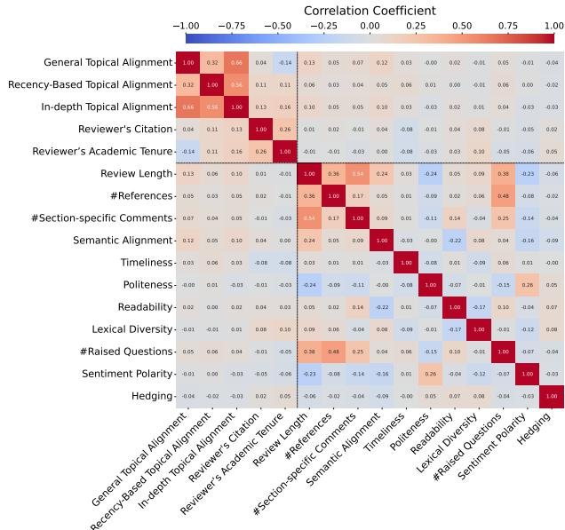
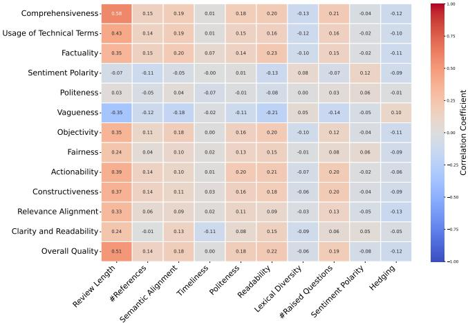
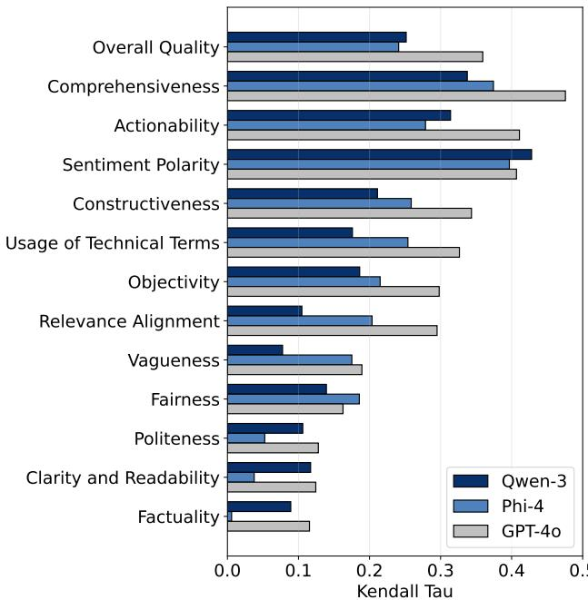
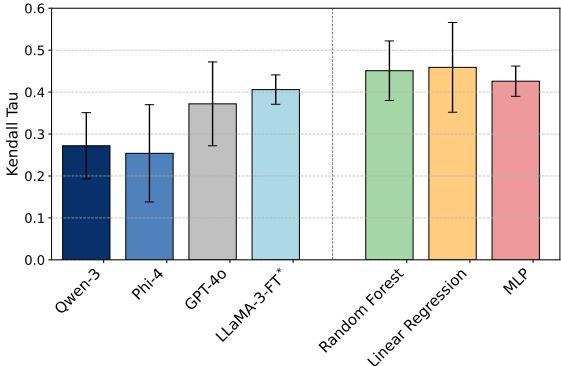

# RottenReviews : Benchmarking Review Quality with Human and LLM-Based Judgments

Sajad Ebrahimi∗ Reviewerly

Soroush Sadeghian Reviewerly

Ali Ghorbanpour Reviewerly

Negar Arabzadeh Reviewerly

Sara Salamat Reviewerly

Muhan Li Reviewerly

Hai Son Le Reviewerly

Mahdi Bashar Reviewerly

Ebrahim Bagheri Reviewerly, University of Toronto

# Abstract

The quality of peer review plays a critical role in scientific publishing, yet remains poorly understood and challenging to evaluate at scale. In this work, we introduce RottenReviews, a benchmark designed to facilitate systematic assessment of review quality. RottenReviews comprises over 15,000 submissions from four distinct academic venues enriched with over 9,000 reviewer scholarly profiles and paper metadata. We define and compute a diverse set of quantifiable review-dependent and reviewer-dependent metrics, and compare them against structured assessments from large language models (LLMs) and expert human annotations. Our humanannotated subset includes over 700 paper–review pairs labeled across 13 explainable and conceptual dimensions of review quality. Our empirical findings reveal that LLMs, both zero-shot and finetuned, exhibit limited alignment with human expert evaluations of peer review quality. Surprisingly, simple interpretable models trained on quantifiable features outperform fine-tuned LLMs in predicting overall review quality. We publicly release all data, code, and models at https://www.github.com/sadjadeb/RottenReviews to support further research in this area.

# 1 Introduction

Peer review is widely recognized as the cornerstone of scholarly communication, serving as a gatekeeper for academic dissemination and a mechanism for maintaining the quality and integrity of scientific research [14]. By providing rigorous assessments of research submissions, peer reviewers play a critical role in improving manuscripts, guiding publication decisions, and upholding the credibility of scientific venues. When done well, peer review fosters constructive dialogue, enhances reproducibility, and accelerates scientific progress. Despite its central role, the quality of peer reviews remains highly variable and poorly understood. There are no universally accepted standards or guidelines for what constitutes a high-quality review [30], and as a result, review assessments tend to be subjective, inconsistent, and opaque [28]. Each reviewer or editor may apply their own implicit criteria, leading to wide variability in tone, depth, and relevance across reviews. The traditional anonymity of the review process further limits opportunities for accountability and quality control. Although public datasets of reviews have recently begun to emerge [8, 19, 25, 36], few include human-annotated evaluations, making it difficult to systematically assess, benchmark, or improve peer review quality.

Given the increasing availability of peer review data and the rapid advancement of natural language processing tools, there is a timely opportunity to systematically examine the characteristics that define high-quality peer reviews. While prior studies have addressed individual aspects of review writing, such as tone, length, or reviewer bias, there remains a lack of unified frameworks that integrate diverse evaluation metrics, including human judgments, automatic metrics, and machine-generated assessments. Moreover, with the emergence of large language models (LLMs) as both potential reviewers and evaluators, critical questions arise about their reliability, alignment with expert opinion, and interpretability. In this work, we propose a multi-faceted investigation that combines empirical analysis with human-in-the-loop benchmarking to address these gaps and move toward scalable, trustworthy, and explainable review quality assessment. In particular, our work pursues four interrelated objectives: (O1) Quantifying Review Quality: We begin by identifying which quantifiable features of peer reviews, such as length, citation usage, politeness, lexical diversity, and topical relevance to name a few, are most informative for assessing review quality. The goal is for these features to potentially serve as interpretable proxies for more subjective dimensions, forming the empirical foundation for subsequent analyses. (O2) Evaluating LLMs as Peer-Review Quality Judges: We assess the ability of LLMs to act as standalone evaluators of peer review quality across multiple dimensions. We investigate how consistently their structured assessments align with human expectations and whether they can capture nuanced aspects of review quality across domains. (O3) Evaluating Alignment Between Assessment Metrics: Building on the extracted features and LLM outputs, we empirically examine how well quantifiable metrics and LLM-based evaluations align with expert human judgments. This comparison allows us to identify which metrics most closely approximate human assessments and to what extent automated judgments can serve as valid substitutes. (O4) Learning from Human Judgments: Finally, we explore whether predictive models, trained on a limited set of human-annotated reviews, can generalize effectively to unseen data. This enables the development of lightweight, data-efficient tools for assessing review quality in real-world, low-resource settings where extensive human evaluation of peer review quality is impractical.

To address these objectives, we introduce RottenReviews, a comprehensive dataset and benchmark for studying peer review quality. Our dataset comprises over 15,000 submissions sourced from four distinct academic venues, i.e., F1000Research, Semantic Web Journal, ICLR, and NeurIPS, chosen to reflect a spectrum of openness and disciplinary diversity. Whenever possible, we enrich reviews with reviewer metadata, including disambiguated scholarly profiles via OpenAlex. This allows us to analyze how reviewer background, expertise, and academic influence relate to review quality. Using this data, we systematically define and compute three complementary types of quality metrics: (1) quantifiable review- and reviewer-dependent metrics (e.g., lexical diversity, topical alignment, hedging), (2) expert human annotations across 13 review quality dimensions (e.g., comprehensiveness, fairness, clarity), and (3) LLM-based assessments using structured prompts. We compare these metrics to determine which metrics align most closely with human judgments. Our key contributions are as follows:

• The RottenReviews Dataset with Associated Reviewer Profiles: We release the first large-scale, publicly available dataset of over 15,000 peer reviews enriched with over 9,000 reviewer profiles (when available), enabling the study of how reviewer expertise relates to review quality. • Benchmarking Review Quality: We provide a unified benchmark combining quantifiable metrics, human expert annotations, and LLM-based evaluations to systematically assess review quality. • Learning to Assess Review Quality: We demonstrate that simple models trained on interpretable features outperform fine-tuned LLMs in predicting human-assigned review quality, highlighting the current limitations of LLMs in this domain.

Through detailed empirical analysis, we show that many surfacelevel and semantic textual features are moderately correlated with human-perceived review quality, establishing them as valuable and interpretable proxies. In contrast, we find that LLMs, when used out-of-the-box, perform poorly as review quality judges and show low alignment with expert annotations across virtually all assessment dimensions. Even after fine-tuning, LLMs only marginally improve and remain substantially less accurate than a simple regression model trained on the quantifiable features. We make all our data and code publicly available for future research purposes at https://github.com/sadjadeb/RottenReviews.

# 2 Related Work

In the recent years, there has been growing interest in enhancing the peer-review process to support more reliable scientific evaluation [2, 4, 9, 17, 27]. A key area of focus has been identifying and mitigating biases in peer review [5, 33]. The authors in [18] and [32] highlight gender-based and institutional biases, showing that non-anonymous reviewing can skew judgments in favor of well-known authors or prestigious institutions. More recently, Goldberg et al. [16] conducted a randomized controlled trial revealing that reviewers tend to overvalue longer reviews, even when the added content is non-informative. These findings underscore the subjectivity and inconsistency in review evaluation and point to the need for robust, multidimensional approaches that go beyond single heuristics or shallow quality metrics.

Use of LLMs for Writing Reviews. Another growing body of work investigates the use of LLMs for generating or assisting with peer reviews. Zhou et al. [36] evaluated LLMs for review generation and score prediction. While the models provided helpful feedback in some cases, they often produced superficial or incorrect critiques, especially for lengthy papers. Du et al. [8] introduced the ReviewCritique dataset, comparing LLM-generated reviews with human-written ones at a fine-grained level. Their results showed that LLMs tend to produce more deficient review segments and struggle with depth, specificity, and constructive feedback. In a related effort, LazyReview [25], the authors focused on detecting ‘lazy thinking’ in reviews: instances where reviewers relied on shallow arguments rather than substantive critiques. While their dataset demonstrated that LLMs can assist in pinpointing such patterns, it was limited to a narrow definition of quality (i.e., comprehensiveness vs. superficiality) and did not cover broader aspects such as tone, politeness, or constructiveness. In contrast, RottenReviews offers a more comprehensive analysis of LLMs as review quality evaluators rather than review generators.

Quality Metrics for Review Assessment A few studies have proposed automatic metrics to quantify review quality. LazyReview categorized reviews based on sentence-level annotations to identify superficial critiques, while Meng [21] introduced politeness and readability scores as potential indicators of review professionalism and clarity. These metrics reflect the hypothesis that well-written, respectful reviews are more likely to be helpful and of high quality. Other works have explored reviewer expertise and consistency. Zahorodnii et al. [34], for instance, proposed a Bayesian model that estimates reviewer reliability based on historical agreement with community consensus. Their findings suggest that weighing reviews by reviewer trustworthiness can improve overall paper evaluation accuracy. However, these approaches tend to focus on a single dimension of review quality such as textual style, reviewer reputation, or argument depth. In contrast, RottenReviews addresses this limitation by integrating multiple quality metrics: human expert annotations using a fine-grained rubric, a diverse set of textual features (e.g., length, politeness, topicality), and structured LLM-based evaluations of the same dimensions to evaluate peer reviews in a fairer and more detailed manner.

# 3 RottenReviews Dataset

# 3.1 Data Collection

To the best of our knowledge, there are only few publicly available datasets dedicated to the study of review quality in academic peer review. Even in existing efforts [8, 25, 34], none have explicitly evaluated entire reviews using human judgments based on multidimensional explainable quality metrics. The closest prior work [8] involved asking humans to assess whether specific parts of a review were useful, and was limited to a small set of around 100 papers. In this work, we curate and publicly release the RottenReviews dataset by aggregating reviews from four venues across three distinct platforms: F1000Research1, Semantic Web Journal $( \mathrm { S W J } ) ^ { 2 }$ , OpenReview3 (covering ICLR 2024 and NeurIPS 2024), each chosen for their unique characteristics and potential to support multifaceted analysis.

Table 1: Statistics of the RottenReviews dataset.   

<table><tr><td rowspan="2">Feature</td><td colspan="4">Data Source</td></tr><tr><td>NeurIPs</td><td>ICLR</td><td>F1000</td><td>SWJ</td></tr><tr><td>#Papers</td><td>3,395</td><td>7,262</td><td>4,509</td><td>796</td></tr><tr><td>#Reviews</td><td>15,175</td><td>28,028</td><td>9,482</td><td>2,337</td></tr><tr><td>Avg #Reviews per paper</td><td>4.47</td><td>3.86</td><td>2.10</td><td>2.93</td></tr><tr><td>#Identified Reviewers</td><td>N/A</td><td>N/A</td><td>8,831</td><td>701</td></tr></table>

F1000Research is an open peer review platform where reviews and reviewer identities are published alongside the articles with reviewer consent. This transparency allows us to link reviewer identities to external scholarly profiles (e.g., OpenAlex4), enabling an investigation of how a reviewer’s academic background and expertise may correlate with the quality of their review. This journal spans a broad range of disciplines, including Natural Sciences, Medical and Health Sciences, Social Sciences, Engineering and Technology, and more. In addition, we collected data from the Semantic Web Journal, a focused-domain journal on Semantic Web and Linked Data. This journal offers a semi-anonymous review model where reviewers can choose whether to disclose their identities or not. To complement these sources with large-scale, well-known peer review data, we also collected reviews from ICLR and NeurIPS via OpenReview. While reviews on OpenReview are anonymized, the platform offers valuable structured metadata including reviewer confidence and fine-grained scoring.

Across these platforms, we extracted paper metadata including title, abstract, full-text content or PDF if available, authors and ORCID IDs (if available), subject area and keywords (if available), final editorial decision of article (if avialble), upload date, and latest publication status. We also collect review-Level meta data which includes full text of each referee report, reviewer identity and affiliation (if revealed or ‘Anonymous’ when opted out), reviewer’s expertise, review date, the article version, the reviewer’s recommended decision, and any author responses.

F1000Research. We collected all publicly reviewed articles available on F1000Research from July 2012, the earliest available on their journal, to February 2025 using the platform’s API. The script iterates through the article index, pulls each article’s base record, and then makes follow-up calls to different versions and reports so that every revision and its reviews are captured.

Semantic Web Journal (SWJ). For the Semantic Web Journal, we collected data spanning from December 2010, the oldest publicly available submission, through February 2025. SWJ practices a fully open peer review process; however, not all manuscripts are publicly accessible. Specifically, submissions marked private are excluded from public access and were therefore not included in our dataset. We restricted our collection to the journal’s publicly available Reviewed Articles section, ensuring compliance with the journal’s access policies while maintaining the integrity of our corpus. Whenever an accessible paper offers multiple revisions, we connect every revision to reconstruct the complete review timeline.

OpenReview. We collected data from OpenReview using their API to retrieve submission records and associated metadata for selected conferences. The pipeline gathers article-level meta data as well as review-level meta data for ICLR 2024 and NeurIPS 2024.

# 3.2 RottenReviews Statistics

After aggregating reviews from NeurIPS, ICLR, F1000Research, and the SWJ, our dataset comprises over 55,000 reviews spanning nearly 15,000 papers as shown in Table 1. Conference venues like NeurIPS and ICLR feature an average of 4.47 and 3.86 reviews per paper, respectively, while journals such as F1000 and SWJ average fewer reviews per submission. On the other hands, while NeurIPS and ICLR maintain full anonymity, F1000Research includes 8,831 identified reviewers, and the Semantic Web Journal includes 701 reviewers who agreed to disclose their identity. These identified subsets allow us to study the relationship between reviewer background and review quality, an analysis that is impossible in anonymized settings. This distinction across venues enables both review-dependent and reviewer-dependent evaluation scenarios.

# 4 Review Quality Metrics

To have interpretable evaluation of peer review quality, we collected a set of quantifiable metrics that reflect both intrinsic properties of the review text and extrinsic attributes related to the reviewer’s scholarly profile [21, 22, 34]. These metrics, not intended to be comprehensive, are grouped into two major categories: reviewdependent metrics (Section 4.1), which can be computed using only the content of the review and the associated paper, and reviewerdependent metrics (Section 4.2), which are measured based on the reviewer’s publication history and academic standing.

# 4.1 Review-Dependent Metrics

The review-dependent metrics aim to capture both surface-level and semantic aspects of the review, providing details for the quality of the review based on the following metrics:

Review Length: Longer reviews are more likely to offer more detailed and informative feedback [15]. We compute the number of words as a basic measure of review verbosity.

#Reference: Reviews that reference other works often reflect a higher level of engagement with the subject matter. To capture this, we count the number of explicit citations, identifying by a regex pattern that detects common citation formats such as $\ddot { \left[ \mathrm { m u m b e r } \right] } ^ { \mathfrak { n } }$ , “(Name et al., Year)”, arXiv links, DOIs, and similar expressions.

#Section-Specific Comments: The presence of references to specific parts of the paper indicates that the reviewer has engaged closely with the manuscript. We measure often a reviewer explicitly references specific components of the paper (e.g., figures, equations, sections) by the proposed approach in [22].

Semantic Alignment: We assess the extent to which the review aligns with submission content using the semantic similarity between the review and the submission’s title and abstract using embedding-based representations from SPECTER [6], which is finetuned on scientific articles.

Timeliness: We examine whether the time taken to complete a review is associated with the review’s quality. Specifically, we measure the time elapsed between the review assignment and its submission.

Politeness: Politeness is crucial in maintaining constructive and respectful peer-review discourse . To evaluate the politeness level of each review, we use a fine-tuned XLM-RoBERTa Large model5 on the TyDiP dataset [29]. Unlike rule-based or lexicon-driven methods [7], this neural model captures nuanced, context-dependent cues such as indirectness, modality, and formal address.

Table 2: Statistics of Review-dependent (above the line) and Reviewer-dependent (below the line) quantifiable metrics.   

<table><tr><td rowspan="2">Metric</td><td colspan="4">Data Source</td></tr><tr><td>NeurIPs</td><td>ICLR</td><td>F1000</td><td>SWJ</td></tr><tr><td>Review Length</td><td>439.4</td><td>424.5</td><td>398.17</td><td>782.09</td></tr><tr><td>#References</td><td>1.25</td><td>1.42</td><td>0.29</td><td>2.29</td></tr><tr><td>#Section-specific Comments</td><td>1.43</td><td>1.73</td><td>1.78</td><td>7.27</td></tr><tr><td>Semantic Alignment</td><td>0.90</td><td>0.90</td><td>0.88</td><td>0.90</td></tr><tr><td>Timeliness</td><td>59.13</td><td>39.81</td><td>142.36</td><td>89.46</td></tr><tr><td>Politeness</td><td>0.84</td><td>0.81</td><td>0.83</td><td>0.75</td></tr><tr><td>Readability</td><td>38.02</td><td>37.65</td><td>36.60</td><td>43.86</td></tr><tr><td>Lexical Diversity</td><td>0.77</td><td>0.77</td><td>0.76</td><td>0.76</td></tr><tr><td>#Raised Questions</td><td>3.76</td><td>4.02</td><td>1.72</td><td>2.88</td></tr><tr><td>Sentiment polarity</td><td>0.11</td><td>0.11</td><td>0.15</td><td>0.10</td></tr><tr><td>Hedging</td><td>0.005</td><td>0.009</td><td>0.013</td><td>0.007</td></tr><tr><td>General Topic Alignment</td><td>N/A</td><td>N/A</td><td>0.74</td><td>0.76</td></tr><tr><td>Recency-Based Topic Alignment</td><td>N/A</td><td>N/A</td><td>0.65</td><td>0.64</td></tr><tr><td>In-depth Topical Alignment</td><td>N/A</td><td>N/A</td><td>0.87</td><td>0.88</td></tr><tr><td>Reviewer&#x27;s Citation</td><td>N/A</td><td>N/A</td><td>4683.00</td><td>2476.08</td></tr><tr><td>Reviewer&#x27;s Academic Tenure</td><td>N/A</td><td>N/A</td><td>29.16</td><td>25.68</td></tr></table>

Readability: We quantify readability and understandability of a review using the Flesch Reading Ease (FRE) score [13] which is calculated based on sentence length and syllable count per word.

Lexical Diversity: Lexical diversity has been used as a marker of language proficiency, textual quality, and cognitive effort [20]. To quantify lexical diversity within review texts, we compute the Type-Token Ratio (TTR). A higher TTR indicates a richer vocabulary and less repetition.

#Raised Questions Constructive reviews often include clarifying questions. To do this, we used a fine-tuned BERT-Mini which aims to detect the number of questions in a text6.

Sentiment Polarity: We compute the overall sentiment of each review using the TextBlob 7 which provides a polarity score ranging from 0 (strongly negative) to 1 (strongly positive).

Hedging: This reflects the reviewer’s confidence, objectivity, and caution in making claims. Excessive hedging may signal indecisiveness or lack of engagement, while an absence of hedging might indicate overconfidence or harsh judgment. We utilize the HEDGEhog model,8 and for each review, we compute the proportion of tokens labeled as hedging cues to quantify the review’s epistemic stance.

# 4.2 Reviewer-Dependent Metrics

This set of metrics captures the alignment between a reviewer’s expertise and the submission.

Reviewer Profile Matching and Disambiguation: To compute reviewer-dependent metrics, we first identified each reviewer’s scholarly profile in OpenAlex. Since the raw data typically included only full names, often ambiguous and shared, we implemented a content-based disambiguation process. Using the OpenAlex database including over 96m authors and $2 6 0 \mathrm { m }$ papers, and through their API, we retrieved a list of candidate profiles for each reviewer and extracted their associated research topics. We then use a contentbased author disambiguation method [1, 26] and embedded the topics along with the title and abstract of the reviewed submission using the SPECTER model [6]. Cosine similarity was used to select the most likely profile match. Once matched, we extracted reviewer metadata such as publication history, citation count, and more to analyze their relationship with review quality.

Once reviewer profiles were matched to OpenAlex records, we extracted several reviewer-dependent metrics aimed at capturing the expertise of each reviewer w.r.t the submission under review. These metrics are detailed as follows:

General Topical Alignment: Reviewers with aligned expertise with the manuscript are likely better equipped to assess the quality of the submission. To estimate the general topical relevance of a reviewer, we computed the average cosine similarity between the submission (title and abstract) and all of the reviewer’s prior publications (title and abstract) using SPECTER [6]

Recency-Based Topical Alignment: Given the dynamic nature of scientific fields, a reviewer’s recent publications may better reflect their up-to-date knowledge of emerging methods. As such, in this variant we emphasize on the reviewer’s current research focus. Specifically, we restricted the set of publications of reviewers to those from the past two years (2023 onward) and computed the average SPECTER-based similarity between these works of the reviewer and the submission.

In-depth Topical Alignment: This metric captures whether the reviewer has authored at least one highly relevant work, potentially indicating deep expertise on the topic. We compute the maximum semantic similarity between the submission and any individual publication from the reviewer’s prior work.

Citations: We aim to investigate whether a reviewer’s scholarly influence are associated with the quality of their reviews. To this end, we include total citation count of the reviewer as proxies for a reviewer’s academic impact [23].

Reviewer’s Academic Tenure: Since seniority may not fully correlate with scholarly impact, we also consider the reviewer’s academic years of experience as an independent metric.This metric is computed as the difference between the current year and the earliest publication year listed in their OpenAlex profile.

# 4.3 Correlation among Quantifiable Metrics

In Figure 1, we present the pairwise Kendall $\tau$ correlation between the quantifiable metrics introduced in Table 2, computed separately for different venues. Since reviewer identities are anonymized in ICLR and NeurIPS, reviewer-dependent features are only available for the F1000 and SWJ datasets, while correlations among reviewdependent features are available across four venues. Due to limited space, the figure only includes data from F1000. We confirm similar observation on the other 3 venues and report similar plots in our Github repo. From the heatmaps, we make the following observations: (1) Review length is strongly correlated with several other review-dependent signals. In particular, longer reviews tend to include more references and exhibit a higher frequency of sectionspecific comments indicating greater specificity and engagement. Moreover, lengthy reviews are positively associated with the number of clarification questions raised and with stronger semantic alignment to the corresponding paper. These patterns suggest that review length is not merely a surface-level feature, but often reflects deeper engagement and effort. (2) As expected, the three topical alignment metrics, namely general, recency-based, and in-depth alignment, are moderately to strongly correlated with one another. However, the lower correlation between general and recency-based alignment implies that a reviewer’s recent publications may differ meaningfully from their historical body of work, highlighting the utility of capturing both. Interestingly, academic tenure shows weak correlation with all topical alignment features, suggesting that the number of years a reviewer has been active in research is not a strong indicator of how well their expertise aligns with a specific submission. (3) We observe no strong correlations between review-dependent and reviewer-dependent features. This is encouraging, as it suggests that the two groups of metrics capture complementary aspects of review quality. Their complementarity implies that combining these features can provide a more holistic and multi-dimensional representation of a review’s quality.

  
Figure 1: Correlation between quantifiable metrics on F1000.

# 5 Human vs LLM as a Review Quality Assessor

To identify which metrics best align with human judgments of review quality, we collected assessments from both human annotators and LLMs. The following sections detail our annotation process and analyze the agreement between quantifiable metrics, LLM-based scores, and human evaluations.

# 5.1 Collecting Review Quality Assessments

5.1.1 Obtaining Human Assessments. To create a human-annotated dataset on the quality of peer reviews, we developed and deployed a custom web-based annotation interface using the Flask web framework and Jinja2 templating engine. Annotators were provided with the title and abstract of each paper, along with all corresponding peer reviews. They were asked to evaluate each review based on a set of detailed dimensions related to review quality. A total of 18 researchers with backgrounds in artificial intelligence and machine learning were recruited for the task. The papers selected for annotation were aligned with their domains of expertise to ensure topic familiarity. All reviews were anonymized: reviewer names and decisions (e.g., accept/reject) were removed, and annotators did not have access to the identities of authors or reviewers, ensuring unbiased evaluation. To ensure high annotation quality, we excluded submissions completed in less than 5 minutes, resulting in 200 annotated submissions (50 from each of the four venues), comprising 753 individual reviews. All annotators were compensated appropriately for their contributions.

Table 3: Review quality dimensions used for human and LLM -based assessment.   

<table><tr><td>Aspect</td><td>Description</td></tr><tr><td>Comprehensiveness</td><td>Covering all key aspects of the paper.</td></tr><tr><td>Usage of Technical Terms</td><td>Using domain-specific vocabulary.</td></tr><tr><td>Factuality</td><td>Accuracy of the statements made in the review.</td></tr><tr><td>Sentiment Polarity</td><td>Overall sentiment conveyed by the reviewer.</td></tr><tr><td>Politeness</td><td>Tone and manner of the review language.</td></tr><tr><td>Vagueness</td><td>Degree of ambiguity or lack of specificity in the review.</td></tr><tr><td>Objectivity</td><td>Presence of unbiased, evidence-based commentary.</td></tr><tr><td>Fairness</td><td>Perceived impartiality and balance in judgments.</td></tr><tr><td>Actionability</td><td>Helpfulness of the review in suggesting clear next steps.</td></tr><tr><td>Constructiveness</td><td>Whether the review offers improvements rather than just criticism.</td></tr><tr><td>Alignment</td><td>Relevance of review to scope of the paper.</td></tr><tr><td>Clarity and Readabil- ity</td><td>Ease of understanding the review, including grammar and structure.</td></tr><tr><td>Overall Quality</td><td>Holistic evaluation of the review&#x27;s usefulness and pro- fessionalism.</td></tr></table>

Each review was rated across 13 dimensions. Most metrics were evaluated on a graded scale: Irrelevant, Very Weak, Weak, Adequate, Strong, and Outstanding. Three metrics, Sentiment Polarity, Factuality, and Politeness, used custom categorical labels (e.g., negative, neutral, and positive for sentiment analysis). Additionally, Overall Quality was rated on a continuous scale from 0 to 100. Full details of the annotation metrics, along with a screenshot of the data collection interface are available on our GitHub repository. Additionally, we provide the data collection code to facilitate future extensions of the dataset.

5.1.2 Obtaining LLM Assessments. In addition to human judgments, we investigated whether LLMs can assess the quality of peer reviews. To this end, we used the same evaluation criteria as in the human annotation task and incorporated them into a structured prompt. This prompt (can be found in our GitHub repository) instructed the LLMs to rate each review across all defined quality dimensions, returning their assessments in a JSON dictionary format with criteria as keys and the corresponding quality scores as values. Each review was evaluated using the set of quality metrics that have been defined in Table 3. We tested three LLMs: two open-weight models, Qwen-3 8B [11] and Phi-4 14B [12], and one commercial model, GPT-4o (gpt-4o-2024-08-06). The open-weight models were run locally using the Ollama framework, while GPT-4o was accessed via the OpenAI API. All models were run with a temperature setting of 0 to ensure deterministic outputs. Each model was given the title and abstract of a submission, along with one corresponding peer review, and the definitions of the review quality metrics. We post-processed the generated responses to validate their structure, ensuring adherence to expected value ranges, and removed or regenerated any malformed entries.

  
Figure 2: Kendall’s ?? correlation between human-evaluated quality dimensions (?? -axis) and quantifiable metrics $X$ -axis).

# 5.2 Agreement w/ Human Annotations

5.2.1 Quantifiable Metrics vs Human Annotation. We now examine the extent to which quantifiable metrics align with humanannotated quality dimensions. While many of the human-evaluated aspects are conceptual and subjective (e.g., fairness, constructiveness), and therefore challenging to capture through surface-level metrics, analyzing their correlations with computable features offers insights into which metrics may serve as reliable proxies.

We adopt a similar strategy to Section 4.3 and report the pairwise Kendall $\tau$ correlation between the two sets of measures (quantifiable metrics on the $X$ -axis and human annotated metrics on the $Y$ -axis) in Figure 2. Based on the figure, we make the following key observations: (1) Review Length shows consistently strong positive correlation with nearly all human-evaluated aspects, most notably comprehensiveness $\mathit { \check { \tau } } _ { \tau } = 0 . 5 8 )$ and overall quality $( \tau = 0 . 5 1 $ ). This supports the intuition that longer reviews often reflect deeper engagement and are perceived as higher quality. As expected, review length shows a negative correlation with vagueness, suggesting that more verbose reviews tend to be more specific and less ambiguous. (2) After review length, the next most correlated metrics with overall quality include semantic alignment, number of raised questions, and readability, each with correlations between 0.18–0.22. Although these correlations are lower than that of review length, they suggest that content relevance, linguistic clarity, and engagement through questions contribute meaningfully to perceived review quality. (3) Furthermore, Comprehensiveness stands out not just because of its strong correlation with review length $\mathit { \check { \tau } } = 0 . 5 8 )$ , but because it maintains moderate to high correlation with a wide range of other features: number of raised questions (0.21), usage of technical terms (0.20), and semantic alignment (0.19). This suggests that human judgments of comprehensiveness are multidimensional. In contrast to metrics like fairness or objectivity, comprehensiveness is more reliably mirrored by quantifiable metrics. (4) Usage of technical terms shows moderate correlation with actionability ${ ' } \tau = 0 . 4 3$ ) and comprehensiveness (0.20), but almost no alignment with dimensions such as fairness (0.15), politeness (0.01), or sentiment polarity (0.01). This reinforces the view that domain expertise or technical fluency contributes significantly to utility and coverage, but does not strongly influence judgments of tone, empathy, or fairness. This suggests a separation between technical depth and socio-linguistic quality, and points to the need for composite modeling of quality that integrates both dimensions. (5) Finally, metrics like hedging, lexical diversity, and timeliness exhibit weak or even negative correlation across most dimensions. These patterns suggest that such features may not reliably capture meaningful signals of review quality, at least in our dataset.

  
Figure 3: Kendall’s $\tau$ correlation between human-evaluated and LLMs-evaluated quality dimensions

5.2.2 LLMs vs Human Annotations. In this section, we analyze the extent to which LLM-based assessments align with human judgments of review quality.

Figure 3 reports the Kendall’s $\tau$ correlations between human annotations across different review quality dimensions and the corresponding LLM-based quantifications. From this figure, we make the following observations: (1) In general, LLM-based assessments do not exhibit strong alignment with human judgments, as the correlation remains below 0.5 across all dimensions. This suggests that unlike other LLM-based evaluation applications [3, 24, 31], there s a limited agreement between LLMs and human annotators in evaluating nuanced aspects of review quality. (2) Among all dimensions, comprehensiveness shows the highest correlation with human judgments. We hypothesize that this is because comprehensiveness is closely tied to review length and perceived effort, attributes that both humans and LLMs can more easily detect and agree upon. Interestingly, sentiment polarity also shows relatively high correlation (close to 0.4) across all three LLMs, indicating that LLMs consistently align with human sentiment judgments, likely due to the more surface-level nature of sentiment metrics. (3) For dimensions such as constructiveness, use of technical terms, and actionability, open-source LLMs like Qwen-3 and Phi-4 struggled to align with human annotations. In contrast, GPT-4o demonstrated relatively higher correlations, suggesting its superior capability in interpreting these more content-dependent aspects. (4) Although politeness and readability are typically considered easier to quantify, they exhibit poor correlation with human annotations. This discrepancy may stem from differing interpretations of these concepts between LLMs and human judges, particularly in academic writing, where tone and clarity are context-dependent.

  
Figure 4: Kendall’s $\tau$ correlation between human-evaluated and models-predicted Overall Quality of peer reviews.

The variation in correlation across dimensions suggests that LLMs are disproportionately sensitive to lexical and stylistic features, but lack the structured domain knowledge and evaluative judgment that human reviewers bring to more substantive aspects of peer feedback. This disparity is especially pronounced in tasks that involve normative assessments (e.g., fairness, constructiveness) or topic-specific critique, which are difficult to learn without extensive grounding in academic standards and field-specific context.

# 5.3 Learning to Assess with Review Quality

We further investigate whether the set of quantifiable metrics can be used to train a simple model to predict the overall quality of a peer review. Specifically, we frame this as a regression task, where the goal is to learn the overall quality score obtained through human assessments. We train three simple baseline models, namely Random Forest, Linear Regression, and Multi-Layer Perceptron (MLP), on the RottenReviews dataset using 5-fold cross-validation. Each model learns to predict the human-assigned overall quality score based solely on review-dependent quantifiable features. All code, training configurations, and evaluation scripts are publicly available in our GitHub repository. We then compare these models with LLM-based assessments by computing the Kendall’s $\tau$ correlation between predicted and human-annotated overall scores using the same 5-fold splits. As shown in Figure 4, even simple models like Random Forest and Linear Regression achieve correlations above 0.45 on average, outperforming all evaluated LLMs. For instance, GPT-4o, the best-performing LLM in Figure 3, reaches a maximum Kendall’s $\tau$ of $0 . 3 8 ^ { 9 }$

Additionally, inspired by prior work [35] and success of finetuning LLMs for different downstream tasks, we experiment with fine-tuning LLaMA-3 8B [10] to directly assess review quality given the title, abstract and review of a manuscript. We fine-tune the model using a learning rate of 5e-5, adjusted dynamically based on batch size and training steps. LoRA adaptation with a rank of 16 is applied to the query and value matrices in the self-attention layers, and 8-bit quantization is used to reduce the memory footprint. All training has been conducted on a server with $2 \times$ NVIDIA A6000 GPUs, and models are trained for 5 epochs. As depicted in Figure 4, the fine-tuned LLaMA-3 model (shown in light blue as LLaMA-3-FT) outperforms GPT-4o, suggesting that fine-tuning on human-annotated data improves zero-shot LLM alignment with review quality judgments. However, it still underperforms compared to simple regression models trained on quantified features. One possible reason could be the limited size of the training dataset, which is insufficient for effectively fine-tuning a large language model. Given the challenges of collecting high-quality labeled data for this task, simpler models may remain more effective until substantially larger annotated datasets become available.

# 5.4 Discussions

Our findings yield several actionable insights for improving peer review quality assessment in practice: (1) Interpretable Metrics for Review Monitoring. We find that models trained on quantifiable, interpretable features, can be useful for predicting human-perceived review quality. This suggests that academic venues could reliably incorporate such inexpensive and transparent metrics into their editorial workflows to identify low-effort or insufficiently detailed reviews. (2) Cautious Use of LLMs in Review Evaluation. Despite growing interest in using large language models to assess review quality, our results show that LLMs, correlate poorly with human assessments, especially on complex dimensions like fairness and factuality. While LLMs may be useful for analyzing characteristics such as sentiment , they are not yet reliable substitutes for expert judgments of review quality. We recommend that any deployment of LLMs in this context be accompanied by human verification .

# 6 Concluding Remarks

In this work, we present RottenReviews, a benchmark designed to assess the peer review quality. Our contributions are threefold: (1) we curate a large-scale dataset comprising over 15,000 paper–reviews pairs from four distinct venues, enriched with over 9,000 reviewer profiles using OpenAlex; (2) we define and compute a diverse set of review- and reviewer-dependent metrics, as well as structured LLM-based evaluations and human annotations; and (3) we provide baselines for a novel prediction task to estimate overall review quality from both interpretable features and fine-tuned LLMs. All resources are publicly released to support future research in review quality assessment. Our study reaffirms that review quality is a multidimensional construct that cannot be reduced to a single numeric score. While we observe that some quantifiable metrics correlate moderately with human annotations, and LLMs show limited but improving alignment, no individual metric or model fully captures the depth of human judgment.

Nonetheless, several limitations must be acknowledged. First, while we evaluate three representative LLMs, the landscape of language models is evolving rapidly, and future models may demonstrate substantially different capabilities. Second, our annotations were provided exclusively by graduate students, which may introduce bias and limit the diversity of perspectives represented in the quality assessments.

# GenAI Usage Disclosure

The authors confirm that generative AI tools were not used for research design, data collection, analysis, or substantive content generation. We only used generative AI tools for light-weight writeup editing and grammar correction. All technical contributions and written content were primarily authored and verified by the authors.

# References

[1] Ahmed Abbasi, Abdul Rehman Javed, Farkhund Iqbal, Zunera Jalil, Thippa Reddy Gadekallu, and Natalia Kryvinska. 2022. Authorship identification using ensemble learning. Scientific reports 12, 1 (2022), 9537.   
[2] Balazs Aczel, Ann-Sophie Barwich, Amanda B. Diekman, Ayelet Fishbach, Robert L. Goldstone, Pablo Gomez, Odd Erik Gundersen, Paul T. von Hippel, Alex O. Holcombe, Stephan Lewandowsky, Nazbanou Nozari, Franco Pestilli, and John P. A. Ioannidis. 2025. The present and future of peer review: Ideas, interventions, and evidence. Proceedings of the National Academy of Sciences 122, 5 (2025), e2401232121. doi:10.1073/pnas.2401232121 arXiv:https://www.pnas.org/doi/pdf/10.1073/pnas.2401232121 [3] Negar Arabzadeh and Charles LA Clarke. 2025. Benchmarking LLM-based Relevance Judgment Methods. arXiv preprint arXiv:2504.12558 (2025).   
[4] Negar Arabzadeh, Sajad Ebrahimi, Sara Salamat, Mahdi Bashari, and Ebrahim Bagheri. 2024. Reviewerly: Modeling the Reviewer Assignment Task as an Information Retrieval Problem. In Proceedings of the 33rd ACM International Conference on Information and Knowledge Management. 5554–5555.   
[5] Jessica L Blackburn and Milton D Hakel. 2006. An examination of sources of peer-review bias. Psychological science 17, 5 (2006), 378–382. [6] Arman Cohan, Sergey Feldman, Iz Beltagy, Doug Downey, and Daniel S Weld. 2020. Specter: Document-level representation learning using citation-informed transformers. arXiv preprint arXiv:2004.07180 (2020).   
[7] Cristian Danescu-Niculescu-Mizil, Moritz Sudhof, Daniel Jurafsky, Jure Leskovec, and Christopher Potts. 2013. A computational approach to politeness with application to social factors. In Annual Meeting of the Association for Computational Linguistics. https://api.semanticscholar.org/CorpusID:12383721   
[8] Jiangshu Du, Yibo Wang, Wenting Zhao, Zhongfen Deng, Shuaiqi Liu, Renze Lou, Henry Peng Zou, Pranav Narayanan Venkit, Nan Zhang, Mukund Srinath, et al. 2024. Llms assist nlp researchers: Critique paper (meta-) reviewing. arXiv preprint arXiv:2406.16253 (2024).   
[9] Sajad Ebrahimi, Sara Salamat, Negar Arabzadeh, Mahdi Bashari, and Ebrahim Bagheri. 2025. exHarmony: Authorship and Citations for Benchmarking the Reviewer Assignment Problem. arXiv:2502.07683 [cs.IR] https://arxiv.org/abs/ 2502.07683   
[10] Aaron Grattafiori et al. 2024. The Llama 3 Herd of Models. arXiv:2407.21783 [cs.AI] https://arxiv.org/abs/2407.21783   
[11] An Yang et al. 2025. Qwen3 Technical Report. arXiv preprint arXiv:2505.09388 (2025).   
[12] Marah Abdin et al. 2024. Phi-4 Technical Report. arXiv:2412.08905 [cs.CL] https://arxiv.org/abs/2412.08905   
[13] Rudolf Franz Flesch. 1948. A new readability yardstick. The Journal of applied psychology 32 3 (1948), 221–33. https://api.semanticscholar.org/CorpusID:39344661   
[14] F. Gannon. 2001. The essential role of peer review. EMBO Reports 2, 9 (2001), 743. doi:10.1093/embo-reports/kve188   
[15] Yang Gao, Steffen Eger, Ilia Kuznetsov, Iryna Gurevych, and Yusuke Miyao. 2019. Does My Rebuttal Matter? Insights from a Major NLP Conference. In Proceedings of the 2019 Conference of the North American Chapter of the Association for Computational Linguistics: Human Language Technologies, Volume 1 (Long and Short Papers). Association for Computational Linguistics, Minneapolis, Minnesota, 1274–1290. doi:10.18653/v1/N19-1129   
[16] Alexander Goldberg, Ivan Stelmakh, Kyunghyun Cho, Alice Oh, Alekh Agarwal, Danielle Belgrave, and Nihar B Shah. 2025. Peer reviews of peer reviews: A randomized controlled trial and other experiments. PloS one 20, 4 (2025), e0320444.   
[17] Md. Tarek Hasan, Mohammad Nazmush Shamael, H. M. Mutasim Billah, Arifa Akter, Md Al Emran Hossain, Sumayra Islam, Salekul Islam, and Swakkhar Shatabda. 2024. Deep Transfer Learning Based Peer Review Aggregation and Meta-review Generation for Scientific Articles. arXiv:2410.04202 [cs.LG] https: //arxiv.org/abs/2410.04202   
[18] Markus Helmer, Manuel Schottdorf, Andreas Neef, and Demian Battaglia. 2017. Gender bias in scholarly peer review. elife 6 (2017), e21718.   
[19] Dongyeop Kang, Waleed Ammar, Bhavana Dalvi, Madeleine van Zuylen, Sebastian Kohlmeier, Eduard H. Hovy, and Roy Schwartz. 2018. A Dataset of Peer Reviews (PeerRead): Collection, Insights and NLP Applications. CoRR abs/1804.09635 (2018). arXiv:1804.09635 http://arxiv.org/abs/1804.09635   
[20] David Malvern, Brian Richards, Ngoni Chipere, and Pilar Duran. 2004. Lexical diversity and language development: Quantification and assessment. Basingstoke, Hampshire: Palgrave Macmillan. doi:10.1057/9780230511804   
[21] Jie Meng. 2023. Assessing and predicting the quality of peer reviews: a text mining approach. The Electronic Library 41, 2/3 (2023), 186–203.   
[22] Jie Meng. 2023. Assessing and predicting the quality of peer reviews: a text mining approach. The Electronic Library 41 (05 2023). doi:10.1108/EL-06-2022-0139   
[23] David Mimno and Andrew McCallum. 2007. Expertise modeling for matching papers with reviewers. In Proceedings of the 13th ACM SIGKDD International Conference on Knowledge Discovery and Data Mining (San Jose, California, USA) (KDD ’07). Association for Computing Machinery, New York, NY, USA, 500–509. doi:10.1145/1281192.1281247   
[24] Ronak Pradeep, Nandan Thakur, Sahel Sharifymoghaddam, Eric Zhang, Ryan Nguyen, Daniel Campos, Nick Craswell, and Jimmy Lin. 2025. Ragnarök: A reusable RAG framework and baselines for TREC 2024 retrieval-augmented generation track. In European Conference on Information Retrieval. Springer, 132– 148.   
[25] Sukannya Purkayastha, Zhuang Li, Anne Lauscher, Lizhen Qu, and Iryna Gurevych. 2025. LazyReview A Dataset for Uncovering Lazy Thinking in NLP Peer Reviews. arXiv preprint arXiv:2504.11042 (2025).   
[26] Chakaveh Saedi and Mark Dras. 2021. Siamese networks for large-scale author identification. Computer Speech & Language 70 (2021), 101241.   
[27] Robert Schulz, Adrian Barnett, René Bernard, Nicholas JL Brown, Jennifer A Byrne, Peter Eckmann, Małgorzata A Gazda, Halil Kilicoglu, Eric M Prager, Maia Salholz-Hillel, et al. 2022. Is the future of peer review automated? BMC Research Notes 15, 1 (2022), 203.   
[28] Amanda Sizo, Adriano Lino, Álvaro Rocha, and Luís Paulo Reis. 2025. Defining quality in peer review reports: a scoping review. Knowledge and Information Systems (2025), 1–48.   
[29] Anirudh Srinivasan and Eunsol Choi. 2022. TyDiP: A Dataset for Politeness Classification in Nine Typologically Diverse Languages. In Findings of the Association for Computational Linguistics: EMNLP 2022, Yoav Goldberg, Zornitsa Kozareva, and Yue Zhang (Eds.). Association for Computational Linguistics, Abu Dhabi, United Arab Emirates, 5723–5738. doi:10.18653/v1/2022.findings-emnlp.420   
[30] Jonathan P Tennant and Tony Ross-Hellauer. 2020. The limitations to our understanding of peer review. Research integrity and peer review 5, 1 (2020), 6.   
[31] Nandan Thakur, Ronak Pradeep, Shivani Upadhyay, Daniel Campos, Nick Craswell, and Jimmy Lin. 2025. Support Evaluation for the TREC 2024 RAG Track: Comparing Human versus LLM Judges. arXiv preprint arXiv:2504.15205 (2025).   
[32] Andrew Tomkins, Min Zhang, and William D Heavlin. 2017. Reviewer bias in single-versus double-blind peer review. Proceedings of the National Academy of Sciences 114, 48 (2017), 12708–12713.   
[33] Alina Tvina, Ryan Spellecy, and Anna Palatnik. 2019. Bias in the peer review process: can we do better? Obstetrics & Gynecology 133, 6 (2019), 1081–1083.   
[34] Andrii Zahorodnii, Jasper JF van den Bosch, Ian Charest, Christopher Summerfield, and Ila R Fiete. 2025. Paper Quality Assessment based on Individual Wisdom Metrics from Open Peer Review. arXiv preprint arXiv:2501.13014 (2025).   
[35] Penghai Zhao, Qinghua Xing, Kairan Dou, Jinyu Tian, Ying Tai, Jian Yang, Ming-Ming Cheng, and Xiang Li. 2025. From Words to Worth: Newborn Article Impact Prediction with LLM. In Proceedings of the AAAI Conference on Artificial Intelligence, Vol. 39. 1183–1191.   
[36] Ruiyang Zhou, Lu Chen, and Kai Yu. 2024. Is LLM a reliable reviewer? A comprehensive evaluation of LLM on automatic paper reviewing tasks. In Proceedings of the 2024 Joint International Conference on Computational Linguistics, Language Resources and Evaluation (LREC-COLING 2024). 9340–9351.