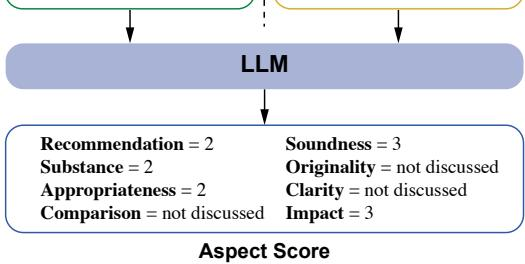
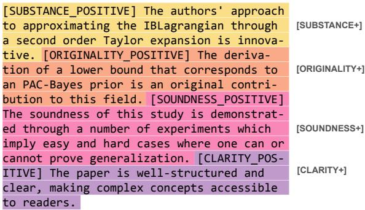
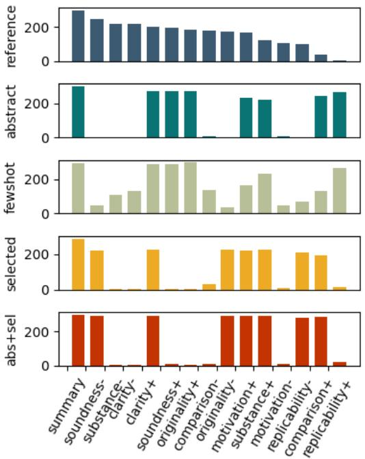
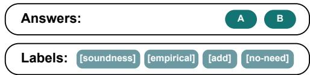
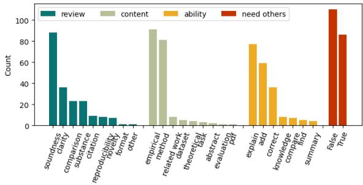

# Is LLM a Reliable Reviewer? A Comprehensive Evaluation of LLM on Automatic Paper Reviewing Tasks

Ruiyang Zhou1 Lu Chen1,2, Kai Yu1,2,

1 X-LANCE Lab, Department of Computer Science and Engineering MoE Key Lab of Artificial Intelligence, SJTU AI Institute Shanghai Jiao Tong University, Shanghai, China Suzhou Laboratory, Suzhou, China {ellenruiyang,chenlusz,kai.yu}@sjtu.edu.cn

# Abstract

The use of large language modes (LM, epecially Chat, tohelp with research has come into pracice. Rehert rely avicendhope btainn-ept ak.Howve, an L  qal a eliablevwrAltoh heaeadis sevra revielatdatast, w workshavcare thorghly pecmode apability reviwerpeciahonessgerate rvs .y eview-evisionmultiple-choicequestions(RR-Cwitdetaile abelfromthereview-rebuttalfo ICLR-Byaskig questins from technical details heoverall preentation and qualiy, urRR-CQat proids a more compleemodel abilityassessment.The results show that  is generally helpful, t re caution is needed as it always makes mistakes. Although it can give passable decisions $( > 6 0 \%$ accuracy) on single options, completely correct answers are still rare (about $20 \%$ ); models are still weak on long paper processing, zero-shot scoring, and giving critical feedback like human reviewers.

Keywords: automatic peer review, large language model, multiple choice question answering

# 1. Introduction

Utilizing large language models for scientific paper review recently attracts researcher's interest. The continuously growing amount of new paper publications, together with the increasing specialization within various research fields makes it a challenge to obtain timely and in-depth feedback. At the same time, LLM demonstrates strong ability in reading comprehension, knowledge integration, and even logical reasoning (OpenAl, 2023). Thus arises naturally this question: can LLM be a qualified and reliable automatic reviewer?

In fact, even before the release of (truly) large language models, there already exist datasets and methods targeting review-related tasks. For example, finetuning pretrained models to predict paper decision and review scores (Li et al., 2020), or using language models to generate review texts (Yuan et al., 2022). Lately, new datasets for review generation and edit generation also appear (D'Arcy et al., 2023), but there is still no detailed assessment of model's reviewing ability.

In this paper, we first examine the reviewing ability of GPT-3.5 and GPT-4 from two perspectives: review aspect score prediction and review generation. The two types of tasks evaluate both the ability to discover flaws in research papers and rectify them, from the granularity level of abstract scoring to detailed commenting. We take great caution during the evaluation process due to the innate difficulty of evaluating freely generated texts: besides classical automatic metrics, new metrics and manual evaluations are also implemented.

We then design a "qualification exam" for finegrained analysis: we construct 196 reviewrevision-related multiple-choice questions. On previous datasets like review generation ones, detailed analyses are only possible when manually examining the generated text, resulting in huge time costs and subjective conclusions. Even with manual analysis, the correctness of generated reviews is still difficult to measure. In contrast, our RR-MCQ dataset with well-defined categorization labels enables comprehensive and satisfactory assessments. The questions are inferred from real discussion forums of 55 reviews from 14 papers in ICLR-2023, investigating both criticizing and correcting abilities. Due to the high cost of designing high-quality questions, we limit the total number of questions to about 200 (196 to be specific).1 Ne come to the following conclusions:

• LLM has the potential to give meaningful scores and decide on individual statements.

However, they are NOT easy to use in practice: seldom fully correct, not critical enough, lack technical details, and struggle with long context.

Automatic similarity metrics do not align with the true review generation quality; the assessment of model reliability is needed.

# 2 Related Work

# 2.1. Paper-reviewing Related Task

Generation task Automatic review generation is the most direct task in using models as automatic reviewers. Datasets like PeerRead (Kang et al., 2018), ASAP (Yuan et al., 2022), ReviewRobot (Wang et al., 2020), MOPRD (Lin et al., 2023), and NLPEER (Dycke et al., 2022) all contain scientific papers (mostly in the domain of computer science) and their corresponding peer reviews. However, since it is difficult to directly generate review texts and evaluate them, various types of annotations have been proposed. The most common label is the sentence type, classified based on the sentence's sentiment polarity, review aspect, or the text aspect that it comments on, for example COMPARE (Singh et al., 2021), ReAct (Choudhary et al., 2021), AMSR (Fromm et al., 2021), COM-PARE (Singh et al., 2021), Peer-Review-Analyze (Ghosal et al., 2022), and AMPERE (Hua et al., 2019). Still, there is no commonly recognized best annotation style and evaluation metric.

Other generation tasks related to reviewing ability also appear, like meta-review generation and edit (revision) generation. The meta-review generation task is more similar to the summarization task, but it summarizes multiple peer reviews in the scientific field. MreD (Shen et al., 2021) is an exemplified meta-review generation task dataset with sentence intent annotations. The revision generation task is more complicated, requiring the ability to comprehend the comment as well as take actions; examples are Revise and Resubmit (Kuznetsov et al., 2022), ArxivEdits (Jiang et al., 2022) and ARIES (D'Arcy et al., 2023).

Classification task Besides directly generating texts, more specific tasks with clear-cut answers are actually more investigated. Paper decision prediction and aspect score prediction are the two most researched tasks before the appearance of large language models, like in PeerRead (Kang et al., 2018). Other reviewing-related tasks include argument extraction in RR (Cheng et al., 2020) and DISAPERE (Kennard et al., 2021), sentence classification (on datasets mentioned above for review generation with annotations).

In this paper, we first evaluate models on both types of existing tasks: the generation task and the classification task. Specifically, we choose to run GPT-3.5 and GPT-4 on the review generation task and aspect score prediction task; the result of

GPT-4 on edit generation is already presented in ARIES (D'Arcy et al., 2023). We then present our RR-MCQ data that inspects all aspects mentioned above.

# 2.2. Large Language Models for Reviewing

Recently, Liu and Shah (2023) inspects GPT-4's ability by constructing a small-sized artificial test dataset. They first create 13 short papers and then design test examples based on these brandnew papers to avoid the data leakage problem. They find that GPT-4 can accomplish the listchecking task, but makes frequent mistakes on error-identifying and paper-ranking tasks. Their detailed analysis is only based on a limited number of manually designed questions; in contrast, our RR-MCQ dataset has more test questions whose distribution basically aligns with reality.

ARIES (D'Arcy et al., 2023) proposes a dataset for comment-edit pairing and edit generation task, but find that even GPT-4 aligns badly the comment and the edit, and that the GPT-4 generated revisions have low coherence and insufficient technical details. However, they do not measure the correctness of generated revisions as it is extremely difficult. Our work turns the freegeneration task into a multiple-choice questionanswering task, making the measurement of correctness easy and automatic. It is like a qualification test for LLM before being an automatic reviewer.

Robertson (2023) tests the usefulness of GPT-4 generated reviews by questioning 10 real users. Very recently, Liang et al. (2023) assess on a larger scale the GPT-4 generated reviews: they tag the comment overlap (hit rate and several other overlap coefficients) and survey the user satisfaction to measure the review quality. They find that the reviews have satisfactory overlap and consistency with human references, but can be nongeneric and emphasize different aspects. Comment overlap is an important indicator, but our RR-MCQ data offers more evaluation perspectivesof the model's ability and reliability.

# 3. Task 1: Aspect Score Prediction

# 3.1. PeerRead Dataset

For the task of aspect score prediction, we use the ICLR-2017 subset of the PeerRead dataset (Kang et al., 2018). This subset contains $1 . 3 \mathsf { k }$ manually annotated aspect scores (ranging from 1 to 5 inclusive) for 427 official reviews from ICLR-2017 conference. The manual annotations ensure the feasibility and consistency of the aspect score prediction task: aspects that are not discussed in the review have a special not discussed score label. See Figure 1 for a concrete example.

Table 1Average results of the aspect score prediction task from GPT-3.5 and GPT-3.5-16k on PeerRead dataset. $\uparrow$ means the higher the metric value, the better the performance. The best result under each setting is bolded, and the best score across all settings is further italicized.   

<table><tr><td colspan="2"></td><td>1. accuracy ↑</td><td>2. |diff| ↓</td><td>3. Pearson ↑</td><td>4. Spearman ↑</td><td>5. Kendall&#x27;s tau ↑</td></tr><tr><td>baseline</td><td>1. most frequent score</td><td>0.404</td><td>0.966</td><td>0.333</td><td>0.340</td><td>0.297</td></tr><tr><td rowspan="3">given review</td><td>2. zero-shot</td><td>0.353</td><td>0.856</td><td>0.548</td><td>0.553</td><td>0.475</td></tr><tr><td>3. few-shot</td><td>0.306</td><td>1.132</td><td>0.651</td><td>0.659</td><td>0.580</td></tr><tr><td>4. MCQ style</td><td>0.336</td><td>1.025</td><td>0.558</td><td>0.565</td><td>0.492</td></tr><tr><td rowspan="4">given paper</td><td>5. abstract</td><td>0.237</td><td>0.992</td><td>0.228</td><td>0.233</td><td>0.195</td></tr><tr><td>6. whole paper (GPT-3.5-16k)</td><td>0.138</td><td>2.132</td><td>0.131</td><td>0.131</td><td>0.109</td></tr><tr><td>7. selected sections</td><td>0.251</td><td>0.886</td><td>0.258</td><td>0.265</td><td>0.222</td></tr><tr><td>8. abstract &amp; sections</td><td>0.330</td><td>0.923</td><td>0.248</td><td>0.249</td><td>0.209</td></tr></table>

Table :Detailed aspect prediction results of GPT-3.5 and GPT-3.5-16k on PeerRead dataset. Numbers ingray colorae values wit p-value arger than .0.is short or Pearon correlatin, Sor Spe correlation, and K for Kendall's tau.   

<table><tr><td rowspan="2" colspan="2"></td><td colspan="3">1. Recommendation</td><td colspan="3">2. Substance</td><td colspan="3">3. Appropriateness</td><td colspan="3">4. Comparison</td></tr><tr><td>P↑</td><td>Sp ↑</td><td>K↑</td><td>P↑</td><td>Sp ↑</td><td>K↑ P↑</td><td>Sp ↑</td><td></td><td>K↑</td><td>P↑</td><td>Sp ↑</td><td>K↑</td></tr><tr><td rowspan="3">given review</td><td>1. zero-shot</td><td>0.826</td><td>0.836</td><td>0.757</td><td>0.394</td><td>0.414</td><td>0.367</td><td>0.473</td><td>0.489</td><td>0.439</td><td>0.393</td><td>0.399</td><td>0.349</td></tr><tr><td>2. few-shot</td><td>0.807</td><td>0.811</td><td>0.733</td><td>0.453</td><td>0.452</td><td>0.413</td><td>0.634</td><td>0.604</td><td>0.558</td><td>0.405</td><td>0.401</td><td>0.353</td></tr><tr><td>3. MCQ style</td><td>0.819</td><td>0.824</td><td>0.744</td><td>0.430</td><td>0.432</td><td>0.382</td><td>0.393</td><td>0.453</td><td>0.392</td><td>0.344</td><td>0.313</td><td>0.273</td></tr><tr><td rowspan="4">given paper</td><td>4. abstract</td><td>0.283</td><td>0.282</td><td>0.25</td><td>0.187</td><td>0.190</td><td>0.166</td><td>0.187</td><td>0.152</td><td>0.129</td><td>-0.023</td><td>-0.031</td><td>-0.028</td></tr><tr><td>whole paper (GPT-3.5-16k)</td><td>0.090</td><td>0.091</td><td>0.080</td><td>0.000</td><td>-0.003</td><td>-0.003</td><td>-0.100</td><td>-0.019</td><td>-0.097</td><td>-0.030</td><td>0.030</td><td>-0.025</td></tr><tr><td>6. selected sections</td><td>-0.076</td><td>-0.081</td><td>-0.072 -0.007</td><td>0.155</td><td>0.131</td><td>0.117 0.046</td><td>0.202</td><td>0.222</td><td>0.197 -0.007</td><td>0.021 0.080</td><td>0.011</td><td>0.009</td></tr><tr><td>7 abstract &amp; sections -0.014</td><td colspan="3">-0.008 5. Soundness</td><td colspan="3">0.032 0.051</td><td colspan="3">0.002 -0.007</td><td colspan="3">0.076 0.068</td></tr><tr><td colspan="2"></td><td colspan="3">Sp ↑</td><td colspan="3">6. Originality</td><td colspan="3">7. Clarity</td><td colspan="3">8. Impact</td></tr><tr><td rowspan="4">given review</td><td></td><td>P↑</td><td></td><td>K↑</td><td>P↑</td><td>Sp ↑</td><td>K↑</td><td>P↑</td><td>Sp ↑</td><td>K↑</td><td>P↑</td><td>Sp ↑</td><td>K↑</td></tr><tr><td>1. zero-shot</td><td>0.585</td><td>0.619</td><td>0.542</td><td>0.507</td><td>0.510</td><td>0.443</td><td>0.626</td><td>0.649</td><td>0.572</td><td>0.445</td><td>0.450</td><td>0.389</td></tr><tr><td>2. few-shot</td><td>0.667</td><td>0.674</td><td>0.610</td><td>0.612</td><td>0.621</td><td>0.545</td><td>0.730</td><td>0.745</td><td>0.676</td><td>0.504</td><td>0.521</td><td>0.460</td></tr><tr><td>3. MCQ style</td><td>0.398</td><td>0.395</td><td>0.355</td><td>0.476</td><td>0.469</td><td>0.409</td><td>0.726</td><td>0.718</td><td>0.644</td><td>0.494</td><td>0.493</td><td>0.436</td></tr><tr><td rowspan="4">given paper</td><td>4. abstract</td><td>0.120</td><td>0.117</td><td>0.104</td><td>0.118</td><td>0.119</td><td>0.098</td><td>0.172</td><td>0.171</td><td>0.151</td><td>0.109</td><td>0.113</td><td>0.097</td></tr><tr><td>5. whole paper (GPT-3.5-16k)</td><td>0.052</td><td>0.064</td><td>0.057</td><td>0.095</td><td>0.103</td><td>0.085</td><td>-0.082</td><td>-0.091</td><td>-0.081</td><td>0.069</td><td>0.086</td><td>0.071</td></tr><tr><td>6. selected sections</td><td>0.008</td><td>0.016</td><td>0.014</td><td>0.197</td><td>0.189</td><td>0.157</td><td>0.081</td><td>0.105</td><td>0.093</td><td>0.088</td><td>0.075</td><td>0.066</td></tr><tr><td>7. abstract &amp; sections</td><td>0.157</td><td>0.183</td><td>0.162</td><td>0.084</td><td>0.079</td><td>0.067</td><td>0.112</td><td>0.143</td><td>0.128</td><td>0.118</td><td>0.109</td><td>0.097</td></tr></table>

# Setting 1: Given Review

# Setting 2: Given Paper

The exposition is OK, and I think the approach is sensible, but the main issue with this paper is that it is lacking experiments on non-synthetic datasets. As such, while I find the graphics inspired questions the paper is investigating interesting, I don't think it is clear that this work introduces useful machinery for modeling more general videos. I think this paper is more appropriate as a workshop contribution in its current form.

Title: Perception Updating Networks: On Architectural Constraints For Interpretable Video Generative Models Abstract: We investigate a neural network architecture and statistical framework that... Section 1 Introduction: The current computer graphics pipelines... Section 3 Perception Updating Networks: This Section proposes a family of neural architectures for optimizing...

  
Figure 1: Example of the aspect score prediction task. We conduct experiments under two settings: given the review or the paper to predict scores.

We conduct experiments under two different settings: (1) given human-written review, predict aspect scores; (2) given (part of) the research paper,

<table><tr><td></td><td>accuracy ↑</td><td>|diff ↓</td><td>Pearson ↑</td><td>Spearman ↑</td><td>Kendall&#x27;s tau ↑</td></tr><tr><td>most freq</td><td>0.317</td><td>0.813</td><td>0.628</td><td>0.630</td><td>0.560</td></tr><tr><td>all 1</td><td>0.314</td><td>0.952</td><td>0.522</td><td>0.525</td><td>0.459</td></tr><tr><td>all 5</td><td>0.337</td><td>0.822</td><td>0.546</td><td>0.539</td><td>0.476</td></tr></table>

Table 3: Average results of "only given abstract" method on 100 randomly chosen examples from PeerRead dataset. "most freq" means using the most frequent reference score for each aspect in the prompt example; similarly, "all 1" and "all 5" mean setting all scores in the prompt example to 1 and 5.

predict scores.

# 3.2. Setting 1: Given Review, Predict Scores

Tests under the Setting 1 can be viewed as a review reading comprehension task, targeting questions: are model-generated scores meaningful? Are they consistent with the text? Can models understand human-written reviews? In addition, we take into consideration the influence of prompt style and content extraction methods. For Setting 1, we try zero-shot / few-shot, direct scoring / multiple-choice style scoring, and different example distributions.

Besides classical metrics accuracy and absolute difference for the score prediction task, we also calculate the correlation indicators of Pearson, Spearman, and Kendall's tau. The three correlation metrics are the common choice when evaluating the score prediction ability of unfinetuned models, as in the work of using LLM to evaluate abstractive summaries (Shen et al., 2023) and machine translations (Kocmi and Federmann, 2023).

If not specially marked, all models are of version 0613 with temperature 0.3, for example GPT-3.5- turbo-0613 in this section.

LLM can infer scores from reviews. As shown in Table 1 (column 3 Pearson), when predicting scores given the review, GPT-3.5 achieves a good correlation with humans (0.651 Pearson correlation value under the few-shot setting, while the baseline is only about 0.3). Even under the most difficult zero-shot setting (line 2 zero-shot & column 345), its correlations are still satisfactory (above 0.5). This indicates that GPT-3.5 can understand human-written reviews, distinguish emotions, and give consistent scores.

Another result worth noticing is that the multiplechoice question style prompting does not help much (line 4 MCQ style). In the MCQ style prompt, we write specific scoring criteria for each score in each aspect but only obtain a small performance gain compared to zero-shot prompting. We may conclude that GPT-3.5 already knows the rules and can inherently give meaningful scores.

# 3.. Setting 2: Given Paper, Predict Scores

Experiments under the Setting 2 really assess model's capability to be a reviewer, answering our main research question. Under this task setting, we try three types of input for LLM: only abstract, selected sections, and the whole paper (for GPT-3.5-16k).

aspect in Table 2 column 1). However, it struggles in judging [Comparison] (column 4) whether the paper presents enough meaningful comparisons with related work, [Substance] (column 2) whether it contains lots of ideas and results, and [Impact] (column 8) whether it is influential and helpful to this field. We may attribute the difficulty to the need of extra scientific knowledge and details, as all three aspects require a rich understanding of the field.

However, we cannot exclude the possibility of using memorized data to successfully predict the [Recommendation] score (data leakage), as this score is the easiest to infer from other factors and the PeerRead dataset uses ICLR-2017 papers. Therefore, we present a more detailed examination of model's ability in Section 5 on our MCQ test data.

We justify the choice of prompt example in Table 3. Using the most frequent score of each aspect in the prompt has the best result, but the influence is not decisive, as the variance among the three prompts' results is small. Therefore, we use the "most frequent" score in the prompt example for all experiments in this section.

# 4 Task 2: Review Generation

# 4.1. ASAP dataset

For the task of review generation, we use the ICLR-2020 subset of the ASAP dataset (Yuan et al., 2022). Review sentences in this subset are labeled by their aspect: summary, motivation, originality, soundness, substance, replicability, meaningful comparison, clarity; each is further classified into positive and negative, except summary. We randomly select 300 papers from this subset with 902 corresponding official peer reviews to test model's review generation ability. An example of GPT-4 generated review is shown in Figure 2.

LLM fails to predict scores directly from papers. Unlike predicting scores given the review, when only given (part of) the research paper, GPT-3.5 struggles to generate reasonable scores. The bottom half (line 5678) of Table 1 shows that GPT-3.5 only has 0.258 best Pearson correlation, even lower than the baseline. The particularly poor performance of GPT-3.5-16k (line 6) with correlations lower than 0.2 gives us another indication: simply injecting long texts is not the way out, especially complex long texts like research papers.

  
Figure 2: Example review generated by GPT-4. The sentence aspect label is part of the generation and is put at the beginning of each sentence. A special [None] label is added if the sentence does not belong to any other types.

LLM predicts well the final [recommendation] score, but not scores of [comparison], [impact], and [substance] that are knowledgeand logic-demanding. GPT-3.5 gains especially high correlations in predicting [Recommendation] scores under both settings (Pearson correlation $0 . 8 2 6 \& \ 0 . 2 8 3$ , see detailed results for each

# 4.2. Experiments and Results

As in the aspect score prediction test in Section 3, we try zero-shot / few-shot prompting and different content extraction methods in the two-step generation experiment. We present both the performance of GPT-3.5-turbo-0613 and GPT-4-0613 for the review generation task. Besides, we focus more on the evaluation method for model-generated review texts.

We examine the quality from the following perspectives. (1) Aspect coverage, thanks to the aspect annotations in ASAP dataset. (2) Similarity to reference reviews, including the classical statistical methods ROUGE-1/2/L (Lin, 2004), the modelbased method BertScore (Zhang et al., 2019), the task-based reference-free metric BLANC (Vasilyev et al., 2020), and using GPT-4 to score the similarity as in the evaluation of abstractive summaries (Shen et al., 2023) and of translation quality (Kocmi and Federmann, 2023). (3) Manual analysis for similarity and informativeness (whether containing enough details) proposed by Yuan and Liu (2022) in KID-Review.

Here are some implementation details. GPT-3.5 is used for 300 randomly selected papers from ASAP, whose results are auto-evaluated in Figure 3 and Table 5; GPT-4 is used for 50 papers and the results are manually examined in Table 6. The reason for only choosing 50 papers for GPT-4 is that, the generation is expensive and that the manual analysis has also a high cost. For the twostep generation experiment, the section extraction step outputs the union of contents that are selected based on each review (most papers have three reference reviews), and the union of useful contents is input into the model to generate one review. During the evaluation, the best similarity score is selected among all references for ROUGE and BertScore; for BLANC, all reference reviews are concatenated to form the new reference.

LLM has its own comment aspect preference: too much positive feedback. In Figure 3, it is clear that GPT-3.5 has its own preference of aspects to comment on: it always generates positive reviews while being very cautious about negative aspects. For each setting, the proportion of positive feedback (exclude [Summary]) is always larger than $5 5 \%$ (reference labels are only $43 \%$ positive). Especially when only given the abstract, $9 9 \%$ comments are positive. In addition, [Substance-] and [Clarity-] are always missing in all four experiment settings.

Few-shot prompting helps GPT-3.5 to generate more negative comments, but the distribution is still very different from reality. We regard this as a strong weakness for GPT-3.5 being a reviewer because well-supported critics are the most helpful for researchers.

  
Figure 3: Aspect label distribution of reference reviews and model-generated reviews on ASAP dataset. "+ / -" means positive/ negative comments, except that [summary] is always neutral. Reference label distribution comes from the union of all reviews for each paper.

The aspect recall value in Table 5 (column 1 aspect) also indicates that both GPT-3.5 and GPT-4 have very different comment preferences from humans. Although their best aspect coverage rate (0.582) is better than humans (0.499), the highest aspect recall is still unsatisfactory (0.559). Even under the few-shot prompt setting (line 2 few-shot), this value is still low (0.506), showing that LLM cannot naturally generate comments of people's interest.

Automatic metrics can be fooled by LLM's generation. In Table 4, to better examine the review generation quality, we try using GPT-4 as an evaluator to predict the relevance, precision, and recall score (between 0 and 100). We also manually score (also between 0 and 100) the 50 reviews generated by GPT-4-0613 when given both the abstract and selected sections. We focus on two perspectives for quality evaluation: (1) relevance to reference reviews; (2) amount of details in the review (informativeness).

During the process of manual inspection, we find that GPT-4 generated reviews are strongly influenced by the given paper content and lack critics, while reference reviews contain lots of detailed suggestions. This is why the manual score is low, 54.5 for relevance and 48.7 for informativeness. However, the manual score (and also our actual impression) is very different from BertScore (always above 0.8): is BertScore fooled by the fluent generation? Thus, we compute the correlation between every automatically computed similarity score and our manual annotations in Table 6. As expected, BertScore has the worst correlation (-0.003 and - 0.024), showing that BertScore is fooled by GPT-4 generated texts.

Table 4: "GPT-4 as review quality evaluator" predicted scores and manually annotated scores for the 50 GPT-4 generated reviews.   

<table><tr><td rowspan="2">GPT-4 predicted</td><td>relevance ↑</td><td>precision ↑</td><td>recall ↑</td></tr><tr><td>83.8</td><td>84.7</td><td>75.8</td></tr><tr><td rowspan="2">manually scored</td><td>relevance ↑</td><td>informativeness ↑</td><td></td></tr><tr><td>54.5</td><td>48.7</td><td></td></tr></table>

Automatic metrics that best correspond to humans are BLANC and GPT-4. BLANC is designed for noreference summary evaluation, but here we consider the generated review as a summary of all reference reviews. BLANC uses the performance gain on the blank-filling task as the indicator: if a summary can help its model to complete the original task, then the summary is considered of good quality. This metric truly tests the amount of information contained in the summary and is difficult to be fooled by fluent but hollow sentences.

In conclusion, GPT-4 does not naturally provide enough details and critics; automatic similarity metrics can be unaware of the flaws. Since it is still difficult to evaluate model-generated reviews, we use our RR-MCQ data in Section 5, a more objective and detailed approach to evaluation.

# 5. Task 3: Review-Revision Multiple-Choice Questions

The experiments of aspect score prediction and review generation above do give us an idea of model's reviewing ability. Moreover, GPT-4 has also been tested on the edit generation task in ARIES (D'Arcy et al., 2023)." They manually annotate 85 generated examples from the following perspectives: compliance (1-3), promise (true/false), paraphrase (true/false), and technical details (true/false). They find that GPT-4 has high compliance( $9 4 \%$ are scored 3), but tends to make promises $(2 1 \% )$ , simply paraphrase the comment $(4 8 \% )$ , and lacks technical details $( 12 \% )$ .

One evident drawback of the previous analyses is that, all detailed results require heavy manual inspection while automatic metrics are not reliable enough (see Section 4.2). Therefore, we propose a review-revision multiple-choice question dataset (RR-MCQ) with abundant labels, containing questions related to both the review and revision with one or more correct answers.

# 5.1. RR-MCQ Data Construction and Characteristics

# Question:

What experiments could be added to illustrate the proposed method's effectiveness?

# Options:

A. change the similarity threshold B. use the same examples for different models C. use randomly sampled examples for different models D. do not use the similarity threshold

  
Figure 4: Example of the multiple-choice question with one or more answers. We randomly shuffle the four options during the experiment.

Our RR-MCQ dataset is targeted for a more specific and in-depth assessment. For example, can models evaluate the soundness of argumentation? Can they integrate domain knowledge and the paper together? Can they give complicated suggestions, such as important experiments to do?

The dataset contains 196 multiple-choice questions examining specific review-revision-related knowledge and ability. An example of the RR-MCQ is presented in Figure 4.

To construct the MCQ test dataset, we select 55 reviews from 14 papers with sufficient commentresponse posts in the peer review forum from the ICLR-2023 conference. We then perform the following four steps: (1) align the smallest unit of comment and response to form a single argument; (2) identify its main topic and decide if controversial (we skip arguments on which the two sides sharply disagree); (3) transform the argument into a fourchoice question without adding new contents, i.e. wrong options either come from irrelevant parts of the same discussion or are the negation of correct ones; (4) label the aspects being assessed by the question.

There are four types of labels corresponding to four ways of categorization: review aspect, content aspect, ability to be tested, if need information from other papers. Figure 5 presents the label distribution, which basically corresponds to the review comment distribution in reality. The labels are assigned by two experienced students in the domain. Among all the 788 annotated labels, 86 labels $( 1 0 . 9 \% )$ have disagreement at first. The final decision is made through a careful discussion of the two annotators.

Table 5: Automatic evaluation of GPT-3.5 (300 examples) and GPT-4 (50 examples) generated reviews on ASAP dataset. GPT-4 results are noted with \* because they are averaged over 50 examples.   

<table><tr><td rowspan="2"></td><td rowspan="2"></td><td colspan="2">1. aspect (macro avg)</td><td colspan="3">2. ROUGE-F1 (macro avg)</td></tr><tr><td>ref coverage ↑ coverage ↑</td><td>recall↑</td><td>R-1 ↑</td><td>R-2↑</td><td>R-L ↑</td></tr><tr><td rowspan="2">abstract</td><td>1. zero-shot</td><td>0.499</td><td>0.034 0.065</td><td>0.429</td><td>0.103</td><td>0.190</td></tr><tr><td>2. few-shot</td><td>0.499</td><td>0.582 0.506</td><td>0.424</td><td>0.108</td><td>0.198</td></tr><tr><td rowspan="2">paper</td><td>3. selected sections</td><td>0.499 0.367</td><td>0.449</td><td>0.382</td><td>0.081</td><td>0.176</td></tr><tr><td>4abstract &amp; sections</td><td>0.499 0.470</td><td>0.559</td><td>0.431</td><td>0.106</td><td>0.193</td></tr><tr><td>GPT-4*</td><td>5. abstract &amp; sections</td><td>0.488* 0.515*</td><td>0.530*</td><td>0.425*</td><td>0.100*</td><td>0.190*</td></tr><tr><td rowspan="2"></td><td></td><td>3. BertScore (macro avg)</td><td></td><td>4. BLANC</td><td></td><td></td></tr><tr><td></td><td>precision ↑ recall ↑</td><td>F1↑</td><td>average ↑</td><td>variance</td><td></td></tr><tr><td rowspan="2">abstract</td><td>1. zero-shot</td><td>0.855</td><td>0.835 0.843</td><td>0.098</td><td>0.001</td><td></td></tr><tr><td>2. few-shot</td><td>0.851</td><td>0.839 0.843</td><td>0.114</td><td>0.001</td><td></td></tr><tr><td rowspan="2">paper</td><td>3. selected sections</td><td>0.843</td><td>0.832 0.835</td><td>0.093</td><td>0.001</td><td></td></tr><tr><td>abstract &amp; sections</td><td>0.845</td><td>0.840 0.841</td><td>0.126</td><td>0.001</td><td></td></tr><tr><td>GPT-4*</td><td>5. abstract &amp; sections</td><td>0.851*</td><td>0.840* 0.843*</td><td>0.112*</td><td>0.001*</td><td></td></tr></table>

Table 6: Pearson correlation values between automatic evaluation metrics and manually annotated review quality labels for the 50 GPT-4 generated reviews.   

<table><tr><td></td><td>relevance</td><td>informativeness</td></tr><tr><td>aspect-recall</td><td>0.076</td><td>0.227</td></tr><tr><td>Rouge1-F1</td><td>0.115</td><td>0.159</td></tr><tr><td>Rouge2-F1</td><td>0.039</td><td>0.111</td></tr><tr><td>RougeL-F1</td><td>0.167</td><td>0.124</td></tr><tr><td>BertScore-F1</td><td>-0.003</td><td>-0.024</td></tr><tr><td>BLANC-avg</td><td>0.255</td><td>0.355</td></tr><tr><td>GPT4-avg</td><td>0.325</td><td>0.244</td></tr></table>

  
Figure 5: Label distribution of our RR-MCQ test data. There are 4 types of labels: review aspect, content aspect, ability, and if need information from other papers.

# 5.2. Experiments and Results

We test both GPT-3.5-turbo-0613 and GPT-4-0613 on our MCQ data. The two-step generation method is similar to that of Section 4: the model selects useful sections based on the given question, then the selected contents are input into the model to predict answers. Note that our multiplechoice questions may have more than one correct answer.

LLM gets passable micro accuracy, but bad macro accuracy. From Table 7, the best micro accuracy 0.710 comes from the GPT-4 -> GPT-4 method. It is a passable score, but the macro accuracy is not ideal: the best macro accuracy is only 0.276. The micro accuracy is calculated by considering each question option as an individual example so that the MCQ task becomes a binary decision task of determining True/False for each option. The macro accuracy is more strict: only when all answers are correct, the question is marked as correct (note that the number of correct options is undetermined, between one and four).

In addition, the precision and recall are balanced. We can conclude that GPT-4 is able to judge the correctness of each individual statement with about $70 \%$ accuracy, but this level of ability is insufficient for giving completely correct answers: errors and omissions are frequent.

LLM struggles with tasks that relate to soundness and adding components. We select the top 2 numerous labels in each of the 4 label categories and present the detailed results in Table 8. As our questions are inferred from the true peer review discussion forum (containing both the review and the response), these types of questions are also the most common in reality. Therefore, model's performance on these questions is important and representative.

In Table 8, [Explain] related questions have the highest macro accuracy (by comparing the bold number in "accuracy" through all eight aspects). These types of questions come from discussions to confirm an understanding or ask a detail, somehow similar to reading comprehension and essay expansion tasks. It does not require much logical reasoning, but lots of knowledge and inference ability.

Table 7:Results on RR-MCQ test data. "GPT-4 -> GPT-3.5" means using GPT-4 for the first section selection step and then using GPT-3.5 for the second answer generation step.   

<table><tr><td rowspan="2"></td><td colspan="4">macro average</td><td colspan="4">micro average</td></tr><tr><td>accuracy ↑</td><td>precision ↑</td><td>recall ↑</td><td>F1↑</td><td>accuracy ↑</td><td>precision ↑</td><td>recall ↑</td><td>F1↑</td></tr><tr><td>GPT-3.5 -&gt; GPT-3.5</td><td>0.128</td><td>0.332</td><td>0.376</td><td>0.176</td><td>0.569</td><td>0.583</td><td>0.373</td><td>0.227</td></tr><tr><td>GPT-4 -&gt; GPT-3.5</td><td>0.214</td><td>0.553</td><td>0.586</td><td>0.285</td><td>0.648</td><td>0.644</td><td>0.603</td><td>0.311</td></tr><tr><td>GPT-4 -&gt; GPT-4</td><td>0.276</td><td>0.665</td><td>0.666</td><td>0.330</td><td>0.710</td><td>0.6699</td><td>00.701</td><td>0.350</td></tr></table>

<table><tr><td></td><td colspan="2">1. Soundness</td><td colspan="3">2. Clarity</td><td colspan="3">3. Empirical</td><td colspan="3">4. Method</td></tr><tr><td>macro average</td><td>acc ↑</td><td>prec ↑</td><td>recall ↑</td><td>acc ↑ prec ↑</td><td>recall ↑</td><td>acc ↑</td><td>prec ↑</td><td>recall ↑</td><td>acc ↑</td><td>prec ↑</td><td>recall ↑</td></tr><tr><td>GPT-3.5 -&gt; GPT-3.5</td><td>0.091</td><td>0.293</td><td>0.307</td><td>0.194 0.356</td><td>0.454</td><td>0.055</td><td>0.267</td><td>0.308</td><td>0.173</td><td>0.391</td><td>0.458</td></tr><tr><td>GPT-4 -&gt; GPT-3.5</td><td>0.205</td><td>0.526</td><td>0.552</td><td>0.278 0.498</td><td>0.560</td><td>0.209</td><td>0.573</td><td>0.597</td><td>0.247</td><td>0.564</td><td>0.598</td></tr><tr><td>GPT-4 -&gt; GPT-4</td><td>0.193</td><td>0.655</td><td>0.673</td><td>0.361 0.514</td><td>0.509</td><td>0.253</td><td>0.713</td><td>0.695</td><td>0.309</td><td>0.617</td><td>0.654</td></tr><tr><td></td><td></td><td>5. Explain</td><td></td><td></td><td>6. Add</td><td></td><td>7. No need</td><td></td><td></td><td>8. Need</td><td></td></tr><tr><td>macro average</td><td>acc ↑</td><td>prec ↑</td><td>recall ↑</td><td>acc ↑</td><td>prec ↑</td><td>recall ↑</td><td>acc ↑</td><td>prec ↑</td><td>recall ↑</td><td>acc ↑ prec ↑</td><td>recall↑</td></tr><tr><td>GPT-3.5 -&gt; GPT-3.5</td><td>0.182</td><td>0.374</td><td>0.384</td><td>0.051 0.284</td><td>0.336</td><td>0.118</td><td>0.295</td><td>0.358</td><td>0.140</td><td>0.380</td><td>0.400</td></tr><tr><td>GPT-4 -&gt; GPT-3.5</td><td>0.247</td><td>0.573</td><td>0.534</td><td>0.203</td><td>0.586 0.609</td><td>0.227</td><td>0.523</td><td>0.549</td><td>0.198</td><td>0.591</td><td>0.634</td></tr><tr><td>GPT-4 -&gt; GPT-4</td><td>0.364</td><td>0.67</td><td>0.626</td><td>0.153</td><td>0.694 0.757</td><td>0.291</td><td>0.602</td><td>0.647</td><td>0.256</td><td>0.724</td><td>0.691</td></tr></table>

Table 8:Detailed results on RR-MCQ test data. For each label category, we present only the detailed results for the top two labels with the most elements.

# Question [Soundness]:

Which choice the author makes may hurt the final performance but is not well-examined in the paper?

# Options:

A. linearize the RNN module   
B. use a learnable gate   
C. combine RNN and self-attention   
D. REM endows positional encodings of a   
multi-head self-attention with recurrent   
dynamics

Answers:

The lowest macro accuracy appears in questions of labels [Soundness] and [Add] (note that one question may have both the [Soundness] and [Add] labels because they mark different perspecttives).

An example of [Soundness] question is shown in Figure 6. The review aspect label [Soundness] concerns questions requiring strong logic, for example, the correctness of a statement, the validity of an argument, or the completeness of supporting evidence. In the example above, the model needs to first identify whether the choice is influential, and then decide if it is well-examined in the paper.

An example of [Add] question is shown in Figure 7.

# Question [Add]:

What possible experiments can be added to present the method's usefulness ?

# Options:

A. compare to linear freezing and AutoFreeze B. try DeiT-T model on ImageNet dataset C. try Bert model on MRPC dataset D. try Bert model on CoLA dataset

  
Figure 6: Example question of label [Soundness].   
Figure 7: Example question of label [Add].

The tested ability label [Add] relates to adding components to the paper, for example, conducting an extra experiment or citing a missing related work. Its difficulty comes from the need for both logic and knowledge. Although possible options to be added are already provided in the question, the model still has to carefully select truly necessary ones. In the example question above, GPT-4 fails to understand that the first option is already in the paper and that the second option is needed to prove method's effectiveness on other model architectures.

# 6. Conclusion

"Can LLM be a qualified and reliable automatic reviewer?" After testing GPT-3.5 and GPT-4 on two existing datasets and also on our proposed RR-MCQ data, we conclude that they are not naturally reliable automatic reviewers because their error rate is still not sufficiently low.

They can generate meaningful scores based on human-written reviews, even without explicitly giving examples or scoring criteria; but when the input is long and complicated like a whole research paper, they can only roughly identify the quality. When being asked to freely generate comments, their suggestions are sometimes correct, but always on aspects that human reviewers would not be interested in. Facing multiple-choice questions, they have the ability to make passable decisions on single options, but hardly to be completely correct .

We claim that it is still too early to trust LLM as automatic scientific paper reviewer. Although there is a chance to get useful and correct results, their current capability is not reliable enough. Especially on questions requiring logic reasoning over long texts or extra knowledge in detail, their performance is still unsatisfactory.

We believe that in detail and in-depth evaluations are needed before the targeted development of LLM in automatic paper reviewing task. Our RR-MCQ test dataset is an example, but still with limited size. Future work could be to develop better data construction methods, to invent new metrics, and finally to improve LLM's capability as a reviewer.

# 7. Acknowledgements

This work was supported by the National Key R&D Program of China 2023ZD0120703 and the China NSFC Projects (U23B2057, 62106142 and 62120106006) and Shanghai Municipal Science and Technology Major Project (2021SHZDZX0102).

# 8. Bibliographical References

Liying Cheng, Lidong Bing, Qian Yu, Wei Lu, and Luo Si. 2020. Ape: Argument pair extraction from peer review and rebuttal via multi-task learning. In Proceedings of the 2020 Conference on Empirical Methods in Natural Language Processing (EMNLP), pages 70007011.

Gautam Choudhary, Natwar Modani, and Nitish Maurya. 2021. React: A re view comment dataset for act ionability (and more). In Web Information Systems Engineering-WISE 2021: 22nd International Conference on Web Information Systems Engineering, WISE 2021, Melbourne, VIC, Australia, October 2629, 2021, Proceedings, Part II 22, pages 336343. Springer.

Mike D'Arcy, Alexis Ross, Erin Bransom, Bailey Kuehl, Jonathan Bragg, Tom Hope, and Doug

Downey. 2023. Aries: A corpus of scientific paper edits made in response to peer reviews. arXiv preprint arXiv:2306.12587.

Nils Dycke, Ilia Kuznetsov, and Iryna Gurevych. 2022. Nlpeer: A unified resource for the computational study of peer review. arXiv preprint arXiv:2211.06651.

Michael Fromm, Evgeniy Faerman, Max Berrendorf, Siddharth Bhargava, Ruoxia Qi, Yao Zhang, Lukas Dennert, Sophia Selle, Yang Mao, and Thomas Seidl. 2021. Argument mining driven analysis of peer-reviews. In Proceedings of the AAAI Conference on Artificial Intelligence, volume 35, pages 47584766.

Tirthankar Ghosal, Sandeep Kumar, Prabhat Kumar Bharti, and Asif Ekbal. 2022. Peer review analyze: A novel benchmark resource for computational analysis of peer reviews. Plos one, 17(1):e0259238.

Xinyu Hua, Mitko Nikolov, Nikhil Badugu, and Lu Wang. 2019. Argument mining for understanding peer reviews. arXiv preprint arXiv:1903.10104.

Chao Jiang, Wei Xu, and Samuel Stevens. 2022. arxivedits: Understanding the human revision process in scientific writing. arXiv preprint arXiv:2210.15067.

Dongyeop Kang, Waleed Ammar, Bhavana Dalvi, Madeleine Van Zuylen, Sebastian Kohlmeier, Eduard Hovy, and Roy Schwartz. 2018. A dataset of peer reviews (peerread): Collection, insights and nlp applications. arXiv preprint arXiv:1804.09635.

Neha Kennard, Tim O'Gorman, Rajarshi Das, Akshay Sharma, Chhandak Bagchi, Matthew Clinton, Pranay Kumar Yelugam, Hamed Zamani, and Andrew McCallum. 2021. Disapere: A dataset for discourse structure in peer review discussions. arXiv preprint arXiv:2110.08520.

Tom Kocmi and Christian Federmann. 2023. Large language models are state-of-the-art evaluators of translation quality. arXiv preprint arXiv:2302.14520.

Ilia Kuznetsov, Jan Buchmann, Max Eichler, and Iryna Gurevych. 2022. Revise and resubmit: An intertextual model of text-based collaboration in peer review. Computational Linguistics, 48(4):949986.

Jiyi Li, Ayaka Sato, Kazuya Shimura, and Fumiyo Fukumoto. 2020. Multi-task peer-review score prediction. In Proceedings of the First Workshop on Scholarly Document Processing, pages 121 126.

Weixin Liang, Yuhui Zhang, Hancheng Cao, Binglu Wang, Daisy Yi Ding, Xinyu Yang, Kailas Vodrahalli, Siyu He, Daniel Scott Smith, Yian Yin, et al. 2023. Can large language models provide useful feedback on research papers? a large-scale empirical analysis. arXiv preprint arXiv:2310.01783.

Chin-Yew Lin. 2004. Rouge: A package for automatic evaluation of summaries. In Text summarization branches out, pages 7481.

Jialiang Lin, Jiaxin Song, Zhangping Zhou, Yidong Chen, and Xiaodong Shi. 2023. Moprd: A multidisciplinary open peer review dataset. Neural Computing and Applications, pages 116.

Ryan Liu and Nihar B Shah. 2023. Reviewergpt? an exploratory study on using large language models for paper reviewing. arXiv preprint arXiv:2306.00622.

OpenAl. 2023. Gpt-4 technical report.

Zachary Robertson. 2023. Gpt4 is slightly helpful for peer-review assistance: A pilot study. arXiv preprint arXiv:2307.05492.

Chenhui Shen, Liying Cheng, Yang You, and Lidong Bing. 2023. Are large language models good evaluators for abstractive summarization? arXiv preprint arXiv:2305.13091.

Chenhui Shen, Liying Cheng, Ran Zhou, Lidong Bing, Yang You, and Luo Si. 2021. Mred: A meta-review dataset for structurecontrollable text generation. arXiv preprint arXiv:2110.07474.

Shruti Singh, Mayank Singh, and Pawan Goyal. 2021. Compare: a taxonomy and dataset of comparison discussions in peer reviews. In 2021 ACM/IEEE Joint Conference on Digital Libraries (JCDL), pages 238241. IEEE.

Oleg Vasilyev, Vedant Dharnidharka, and John Bohannon. 2020. Fill in the blanc: Humanfree quality estimation of document summaries. arXiv preprint arXiv:2002.09836.

Qingyun Wang, Qi Zeng, Lifu Huang, Kevin Knight, Heng Ji, and Nazneen Fatema Rajani. 2020. Reviewrobot: Explainable paper review generation based on knowledge synthesis. arXiv preprint arXiv:2010.06119.

Weizhe Yuan and Pengfei Liu. 2022. Kid-review: Knowledge-guided scientific review generation with oracle pre-training. In Proceedings of the AAAI Conference on Artificial Intelligence, volume 36, pages 1163911647.

Weizhe Yuan, Pengfei Liu, and Graham Neubig. 2022. Can we automate scientific reviewing? Journal of Artificial Intelligence Research, 75:171212.

Tianyi Zhang, Varsha Kishore, Felix Wu, Kilian Q Weinberger, and Yoav Artzi. 2019. Bertscore: Evaluating text generation with bert. arXiv preprint arXiv:1904.09675.

# A. Prompt

# A.1. Evaluation on PeerRead

Setting 1 Given review, predict scores.

Prompt You are a professional reviewer in computer science and machine learning. Based on the given review, you need to predict the review score in several aspects. Choose a score from [1,2,3,4,5], higher score means better paper quality.

Zero-Shot Example Example output: RECOM-MENDATION: x, SUBSTANCE: x, APPROPRI-ATENESS: x, MEANINGFU COMPARISON: x, SOUNDNESS CORRECTNESS: x, ORIGINAL-ITY: x, CLARITY: x, IMPACT: x

Few-Shot Example Example1: Review: This paper presents an approach to modeling videos based on a decomposition into a background ... workshop contribution in its current form. Output: RECOMMENDATION: 2, SUBSTANCE: 2, AP-PROPRIATENESS: 2, SOUNDNESS CORRECT-NESS: 3, IMPACT: 3 . Example2 ... Example5 ..

MCQ-Style Example RECOMMENDATION: A. This paper changed my thinking on this topic and I'd fight to get it accepted; B. I learned a lot from this paper and would like to see it accepted. C. Borderline: I am ambivalent about this one. D. Leaning against: I would rather not see it in the conference. E. Poor: I would fight to have it rejected.

Setting 2 Given paper, predict scores.

Prompt You are a professional reviewer in computer science and machine learning. Based on the given abstract/sections/paper, you need to predict the review score in several aspects. Choose a score from [1,2,3,4,5], higher score means better paper quality.

# A.2. Evaluation on ASAP

Setting 1 Given paper, generate review text.

Prompt You are a professional reviewer in computer science and machine learning. Based on the given title and abstract of a research paper, you need to write a review in ICLR style. At the same time, you need to tag sequences of words with their review type at the beginning: [NONE], [SUMMARY], [MO-TIVATION POSITIVE], [MOTIVATION NEGA-TIVE]], [SUBSTANCE POSITIVE], [SUBSTANCE NEGATIVE], [ORIGINALITY POSITIVE], [ORIGI-NALITY NEGATIVE], [SOUNDNESS POSITIVE], [SOUNDNESS NEGATIVE], [CLARITY POSI-TIVE], [CLARITY NEGATIVE], [REPLICABILITY POSITIVE], [REPLICABILIT NEGATIVE], [MEAN-INGFUL COMPARISON POSITIVE], [MEANING-FUL COMPARISON NEGATIVE]. Your total output should not surpass 500 tokens.

Zero-Shot Example Example output: [LABEL] sequence. [LABEL] sequence. [LABEL] sequence...

Few-Shot Example Example1: [SUM-MARY]This paper introduces a method to disentanglement the private and public attribute information... Example2: [SUMMARY]The paper proposes learning NN to correct for inaccuracies... Example3: [SUMMARY]This paper describes a method for segmenting 3D point clouds... Example4: [SUMMARY]This work introduces GQ-Net , a novel technique that trains quantization friendly networks...

Setting 2 Given reference reviews, evaluate the generated review quality.

Prompt Score the following review step by step with respect to its relevance with reference reviews on a continuous scale from 0 to 100. You should give a relevance score, a precision score and a recall score of the review to be scored. Relevance measures its selection of important content from references, where relevance $\mathtt { \mathtt { = 0 } }$ means 'no meaning preserved' and relevance $\yen 100$ means 'perfect meaning'. Precision measures its correctness with respect to references, and recall measures its information coverage with respect to references. Output format: Score for the review to be scored:relevance ${ \tt = } \tt X$ , precision $\mathbf { \tau } = \mathbf { x }$ , recall $\mathsf { \Pi } = \mathsf { X }$ .

# A.3. Evaluation on RR-MCQ

Setting 1 Given question and paper, select useful sections.

Prompt You are a professional reviewer in leywords. You will be given a multiple choice question and the headings of a research paper in this field. You need to select sections that are useful to anwer the question.

Setting 2 Given selected sections, predict answers.

Prompt You are a professional reviewer in keywords. You will be given some sections extracted from a paper in this domain. Based on the given context, you need to answer the following multiple choice question. You should select one or more answer choices from A, B, C, D.

# B. Labeling Principle

# B.1. Review aspect

[Soundness] Questions related to the soundness of claims, supporting materials and mathematical results.   
•[Clarity] Questions of requesting more explanations.   
[Comparison] Questions related to the comparison with related work: whether it is precise and complete.   
[Substance] Questions to evaluate the number of new ideas, results and the amount of work.   
[Citation] Specific questions of citations without much comparison.   
[Reproducibility] Questions about code availability, settings and hyperparameters. [Novelty] Questions to evaluate the significance of problem, technique, methodology, or insight.   
[Format] Specific questions about the paper format.

# B.2. Content aspect

Questions related to different parts of the paper. The labels are: [Empirical Result], [Method], [Related Work], [Dataset], [Theoretical Result], [Task], [Abstract], [Evaluation], [PDF].

# B.3. Ability

The main ability needed to solve the question. If more than one ability is required, only choose the more complex one. The following labels are ordered increasingly by their complexity.

[Knowledge] Questions about domain knowledge, not the paper. [Summarize] Questions about general descriptions of the paper. If it requires detailed information or analysis of the reasoning process, the use the [find] label.   
[Compare] Questions about comparing the paper to other domain knowledge.   
• [Find] Questions about detailed information and logic.   
[Explain] Questions about further explanations. If the explanation needs to add content, for example extra experiments or results, then use the [add] label.

[Add] Questions about adding content to the original paper. For example experiments, results, citations, etc. If the correction of old content is also involved, then use the [correct] label.

[Correct] Questions about finding errors and make modifications.

# B.4. Extra Information

Only information from referenced papers (citations in the paper or in the discussion forum) are considered extra information.