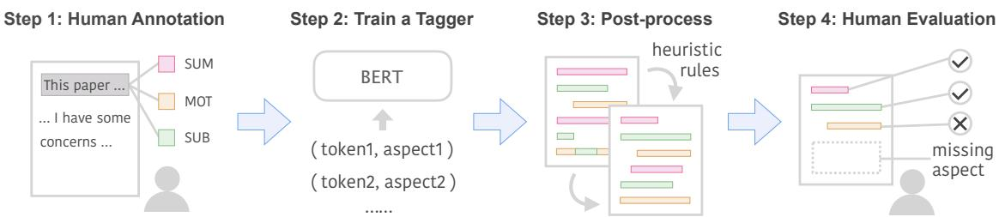
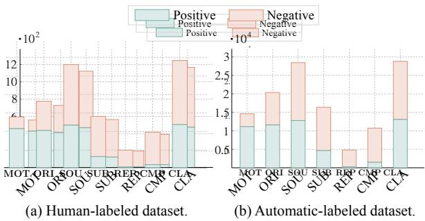
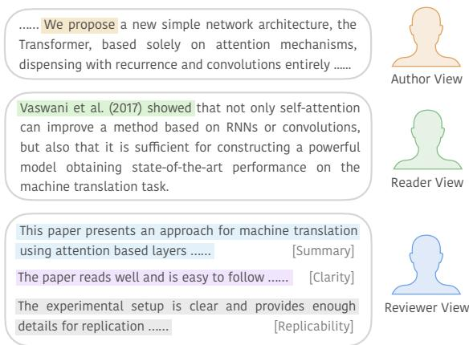
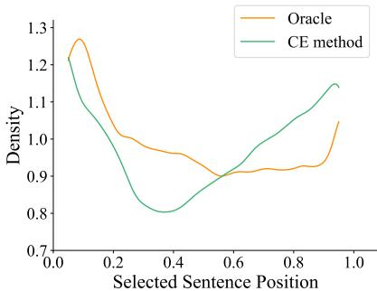
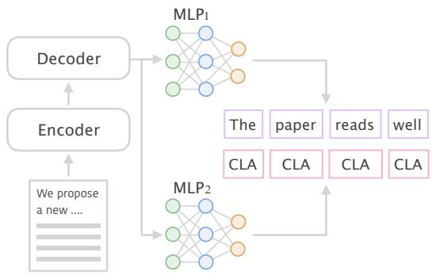
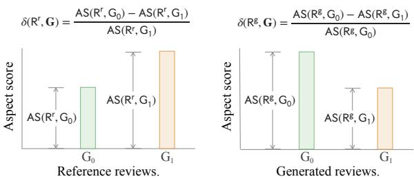
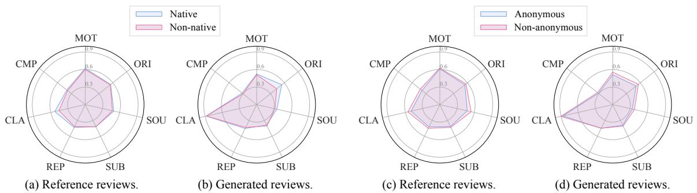
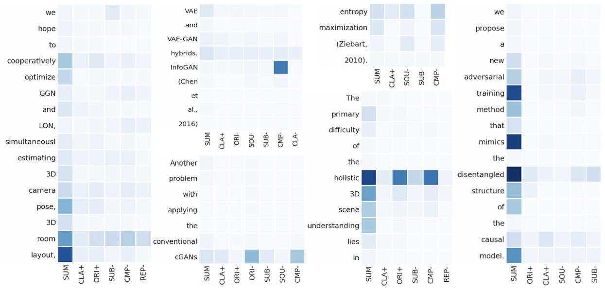
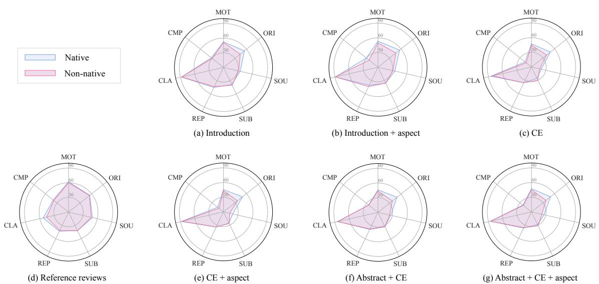
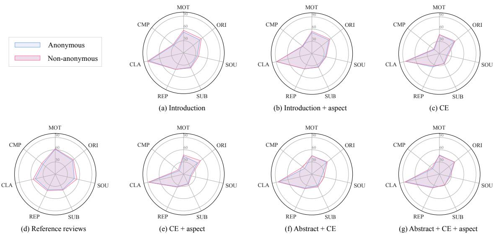

# Can We Automate Scientific Reviewing?

Weizhe Yuan Carnegie Mellon University weizhey@cs.cmu.edu

Pengfei Liu ∗ Carnegie Mellon University pliu3@cs.cmu.edu

Graham Neubig Carnegie Mellon University gneubig@cs.cmu.edu

# TL;QR

This paper proposes to use NLP models to generate reviews for scientific papers . The model is trained on the ASAP-Review dataset and evaluated on a set of metrics to evaluate the quality of the generated reviews . It is found that the model is not very good at summarizing the paper , but it is able to generate more detailed reviews that cover more aspects of the paper than those created by humans . The paper also finds that both human and automatic reviewers exhibit varying degrees of bias and biases , and that the system generate more biased reviews than human reviewers.(“Too Long; Quick Read”, this paragraph, is generated by our system.)

summarization models that take in papers to generate reviews. Comprehensive experimental results show that system-generated reviews tend to touch upon more aspects of the paper than human-written reviews, but the generated text can suffer from lower constructiveness for all aspects except the explanation of the core ideas of the papers, which are largely factually correct. We finally summarize eight challenges in the pursuit of a good review generation system together with potential solutions, which, hopefully, will inspire more future research on this subject. We make all code, and the dataset publicly available: https://github. com/neulab/ReviewAdvisor as well as a ReviewAdvisor system: http://review.nlpedia.ai/ (See demo screenshot in A.2). The review of this paper (without TL;QR section) written by the system of this paper can be found A.1

# 1 Introduction

# Abstract

The rapid development of science and technology has been accompanied by an exponential growth in peer-reviewed scientific publications. At the same time, the review of each paper is a laborious process that must be carried out by subject matter experts. Thus, providing high-quality reviews of this growing number of papers is a significant challenge. In this work, we ask the question “can we automate scientific reviewing?”, discussing the possibility of using state-of-the-art natural language processing (NLP) models to generate first-pass peer reviews for scientific papers. Arguably the most difficult part of this is defining what a “good” review is in the first place, so we first discuss possible evaluation measures for such reviews. We then collect a dataset of papers in the machine learning domain, annotate them with different aspects of content covered in each review, and train targeted

The number of published papers is growing exponentially (Tabah, 1999; De Bellis, 2009; Bornmann and Mutz, 2015). While this may be positively viewed as indicating acceleration of scientific progress, it also poses great challenges for researchers, both in reading and synthesizing the relevant literature for one’s own benefit, and for performing peer review of papers to vet their correctness and merit. With respect to the former, a large body of existing work explores automatic summarization of a paper or a set of papers for automatic survey generation (Mohammad et al., 2009; Jha et al., 2013, 2015b,a; Yasunaga et al., 2019b; Cohan et al., 2018b; Xing et al., 2020). However, despite the fact that peer review is an important, but laborious part of our scientific process, automatic systems to aid in the peer review process remain relatively underexplored. Bartoli et al. (2016) investigated the feasibility of generating reviews by surface-level term replacement and sentence reordering, and Wang et al. (2020) (contemporaneously and independently) propose a two-stage information extraction and summarization pipeline to generate paper reviews. However, both do not extensively evaluate the quality or features of the generated review text.

In this work, we are concerned with providing at least a preliminary answer to the ambitious overarching question: can we automate scientific reviewing? Given the complexity of understanding and assessing the merit of scientific contributions, we do not expect an automated system to be able to match a well-qualified and meticulous human reviewer at this task any time soon. However, some degree of review automation may assist reviewers in their assessments, or provide guidance to junior reviewers who are just learning the ropes of the reviewing process. Towards this goal, we examine two concrete research questions, the answers to which are prerequisites to building a functioning review assistant:

Q1: What are the desiderata of a good automatic reviewing system, and how can we quantify them for evaluation? Before developing an automatic review system, we first must quantify what constitutes a good review in the first place. The challenge of answering this question is that a review commonly involves both objective (e.g. “lack of details necessary to replicate the experimental protocol”) and subjective aspects (e.g. “lack of potential impact”). Due to this subjectivity, defining a “good” review is itself somewhat subjective.

As a step towards tackling this challenge, we argue that it is possible to view review generation as a task of aspect-based scientific paper summarization, where the summary not only tries to summarize the core idea of a paper, but also assesses specific aspects of that paper (e.g. novelty or potential impact). We evaluate review quality from multiple perspectives, in which we claim a good review not only should make a good summary of a paper but also consist of factually correct and fair comments from diverse aspects, together with informative evidence.

To operationalize these concepts, we build a dataset of reviews, named ASAP-Review1 from machine learning domain, and make fine-grained annotations of aspect information for each review, which provides the possibility for a richer evaluation of generated reviews.

Q2: Using state-of-the-art NLP models, to what extent can we realize these desiderata? We provide an initial answer to this question by using the aforementioned dataset to train state-of-the-art summarization models to generate reviews from scientific papers, and evaluate the output according to our evaluation metrics described above. We propose different architectural designs for this model, which we dub ReviewAdvisor (§4), and comprehensively evaluate them, interpreting their relative advantages.

# Lastly, we highlight our main observations and conclusions:

(1) What are review generation systems (not) good at? Most importantly, we find the constructed automatic review system generates non-factual statements regarding many aspects of the paper assessment, which is a serious flaw in a high-stakes setting such as reviewing. However, there are some bright points as well. For example, it can often precisely summarize the core idea of the input paper, which can be either used as a draft for human reviewers or help them (or general readers) quickly understand the main idea of the paper to be reviewed (or pre-print papers). It can also generate reviews that cover more aspects of the paper’s quality than those created by humans, and provide evidence sentences from the paper. These could potentially provide a preliminary template for reviewers and help them quickly identify salient information in making their assessment.

(2) Will the system generate biased reviews? Yes. We present methods to identify and quantify potential biases in reviews (§5.3), and find that both human and automatic reviewers exhibit varying degrees of bias. (i) regarding native vs. non-native English speakers: papers of native English speakers tend to obtain higher scores on “Clarity” from human reviewers than non-native English ones,2 but the automatic review generators narrow this gap. Additionally, system reviewers are harsher than human reviewers when commenting regarding the paper’s “Originality” for non-native English speakers. (ii) regarding anonymous vs. non-anonymous submissions: both human reviewers and system reviewers favor non-anonymous papers, which have been posted on non-blind preprint servers such as arXiv3 before the review period, more than anonymous papers in all aspects.

Based on above mentioned issues, we claim that a review generation system can not replace human reviewers at this time, instead, it may be helpful as part of a machine-assisted human review process. Our research also enlightens what’s next in pursuing a better method for automatic review generation or assistance and we summarize eight challenges that can be explored for future directions in $\ S 7 . 2$ .

# 2 What Makes a Good Peer Review?

Although peer review has been adopted by most journals and conferences to identify important and relevant research, its effectiveness is being continuously questioned (Smith, 2006; Langford and Guzdial, 2015; Tomkins et al., 2017; Gao et al., 2019; Rogers and Augenstein, 2020).

As concluded by Jefferson et al. (2002b): “Until we have properly defined the objectives of peerreview, it will remain almost impossible to assess or improve its effectiveness.” Therefore we first discuss the possible objectives of peer review.

# 2.1 Peer Review for Scientific Research

A research paper is commonly first reviewed by several committee members who usually assign one or several scores and give detailed comments. The comments, and sometimes scores, cover diverse aspects of the paper (e.g. “clarity,” “potential impact”; detailed in $\ S 3 . 2 . 1 $ , and these aspects are often directly mentioned in review forms of scientific conferences or journals. 4

Then a senior reviewer will often make a final decision (i.e., “reject” or “accept”) and provide comments summarizing the decision (i.e., a metareview).

After going through many review guidelines5   
and resources about how to write a good review6

we summarize some of the most frequently mentioned desiderata below:

1. Decisiveness: A good review should take a clear stance, selecting high-quality submissions for publication and suggesting others not be accepted (Jefferson et al., 2002a; Smith, 2006).

2. Comprehensiveness: A good review should be well-organized, typically starting with a brief summary of the paper’s contributions, then following with opinions gauging the quality of a paper from different aspects. Many review forms explicitly require evaluation of different aspects to encourage comprehensiveness.

3. Justification: A good review should provide specific reasons for its assessment, particularly whenever it states that the paper is lacking in some aspect. This justification also makes the review more constructive (another oft-cited desiderata of reviews), as these justifications provide hints about how the authors could improve problematic aspects in the paper (Xiong and Litman, 2011).

4. Accuracy: A review should be factually correct, with the statements contained therein not being demonstrably false.

5. Kindness: A good review should be kind and polite in language use.

Based on above desiderata, we make a first step towards evaluation of reviews for scientific papers and characterize a “good” review from multiple perspectives.

# 2.2 Multi-Perspective Evaluation

Given input paper $D$ and meta-review $R ^ { m }$ , our goal is to evaluate the quality of review $R$ , which can be either manually or automatically generated. We also introduce a function $\mathrm { D E C } ( D ) \in \{ 1 , - 1 \}$ that indicates the final decision of a given paper reached by the meta-review: “accept” or “reject”. Further, $\operatorname { R e c } ( R ) \in \{ 1 , 0 , - 1 \}$ represents the acceptance recommendation of a particular review: “accept,” “neutral,” or “reject (see Appendix A.3 for details).

Below, we discuss evaluation metrics that can be used to approximate the desiderata of reviews described in the previous section. And we have summarized them in Tab. 1.

<table><tr><td>Desiderata</td><td>Metrics</td><td>Range</td><td>Automated</td></tr><tr><td>Decisiveness</td><td>RACC</td><td>[-1, 1]</td><td>No</td></tr><tr><td>Comprehen.</td><td>ACOV</td><td>[0, 1]</td><td>Yes</td></tr><tr><td></td><td>AREC</td><td>[0, 1]</td><td>Yes</td></tr><tr><td>Justification</td><td>InFo</td><td>[0, 1]</td><td>No</td></tr><tr><td></td><td>SACC</td><td>[0, 1]</td><td>No</td></tr><tr><td>Accuracy</td><td>ACON</td><td>[0, 1]</td><td>No</td></tr><tr><td></td><td>ROUGE</td><td>[0, 1]</td><td>Yes</td></tr><tr><td>Others</td><td>BERTScore</td><td>[-1, 1]</td><td>Yes</td></tr></table>

Table 1: Evaluation metrics from different perspectives. “Range” represents the range value of each metric. “Automated” denotes if metrics can be obtained automatically.

# 2.2.1 D1: Decisiveness

First, we tackle the decisiveness, as well as accuracy of the review’s recommendation, through Recommendation Accuracy (RACC). Here we use the final decision regarding a paper and measure whether the acceptance implied by the review $R$ is consistent with the actual accept/reject decision of the reviewed paper. It is calculated as:

# 2.2.3 D3: Justification

As defined in $\ S 2 . 1$ , a good peer review should provide hints about how the author could improve problematic aspects. For example, when reviewers comment: “this paper lacks important references”, they should also list these relevant works. To satisfy this justification desideratum, we define a metric called Informativeness (INFO) to quantify how many negative comments8 are accompanied by corresponding evidence.

First, let $n _ { \mathrm { n a } } ( R )$ denote the number of aspects in $R$ with negative sentiment polarity. $n _ { \mathrm { n a e } } ( R )$ denotes the number of aspects with negative sentiment polarity that are supported by evidence. The judgement of supporting evidence is conducted manually (details in Appendix A.3). INFO is calculated as:

$$
\mathrm { I n f o } ( R ) = { \frac { n _ { \mathrm { n a e } } ( R ) } { n _ { \mathrm { n a } } ( R ) } }
$$

And we set it to be 1 when there are no negative aspects mentioned in a review.

$$
\operatorname { R A c c } ( R ) = \operatorname { D E C } ( D ) \times \operatorname { R E C } ( R )
$$

A higher score indicates that the review more decisively and accurately makes an acceptance recommendation.

# 2.2.2 D2: Comprehensiveness

A comprehensive review should touch on the quality of different aspects of the paper, which we measure using a metric dubbed Aspect Coverage (ACOV). Specifically, given a review $R$ , aspect coverage measures how many aspects (e.g. clarity) in a predefined aspect typology (in our case, $\ S 3 . 2 . 1 )$ have been covered by $R$ .

In addition, we propose another metric Aspect Recall (AREC), which explicitly takes the metareview $R ^ { m }$ into account. Because the meta-review is an authoritative summary of all the reviews for a paper, it provides an approximation of which aspects, and with which sentiment polarity, should be covered in a review. Aspect recall counts how many aspects in meta-review $R ^ { m }$ are covered by general review $R$ , with higher aspect recall indicating better agreement with the meta-review.7

# 2.3 D4: Accuracy

We use two measures to evaluate the accuracy of assessments. First, we use Summary Accuracy (SACC) to measure how well a review summarizes contributions of a paper. It takes value of 0, 0.5, or 1, which evaluates the summary part of the review as incorrect/absent, partially correct, and correct. The correctness judgement is performed manually, with details listed in Appendix A.3.

INFO implicitly requires that negative aspects should be supported with evidence, ignoring the quality of this evidence. However, to truly help to improve the quality of a paper, the evidence for negative aspects should be factual as well. Here we propose Aspect-level Constructiveness (ACON), the percentage of the supporting statements $n _ { \mathrm { n a e } } ( R )$ that are judged as valid support by human annotators. If $n _ { \mathrm { n a e } } ( R )$ is 0, we set its ACON as 1. This metric will implicitly favor reviews that do not provide enough evidence for negative aspects. However, in this case, the INFO of those reviews will be rather low. The details of evaluating “validity” are also described in Appendix A.3.

# 2.4 D5: Kindness

While kindness is very important in maintaining a positive research community, accurately measuring it computationally in a nuanced setting such as peer review is non-trivial. Thus, we leave the capturing of kindness in evaluation to future work.

# 2.5 Similarity to Human Reviews

For automatically generated reviews, we also use Semantic Equivalence metrics to measure the similarity between generated reviews and reference reviews. The intuition is that while human reviewers are certainly not perfect, knowing how close our generated reviews are to existing human experts may be informative. Here, we investigate two specific metrics: ROUGE (Lin and Hovy, 2003) and BERTScore (Zhang et al., 2019). The former measures the surface-level word match while the latter measures the distance in embedding space. Notably, for each source input, there are multiple reference reviews. When aggregating ROUGE and BERTScore, we take the maximum instead of average since it is not necessary for generated reviews to be close to all references.

# 3 Dataset

Next, in this section we introduce how we construct a review dataset with more fine-grained metadata, which can be used for system training and the multiple perspective evaluation of reviews.

# 3.1 Data Collection

The advent of the Open Peer Review system9 makes it possible to access review data for analysis or model training/testing. One previous work (Kang et al., 2018) attempts to collect reviews from several prestigious publication venues including the Conference of the Association of Computational Linguistics (ACL) and the International Conference on Learning Representations (ICLR). However, there were not nearly as many reviews accumulated in OpenReview at that time10 and other private reviews only accounted for a few hundred. Therefore we decided to collect our own dataset Aspect-enhanced Peer Review (ASAP-Review).

We crawled ICLR papers from 2017-2020 through OpenReview11 and NeurIPS papers from

2016-2019 through NeurIPS Proceedings.12 For each paper’s review, we keep as much metadata information as possible. Specifically, for each paper, we include following metadata information that we can obtain from the review web page:

• Reference reviews, which are written by a committee member.   
• Meta reviews, which are commonly written by an area chair (senior committee member).   
• Decision, which denotes a paper’s final “accept” or “reject” decision.   
• Other information like url, title, author, etc.

We used Allenai Science-parse13 to parse the pdf of each paper and keep the structured textual information (e.g., titles, authors, section content and references). The basic statistics of our ASAP-Review dataset is shown in Tab. 2.

Table 2: Basic statistics of ASAP-Review dataset. Note that NeurIPS only provide reviews for accepted papers to the public.   

<table><tr><td></td><td>ICLR</td><td>NeurIPS</td><td>Both</td></tr><tr><td>Accept</td><td>1,859</td><td>3,685</td><td>5,544</td></tr><tr><td>Reject</td><td>3,333</td><td>0</td><td>3,333</td></tr><tr><td>Total</td><td>5,192</td><td>3,685</td><td>8877</td></tr><tr><td>Avg. Full Text Length</td><td>7,398</td><td>5,916</td><td>6782</td></tr><tr><td>Avg. Review Length</td><td>445</td><td>411</td><td>430</td></tr><tr><td># of Reviews</td><td>15,728</td><td>12,391</td><td>28,119</td></tr><tr><td># of Reviews per Paper</td><td>3.03</td><td>3.36</td><td>3.17</td></tr></table>

# 3.2 Aspect-enhanced Review Dataset

Although reviews exhibit internal structure, for example, as shown in Fig. 3, reviews commonly start with a paper summary, followed by different aspects of opinions, together with evidence. In practice, this useful structural information cannot be obtained directly. Considering that fine-grained information about the various aspects touched on by the review plays an essential role in review evaluation, we conduct aspect annotation of those reviews. To this end, we first (i) introducing an aspect typology and (ii) perform human annotation.

# 3.2.1 Aspect Typology and Polarity

We define a typology that contains 8 aspects, which follows the ACL review guidelines14 with small modifications, which are Summary (SUM), Motivation/Impact (MOT) , Originality (ORI), Soundness/Correctness (SOU), Substance (SUB), Replicability (REP), Meaningful Comparison (CMP) and Clarity (CLA). The detailed elaborations of each aspect can be found in Supplemental Material B.1. Inside the parentheses are what we will refer to each aspect for brevity. To take into account whether the comments regarding each aspect are positive or negative, we also mark whether the comment is positive or negative for every aspect (except summary).

  
Figure 1: Data annotation pipeline.(a) Human-label

# 3.2.2 Aspect Annotation

Overall, the data annotation involves four steps that are shown in Fig. 1.

Step 1: Manual Annotation To manually annotate aspects in reviews, we first set up a data annotation platform using Doccano.15 We asked 6 students from ML/NLP backgrounds to annotate the dataset. We asked them to tag an appropriate text span that indicates a specific aspect. For example, “ The results are new [Positive Originality] and important to this field [Positive Motivation]”. The detailed annotation guideline can be found in Supplemental Material B.1. Each review is annotated by two annotators and the lowest pair-wise Cohen kappa is 0.653, which stands for substantial agreement. In the end, we obtained 1,000 human-annotated reviews in total. The aspect statistics in this dataset are shown in Fig. 2-(a).

Step 2: Training an Aspect Tagger Since there are over 20,000 reviews in our dataset, using human labor to annotate them all is unrealistic. Therefore, we use the annotated data we do have to train an aspect tagger and use it to annotate the remaining reviews. The basic architecture of our aspect tagger contains a pre-trained model BERT (Devlin et al.,

  
Figure 2: (a) and (b) represent distributions over seven aspects obtained by human and BERT-based tagger respectively. Red bins represent positive sentiment while green ones suggest negative sentiment. We omit “Sum” aspect since there is no polarity definition of it.

2019) and a multi-layer perceptron. The training details can be found in Appendix A.4.

Step 3: Post-processing However, after inspecting the automatically labeled dataset, we found that there appears to be some common problems such as interleaving different aspects and inappropriate boundaries. To address those problems, we used seven heuristic rules to refine the prediction results and they were executed sequentially. The detailed heuristics can be found in Appendix A.5. An example of our model prediction after applying heuristic rules is shown in Appendix A.6. Fig. 2-(b) shows the distribution of all reviews over different aspects. As can be seen, the relative number of different aspects and the ratio of positive to negative are very similar across human and automatic annotation.

Step 4: Human Evaluation To evaluate the data quality of reviews’ aspects, we conduct human evaluation. Specifically, we measure both aspect precision and aspect recall for our defined 15 aspects.

We randomly chose 300 samples from our automatically annotated dataset and assigned each sample to three different annotators to judge the annotation quality. As before, these annotators are all from ML/NLP backgrounds.

The detailed calculation for aspect precision and aspect recall can be found in Appendix A.7. Under these criteria, we achieved $9 2 . 7 5 \%$ aspect precision and $8 5 . 1 9 \%$ aspect recall. The fine-grained aspect precision and aspect recall for each aspect is shown in Tab. 3. The aspect recall for positive replicability is low. This is due to the fact that there are very few mentions of positive replicability. And in our human evaluation case, the system identified one out of two, which results in $50 \%$ . Other than that, the precision and recall are much higher.16

Table 3: Fine-grained aspect precision and recall forReference each aspect. $^ +$ denotes positive and – denotes negative.   

<table><tr><td>Aspect</td><td>Polarity Precision</td><td>Recall</td></tr><tr><td>Summary</td><td>95%</td><td>100%</td></tr><tr><td>Motivation</td><td>94%</td><td>89%</td></tr><tr><td>+</td><td>72%</td><td>71%</td></tr><tr><td>Originality</td><td>95%</td><td>87%</td></tr><tr><td>+</td><td>94%</td><td>80%</td></tr><tr><td>Soundness</td><td>95%</td><td>98%</td></tr><tr><td></td><td>92%</td><td>79%</td></tr><tr><td>+ Substance</td><td>90%</td><td>94%</td></tr><tr><td></td><td>90%</td><td>78%</td></tr><tr><td>+ Replicability</td><td>100%</td><td>50%</td></tr><tr><td></td><td>77%</td><td>71%</td></tr><tr><td>+</td><td>97%</td><td>92%</td></tr><tr><td></td><td>92%</td><td>73%</td></tr><tr><td>×</td><td>85%</td><td>100%</td></tr><tr><td>Comparison</td><td></td><td></td></tr><tr><td></td><td>94%</td><td>94%</td></tr></table>

Besides, one thing to mention is that our evaluation criterion is very strict, and it thus acts as a lower bound for these two metrics.

# 4 Scientific Review Generation

# 4.1 Task Formulation

The task of scientific review generation can be conceptualized an aspect-based scientific paper summarization task but with a few important differences. Specifically, most current works summarize a paper (i) either from an “author view” that only use content written by the author to form a summary (Cohan et al., 2018a; Xiao and Carenini, model obtaining state-of-the-art performance on the 2019; Erera et al., 2019; Cohan et al., 2018a; Cachola et al., 2020b), (ii) or from a “reader view” This paper presents an approach for machine translation that argues a paper’s summary should take into account the view of those in the research community (Qazvinian and Radev, 2008; Cohan and Goharian, details for replication …… 2017; Yasunaga et al., 2019a).

  
Figure 3: Summarization from three different views for the paper “Attention Is All You Need” (Vaswani et al., Transformer, based solely on attention mechanisms, 2017). Summareis from three views (author, reader, redispensing with recurrence and convolutions entirely ...... viewer) comes from the paper’s abstract, citance (i.e., a paper that cites this paper) and peer review respectively.

In this work, we extend the view of scientific paper summarization from “author” or “reader” to “reviewer”, and claim that a good summary of a scientific paper can not only reflect the core idea but also contains critical comments from different aspects made by domain experts, which usually requires knowledge beyond the source paper itself. The advantages lie in: (i) authors: helping them identify weak points in their paper and make it stronger. (ii) reviewers: relieving them from some of the burden of reviewing process. (iii) readers: helping them quickly grasp the main idea of the paper and letting them know what “domain experts” (our system) comments on the paper are. The three views of scientific paper summarization are shown in Fig. 3.

# 4.2 System Design

Despite the fact that our dataset contains fewer training samples compared with other benchmark summarization datasets, the few-shot learning ability of recent contextualized pre-trained models (Radford et al., 2019; Brown et al., 2020; Cachola et al., 2020a) still put training a passable review generation system from this dataset within grasp. We use BART (Lewis et al., 2019), which is a denoising autoencoder for pretraining sequence-tosequence models, as our pre-trained model since it has shown superior performance on multiple generation tasks.

  
Figure 4: Selected sentence position distribution. We use the relative position of each sentence with regard to the whole article, thus taking values from 0 to 1.

However, even if we can take the advantage of this pre-trained model, how to deal with lengthy text in the context of using a pre-trained model (BART, for example, has a standard length limit of 1024 since it was pre-trained on texts of this size) remains challenging. After multiple trials, we opted for a two-stage method detailed below, and describe other explorations that were less effective in Appendix A.8.

# 4.2.1 Two-stage Systems for Long Documents

Instead of regarding text generation as a holistic process, we decompose it into two steps, using an extract-then-generate paradigm (Chen and Bansal, 2018; Gehrmann et al., 2018; Subramanian et al., 2019; Dou et al., 2020). Specifically, we first perform content selection, extracting salient text pieces from source documents (papers), then generate summaries based on these extracted texts.

To search for an effective way to select content that is most useful for constructing a review generation system, we operationalize the first extraction step in several ways. One thing to notice is that the extraction methods we use here mainly focus on heuristics. We leave more complicated selection methods for future work.

Oracle Extraction First, for comparison purposes, we construct an oracle for each paper which is the extraction that achieves highest average ROUGE scores with respect to reference reviews, specifically using the greedy method described in Nallapati et al. (2017). Note that for each paper with multiple reviews, we construct multiple oracles for that paper. We assume that oracle extractions can reflect where reviewers pay more attention to when they are writing reviews. The selected sentence position distribution in oracles is shown in Fig. 4.

Section-based Extraction Scientific papers are highly structured. As a convention, a scientific paper usually describes problem background, related work comparison, as well as its own contributions in the introduction part. Regarding this method, we only use the introduction section, which can be regarded as a baseline model.

Cross-entropy (CE) Method Extraction Here we select salient sentences from the full text range. The way we do so is through a two-step selection process:

1. Select sentences containing certain informative keywords (e.g. propose) which are detailed in Appendix A.9. Those selected sentences form a set $\boldsymbol { \mathcal { S } }$ .   
2. Select a subset $S ^ { \prime } \subseteq S$ such that sentences in $S ^ { \prime }$ cover diverse content and satisfy a length constraint.

In the second step, we use the cross-entropy method introduced in Feigenblat et al. (2017) where we select diverse content by maximizing unigram entropy. The details of this two-step process can be found in Appendix A.9. The selected sentence position distribution using this method is shown in Fig. 4. We can see that the extractor tends to select sentences from the beginning of a paper as well as the ending part of a paper just as the oracle extractor does. This makes sense because the beginning part is the introduction part which talks about the essence of the whole paper and the ending part mostly contains the analysis of experimental results and conclusions etc.

Hybrid Extraction We combine the abstract of a paper and its CE extraction to form a hybrid of both.

# 4.2.2 Aspect-aware Summarization

Typically in the extract-then-generate paradigm, we can just use the extractions directly and build a sequence-to-sequence model to generate text. Here, in order to generate reviews with more diverse aspects and to make it possible to interpret the generated reviews through the lens of their internal structure, we make a step towards a generation framework involving extract-then-generate-and-predict.

Specifically, instead of existing aspect-based summarization works that explicitly take aspects asEncoder input (Angelidis and Lapata, 2018; Frermann and Klementiev, 2019; Hayashi et al., 2020), we useWe propose our annotated aspects (§3.2) as additional information, and design an auxiliary task that aims toMLP predict aspects of generated texts (reviews). Fig. 5 illustrates the general idea of this.

  
Figure 5: Aspect-aware summarization.

The loss of this model is shown in Eq. 3

$$
\mathcal { L } = \mathcal { L } _ { \mathrm { s e q 2 s e q } } + \alpha \mathcal { L } _ { \mathrm { s e q l a b } }
$$

where $\mathcal { L } _ { \mathrm { s e q } 2 \mathrm { s e q } }$ denotes sequence to sequence loss which is the negative log likelihood of the correct next tokens, and $\mathcal { L } _ { \mathrm { { s e q l a b } } }$ denotes sequence labeling loss which is the negative log likelihood of the correct labels of next tokens. $\alpha$ is a hyper-parameter $( \alpha = 0 . 1 )$ ) that is tuned to maximize aspect coverage on the development set.

# 5 Experiment

In this section, we investigate using our proposed review generation systems with state-of-the-art pre-trained models, to what extent can we realize desiderata of reviews that we defined in $\ S 2 . 2$ . We approach this goal by two concrete questions: (1) What are review generation systems (not) good at? (2) Will systems generate biased reviews?

# 5.1 Settings

Here we consider three extraction strategies in $\ S 4 . 2 . 1$ as well as two generation frameworks, one is the vanilla sequence to sequence model, the other is jointly sequence to sequence and sequence labeling.

Dataset We use our constructed dataset ASAP-Review described in $\ S 3$ to conduct experiments. For each paper, we use full text (without Appendix) as source document.17 And wellhe paper readswe filtered papers with full text fewer than 100 A CLA CLA CLAwords since they don’t contain enough information for models to learn. For reviews, we only use 100-1024 word reviews 18 for training due to computational efficiency, which account for $9 2 . 5 7 \%$ of all the reviews. This results in 8,742 …… We propose a new simple network architeunique papers and 25,986 paper-review pairs in Transformer, based solely on attention total, the split of our dataset is shown in Tab. 4.

machine translation task. Table 4: Data split of ASAP-Review.   

<table><tr><td></td><td>Train</td><td>Validation</td><td>Test</td></tr><tr><td>Unique papers</td><td>6,993</td><td>874</td><td>875</td></tr><tr><td>Paper-review pairs</td><td>20,757</td><td>2,571</td><td>2,658</td></tr></table>

using attention bModel As mentioned in $\ S 4 . 2$ yers …… [, the pre-trained sequence-to-sequence model we used is BART. For all models, we initialized the model weights using [Repdetails for replication …… the checkpoint: “bart-large-cnn” which is pre-trained on “CNN/DM” dataset (Hermann et al., 2015).19 For extract-then-generate-and-predict framework, we add another multilayer perceptron on top of the BART decoder, and initialize it with 0.0 mean and 0.02 standard deviation. We use the Adam optimizer(Kingma and Ba, 2014) with a linear learning rate scheduler which increases the learning rate linearly from 0 to $4 e ^ { - 5 }$ in the first $1 0 \%$ steps (the warmup period) and then decreases the learning rate linearly to 0 throughout the rest of training steps. We finetuned our models on the whole dataset for 5 epochs. We set a checkpoint at the end of every epoch and finally took the one with the lowest validation loss.

During generation, we used beam search decoding with beam size 4. Similarly to training time, we set a minimum length of 100 and a maximum length of 1024. A length penalty of 2.0 and trigram blocking (Paulus et al., 2017) were used as well.

# 5.2 What are Systems Good and Bad at?

Based on the evaluation metrics we defined in $\ S 2 . 2$ , we conduct both automatic evaluation and human evaluation to characterize both reference reviews and generated reviews, aiming to analyze what subtasks of review generation automatic systems can do passably at, and also where they fail. The aspect information in each review is obtained using aspect tagger we trained in $\ S 3 . 2$ .

Table 5: Results of the baseline models as well as different aspect-enhanced models under diverse automated evaluation metrics. “BS” represents BERTScore. $\dagger$ denotes that the difference between system generated reviews and human reviews are statistically significant $\scriptstyle \mathbf { p } \cdot$ -value $< 0 . 0 5$ using 10,000 paired bootstrap resampling (Efron, 1992) tests with 0.8 sample ratio).   

<table><tr><td>Desiderata</td><td>Decisive.</td><td colspan="2">Comprehen.</td><td>Justification</td><td colspan="2">Accuracy</td><td colspan="4">Others</td></tr><tr><td>Metric</td><td>RACC</td><td>Acov</td><td>AREC</td><td>Info</td><td>ACOn</td><td>SACC</td><td>R-1</td><td>R-2</td><td>R-L</td><td>BS</td></tr><tr><td>HUMAN</td><td>30.32</td><td>49.85</td><td>58.66</td><td>97.97</td><td>75.67</td><td>90.77</td><td></td><td>−</td><td>−</td><td></td></tr><tr><td colspan="9">Extractive</td><td></td></tr><tr><td>INTRO</td><td></td><td></td><td></td><td></td><td></td><td></td><td>38.62</td><td>8.84</td><td>25.11</td><td>29.22</td></tr><tr><td>CE</td><td></td><td></td><td></td><td></td><td></td><td></td><td>38.56</td><td>7.81</td><td>25.94</td><td>29.11</td></tr><tr><td>ABSCE</td><td></td><td></td><td></td><td></td><td></td><td></td><td>37.55</td><td>8.53</td><td>25.85</td><td>31.99</td></tr><tr><td colspan="9">ExTractIvE+ABSTrAcTIVE</td><td></td><td></td></tr><tr><td>Aspect</td><td></td><td></td><td></td><td></td><td></td><td></td><td></td><td></td><td></td><td></td></tr><tr><td rowspan="2">INTRO</td><td>×</td><td>-15.38†</td><td>50.37</td><td>55.52†</td><td>100.00†</td><td>43.78†</td><td>83.93</td><td>41.39</td><td>11.53</td><td>38.52 42.29</td></tr><tr><td>√</td><td>-11.54†</td><td>51.50</td><td>58.24</td><td>99.29</td><td>32.51†</td><td>80.36† 41.31</td><td>11.41</td><td>38.38</td><td>42.33</td></tr><tr><td rowspan="2">CE</td><td>×</td><td>-23.08†</td><td>62.64†</td><td>60.73</td><td>99.29 39.17†</td><td>78.57†</td><td>42.37</td><td>11.72</td><td>39.86</td><td>41.78</td></tr><tr><td>√</td><td>-30.77†</td><td>63.96† 61.62†</td><td>100.00†</td><td>34.46†</td><td>69.64†</td><td>42.27</td><td>11.62</td><td>39.73</td><td>41.71</td></tr><tr><td rowspan="2">ABSCE</td><td>×</td><td>-30.77†</td><td>55.37†</td><td>58.31</td><td>98.21</td><td>34.75†</td><td>92.86</td><td>43.11</td><td>12.24 40.18</td><td>42.90</td></tr><tr><td>√</td><td>-38.46†</td><td>56.91† 57.56</td><td>98.21</td><td>35.21†</td><td>87.50</td><td>42.99</td><td>12.19</td><td>40.12</td><td>42.63</td></tr></table>

Automatic Evaluation Automatic evaluation metrics include Aspect Coverage (ACOV), Aspect Recall (AREC) and Semantic Equivalence (ROUGE, BERTScore). Notably, for each source input, there are multiple reference reviews. When aggregating ROUGE and BERTScore20, we take the maximum instead of average. And when aggregating other metrics for human reviews, we take the average for each source document. The results are shown in Tab. 5.

Human Evaluation Metrics that require human labor include Recommendation Accuracy (RACC), Informativeness (INFO), Aspect-level Constructiveness (ACON) and Summary Accuracy (SACC). We select 28 papers from ML/NLP/CV/RL domains. None of these papers are in the training set. Details regarding human judgment are shown in Appendix A.3. The evaluation results are shown in Tab. 5. Overall, we make the following observations:

# 5.2.1 Weaknesses

Review generation system will generate nonfactual statements for many aspects of the paper assessment, which is a serious flaw in a high-stakes setting.

Lacking High-level Understanding Specifically, when using metrics that require higher level understanding of the source paper like Recommendation Accuracy and Aspect-level Constructiveness, proposed systems achieved much lower performance, with even the smallest gaps between systems and humans being $4 1 . 8 6 \%$ for Recommendation Accuracy and $3 1 . 8 9 \%$ for Aspect-level Constructiveness compared to reference reviews. This means our systems cannot precisely distinguish high-quality papers from low-quality papers and the evidence for negative aspects is not reliable most of the time.21

Imitating Style After careful inspection, we find that some of sentences will appear frequently in different generated results. For example, the sentence “The paper is well-written and easy to follow” appears in more than $9 0 \%$ of generated reviews due to the fact that in the training data, this exact sentence appears in more than $1 0 \%$ of papers. This suggests that the style of generated reviews tend to be influenced by high-frequency sentence patterns in training samples.

Lack of Questioning Generated reviews ask few questions about the paper content, which is an important component in peer reviewing. In the reference reviews, the average number of questions per review is 2.04, while it is only 0.32 in generated reviews.

# 5.2.2 Advantages

We find that review generation systems can often precisely summarize the core idea of the input paper, and generate reviews that cover more aspects of the paper’s quality than those created by human reviewers. Systems with aspect information are also aspect-aware and evidence sensitive as we will discuss below.

Comprehensiveness In terms of Aspect Coverage and Informativeness, our systems can outperform human reviewers by at most $1 4 . 1 1 \%$ and $2 . 0 3 \%$ respectively, suggesting that even reviews from the reviewers may also fall short on our defined criterion regarding comprehensiveness.

Good Summarization Current systems can correctly summarize the contributions of papers most of the time as shown by Summary Accuracy. 4 out of 6 systems can achieve over $8 0 \%$ accuracy and statistical significance tests show that gaps between top-3 systems and human reviewers are not significant. This means that in terms of summarizing the paper content, current systems can achieve comparable performance to human reviewers.

# 5.2.3 System Comparisons

We also look into how systems with different settings are diverse in performance and make the following observations.

Summarization Paradigms By looking at ROUGE (R) and BERTScore (BS), we can see that “extractive $^ +$ abstractive”-based methods can consistently outperform pure extractive methods, with the smallest gaps of 2.69, 2.57, 12.44, 9.72 for R-1, R-1, R-L and BS respectively. This demonstrates the necessity of using abstractive summarization which can generate reviews that are close both in meaning as well as language use to human reviews.

Extraction Strategies We can see that it is more effective to use extracted text from the full paper to aid the generation process, resulting in higher aspect coverage compared with solely using introduction information. This is reasonable since models can obtain more diverse input from the full text.

System Diagnosis Our fine-grained evaluation metrics enable us to compare different systems and interpret their relative merits. For example, as discussed before, our systems can achieve higher Informativeness than reference reviews while suffering from much lower Aspect-level Constructiveness. This means that if we want our systems to match the performance of real reviewers, we should focus on improving the constructiveness of our systems instead of aiming for methods that provide better evidence for negative aspects (which are not factually correct most of the time in the first place).

# 5.2.4 Case Study

To get an intuitive understanding of how aspectenhanced review generation system worked, we perform analysis on a real case. (More analysis can be found in Appendix A.10.) Specifically, since our aspect-enhanced model is trained based on multitask learning framework, it would be interesting to see how well the tokens are generated associated with corresponding aspects. We take our aspectenhanced model using CE extraction to conduct this experiment. Tab. 6 shows an example review when we do so.

We can see that the model can not only generate fluent text but also be aware of what aspect it is going to generate as well as the correct polarity of that aspect. Although the generated aspects are often small segments and there are some minor alignment issues, the model is clearly aspect-aware.

# 5.3 Will System Generate Biased Reviews?

Biases in text are prevalent, but often challenging to detect (Manzoor and Shah, 2020; Stelmakh et al., 2019). For example, in natural language processing, researchers are trying to identify societal biases (e.g, gender) in data and learning systems on different tasks (Bolukbasi et al., 2016; Zhao et al., 2018; Stanovsky et al., 2019). However, previous works on analyzing bias in scientific peer review usually focus on disparities in numerical feedback instead of text. Manzoor and Shah (2020) recently uncover latent bias in peer review based on review text. In this work, besides designing a model to generate reviews, we also perform an analysis of bias, in which we propose a method to identify and quantify biases both in human-labeled and systemgenerated data in a more fine-grained fashion.

Table 6: Illustration of generated tokens associated with corresponding aspects. $^ +$ denotes positive sentiment. - denotes negative sentiment.   

<table><tr><td>summary clarity + substance +</td></tr><tr><td>T  </td></tr><tr><td>p  Th </td></tr><tr><td>    e   T</td></tr><tr><td>u ha  aeFAS T  </td></tr></table>

  
Figure 6: Aspect score $\mathbf { A } \mathbf { S } ( R , G _ { i } )$ and disparity $\delta ( R , { \bf G } )$ in reference reviews $( R ^ { r } )$ and generated reviews $( R ^ { g } )$ . $\mathbf { G } = [ G _ { 0 } , G _ { 1 } ]$ denotes different groups.

# 5.3.1 Measuring Bias in Reviews

To characterize potential biases existing in reviews, we (i) first define an aspect score, which calculates the percentage of positive occurrences22 of each aspect. The polarity of each aspect is obtained based on our learned tagger in $\ S 3 . 2$ ; (ii) then we aim to observe if different groups $G _ { i }$ (e.g., groups whether the paper is anonymous during reviewing or is not anonymous) of reviews $R$ would exhibit disparity $\delta ( R , { \bf G } )$ in different aspects. The calculation of disparity can be visualized in Fig. 6.

Based on above two definitions, we characterize bias in two ways respectively:

(1) spider chart, which directly visualizes aspect scores of different groups of reviews w.r.t each aspect.

(2) disparity difference, which represents the difference between disparities in generated reviews

$R ^ { g }$ and reference reviews $R ^ { r }$ and can be formally calculated as:

$$
\Delta ( R ^ { g } , R ^ { r } , { \bf G } ) = \delta ( R ^ { g } , { \bf G } ) - \delta ( R ^ { r } , { \bf G } )
$$

where $\textbf { G } = \ [ G _ { 0 } , G _ { 1 } ]$ denotes different groups based on a given partition criterion. Positive value means generated reviews favor group $G _ { 0 }$ more compared to reference reviews, and vice versa.

In this work, we group reviews from two perspectives. The basic statistics are shown in Tab. 7.

Table 7: Test set statistics based on nativeness and anonymity.   

<table><tr><td></td><td>Native</td><td>Non-native</td><td>Anonym.</td><td>Non-anonym.</td></tr><tr><td>Total</td><td>651</td><td>224</td><td>613</td><td>217</td></tr><tr><td>Acc.%</td><td>66.51%</td><td>50.00%</td><td>57.59%</td><td>78.34%</td></tr></table>

Nativeness We categorize all papers in test set into “native” $( G _ { 0 } )$ and “non-native” $( G _ { 1 } )$ based on whether there is at least one native speaker in the author list as well as whether the institution is in an English-speaking country.23

Anonymity We categorize all papers in test set into “anonymous” $( G _ { 0 } )$ and “non-anonymous” $( G _ { 1 } )$ based on whether the paper has been released as a pre-print before a half month after the conference submission deadline.24

Here we take our model with introduction extraction as an example to showcase how to use the fine-grained aspect information in our dataset to do bias analysis. We list the bias analysis for other models in Appendix A.12.

  
Figure 7: Spider chart of aspect scores with respect to different groups.

<table><tr><td></td><td>MOT</td><td>ORI</td><td>SOU</td><td>SUB</td><td>REP</td><td>CLA</td><td>CMP</td><td>Total</td></tr><tr><td>Nativeness</td><td>-0.72</td><td>+18.71</td><td>+3.84</td><td>-3.66</td><td>+0.73</td><td>-13.32</td><td>+2.40</td><td>43.39</td></tr><tr><td>Anonymity</td><td>-5.69</td><td>-4.43</td><td>+2.76</td><td>-0.64</td><td>+5.65</td><td>+5.80</td><td>+3.02</td><td>28.00</td></tr></table>

Table 8: Disparity differences regarding nativeness and anonymity. Total is the sum of absolute value of disparity difference.

# 5.3.2 Nativeness Analysis

Spider Chart Generally, Native papers receive higher score in most aspects in both reference reviews and generated reviews. Specifically, for human reviews: (1) By looking at Fig. 7-(a), there is a significant gap in Clarity, which is reasonable since non-native authors may have more trouble conveying their ideas. (2) Scores of the two groups are much closer in other aspects.

For system-generated reviews: As shown in Fig. 7-(b), the auto-review system narrows the disparity in Clarity but amplifies it in Originality, meaning that system reviewers are harsher than human reviewers when commenting the paper’s “Originality” for non-native English speakers. This observation suggests that a review system can generate biased reviews in some aspects, which would lead to unfair comments. Therefore, a system should be de-biased before it come to use.

Disparity Difference Through spider chart, gaps between different groups are relatively small and hard to discern. Besides, those gaps can only show the absolute favor for a certain group in different aspects. We are also interested in whether generated reviews are more in favor of a certain group compared to reference reviews. To do this, we calculate disparity differences and list them in Tab. 8.

As shown in Tab. 8, for Originality and Clarity, the disparity difference is $+ 1 8 . 7 1$ and $- 1 3 . 3 2$ which means that the system favours native papers in Originality and non-native papers in Clarity compared to human reviewers. This observation is consistent with spider chart. Besides, varying degrees of bias are presented in Tab. 8. For example, for Motivation and Replicability, the disparity difference is less than 1, which suggests little bias while in other aspects, the bias is much larger.

# 5.3.3 Anonymity Analysis

Spider Chart By looking at Fig. 7-(c) and Fig. 7-(d), we find that both human reviewers and system reviewers favor non-anonymous papers in all aspects. Specifically, for human reviews: we find gaps are non-negligible in Soundness, Clarity and Meaningful Comparison while for system-generated reviews, we observe that gaps are considerable in Motivation, Originality, Soundness. This observation is interesting since human reviewers may be aware of the identity of the authors due to non-anonimity which may affect the reviews they write. However, our system is not aware of that and its preference towards non-anonymous paper probably suggests some quality difference.25

Disparity Difference By looking at Tab. 8, we find that the largest absolute disparity difference regarding anonymity is 5.80 compared to 18.71 regarding nativeness. This suggests that regarding anonymity, our system’s preference does not diverge that much from human reviewers. Also, the total aspect bias regarding anonymity is 28.00, much smaller compared to total aspect bias regarding nativeness (43.00). This also suggests that our model is less sensitive to anonymity compared to nativeness.

The observations above are probably related to some superficial heuristics existing in peer review. For example, when reviewers detect some grammar mistakes, they may assume that the authors are not native and then bias towards rejecting the paper by claiming some clarity issues. Another example is that there may exist differences in the research topics pursued by different subgroups (e.g., different countries), the bias regarding nativeness may also suggest the favor of certain topics in the reviewing process. Those superficial heuristics should be discouraged and deserve further investigation in future research.

# 6 Related Work

Scientific Review Generation There has been a relative paucity of work on scientific review generation, other than Bartoli et al. (2016)’s work investigating the feasibility of generating fake reviews by surface-level term replacement and sentence reordering etc. In addition contemporaneous and independent work by Wang et al. (2020) proposes a two-stage information extraction and summarization pipeline to generate paper reviews. Their evaluation focuses mainly on the accuracy of information extraction, and the evaluation of the generated summaries is somewhat precursory, assessing only a single criterion “constructiveness and validity” manually over 50 papers. Our paper (1) proposes a wide variety of diagnostic criteria on review quality, (2) uses a very different summarization methodology, and (3) evaluates the generated results extensively.

Peer Review Peer review is an essential component of the research cycle and is adopted by most journals and conferences to identify important and relevant research. However, at the same time it is easy to identify many issues: expensiveness, slowness, existence of inconsistency (Langford and Guzdial, 2015) and bias (Tomkins et al., 2017), etc.

Some efforts have been put into analyzing the peer review process including automating review assignment (Jin et al., 2017; Nguyen et al., 2018; Anjum et al., 2019; Jecmen et al., 2020), examining bias problems (Tomkins et al., 2017; Stelmakh et al., 2019), examining consistency problems (Langford and Guzdial, 2015) and performing sentiment analysis on reviews (Wang and Wan, 2018; Chakraborty et al., 2020). Several decision classification methods have been explored to help make accept or reject decision given a paper. Those methods are either based on textual (Kang et al., 2018; Qiao et al., 2018) or visual (Von Bearnensquash, 2010; Huang, 2018) information. However, they do not directly alleviate review load, as our paper aims to do.

# 7 Discussion and Future Directions

We first summarize what we have achieved in this work and how the current ReviewAdvisor system can potentially help in a reviewing process. Then we discuss challenges and potential directions for the automatic review generation task, which, hopefully, encourages more future researchers to explore this task, and in the right direction.

# 7.1 Machine-assisted Review Systems

Instead of replacing a human reviewer, a better position for ReviewAdvisor is to regard it as a machineassisted review system. Although there is still a large room for improvement, our results indicate that even with current technology:

(1) Based on the evaluation of $\ S 5 . 2$ , Summary Accuracy of our systems is quite high, suggesting that it can be either used for reviewers to finish the description of Summary, or help general readers to quickly understand the core idea of recently preprinted papers (e.g., papers from arXiv).

(2) Based on evaluation of $\ S 5 . 2$ , reviews generated by ReviewAdvisor can cover more aspects and generate more informative reviews. Although the associated opinions may suffer from constructiveness problems, they still may be useful since they can provide a preliminary template for reviewers, especially enabling junior or non-native English reviewers to know what a review generally should include and how to phrase each aspect. Additionally, for each aspect (e.g., Clarity), our system can provide relevant evidence sentences from the paper, helping reviewers quickly identify salient information when reviewing the paper (Detailed example in our Appendix A.10).

# 7.2 Challenges and Promising Directions

# 7.2.1 Model

(1) Long Document Modeling: The average length of one scientific paper is commonly larger than 5,000 words, far beyond the input text’s length that mainstream neural sequence models (e.g., LSTM, Transformer) or pre-trained models (e.g., BERT, BART) normally use. This work (in $\ S 4 . 2 . 1 )$ bypasses the difficulty by using a two-stage system, but other strategies should be explored.

(2) Pre-trained Models for Scientific Domain: Although previous works, as exemplified by (Beltagy et al., 2019) have pre-trained BERT on scientific domain, we observe that using these models with transformer decoders perform much worse than BART on sequence generation tasks in terms of fluency and coherence, which calls for general sequence to sequence models pre-trained on scientific domain for higher-quality review generation.

(3) Structure Information: Review generation systems could get a deeper understanding of a given research paper if structural information can be provided. To this end, outputs from scientific paperbased information extraction tasks (Hou et al., 2019; Jain et al., 2020) can be utilized to guide review generation.

(4) External Knowledge: Besides the paper itself, review systems can also rely on external knowledge, such as a citation graphs constructed based on more scientific papers or a knowledge graph connecting concepts across different papers (Luan et al., 2018; Lo et al., 2020). Also, recently, August et al. (2020) compile a set of writing strategies drawn from a wide range of prescriptive sources, it would be also valuable to transfer this knowledge into the auto-review system.

# 7.2.2 Datasets

(5) More Open, Fine-grained Review Data: In this work, we annotate fine-grained information (aspects) of each review manually. However, this information could potentially be obtained directly from the peer review system. How to access this information appropriately would be an important and valuable step in the future.

(6) More Accurate and Powerful Scientific Paper Parsers: Existing parsing tools (e.g. science-parse, grobid) for scientific papers are commonly designed for certain specific paper templates, and also still struggle at extracting fine-grained information, such as the content of tables and figures.

# 7.2.3 Evaluation

(7) Fairness and Bias in Generated Text: In this work, we make a step towards identifying and quantifying two types of biases existing in human and system-generated reviews. Future works can explore more along this direction based on our dataset that contains fine-grained aspect annotation.

(8) Factuality and Reliability: A generated review should be factually correct (Wadden et al., 2020) which also poses challenge to the current evaluation methodology. In addition to generating a review, a reliable system should also provide a level of confidence with respect to the current comment. Moreover, whether review scores are calibrated is another valuable question.

# 7.3 Conclusion

In answer to the titular question of “can we automate scientific review,” the answer is clearly “not yet”. However, we believe the models, data, and analysis tools presented in this paper will be useful as a starting point for systems that can work in concert with human reviewers to make their job easier and more effective.

# Acknowledgment

This work could not be accomplished without the help of many researchers. We would like to thank people for their generous support, especially,

Volunteer to help us with the human evaluation: Gabor Berend, Zhouhan Lin, William W. Co- ´ hen, Pengcheng Yin, Tiange Luo, Yuki M. Asano, Junjie Yan, Tuomas Haarnoja, Dandan Guo, Jie Fu, Lei Chen, Jinlan Fu, Jiapeng Wu, Wenshan Wang, Ziyi Dou, Yixin Liu, Junxian He, Bahetiyaer Bare, Saizheng Zhang, Jiateng Xie, Spyros Gidaris, Marco Federici, Junji Dai, Zihuiwen Ye Jie Zhou, Yufang Liu, Yue Zhang, Ruifeng Xu, Zhenghua Li, Chunting Zhou, Yang Wei.

This work lasted nearly a year, from the initial idea discussion (2020.02.28) to completing the first version of draft (2021.01.29). This is the year from the beginning of the COVID-19 epidemic to its outbreak. Thanks for this fun and challenging project that punctuates my dull life at home. Thank Weizhe, for her patience, persistence and her willingness to work with me to complete this crazy idea. Thanks a lot for Graham’s endless help on this project. The story is not over, and our system is still evolving.

# References

Stefanos Angelidis and Mirella Lapata. 2018. Summarizing opinions: Aspect extraction meets sentiment prediction and they are both weakly supervised. In Proceedings of the 2018 Conference on Empirical Methods in Natural Language Processing, pages 3675–3686, Brussels, Belgium. Association for Computational Linguistics.

Omer Anjum, Hongyu Gong, Suma Bhat, Wen-Mei Hwu, and JinJun Xiong. 2019. PaRe: A paperreviewer matching approach using a common topic space. In Proceedings of the 2019 Conference on Empirical Methods in Natural Language Processing and the 9th International Joint Conference on Natural Language Processing (EMNLP-IJCNLP), pages 518–528, Hong Kong, China. Association for Computational Linguistics.

Tal August, Lauren Kim, Katharina Reinecke, and Noah A. Smith. 2020. Writing strategies for science communication: Data and computational analysis. In Proceedings of the 2020 Conference on Empirical Methods in Natural Language Processing (EMNLP), pages 5327–5344, Online. Association for Computational Linguistics.

Alberto Bartoli, Andrea De Lorenzo, Eric Medvet, and Fabiano Tarlao. 2016. Your paper has been accepted, rejected, or whatever: Automatic generation of scientific paper reviews. In International Conference on Availability, Reliability, and Security, pages 19– 28. Springer.

Iz Beltagy, Kyle Lo, and Arman Cohan. 2019. Scibert: A pretrained language model for scientific text. arXiv preprint arXiv:1903.10676.

Tolga Bolukbasi, Kai-Wei Chang, James Zou, Venkatesh Saligrama, and Adam Kalai. 2016. Man is to computer programmer as woman is to homemaker? debiasing word embeddings.

Lutz Bornmann and Rudiger Mutz. 2015. Growth rates ¨ of modern science: A bibliometric analysis based on the number of publications and cited references. Journal of the Association for Information Science and Technology, 66(11):2215–2222.

Tom B Brown, Benjamin Mann, Nick Ryder, Melanie Subbiah, Jared Kaplan, Prafulla Dhariwal, Arvind Neelakantan, Pranav Shyam, Girish Sastry, Amanda Askell, et al. 2020. Language models are few-shot learners. arXiv preprint arXiv:2005.14165.

Isabel Cachola, Kyle Lo, Arman Cohan, and Daniel Weld. 2020a. TLDR: Extreme summarization of scientific documents. In Findings of the Association for Computational Linguistics: EMNLP 2020, pages 4766–4777, Online. Association for Computational Linguistics.

Isabel Cachola, Kyle Lo, Arman Cohan, and Daniel S. Weld. 2020b. Tldr: Extreme summarization of scientific documents. ArXiv, abs/2004.15011.

Souvic Chakraborty, Pawan Goyal, and Animesh Mukherjee. 2020. Aspect-based sentiment analysis of scientific reviews. arXiv preprint arXiv:2006.03257.

Yen-Chun Chen and Mohit Bansal. 2018. Fast abstractive summarization with reinforce-selected sentence rewriting. In Proceedings of the 56th Annual Meeting of the Association for Computational Linguistics (Volume 1: Long Papers), volume 1, pages 675–686.

Arman Cohan, Franck Dernoncourt, Doo Soon Kim, Trung Bui, Seokhwan Kim, W. Chang, and Nazli Goharian. 2018a. A discourse-aware attention model for abstractive summarization of long documents. In NAACL-HLT.

Arman Cohan, Franck Dernoncourt, Doo Soon Kim, Trung Bui, Seokhwan Kim, Walter Chang, and Nazli Goharian. 2018b. A discourse-aware attention model for abstractive summarization of long documents. In Proceedings of the 2018 Conference of the North American Chapter of the Association for Computational Linguistics: Human Language Technologies, Volume 2 (Short Papers), pages 615–621, New Orleans, Louisiana. Association for Computational Linguistics.

Arman Cohan and Nazli Goharian. 2017. Scientific article summarization using citation-context and article’s discourse structure. arXiv preprint arXiv:1704.06619.

Nicola De Bellis. 2009. Bibliometrics and citation analysis: from the science citation index to cybermetrics. scarecrow press.

Jacob Devlin, Ming-Wei Chang, Kenton Lee, and Kristina Toutanova. 2019. Bert: Pre-training of deep bidirectional transformers for language understanding. In Proceedings of the 2019 Conference of the North American Chapter of the Association for Computational Linguistics: Human Language Technologies, Volume 1 (Long and Short Papers), pages 4171–4186.

Zi-Yi Dou, Pengfei Liu, Hiroaki Hayashi, Zhengbao Jiang, and Graham Neubig. 2020. Gsum: A general framework for guided neural abstractive summarization. arXiv preprint arXiv:2010.08014.

Bradley Efron. 1992. Bootstrap methods: another look at the jackknife. In Breakthroughs in statistics, pages 569–593. Springer.

Shai Erera, Michal Shmueli-Scheuer, Guy Feigenblat, O. Nakash, O. Boni, Haggai Roitman, Doron Cohen, B. Weiner, Y. Mass, Or Rivlin, G. Lev, Achiya Jerbi, Jonathan Herzig, Yufang Hou, Charles Jochim, Martin Gleize, F. Bonin, and D. Konopnicki. 2019. A summarization system for scientific documents. In EMNLP/IJCNLP.

Guy Feigenblat, Haggai Roitman, Odellia Boni, and David Konopnicki. 2017. Unsupervised queryfocused multi-document summarization using the cross entropy method. In Proceedings of the 40th International ACM SIGIR Conference on Research and Development in Information Retrieval, SIGIR ’17, page 961–964, New York, NY, USA. Association for Computing Machinery.

Lea Frermann and Alexandre Klementiev. 2019. Inducing document structure for aspect-based summarization. In Proceedings of the 57th Annual Meeting of the Association for Computational Linguistics, pages 6263–6273, Florence, Italy. Association for Computational Linguistics.

Yang Gao, Steffen Eger, Ilia Kuznetsov, Iryna Gurevych, and Yusuke Miyao. 2019. Does my rebuttal matter? insights from a major NLP conference. In Proceedings of the 2019 Conference of the North American Chapter of the Association for Computational Linguistics: Human Language Technologies, Volume 1 (Long and Short Papers), pages 1274–1290, Minneapolis, Minnesota. Association for Computational Linguistics.

Sebastian Gehrmann, Yuntian Deng, and Alexander Rush. 2018. Bottom-up abstractive summarization. In Proceedings of the 2018 Conference on Empirical Methods in Natural Language Processing, pages 4098–4109.

Hiroaki Hayashi, Prashant Budania, Peng Wang, Chris Ackerson, Raj Neervannan, and Graham Neubig. 2020. Wikiasp: A dataset for multi-domain aspectbased summarization. Transactions of the Association for Computational Linguistics (TACL).

Kaiming He, Xiangyu Zhang, Shaoqing Ren, and Jian Sun. 2016. Deep residual learning for image recognition. In Proceedings of the IEEE conference on computer vision and pattern recognition, pages 770– 778.

Karl Moritz Hermann, Tomas Kocisky, Edward Grefenstette, Lasse Espeholt, Will Kay, Mustafa Suleyman, and Phil Blunsom. 2015. Teaching machines to read and comprehend. In Advances in Neural Information Processing Systems, pages 1684–1692.

Yufang Hou, Charles Jochim, Martin Gleize, Francesca Bonin, and Debasis Ganguly. 2019. Identification of tasks, datasets, evaluation metrics, and numeric scores for scientific leaderboards construction. In Proceedings of the 57th Annual Meeting of the Association for Computational Linguistics, pages 5203–5213, Florence, Italy. Association for Computational Linguistics.

Jia-Bin Huang. 2018. Deep paper gestalt. arXiv preprint arXiv:1812.08775.

Sarthak Jain, Madeleine van Zuylen, Hannaneh Hajishirzi, and Iz Beltagy. 2020. SciREX: A challenge dataset for document-level information extraction. In Proceedings of the 58th Annual Meeting of the Association for Computational Linguistics, pages 7506–7516, Online. Association for Computational Linguistics.

Steven Jecmen, Hanrui Zhang, Ryan Liu, Nihar B Shah, Vincent Conitzer, and Fei Fang. 2020. Mitigating manipulation in peer review via randomized reviewer assignments. arXiv preprint arXiv:2006.16437.

Tom Jefferson, Philip Alderson, Elizabeth Wager, and Frank Davidoff. 2002a. Effects of editorial peer review: a systematic review. Jama, 287(21):2784– 2786.

Tom Jefferson, Elizabeth Wager, and Frank Davidoff. 2002b. Measuring the quality of editorial peer review. Jama, 287(21):2786–2790.

Rahul Jha, Amjad Abu-Jbara, and Dragomir Radev. 2013. A system for summarizing scientific topics starting from keywords. In Proceedings of the 51st Annual Meeting of the Association for Computational Linguistics (Volume 2: Short Papers), pages 572–577, Sofia, Bulgaria. Association for Computational Linguistics.

Rahul Jha, Reed Coke, and Dragomir R. Radev. 2015a. Surveyor: A system for generating coherent survey articles for scientific topics. In Proceedings of the Twenty-Ninth AAAI Conference on Artificial Intelligence, January 25-30, 2015, Austin, Texas, USA, pages 2167–2173. AAAI Press.

Rahul Jha, Catherine Finegan-Dollak, Ben King, Reed Coke, and Dragomir Radev. 2015b. Content models for survey generation: A factoid-based evaluation. In Proceedings of the 53rd Annual Meeting of the Association for Computational Linguistics and the 7th International Joint Conference on Natural Language Processing (Volume 1: Long Papers), pages 441–450, Beijing, China. Association for Computational Linguistics.

Jian Jin, Qian Geng, Qian Zhao, and Lixue Zhang. 2017. Integrating the trend of research interest for reviewer assignment. In Proceedings of the 26th International Conference on World Wide Web Companion, pages 1233–1241.

Dongyeop Kang, Waleed Ammar, Bhavana Dalvi, Madeleine van Zuylen, Sebastian Kohlmeier, Eduard Hovy, and Roy Schwartz. 2018. A dataset of peer reviews (peerread): Collection, insights and nlp applications. In Meeting of the North American Chapter of the Association for Computational Linguistics (NAACL), New Orleans, USA.

Diederik Kingma and Jimmy Ba. 2014. Adam: A method for stochastic optimization. arXiv preprint arXiv:1412.6980.

John Langford and Mark Guzdial. 2015. The arbitrariness of reviews, and advice for school administrators.

Mike Lewis, Yinhan Liu, Naman Goyal, Marjan Ghazvininejad, Abdelrahman Mohamed, Omer Levy, Ves Stoyanov, and Luke Zettlemoyer. 2019. Bart: Denoising sequence-to-sequence pre-training for natural language generation, translation, and comprehension. ArXiv, abs/1910.13461.

Chin-Yew Lin and Eduard Hovy. 2003. Automatic evaluation of summaries using n-gram cooccurrence statistics. In Proceedings of the 2003 Human Language Technology Conference of the North American Chapter of the Association for Computational Linguistics, pages 150–157.

Kyle Lo, Lucy Lu Wang, Mark Neumann, Rodney Kinney, and Daniel Weld. 2020. S2ORC: The semantic scholar open research corpus. In Proceedings of the 58th Annual Meeting of the Association for Computational Linguistics, pages 4969–4983, Online. Association for Computational Linguistics.

Yi Luan, Luheng He, Mari Ostendorf, and Hannaneh Hajishirzi. 2018. Multi-task identification of entities, relations, and coreference for scientific knowledge graph construction. arXiv preprint arXiv:1808.09602.

Emaad Manzoor and Nihar B. Shah. 2020. Uncovering latent biases in text: Method and application to peer review.

Saif Mohammad, Bonnie Dorr, Melissa Egan, Ahmed Hassan, Pradeep Muthukrishan, Vahed Qazvinian, Dragomir Radev, and David Zajic. 2009. Using citations to generate surveys of scientific paradigms. In Proceedings of Human Language Technologies: The 2009 Annual Conference of the North American Chapter of the Association for Computational Linguistics, pages 584–592, Boulder, Colorado. Association for Computational Linguistics.

Ramesh Nallapati, Feifei Zhai, and Bowen Zhou. 2017. Summarunner: A recurrent neural network based sequence model for extractive summarization of documents. ArXiv, abs/1611.04230.

Shashi Narayan, Shay B. Cohen, and Mirella Lapata. 2018. Don’t give me the details, just the summary! Topic-aware convolutional neural networks for extreme summarization. In Proceedings of the 2018 Conference on Empirical Methods in Natural Language Processing, Brussels, Belgium.

Jennifer Nguyen, German S ´ anchez-Hern ´ andez, N ´ uria ´ Agell, Xari Rovira, and Cecilio Angulo. 2018. A decision support tool using order weighted averaging for conference review assignment. Pattern Recognition Letters, 105:114–120.

Romain Paulus, Caiming Xiong, and Richard Socher. 2017. A deep reinforced model for abstractive summarization. arXiv preprint arXiv:1705.04304.

Vahed Qazvinian and Dragomir R. Radev. 2008. Scientific paper summarization using citation summary networks. In Proceedings of the 22nd International Conference on Computational Linguistics - Volume 1, COLING $^ { \ ' 0 8 }$ , page 689–696, USA. Association for Computational Linguistics.

Feng Qiao, Lizhen Xu, and Xiaowei Han. 2018. Modularized and attention-based recurrent convolutional neural network for automatic academic paper aspect scoring. In International Conference on Web Information Systems and Applications, pages 68–76. Springer.

Alec Radford, Jeffrey Wu, Rewon Child, David Luan, Dario Amodei, and Ilya Sutskever. 2019. Language models are unsupervised multitask learners. OpenAI blog, 1(8):9.

Jack W. Rae, Anna Potapenko, Siddhant M. Jayakumar, and T. Lillicrap. 2020. Compressive transformers for long-range sequence modelling. ArXiv, abs/1911.05507.

Anna Rogers and Isabelle Augenstein. 2020. What can we do to improve peer review in NLP? In Findings of the Association for Computational Linguistics: EMNLP 2020, pages 1256–1262, Online. Association for Computational Linguistics.

Reuven Y Rubinstein and Dirk P Kroese. 2013. The cross-entropy method: a unified approach to combinatorial optimization, Monte-Carlo simulation and machine learning. Springer Science & Business Media.

R. Smith. 2006. Peer review: A flawed process at the heart of science and journals. Journal of the Royal Society of Medicine, 99:178 – 182.

Gabriel Stanovsky, Noah A. Smith, and Luke Zettlemoyer. 2019. Evaluating gender bias in machine translation. In Proceedings of the 57th Annual Meeting of the Association for Computational Linguistics, pages 1679–1684, Florence, Italy. Association for Computational Linguistics.

Ivan Stelmakh, Nihar Shah, and Aarti Singh. 2019. On testing for biases in peer review. In Advances in Neural Information Processing Systems, pages 5286– 5296.

Sandeep Subramanian, Raymond Li, Jonathan Pilault, and Christopher Pal. 2019. On extractive and abstractive neural document summarization with transformer language models. arXiv preprint arXiv:1909.03186.

Albert N Tabah. 1999. Literature dynamics: Studies on growth, diffusion, and epidemics. Annual review of information science and technology (ARIST), 34:249–86.

Andrew Tomkins, Min Zhang, and William D Heavlin. 2017. Reviewer bias in single-versus double-blind peer review. Proceedings of the National Academy of Sciences, 114(48):12708–12713.

Ashish Vaswani, Noam Shazeer, Niki Parmar, Jakob Uszkoreit, Llion Jones, Aidan N Gomez, Łukasz Kaiser, and Illia Polosukhin. 2017. Attention is all you need. In Advances in neural information processing systems, pages 5998–6008.

Carven Von Bearnensquash. 2010. Paper gestalt. Secret Proceedings of Computer Vision and Pattern Recognition (CVPR).

David Wadden, Shanchuan Lin, Kyle Lo, Lucy Lu Wang, Madeleine van Zuylen, Arman Cohan, and Hannaneh Hajishirzi. 2020. Fact or fiction: Verifying scientific claims. In Proceedings of the 2020 Conference on Empirical Methods in Natural Language Processing (EMNLP), pages 7534–7550, Online. Association for Computational Linguistics.

Jieyu Zhao, Tianlu Wang, Mark Yatskar, Vicente Ordonez, and Kai-Wei Chang. 2018. Gender bias in coreference resolution: Evaluation and debiasing methods. arXiv preprint arXiv:1804.06876.

Ke Wang and Xiaojun Wan. 2018. Sentiment analysis of peer review texts for scholarly papers. In The 41st International ACM SIGIR Conference on Research & Development in Information Retrieval, pages 175– 184.

Qingyun Wang, Qi Zeng, Lifu Huang, Kevin Knight, Heng Ji, and Nazneen Fatema Rajani. 2020. Reviewrobot: Explainable paper review generation based on knowledge synthesis. In Proceedings of INLG.

Wen Xiao and Giuseppe Carenini. 2019. Extractive summarization of long documents by combining global and local context. ArXiv, abs/1909.08089.

Xinyu Xing, Xiaosheng Fan, and Xiaojun Wan. 2020. Automatic generation of citation texts in scholarly papers: A pilot study. In Proceedings of the 58th Annual Meeting of the Association for Computational Linguistics, pages 6181–6190, Online. Association for Computational Linguistics.

Wenting Xiong and Diane Litman. 2011. Automatically predicting peer-review helpfulness. In Proceedings of the 49th Annual Meeting of the Association for Computational Linguistics: Human Language Technologies, pages 502–507, Portland, Oregon, USA. Association for Computational Linguistics.

Michihiro Yasunaga, Jungo Kasai, Rui Zhang, A. R. Fabbri, Irene Li, D. Friedman, and Dragomir R. Radev. 2019a. Scisummnet: A large annotated corpus and content-impact models for scientific paper summarization with citation networks. In AAAI.

Michihiro Yasunaga, Jungo Kasai, Rui Zhang, Alexander R. Fabbri, Irene Li, Dan Friedman, and Dragomir R. Radev. 2019b. Scisummnet: A large annotated corpus and content-impact models for scientific paper summarization with citation networks. In The Thirty-Third AAAI Conference on Artificial Intelligence, AAAI 2019, The Thirty-First Innovative Applications of Artificial Intelligence Conference, IAAI 2019, The Ninth AAAI Symposium on Educational Advances in Artificial Intelligence, EAAI 2019, Honolulu, Hawaii, USA, January 27 - February 1, 2019, pages 7386–7393. AAAI Press.

Tianyi Zhang, Varsha Kishore, Felix Wu, Kilian Q Weinberger, and Yoav Artzi. 2019. Bertscore: Evaluating text generation with bert. arXiv, pages arXiv– 1904.

# A Appendices

# A.1 Reviews of this Paper Written by Our Model

Notably, the following review is generated based on the paper without this review as well as the TL;QR section (The original version can be found here: https://drive.google.com/file/d/ 1nC4kCaaeqKRiajcvK75g421Ku9Jog1n9/view? usp $\Vdash$ sharing). And we directly put the system output here without any grammar check.

Summary : This paper presents an approach to evaluate the quality of reviews generated by an automatic summarization system for scientific papers . The authors build a dataset of reviews , named ASAP-Review1 , from machine learning domain , and make fine-grained annotations of aspect information for each review , which provides the possibility for a richer evaluation of generated reviews . They train a summarization model to generate reviews from scientific papers , and evaluate the output according to our evaluation metrics described above . They propose different architectural designs for this model , which they dub ReviewAdvisor , and comprehensively evaluate them , interpreting their relative advantages and disadvantages . They find that both human and automatic reviewers exhibit varying degrees of bias regarding native English speakers vs non-native English speakers , and find that native speakers tend to obtain higher scores on “ Clarity ” and “ Potential Impact ” . The paper is well-written and easy to follow .

Strengths : 1 . The proposed approach is novel and interesting . 2 .The paper is easy to read and well-organized . 3 .The evaluation metrics are wellmotivated . 4 .The authors have done a good job of evaluating the proposed approach .

Weaknesses : 1 ) The evaluation metrics used in this paper are not well-defined . For example , what is the definition of “ good review quality ” ? What is the criteria for a good review ? 2 ) It is not clear to me how the authors define “ factually correct ” , “ fair ” or “ non-factual ” in Section 3.2 . 3 ) The authors should provide more details about the evaluation metrics in the paper . For instance , what are the criteria used in Table 1 and Table 2 ? What are the metrics used for the evaluation in Table 3 and Table 4 ? 4 ) It would be better if the authors can provide more explanations about the results of Table 2 and Table 3 . 5 ) In Table 3 , the authors mentioned that “ we found the constructed automatic review system generates nonfactual statements regarding many aspects of the paper assess-1ASpect-enhanced-Anced Peer Review dataset , which is a serious flaw in a high-stakes setting such as reviewing . However , there are some bright points as well . ” However , it is unclear to me why the authors found this problem . 6 ) In Section 4.3 , it seems that the authors did not provide any explanation about why the human reviewers are biased . 7 ) In Figure 1 , it would be good to provide more information about the training data . 8 ) In section 4.4 , it will be better to provide some explanation about how the human reviews are generated .

# A.2 Screenshot of Our Demo System

# A.3 Details for Evaluation Metrics

REC In $\ S 2 . 2$ , the REC function we define corresponds to the recommendation sentiment of a review, with $\{ - 1 , 0 , 1 \}$ representing negative, neutral and positive.

To decide the sentiment of a reference review, we use the rating information from reviewers: (i) if the rating corresponds to marginal accept or marginal reject, then we regard it as neutral; (ii) if the rating is above marginal accept, then we regard it as positive; (iii) otherwise, we regard it as negative.

To decide the sentiment of a generated review, two members of the project team judged the sentiment polarity of a review. If they agreed with each other, then we uses the agreed-upon sentiment, if they disagreed with each other, then we label the sentiment of that review as neutral. The Cohen kappa of two annotators is 0.5778, which is commonly referred to as “moderate” agreement.

INFO The judgement of evidence for negative aspects was conducted by a member of the project team, who judged whether each identified negative aspect was accompanied by evidence irrespective of the correctness of the evidence. In other words, as long as there is a reason, we count that as an evidence.

SACC & ACON The judgement of summary accuracy and valid support for negative aspects are performed by one of the first authors of the reviewed paper. Summary and each negative aspect in the review should be scored 0, 0.5 or 1 which represent agree, partially agree and disagree respectively. We provide authors with the following instructions:

“We have created a Google doc for your paper, and

# Paper Review

Model List $^ +$

uhowat met o  pancet wiet $2 2 \%$ et datas heresult nreotressieuthors claim that hmetho

# Paper Content

#

copehensivepiricalevienchowng that these reidualnetworks aeesr ptmiz, c i $- 8 \times$ $3 . 5 7 \%$ $2 8 \%$

Figure 8: Generated reviews with aspects by our ReviewAdvisor demo associated with evidence sentences from the paper “Deep Residual Learning for Image Recognition” (He et al., 2016).

you can score the summary as well as each aspect with its corresponding comments inside the red brackets. "1" denotes agree, "0.5" denotes partially agree, "0" denotes disagree. You only need to assign a score based on your judgment. For summary, agree means that you think it’s factually correct. For each aspect, agree means that you think the strength/weakness the reviewer points out is reasonable or constructive.”

BERTScore Regarding BERTScore, we apply the same rescaling procedure following Zhang et al. (2019), which does not affect the ranking ability of BERTScore, but make the scores more discriminative.

# A.4 Training of Aspect Tagger

We formulate the annotation process as a sequence labeling problem where the input is a sequence consisting of $n$ words $S = w _ { 1 } , \cdot \cdot \cdot , w _ { n }$ , and the target is a sequence of tags one for each word $T = t _ { 1 } , \cdots , t _ { n }$ . We aim to find a mapping $f$ such that $T = f ( S )$ can convey reasonable aspect information in the input sequence.

We first segment each review into multiple sentences and consider each sentence as an individual training example.26 For a tokenized sequence contains $n$ tokens $( w _ { 1 } , w _ { 2 } , \cdots , w _ { n } )$ , we use BERT to get a contextualized representation for each token $( e _ { 1 } , e _ { 2 } , \cdots , e _ { n } )$ , where $e _ { i }$ represents the vector for $i$ -th token. Then those contextualized representations can be used as features for token classification:

$$
{ \bf p } _ { i } = \mathrm { s o f t m a x } ( { \bf W } e _ { i } + { \bf b } )
$$

where W and $\mathbf { b }$ are tunable parameters of the multilayer perceptron. $\mathbf { p } _ { i }$ is a vector that represents the probability of token $i$ being assigned to different aspects.

We use the negative log likelihood of the correct labels as training loss:

$$
\mathcal { L } = - \sum _ { t \in \mathcal { T } } \log \mathbf { p } _ { t j }
$$

where $j$ is the label of token $t$ , and $\tau$ denotes all the tokens.

We used 900 annotated reviews for training and 100 for validation which is equivalent to using 16,543 training data and 1,700 validation data since we consider sentence as the basic individual training sample. The initial BERT checkpoint we used is “bert-large-cased” which is the large version of BERT with an uncased vocabulary. We used Adam optimizer (Kingma and Ba, 2014) with a learning rate of $5 e ^ { - 5 }$ to finetune our model. We trained for 5 epochs and saved the model that achieved lowest loss on validation set as our aspect tagger.

# A.5 Heuristics for Refining Prediction Results

The seven heuristic rules used for refining the prediction results are listed below. Examples of those rules are shown in Tab. 9.

1. If there are no other tags (they are tagged as “O” which stands for Outside) between two “summary” tags, then replace all tags between them with “summary” tag.   
2. If there are multiple discontinuous text spans tagged as “summary”, we keep the first one and discard others.   
3. If the punctuation is separately tagged and is different from its neighbors, we replace its tag to “O”.   
4. If two identical tags are separated by a single other tag, then replace this tag with its right neighbor’s tag.   
5. If there exists a single token with a tag and its neighbors are “O”, then replace this tag to ‘O”.   
6. For a “non-summary” “non-O” tag span, if its neighbors are “O” and the start/end of this span is not special symbol (for example, punctuations or other symbols that have 1 length), then we expand from its start/end until we meet other “non-O” tag or special symbol.

Table 9: Examples of seven heuristic rules used for refineing prediction results.   

<table><tr><td>Heuristics</td><td>Before</td><td>After</td></tr><tr><td>1</td><td>The authors present a method for learning Hami- ltonian functions [Summary] ∴… [] this is[Summary] …… [] that maps past observations to a latent p, q space in a VAE-like fashion. ummar</td><td>The authors present a method for learning Hami- ltonian functions · . . this is . . . that maps past o- bservations to a latent p, q space in a VAE-like fa- shion.[Summary]</td></tr><tr><td>2</td><td>This paper proposes a new representation learn- ing model for graph optimization, Graph2Seq . [Summary] · the theorems are very interesting . [Positive Originality] ·… The performance of Graph2Seq is remarkable. [Summary]</td><td>This paper proposes a new representation learn- ing model for graph optimization, Graph2Seq . [Summary] ·… the theorems are very interesting. [Positive Originality] ·… The performance of Graph2Seq is remarkable. [</td></tr><tr><td>3</td><td>The proposed idea is novel[Positive Originality] :[Positive Motivation] The paper is well written and easy to follow.[Positive Clarity]</td><td>The proposed idea is novel[Positive Originality] The paper is well written and easy to follow. [Positive Clarity]</td></tr><tr><td>4</td><td>The overall notion of [Positive Originality] learn- ning [] a Hamiltonian network directly is a great one.[Positive Originality]</td><td>The overall notion of learning a Hamiltonian net- work directly is a great one.[Positive Originality]</td></tr><tr><td>5</td><td>It is[] clearly[Positive Clarity] geared towards DNN practitioners.[</td><td>It is clearly geared towards DNN practitioners.</td></tr><tr><td>6</td><td>In contrast , this aspect[] is missing from other work on ML [Negative Meaningful Comparison] for optimization.[] The authors propose a novel approach to estim-</td><td>In contrast, this aspect is missing from other work on ML for optimization.[Negative Meaningful Comp.] The authors propose a novel approach to estimate</td></tr><tr><td rowspan="2">7</td><td>ate unbalanced optimal transport between sam- pled measures that scales well in the dimension and in the number of samples · . . The effectiv-</td><td>unbalanced optimal transport between sampled m- easures that scales well in the dimension and in the</td></tr><tr><td>eness of the approach [Summary] is shown on so- me tasks.[o]</td><td>in the number of samples . . . The effectiveness of the approach is shown on some tasks. [Summary]</td></tr></table>

7. If the “summary” span does not end with a period, then we truncate or extend it at most five words to make it ends with a period.

# A.6 An Example of Automatically Annotated Reviews

Tab. 10 illustrates an annotated review after using our trained aspect tagger and heuristic refining rules in Appendix A.5. Although here we do not add separate polarity tags to avoid visual burden, the polarity of each aspect the model predicts is correct.

# A.7 Calculation of Aspect Precision and Aspect Recall

To measure aspect precision, we asked three annotators to decide whether each aspect span the model predicted is accurate. They were asked to delete a tagged span if they regarded it as inappropriate. We denote all prediction spans as $\mathcal { M }$ , and the filtered spans from annotators as $\mathcal { F } _ { 1 }$ , $\mathcal { F } _ { 2 }$ and $\mathcal { F } _ { 3 }$ . We represent $n _ { \cal S }$ as the total number of text spans in $\boldsymbol { \mathcal { S } }$ . Here we define correct spans as

$$
{ \mathcal { C } } = \left\{ l | l \in { \mathcal { F } } _ { 1 } , l \in { \mathcal { F } } _ { 2 } , l \in { \mathcal { F } } _ { 3 } \right\}
$$

The aspect precision is calculated using Formula 5.

$$
\mathrm { P r e c i s i o n } = { \frac { n _ { C } } { n _ { \mathcal { M } } } }
$$

For measuring aspect recall, we asked three annotators to label aspect spans that they identified while the model ignored. We denote the additional labeled spans from one annotator as $\mathcal { A }$ where $\mathcal { A } = \{ a _ { 1 } , a _ { 2 } , \cdot \cdot \cdot , a _ { n _ { A } } \}$ , $a _ { i }$ represents a text span. We denote the additional labeled spans from other two annotators as $\boldsymbol { B }$ and $\mathcal { C }$ .

We define common ignored spans for every two annotators as below. $| \cdot |$ denotes the number of tokens in a span and $\cap$ takes the intersect span

Table 10: An example of automatically labeled reviews.   

<table><tr><td>summary originality clarity</td><td>− meaningful comparison motivation substance</td></tr><tr><td>This paperstudiesherah bedi roblem bysncode-coermetho Theexperenal stu l e</td></tr><tr><td>torat hote e </td></tr><tr><td>Thee u i quThe-</td></tr><tr><td></td></tr><tr><td>h peWapointh pae atrt-</td></tr><tr><td>  </td></tr><tr><td>meThe parion i a keressNeemoreexpermentemostrat he powe  T</td></tr></table>

between two spans.

$$
\begin{array} { r l } & { \mathcal { T } _ { 1 } = \{ a _ { i } \cap b _ { j } | \frac { \left| a _ { i } \cap b _ { j } \right| } { \operatorname* { m i n } \left\{ | a _ { i } | , | b _ { j } | \right\} } > 0 . 5 \} } \\ & { \mathcal { T } _ { 2 } = \{ b _ { i } \cap c _ { j } | \frac { \left| b _ { i } \cap c _ { j } \right| } { \operatorname* { m i n } \left\{ | b _ { i } | , | c _ { j } | \right\} } > 0 . 5 \} } \\ & { \mathcal { T } _ { 3 } = \{ a _ { i } \cap c _ { j } | \frac { \left| a _ { i } \cap c _ { j } \right| } { \operatorname* { m i n } \left\{ | a _ { i } | , | c _ { j } | \right\} } > 0 . 5 \} } \end{array}
$$

We also define common ignored spans for three annotators as below.

$$
\mathcal { T } = \{ a _ { i } \cap b _ { j } \cap c _ { k } | \frac { | a _ { i } \cap b _ { j } \cap c _ { k } | } { \operatorname* { m i n } \left\{ | a _ { i } | , | b _ { j } | , | c _ { k } | \right\} } > 0 . 3 \}
$$

where $a _ { i } , b _ { j } , c _ { k }$ are text spans from $A , B , { \mathcal { C } }$ respectively. We assume all the spans the model predicts are correct. Then we can calculate total number of spans using Formula 6.

$$
\begin{array} { c } { n = n _ { \mathcal { M } } + n _ { \mathcal { A } } + n _ { \mathcal { B } } + n _ { \mathcal { C } } - n _ { \mathcal { T } _ { 1 } } - n _ { \mathcal { T } _ { 2 } } - } \\ { n _ { \mathcal { T } _ { 3 } } + n _ { \mathcal { T } } } \end{array}
$$

The aspect recall is calculated using Formula 7.

length.27 We followed this approach and tried copying the first 1024 position encodings periodically for longer sequence and finetuned the model on our own dataset.

Arc-II: Independently-windowed BART In this architecture, we simply chunked the documents into multiple windows with 1024 window size, and then use BART to encode them separately. The final output of the encoder side is the concatenation of those window outputs. The decoder can then generate texts as normal while attending to the whole input representations.

Arc-III: Dependently-windowed BART In Arc-II, we ignore the interdependence between each chunk which may lead to incoherence in generated texts. Here, to model the inter-window dependencies, we followed the approach introduced in Rae et al. (2020). We kept a compressive memory of the past and used this memory to compute the representation of new window. The final output of the encoder side is the concatenation of those window outputs as in Arc-II.

$$
{ \mathrm { R e c a l l } } = { \frac { n _ { \mathcal { M } } } { n } }
$$

# A.8 Adjusting BART for Long Documents

The first attempts we made to directly adjust BART for long text either expanded its positional encodings or segmented the input text and dealt with each segment individually. Below are three ways we attempted.

Arc-I: Position Encoding Expanded BART Since the original BART model is pretrained on 512 sequence length and fintuned on 1024 sequence

However, we found that none of these adjustments could generate satisfying fluent and coherent texts according to our experiments. Common problems include interchanges between first and third person narration (They... Our model...), contradiction between consecutive sentences, more descriptive texts and fewer opinions, etc.

# A.9 CE Extraction Details

The basic sentence statistics of our ASAP-Review dataset is listed in Tab. 12.

Table 11: Predefined keywords for filtering sentences.   

<table><tr><td colspan="8">KEYWORDS</td></tr><tr><td>find</td><td>prove</td><td>examine</td><td>address</td><td>suggest</td><td>baseline</td><td>optimize</td><td>outperform</td></tr><tr><td>show</td><td>design</td><td>explore</td><td>analyze</td><td>achieve</td><td>maximize</td><td>eficient</td><td>generalize</td></tr><tr><td>imply</td><td>reduce</td><td>propose</td><td>explain</td><td>perform</td><td>minimize</td><td>effective</td><td>understand</td></tr><tr><td>study</td><td>metric</td><td>observe</td><td>benefit</td><td>improve</td><td>increase</td><td>introduce</td><td>investigate</td></tr><tr><td>bound</td><td>better</td><td>present</td><td>compare</td><td>dataset</td><td>decrease</td><td>interpret</td><td>demonstrate</td></tr><tr><td>apply</td><td>result</td><td>develop</td><td>measure</td><td>evaluate</td><td>discover</td><td>experiment</td><td>state-of-the-art</td></tr></table>

Table 12: Sentence statistics of ASAPReview dataset. “Avg. Sentence Num.” denotes average sentence number in a paper.   

<table><tr><td></td><td>ICLR</td><td>NeurIPS</td><td>Both</td></tr><tr><td>Avg. Sentence Num.</td><td>216</td><td>198</td><td>209</td></tr></table>

We use two steps to extract salient sentences from a source document: (i) Keywords filtering, (ii) Cross-entropy method

# A.9.1 Keywords Filtering

We have predefined 48 keywords and in the first stage, we select sentences containing those keywords as well as their inflections. The 48 keywords are shown in Tab. 11. After applying keywords filtering, the statistics of selected sentences are shown in Tab. 13.

Table 13: Sentence statistics of selected sentences after keywords filtering. “Avg. Sentence Num.” denotes average selected sentence number in a paper.   

<table><tr><td></td><td>ICLR</td><td>NeurIPS</td><td>Both</td></tr><tr><td>Avg. Sentence Num.</td><td>97</td><td>85</td><td>92</td></tr></table>

# A.9.2 Cross Entropy Method

Following Feigenblat et al. (2017)’s approach in unsupervised summaization. We formalize the sentence extraction problem as a combinatorial optimization problem. Specifically, we define the performance function $R$ as below.

$$
\begin{array} { l } { { \displaystyle R ( S ) = - \sum _ { w \in S } p _ { S } ( w ) \log p _ { S } ( w ) } } \\ { { \displaystyle p _ { S } ( w ) = \frac { \mathrm { C o u n t } ( w ) } { \mathrm { L e n } ( S ) } } } \end{array}
$$

Where $S$ represents the concatenation of selected sentences, $\operatorname { L e n } ( S )$ represents the number of words in $S$ while $\operatorname { C o u n t } ( \boldsymbol { w } )$ represents the number of times $w$ appears in $S$ . The intuition behind this performance function is that we want to select sentences that can cover more diverse words. Note that when calculating $R ( S )$ , we do preprocessing steps (i.e. lowercasing, removing punctuation, removing stop words etc.).

For each paper containing $n$ sentences, we aim to find a binary vector $p = ( p _ { 1 } , \cdots , p _ { n } )$ in which $p _ { i }$ indicates whether the $i$ -th sentence is selected such that the conbination of selected sentences achieves highest performance score and also contains fewer than $3 0 ^ { 2 8 }$ sentences. We did this by using Cross Entropy Method (Rubinstein and Kroese, 2013). The algorithm is shown below.

1. For each paper containing $n$ sentences, we first assume that each sentence is equally likely to be selected. We start with $p _ { 0 } ~ =$ $( 1 / 2 , 1 / 2 , . . . , 1 / 2 )$ . Let $t : = 1$ .

2. Draw a sample $X _ { 1 } , \cdots , X _ { N }$ of Bernoulli vectors with success probability vector $p _ { t - 1 }$ . For each vector, concatenate the sentences selected and get $N$ sequences $S _ { 1 } , \cdots , S _ { N }$ . Calculate the performance scores $R ( S _ { i } )$ for all $i$ , and order them from smallest to biggest, $R _ { ( 1 ) } \ \leq \ R _ { ( 2 ) } \ \leq \ \cdot \cdot \cdot \ \leq \ R _ { ( N ) }$ . Let $\gamma _ { t }$ be $( 1 - \rho )$ sample quantile of the performances: $\gamma _ { t } = R _ { ( \lceil ( 1 - \rho ) N \rceil ) } .$

3. Use the same sample to calculate $\begin{array} { r l } { \hat { p _ { t } } } & { { } = } \end{array}$ $( \widehat { p } _ { t , 1 } , \cdots , \widehat { p } _ { t , n } )$ via

$$
\hat { p } _ { t , j } = \frac { \sum _ { i = 1 } ^ { N } I _ { \left\{ R ( S _ { i } ) \geq \gamma _ { t } \right\} } I _ { \left\{ X _ { i j } = 1 \right\} } } { \sum _ { i = 1 } ^ { N } I _ { \left\{ R ( S _ { i } ) \geq \gamma _ { t } \right\} } }
$$

where $I _ { \{ c \} }$ takes the value 1 if $c$ is satisfied, otherwise 0.

4. Perform a smoothed update.

$$
p _ { t } = \alpha \hat { p _ { t } } + ( 1 - \alpha ) p _ { t - 1 }
$$

5. If the value of $\gamma _ { t }$ hasn’t changed for 3 iterations, then stop. Otherwise, set $t : = t + 1$ and return to step 2.

The elements in $p _ { t }$ will converge to either very close to 0 or very close to 1. And we can sample from the converged $p _ { t }$ to get our extraction.

We chose $N = 1 0 0 0$ , $\rho = 0 . 0 5$ and $\alpha = 0 . 7$ when we ran this algorithm. If we happen to select more than 30 sentences in a sample, we drop this sample. Note that we slightly decrease the initial probability when there are more than 90 sentences after filtering to ensure enough sample number in the first few iterations.

# A.10 Detailed Analysis and Case Study

We take our aspect-enhanced model using CE extraction to conduct case study. Tab. 16 lists five examples for each aspect the model mentions. It can be seen that the language use of generated reviews are pretty close to real reviewers.

Evidence-sensitive For aspect-enhanced model, It would also be interesting to trace back to the evidence when the model generates a specific aspect. To do that we inspect where the model attends when it generates a specific aspect by looking at the attention values with respect to the source input.29

And interestingly, we found that the model attends to the reasonable place when it generates a specific aspect. Fig. 9 presents the attention heatmap of several segment texts, the bottom of the figure shows aspects the model generates. There are some common patterns we found when we examined the attention values between the source input and output.

1. When the model generates summary, it will attend to sentences that contain strong indicators like “we propose” or “we introduce”.   
2. When it generates originality, it will attend to previous work part as well as places describing contributions of this work.   
3. When it generates substance, it will attend to experiment settings and number of experiments conducted;

4. When it generates meaningful comparison, it will attend to places contains “et al.”

# A.11 Calculation of Aspect Score

For accepted (rejected) papers, we calculate the average aspect score for each aspect.

The aspect score of a review is calculated as follows.

• If an aspect does not appear in a review, then we count the score for this aspect as 0.5 (which stands for neutral) • If an aspect appears in a review, we denote its occurrences as $\mathcal { O } = \{ o _ { 1 } , o _ { 2 } , \cdots , o _ { n } \}$ where $n$ is the total number of occurrences. And we denote the positive occurrences of this aspect as $\mathcal { O } _ { p } = \{ o _ { p _ { 1 } } , o _ { p _ { 2 } } , \cdot \cdot \cdot , o _ { p _ { n } } \}$ where $p _ { n }$ is the total number of positive occurrences. The aspect score is calculated using Formula 12.

$$
{ \mathrm { A s p e c t ~ S c o r e } } = { \frac { p _ { n } } { n } }
$$

# A.12 Bias Analysis for All Models

Here, following the methods we proposed in $\ S 5 . 3 . 1$ , we list the bias analysis for all models in Fig. 10, Fig. 11, Tab. 14, Tab. 15.

# B Supplemental Material

# B.1 Dataset Annotation Guideline

The annotation guideline for annotating aspects in reviews can be found at https://github.com/neulab/ReviewAdvisor/ blob/main/materials/AnnotationGuideline.pdf

  
Figure 9: Attention heatmap between source document and generated reviews. $^ +$ denotes positive sentiment and − denotes negative sentiment.

  
Figure 10: Spider chart of aspect scores for all models with regard to nativeness.

<table><tr><td></td><td>MOT</td><td>ORI</td><td>SOU</td><td>SUB</td><td>REP</td><td>CLA</td><td>CMP</td><td>Total</td></tr><tr><td>INTRO</td><td>-0.72</td><td>+18.71</td><td>+3.84</td><td>-3.66</td><td>+0.73</td><td>-13.32</td><td>+2.40</td><td>43.39</td></tr><tr><td>INTRO+ASPECT</td><td>+3.12</td><td>+15.75</td><td>+6.14</td><td>+0.66</td><td>-10.61</td><td>-13.50</td><td>+19.05</td><td>68.84</td></tr><tr><td>CE</td><td>+2.56</td><td>+18.33</td><td>+11.16</td><td>-13.41</td><td>-3.71</td><td>-9.94</td><td>+13.49</td><td>72.58</td></tr><tr><td>CE+ASPECT</td><td>+1.13</td><td>+24.77</td><td>+28.78</td><td>-2.92</td><td>-3.18</td><td>-12.02</td><td>+18.36</td><td>91.18</td></tr><tr><td>ABSTRACT+CE</td><td>+1.77</td><td>+23.01</td><td>+3.79</td><td>+0.44</td><td>+0.37</td><td>-15.18</td><td>-2.13</td><td>46.69</td></tr><tr><td>ABSTRACT+CE+ASPECT</td><td>+1.72</td><td>+22.23</td><td>+12.94</td><td>-8.30</td><td>-0.38</td><td>-13.40</td><td>+0.89</td><td>59.86</td></tr></table>

Table 14: Disparity differences regarding nativeness. Total is the sum of absolute value of disparity difference.

  
Figure 11: Spider chart of aspect scores for all models with regard to anonymity.

<table><tr><td></td><td>MOT</td><td>ORI</td><td>SOU</td><td>SUB</td><td>REP</td><td>CLA</td><td>CMP</td><td>Total</td></tr><tr><td>INTRO</td><td>-5.69</td><td>-4.43</td><td>+2.76</td><td>-0.64</td><td>+5.65</td><td>+5.80</td><td>+3.02</td><td>28.00</td></tr><tr><td>INTRO + ASPECT</td><td>-3.53</td><td>-1.65</td><td>+7.85</td><td>+0.01</td><td>+5.93</td><td>+11.02</td><td>+4.20</td><td>34.20</td></tr><tr><td>CE</td><td>+1.89</td><td>-1.18</td><td>+0.05</td><td>-0.44</td><td>+13.09</td><td>+8.00</td><td>-2.56</td><td>27.21</td></tr><tr><td>CE+ASPECT</td><td>-4.20</td><td>-12.32</td><td>-0.52</td><td>-2.57</td><td>+2.70</td><td>+8.75</td><td>-10.31</td><td>41.37</td></tr><tr><td>ABSTRACT+CE</td><td>+3.18</td><td>-0.05</td><td>-7.96</td><td>-3.73</td><td>+2.25</td><td>+8.69</td><td>-12.02</td><td>37.88</td></tr><tr><td>ABSTRACT+CE+ASPECT</td><td>+5.45</td><td>+2.49</td><td>+2.80</td><td>+5.69</td><td>+1.33</td><td>+8.03</td><td>-3.79</td><td>29.59</td></tr></table>

Table 15: Disparity differences regarding anonymity. Total is the sum of absolute value of disparity difference.

# Motivation

1. The motivation of using the conditional prior is unclear.   
2. I think this paper will be of interest to the NeurIPS community.   
3. The idea of continual learning is interesting and the method is well motivated.   
4. Overall, I think this paper is a good contribution to the field of adversarial robustness.   
5. It is hard to understand the motivation of the paper and the motivation behind the proposed methods.

# Originality

1. This paper presents a novel approach to cross-lingual language model learning.   
2. The novelty of the paper is limited . The idea of using low rank matrices is not new.   
3. The proposed method seems to be very similar to the method of Dong et al. ( 2018 ).   
4. The idea of using neural networks to learn edit representations is interesting and novel .   
5. The proposed method seems to be a simple extension of the batched-E-step method proposed by Shazeer   
et al.

# Soundness

1. This assumption is not true in practice .   
2. The experimental results are not very convincing .   
3. But the authors do not provide any theoretical justification for this claim.   
4. The theoretical results are sound and the experimental results are convincing.   
5. The paper does not provide any insights on the reasons for the success of the supervised methods.

# Substance

1. The experiments are well-conducted.   
2. The ablation study in Section A.1.1 is not sufficient.   
3. It would be better to show the performance on a larger dataset.   
4. The authors should show the performance on more difficult problems.   
5. The experiments are extensive and show the effectiveness of the proposed method.

# Replicability

1. It is not clear how the network is trained.   
2. The authors should provide more details about the experiments.   
3. The authors should provide more details about the hyperparameters.   
4. The authors should provide more details about the training procedure.   
5. It would be better if the authors can provide more details about the hyperparameters of LST.

# Meaningful Comparison

1. The author should compare with [ 1 , 2 , 3 ] and [ 4 ] .   
2. The authors should compare the proposed method with existing methods .   
3. It would be more convincing if the authors can compare with other methods such as AdaGrad.   
4. authors should compare the performance with the state-of-the-art methods in real-world applications .   
5. I also think the paper should compare the performance of intrinsic fear with the other methods proposed   
in [ 1 , 2 , 3 , 4 , 5 ].

# Clarity

1. There are some typos in the paper.   
2. The paper is well-written and easy to follow.   
3. It is not clear to me how to interpret the results in Table 1.   
4. It would be better if the authors can provide a more detailed explanation of the difference.   
5. The paper is not well organized . It is hard to follow the description of the proposed method.