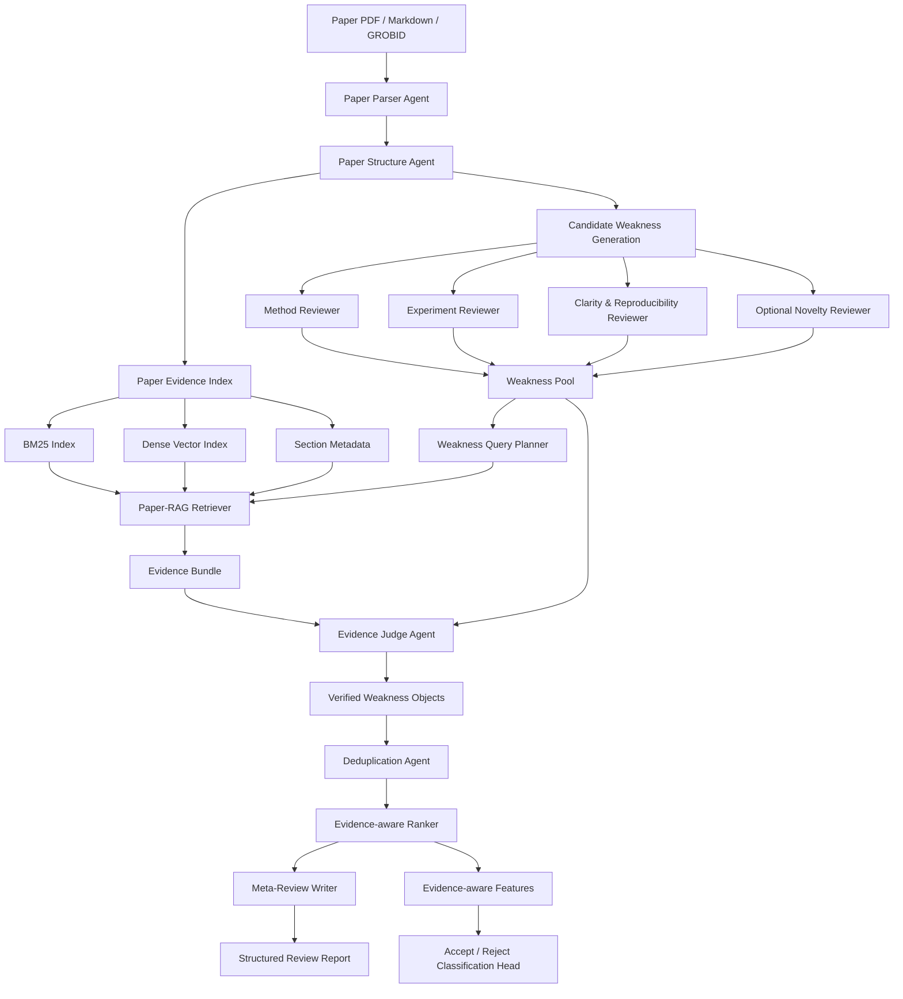

# 开题报告与研究方案：基于证据校验的轻量级学术论文自动评审与接收倾向分类系统研究

## 一、拟定题目

### 1.1 推荐题目

**基于证据校验的轻量级学术论文自动评审与接收倾向分类系统研究**

### 1.2 备选题目

**基于多智能体 RAG 的学术论文弱点评审生成与证据验证研究**

### 1.3 题目说明

本文建议采用第一个题目。该题目突出三个关键信息：

1. **证据校验**：区别于普通大语言模型直接生成评审文本，本文强调每条弱点评审意见都需要回到论文证据中验证。
2. **轻量级自动评审**：不做替代人类审稿人的全功能系统，而是做面向投稿前自检和审稿辅助的工具。
3. **接收倾向分类**：分类任务作为辅助实验，用证据化评审特征提升分类可解释性。

本文系统命名为 **EviReview-Lite**。其核心定位是：

> 先生成候选弱点评审意见，再用论文内部证据和可选外部文献证据对每条弱点进行检索、校验、过滤和排序，最终输出带证据锚点的结构化评审报告，并将证据化评审特征用于论文接收倾向分类辅助实验。

## 二、研究背景与意义

### 2.1 研究背景

近年来，人工智能、自然语言处理、机器学习等领域的论文数量快速增长，顶级会议和期刊面临越来越大的审稿压力。以 ICLR、NeurIPS、ACL 等会议为代表，审稿人需要在有限时间内阅读大量论文、判断创新性、检查实验充分性并给出建设性意见。传统同行评审机制虽然仍是学术质量控制的核心环节，但存在以下问题：

1. **审稿负担持续增加**：投稿数量增长快于合格审稿人数量，单个审稿人承担的阅读和评估压力增大。
2. **评审质量不稳定**：不同审稿人的研究背景、认真程度和判断标准不同，导致评审意见在深度、具体性和可操作性上存在差异。
3. **评审意见证据性不足**：实际评审中常出现“实验不充分”“创新性不足”“表述不清”等泛化意见，但没有明确指出对应章节、表格、实验结果或相关文献依据。
4. **大语言模型自动评审仍不可靠**：LLM 能生成流畅、结构化的评审文本，但容易出现幻觉、误读论文、泛化批评、遗漏关键实验细节等问题。

因此，自动论文评审系统的合理目标不是替代人类审稿人，而是作为辅助工具：帮助作者在投稿前发现潜在弱点，帮助审稿人快速定位需要重点核查的问题，并提升评审意见的证据性、具体性和可解释性。

### 2.2 研究意义

本课题具有以下研究意义：

第一，从自动评审任务本身看，现有方法大多关注“能否生成完整 review”，但对“生成的每条评审意见是否成立”关注不足。本文将自动评审拆解为弱点生成、证据检索、证据校验、排序整合四个步骤，使评审过程更可控。

第二，从 RAG 技术应用看，普通 RAG 通常用于回答问题或生成摘要，而本文将 RAG 用于**评审意见级证据审计**：以每条候选弱点为检索和判断单位，检查它是否被论文内容支持、是否已被论文解决、是否过于泛化或与论文事实相矛盾。

第三，从实验可行性看，本文不训练大模型，也不要求完整复现复杂多智能体审稿平台，而是在可获取的 OpenReview、PRISM、PeerRead 等数据上构建轻量级系统，工作量适合硕士毕业论文。

第四，从实际应用看，系统输出不是不可解释的 accept/reject 结论，而是带 evidence anchor 的弱点列表、置信度和人工复核项，更适合作为论文修改、审稿辅助和研究训练工具。

## 三、国内外研究现状与文献综述

### 3.1 自动论文评审数据集与任务定义

早期自动论文评审研究主要围绕论文接收预测、评分预测和评审文本生成展开。

**PeerRead** 是自动论文评审研究中较经典的数据集，包含论文草稿、接收决策以及专家评审文本，支持论文接收预测、评分预测和评审生成等任务。它的优点是数据公开、任务定义清楚，适合作为接收倾向分类的备选数据来源；不足是数据年份较早，与当前 LLM 驱动的评审生成系统存在一定距离。

OpenReview 平台公开了 ICLR 等会议的投稿论文、评审文本、评分和最终决策，为当前自动评审研究提供了真实数据基础。PRISM 等工作进一步整理了 OpenReview 数据，使研究者可以更方便地获取论文、评审意见和 accept/reject 标签。本文计划优先使用 PRISM 或 OpenReview ICLR 子集作为主数据来源。

### 3.2 LLM 直接评审与可靠性研究

随着大语言模型能力提升，研究者开始探索 LLM 是否能够直接生成研究论文反馈。相关研究表明，LLM 在摘要概括、写作问题发现、实验建议等方面能够提供一定帮助，但也存在明显问题：

1. 输出常包含泛化意见，例如“缺少更多实验”“需要更清晰解释方法”；
2. 对专业细节、实验设置和新颖性判断不稳定；
3. 可能提出论文已经解决的问题；
4. 可能捏造不存在的实验、数据集或结论。

这说明单纯使用 LLM 直接写 review 不足以构成可靠系统。自动评审需要引入结构化流程、角色分工、证据检索和校验机制。

### 3.3 多智能体自动评审系统

多智能体自动评审系统试图模拟真实审稿过程，让不同 agent 分别从方法、实验、表达、新颖性等角度阅读论文，再由元评审者汇总意见。

**MARG: Multi-Agent Review Generation for Scientific Papers** 是本课题的重要生成端参考。MARG 使用多个 LLM agent 分别关注实验、清晰度、新颖性和影响力等方面，并通过 refinement 阶段整合评论。MARG 的优势是架构清晰、复现成本相对较低，适合作为候选弱点生成 baseline。

MARG 的关键问题也很明确：其高召回版本可以提出较多潜在问题，但 Precision 不高，输出评论数量较多，存在重复、泛化或不够准确的意见。因此，本文不把 MARG 作为最终系统，而是借鉴其“多角度生成候选意见”的思想，在生成后增加证据校验和排序模块。

**ReviewAgents** 和 **AgentReview** 等工作进一步证明多智能体角色分工可以模拟审稿流程，并提升评审结构性。但这类系统往往侧重完整评审过程模拟，工程复杂度较高。本文选择更轻量的 agent 设计，只保留与弱点发现和证据验证直接相关的 agent。

### 3.4 证据校验、Grounding 与 RAG 评审

自动评审系统的关键问题不是“能否生成评论”，而是“评论是否成立”。因此，近年来出现了证据化评审、grounded review 和 claim-level verification 方向。

**ReviewGrounder** 强调 rubric-guided 和 evidence-based critique，将评审质量拆解为贡献准确性、实验解释、比较分析、证据化批评、清晰度、覆盖度、建设性语气和错误声明等维度。它为本文提供了评价体系参考：评审意见不能只看流畅性，还应考察证据性、具体性和错误率。

**FactReview** 将自动评审转化为 evidence-grounded claim assessment。它对论文中的 claim、实验结果和方法结论进行证据判断，并输出 supported、partially supported、in conflict 等标签。本文借鉴其“细粒度声明验证”思想，但验证对象不是论文原始 claim，而是自动生成的 weakness。

**SubstanReview** 关注评审意见是否有证据支撑。其核心启发是：评审文本本身也应被拆解为可验证的 claim-evidence pair。本文进一步扩展为：不仅判断评审文本内部是否有解释，还主动检索论文正文证据，判断候选弱点是否真正成立。

**RAGChecker**、**RefChecker** 等工作说明，RAG 系统需要细粒度诊断检索和生成两个环节。本文借鉴这一思路，将系统评价拆分为 evidence retrieval quality、weakness verification quality 和 final review quality。

### 3.5 新颖性、相关工作与外部文献检索

论文评审中的新颖性判断常需要外部文献支持。ScholarPeer、OpenNovelty、NoveltyAgent 等工作将论文贡献点拆解为细粒度 novelty claim，并通过外部文献检索判断其新颖性和相关工作覆盖度。这些工作说明外部搜索对评审有价值，但工程依赖较重。

本文将外部文献检索作为可选增强模块，而不是主线任务。硕士论文主线优先完成 Paper-RAG，即基于当前论文全文的证据检索与校验；在时间允许时，再加入 Literature-RAG，用于新颖性和遗漏 baseline 的辅助判断。

### 3.6 接收倾向分类与评审质量评估

论文接收倾向分类通常使用论文全文、摘要、评审文本或 embedding 特征预测 accept/reject。DeepReview、PeerRead、RottenReviews 等数据和研究说明，评审质量、弱点数量、具体性、可操作性和事实性都与最终评价有关。

但如果直接用全文 embedding 做分类，模型可解释性不足。本文将证据校验后的弱点结果转化为结构化特征，例如 valid major weakness 数量、evidence coverage、unsupported rate、experiment weakness score 等，用于辅助 accept/reject 分类。分类不是本文主创新点，而是验证证据化评审特征是否具有下游价值。

### 3.7 研究空白

综合现有研究，本文关注以下空白：

1. 现有多智能体评审系统重视生成更多评审意见，但缺少对每条评审意见的证据校验。
2. 现有 RAG 和 claim verification 工作多用于论文 claim 或 novelty claim，较少直接用于过滤自动生成的 review weakness。
3. 现有 accept/reject 分类方法常依赖全文或评审文本表示，缺少可解释的证据化中间特征。
4. 复杂系统如 ScholarPeer、ReviewGrounder 工程成本较高，硕士课题需要一个可复现、可量化、边界清晰的轻量方案。

### 3.8 重点论文与本文系统模块映射

本文不是照搬某一篇论文，而是从几类代表工作中抽取可落地模块，形成一个轻量系统。

| 论文或方向 | 本文借鉴内容 | 本文如何简化或改进 |
|---|---|---|
| MARG | 多 agent 从不同维度生成候选评审意见 | 不把 MARG 当最终系统，只作为候选 weakness 生成思想或 baseline |
| ReviewGrounder | evidence-based critique、rubric-guided review quality | 不复现复杂训练和完整 grounding pipeline，改为 weakness-level verifier |
| FactReview | claim-level evidence assessment、supported/conflict 标签思想 | 将验证对象从论文 claim 改为自动生成的 weakness |
| SubstanReview | review claim 需要 evidence 支撑 | 主动检索论文正文证据，而不是只检查评审文本内部解释 |
| RAGChecker / RefChecker | 细粒度诊断 RAG 与 hallucination | 设计 Evidence Recall、Unsupported F1、Evidence Coverage 等指标 |
| ScholarPeer / OpenNovelty / NoveltyAgent | 外部文献和新颖性逐点分析 | 作为 Literature-RAG 可选扩展，不作为主线必做 |
| PeerRead / PRISM / DeepReview | 接收倾向分类数据和评价方式 | 使用证据化弱点特征提升分类可解释性 |

## 四、研究问题与研究目标

### 4.1 研究问题

本文拟回答以下研究问题：

**RQ1：如何设计一个轻量级多智能体流程，从论文中生成覆盖方法、实验、清晰度和可复现性的候选弱点评审意见？**

**RQ2：如何利用 Paper-RAG 对每条候选弱点进行证据检索，判断其是否被论文内容支持、是否已被论文解决、是否过于泛化或与论文事实矛盾？**

**RQ3：如何设计证据感知的 Meta-Reviewer Ranker，将大量候选弱点过滤、去重、排序为少量高质量核心问题？**

**RQ4：证据化弱点评审特征是否能够辅助论文接收倾向分类，并提升分类结果的可解释性？**

### 4.2 研究目标

本文拟实现以下目标：

1. 构建一个轻量级学术论文自动评审系统 EviReview-Lite。
2. 实现论文解析、结构识别、论文内部证据索引和 Hybrid Paper-RAG 检索。
3. 设计多角色弱点生成 agent，生成候选 weakness pool。
4. 设计 Weakness Evidence Verifier，为每条 weakness 输出标签、证据、理由和置信度。
5. 设计 Evidence-aware Ranker，对有效弱点进行去重、排序和结构化报告生成。
6. 构建小规模人工标注集，用于评估弱点验证和排序效果。
7. 在 OpenReview/PRISM/PeerRead 等数据上完成弱点评审质量实验和接收倾向分类辅助实验。

## 五、总体技术路线

### 5.1 核心思路

EviReview-Lite 的核心思路可以概括为：

```text
候选弱点生成负责“多找问题”
证据校验负责“判断问题是否成立”
元评审排序负责“保留最重要、最具体、最有证据的问题”
分类模块负责“验证证据化特征是否具有下游解释价值”
```

与直接让 LLM 写完整 review 不同，本文把自动评审拆成可检验的中间步骤。每条弱点都有独立输入、检索结果、验证标签和证据锚点，因此系统更容易评估和调试。

### 5.2 总体流程图

```text
┌────────────────────────────────────────────────────────────────────┐
│                         Input Layer                                │
│  Paper PDF / Markdown / GROBID full text / OpenReview metadata      │
└───────────────────────────────┬────────────────────────────────────┘
                                │
                                ▼
┌────────────────────────────────────────────────────────────────────┐
│ Stage 0. Paper Understanding & Evidence Indexing                   │
│                                                                    │
│  A0 Paper Parser Agent                                             │
│     - PDF/Markdown/GROBID 解析                                     │
│     - section / paragraph / table / figure caption 切分             │
│                                                                    │
│  A1 Paper Structure Agent                                          │
│     - 识别 Introduction / Method / Experiment / Limitation          │
│     - 抽取 datasets / baselines / metrics / claims                  │
│                                                                    │
│  R0 Paper Evidence Index                                           │
│     - BM25 index                                                   │
│     - Dense vector index                                           │
│     - section-aware metadata                                       │
└───────────────────────────────┬────────────────────────────────────┘
                                │
                                ▼
┌────────────────────────────────────────────────────────────────────┐
│ Stage 1. Candidate Weakness Generation                             │
│                                                                    │
│  A2 Method Reviewer Agent                                          │
│  A3 Experiment Reviewer Agent                                      │
│  A4 Clarity & Reproducibility Reviewer Agent                       │
│  A5 Optional Novelty Reviewer Agent                                │
│                                                                    │
│  Output: Candidate Weakness Pool W = {w1, w2, ..., wn}             │
└───────────────────────────────┬────────────────────────────────────┘
                                │
                                ▼
┌────────────────────────────────────────────────────────────────────┐
│ Stage 2. Weakness-oriented Paper-RAG                               │
│                                                                    │
│  A6 Weakness Query Planner Agent                                   │
│     - 将 weakness 改写为关键词 query / 语义 query / section query    │
│                                                                    │
│  R1 Paper-RAG Retriever                                            │
│     - BM25 + Dense + Rerank                                        │
│     - 检索论文内部 Top-K evidence                                  │
│                                                                    │
│  R2 Optional Literature-RAG Retriever                              │
│     - 检索相关工作、遗漏 baseline、SOTA 对比                         │
│                                                                    │
│  Output: Evidence Bundle E(wi)                                     │
└───────────────────────────────┬────────────────────────────────────┘
                                │
                                ▼
┌────────────────────────────────────────────────────────────────────┐
│ Stage 3. Evidence Verification                                     │
│                                                                    │
│  A7 Evidence Judge Agent                                           │
│     - 判断 weakness 与 evidence 的关系                              │
│     - 输出 label / confidence / reason / evidence_ids              │
│                                                                    │
│  Labels: Supported / Partially Supported / Covered / Generic       │
│          Unsupported / Contradicted                                │
│                                                                    │
│  Output: Verified Weakness Objects VW                              │
└───────────────────────────────┬────────────────────────────────────┘
                                │
                                ▼
┌────────────────────────────────────────────────────────────────────┐
│ Stage 4. Meta-reviewing & Ranking                                  │
│                                                                    │
│  A8 Deduplication Agent                                            │
│     - 合并重复或语义相近 weakness                                   │
│                                                                    │
│  A9 Evidence-aware Ranker Agent                                    │
│     - 按 evidence_strength / severity / specificity 排序             │
│                                                                    │
│  A10 Meta-Review Writer Agent                                      │
│     - 输出结构化 review                                            │
│     - 每条 weakness 附 evidence anchor                              │
└───────────────┬───────────────────────────────────┬────────────────┘
                │                                   │
                ▼                                   ▼
┌──────────────────────────────┐      ┌───────────────────────────────┐
│ Output A: Structured Review  │      │ Output B: Classification      │
│ - Top-K Major Weaknesses     │      │ A11 Classification Head       │
│ - Minor Weaknesses           │      │ - Accept / Reject tendency    │
│ - Questions                  │      │ - evidence feature explanation│
│ - Evidence Anchors           │      └───────────────────────────────┘
│ - Needs Human Check          │
└──────────────────────────────┘
```

### 5.3 Mermaid 架构图



## 六、系统架构设计

### 6.1 Stage 0：Paper Processor 与 Evidence Index

Stage 0 负责把原始论文转化为可检索、可引用的结构化证据库。

输入包括：

1. OpenReview / PRISM / PeerRead 中的论文 PDF；
2. MinerU、GROBID 或已有 Markdown 转换结果；
3. 元数据，例如标题、作者、会议、评分、接收决策和评审文本。

输出格式示例：

```json
{
  "paper_id": "iclr_2024_xxx",
  "title": "Paper Title",
  "abstract": "...",
  "blocks": [
    {
      "block_id": "p032",
      "section": "Experiments",
      "type": "paragraph",
      "text": "...",
      "order": 32
    }
  ],
  "tables": [
    {
      "table_id": "t02",
      "caption": "...",
      "nearby_text": "...",
      "section": "Experiments"
    }
  ],
  "metadata": {
    "datasets": ["..."],
    "baselines": ["..."],
    "metrics": ["Accuracy", "F1"]
  }
}
```

索引设计包括：

1. **BM25 索引**：用于关键词、数据集名、baseline 名和 metric 名精确匹配；
2. **Dense Vector 索引**：用于语义相似检索；
3. **Section-aware metadata**：记录每个证据块所属章节，使实验类弱点优先检索 Experiments、Ablation、Results，方法类弱点优先检索 Method、Algorithm、Model。

### 6.2 Stage 1：Candidate Weakness Generator

Stage 1 的目标不是生成完整评审，而是生成 8-12 条候选弱点。候选弱点越结构化，后续证据校验越容易。

Agent 设计如下：

| Agent | 职责 | 关注问题 | 是否必需 |
|---|---|---|---|
| A2 Method Reviewer | 检查方法设计 | 假设是否合理、模块是否解释充分、理论或算法设计是否清楚 | 必需 |
| A3 Experiment Reviewer | 检查实验充分性 | baseline、数据集、metric、ablation、统计显著性 | 必需 |
| A4 Clarity & Reproducibility Reviewer | 检查表达和复现 | 超参数、训练设置、实现细节、图表说明 | 必需 |
| A5 Novelty Reviewer | 检查新颖性和相关工作 | 遗漏相关工作、贡献是否只是组合已有方法 | 可选 |

统一输出格式：

```json
{
  "weakness_id": "w01",
  "weakness": "The paper lacks ablation studies for the retrieval module.",
  "aspect": "experiment",
  "severity": 4,
  "suggestion": "Add ablations that remove or replace the retrieval module.",
  "source": "structured_reviewer",
  "target_sections": ["Experiments", "Ablation"]
}
```

### 6.3 Stage 2：Weakness-oriented Paper-RAG

Stage 2 以每条 weakness 为单位进行检索，而不是对整篇论文做一次粗粒度检索。

#### 6.3.1 Query Planner

Query Planner 将自然语言 weakness 改写为三类 query：

```json
{
  "weakness_id": "w01",
  "keyword_query": "ablation retrieval module remove replace",
  "semantic_query": "Whether the paper evaluates the contribution of the retrieval module through ablation studies.",
  "section_query": ["Experiments", "Ablation", "Results"],
  "key_entities": ["retrieval module", "ablation"]
}
```

#### 6.3.2 Hybrid Retriever

Hybrid Retriever 包含三个步骤：

1. BM25 检索 Top-K1；
2. Dense Retrieval 检索 Top-K2；
3. 合并结果并按章节权重和语义相关性 rerank。

章节权重示例：

| weakness aspect | 优先检索章节 |
|---|---|
| method | Method、Approach、Algorithm、Model |
| experiment | Experiments、Results、Ablation、Evaluation |
| clarity | Method、Implementation Details、Appendix |
| reproducibility | Experimental Setup、Implementation、Appendix |
| novelty | Introduction、Related Work、Conclusion |

检索输出：

```json
{
  "weakness_id": "w01",
  "evidence": [
    {
      "evidence_id": "p045",
      "section": "Experiments",
      "type": "paragraph",
      "text": "...",
      "retrieval_score": 0.82
    },
    {
      "evidence_id": "t02",
      "section": "Experiments",
      "type": "table_caption",
      "text": "...",
      "retrieval_score": 0.77
    }
  ]
}
```

### 6.4 Stage 3：Weakness Evidence Verifier

Evidence Verifier 是本文核心模块。它判断 weakness 与 evidence 的关系，并输出可解释标签。

标签体系如下：

| 标签 | 含义 | 后续处理 |
|---|---|---|
| Supported | 论文证据支持该弱点，问题基本成立 | 保留 |
| Partially Supported | 部分成立，但表述过宽或需要收窄 | 保留并改写 |
| Covered | 论文已经处理该问题，候选弱点误判 | 删除或降权 |
| Generic | 评论太泛，缺少具体对象或证据锚点 | 降权或要求改写 |
| Unsupported | 找不到证据，可能是幻觉或误读 | 删除 |
| Contradicted | 与论文证据相反 | 删除并计入错误 |

Verifier 输出示例：

```json
{
  "weakness_id": "w01",
  "label": "Supported",
  "confidence": 0.84,
  "evidence_ids": ["p045", "t02"],
  "reason": "The retrieved experiment section reports overall performance but does not include an ablation that isolates the retrieval module.",
  "revised_weakness": "The experimental section reports overall results, but does not provide an ablation isolating the retrieval module.",
  "needs_human_check": false
}
```

### 6.5 Stage 4：Evidence-aware Meta-Reviewer Ranker

Stage 4 模拟真实审稿中的元评审整合过程。它不重新生成大量新意见，而是对 verified weakness objects 进行过滤、合并和排序。

主要步骤：

1. 删除 Unsupported、Contradicted 和明显 Covered 的弱点；
2. 对 Partially Supported 的弱点进行表述收窄；
3. 合并语义重复弱点；
4. 按证据强度、严重性、具体性、可操作性和置信度排序；
5. 输出 Top-K Major Weaknesses、Minor Weaknesses、Questions 和 Needs Human Check。

推荐排序公式：

```text
score(w) =
  0.30 * evidence_strength
+ 0.25 * severity
+ 0.20 * specificity
+ 0.15 * actionability
+ 0.10 * confidence
```

### 6.6 Stage 5：接收倾向分类辅助模块

分类模块不直接替代审稿决策，而是验证证据化评审特征是否对 accept/reject 预测有帮助。

特征设计：

```text
features =
  valid_major_weakness_count,
  valid_minor_weakness_count,
  unsupported_rate,
  covered_rate,
  generic_rate,
  evidence_coverage,
  avg_evidence_strength,
  top3_weakness_score,
  experiment_weakness_score,
  method_weakness_score,
  reproducibility_weakness_score,
  novelty_risk_score
```

分类器采用轻量模型即可：

1. Logistic Regression；
2. Linear SVM；
3. Random Forest；
4. Text embedding + Logistic Regression；
5. Text embedding + evidence-aware features。

## 七、Agent 详细设计

| 编号 | Agent | 输入 | 输出 | 主要作用 |
|---|---|---|---|---|
| A0 | Paper Parser Agent | PDF / Markdown / GROBID | blocks、tables、captions | 论文解析和切块 |
| A1 | Paper Structure Agent | blocks | sections、datasets、baselines、metrics、claims | 结构识别和元数据抽取 |
| A2 | Method Reviewer Agent | paper structure | method weaknesses | 生成方法类候选弱点 |
| A3 | Experiment Reviewer Agent | paper structure | experiment weaknesses | 生成实验类候选弱点 |
| A4 | Clarity & Reproducibility Reviewer Agent | paper structure | clarity/repro weaknesses | 生成表达和复现类弱点 |
| A5 | Novelty Reviewer Agent | paper + optional literature | novelty weaknesses | 可选新颖性弱点 |
| A6 | Weakness Query Planner Agent | weakness | retrieval queries | 将弱点转为检索任务 |
| R1 | Paper-RAG Retriever | queries + index | evidence bundle | 检索论文内部证据 |
| R2 | Literature-RAG Retriever | queries + external search | literature evidence | 可选外部文献证据 |
| A7 | Evidence Judge Agent | weakness + evidence | label、confidence、reason | 证据校验 |
| A8 | Deduplication Agent | verified weaknesses | merged weaknesses | 去重合并 |
| A9 | Evidence-aware Ranker Agent | merged weaknesses | ranked weaknesses | 排序 Top-K |
| A10 | Meta-Review Writer Agent | ranked weaknesses | structured review | 输出最终报告 |
| A11 | Classification Head | evidence features | accept/reject tendency | 分类辅助实验 |

## 八、RAG 设计方案

### 8.1 Paper-RAG 主线

Paper-RAG 是本文主线，检索范围仅限当前论文全文。这样做的原因是：

1. 数据更容易获取，不依赖实时联网；
2. 评估更稳定，可重复；
3. 大多数弱点评审，如实验缺失、实现细节不足、结论证据不足，都可以先通过论文内部证据判断；
4. 硕士论文工作量可控。

### 8.2 Evidence Block 设计

每个证据块包含：

```json
{
  "evidence_id": "p045",
  "paper_id": "iclr_2024_xxx",
  "section": "Experiments",
  "type": "paragraph",
  "text": "...",
  "prev_block_id": "p044",
  "next_block_id": "p046",
  "entities": ["dataset", "baseline", "metric"]
}
```

### 8.3 检索策略

本文拟比较三种检索方案：

| 检索方法 | 说明 | 用途 |
|---|---|---|
| BM25 | 关键词匹配 | baseline、dataset、metric 精确匹配 |
| Dense Retrieval | 语义向量匹配 | 自然语言弱点语义匹配 |
| Hybrid Retrieval | BM25 + Dense + rerank | 本文主方法 |

### 8.4 Literature-RAG 可选扩展

Literature-RAG 只作为扩展模块，用于以下场景：

1. 判断 related work 是否遗漏关键近作；
2. 判断 claimed novelty 是否已有类似工作；
3. 判断 baseline 是否明显缺失。

考虑到硕士论文可行性，本文不承诺大规模外部文献搜索，只在小规模样本上做扩展实验或案例分析。

## 九、关键算法与输出格式

### 9.1 候选弱点生成算法

```text
Input: paper structure S
Output: weakness pool W

1. Method Reviewer reads abstract + introduction + method sections.
2. Experiment Reviewer reads experiment + result + ablation sections.
3. Clarity Reviewer reads method + implementation + appendix sections.
4. Optional Novelty Reviewer reads introduction + related work.
5. Each reviewer outputs structured weaknesses.
6. Merge all weaknesses into W and assign weakness_id.
```

### 9.2 弱点证据校验算法

```text
Input: weakness wi, paper evidence index I
Output: verified weakness vwi

1. Generate keyword query, semantic query and section-aware query.
2. Retrieve evidence candidates by BM25 and dense retrieval.
3. Rerank evidence by retrieval score and section priority.
4. Judge relation between wi and evidence candidates.
5. Assign label:
   Supported / Partially Supported / Covered / Generic / Unsupported / Contradicted.
6. Output confidence, evidence_ids, reason and revised weakness.
```

### 9.3 最终评审报告输出格式

```markdown
## Summary
简要总结论文主题、方法和主要贡献。

## Strengths
- ...

## Major Weaknesses
1. [Supported, Confidence=0.84] ...
   Evidence: Section 4.2, Table 2, paragraph p045.
   Suggestion: ...

2. [Partially Supported, Confidence=0.71] ...
   Evidence: ...
   Suggestion: ...

## Minor Weaknesses
- ...

## Questions for Authors
- ...

## Needs Human Check
- ...

## Evidence Statistics
- Supported: ...
- Partially Supported: ...
- Generic: ...
- Unsupported: ...
- Evidence Coverage: ...
```

## 十、Baseline 与对比方案

### 10.1 弱点生成 Baseline

| 方法 | 说明 | 目的 |
|---|---|---|
| Direct LLM Weakness | 单模型直接生成弱点 | 最基础 baseline |
| Structured Prompt Weakness | 按方法、实验、清晰度分项生成 | 验证结构化 prompt 效果 |
| MARG-lite | 复现 MARG 的多 agent 弱点生成思想 | 生成端主 baseline |
| Full MARG | 若代码和数据顺利，再做完整对齐 | 可选强 baseline |

### 10.2 证据校验 Baseline

| 方法 | 说明 | 对比目的 |
|---|---|---|
| No Verification | 直接输出生成弱点 | 验证证据校验必要性 |
| LLM-only Filter | 不检索证据，只让 LLM 判断弱点是否有效 | 验证 RAG 是否必要 |
| BM25-RAG Verifier | 只使用 BM25 检索证据 | 检索 baseline |
| Dense-RAG Verifier | 只使用向量检索证据 | 检索 baseline |
| Hybrid-RAG Verifier | BM25 + Dense + section rerank | 本文主检索方案 |
| Ours Full | Hybrid-RAG + Evidence Judge + Ranker | 完整系统 |

### 10.3 排序与报告 Baseline

| 方法 | 说明 |
|---|---|
| Original Order | 保持生成顺序 |
| Severity-only Rank | 只按弱点严重性排序 |
| Evidence-only Rank | 只按证据强度排序 |
| Evidence-aware Rank | 综合证据强度、严重性、具体性、可操作性和置信度 |

### 10.4 分类 Baseline

| 方法 | 说明 |
|---|---|
| Majority Class | 多数类预测 |
| TF-IDF + Logistic Regression | 传统文本分类 baseline |
| TF-IDF + SVM | 传统强 baseline |
| Paper Embedding + Logistic Regression | 基于论文全文表示 |
| Weakness Text Embedding | 基于生成弱点文本 |
| Evidence-aware Features | 只使用证据化评审特征 |
| Text + Evidence-aware Features | 融合文本表示和证据化特征，作为本文分类主方法 |

## 十一、实验设计与评价指标

### 11.1 数据来源

本文计划使用以下数据：

| 数据集 | 用途 | 说明 |
|---|---|---|
| PRISM / OpenReview ICLR 子集 | 主数据 | 论文全文、评审文本、评分和接收决策较完整 |
| PeerRead | 分类备选数据 | 经典自动评审数据集，可做 accept/reject 分类 |
| CLAIMCHECK / SubstanReview 相关标注思想 | 标签设计参考 | 用于设计 evidence verification 标签体系 |
| RottenReviews | 质量维度参考 | 用于 factuality、vagueness、actionability 等指标设计 |

### 11.2 实验一：候选弱点生成质量评估

目标：比较不同生成方法生成候选弱点的覆盖度、具体性和冗余度。

对比方法：

1. Direct LLM Weakness；
2. Structured Prompt Weakness；
3. MARG-lite；
4. MARG-lite + Paper-RAG Verifier；
5. Ours Full。

评价指标：

| 指标 | 含义 | 预期方向 |
|---|---|---|
| Weakness Precision | 生成弱点中与人工评审或人工标注一致的比例 | 提升 |
| Weakness Recall | 覆盖人工主要弱点的比例 | 尽量保持 |
| Jaccard | 生成弱点集合与人工弱点集合重叠度 | 提升 |
| Average Weakness Count | 平均输出弱点数量 | 降低到合理范围 |
| Generic Rate | 泛化弱点比例 | 降低 |
| Redundancy Rate | 重复弱点比例 | 降低 |

### 11.3 实验二：证据校验效果评估

目标：评估 Evidence Verifier 是否能正确判断弱点有效性。

标注规模建议：

1. 选取 30-50 篇 ICLR 论文；
2. 每篇生成 8-12 条候选弱点；
3. 获得约 300-500 条 weakness；
4. 人工标注标签：Supported、Partially Supported、Covered、Generic、Unsupported、Contradicted。

评价指标：

| 指标 | 含义 |
|---|---|
| Accuracy | 标签预测准确率 |
| Macro-F1 | 多类别平均 F1 |
| Supported Precision | 系统保留弱点中真正成立的比例 |
| Unsupported F1 | 识别无证据或幻觉弱点的能力 |
| Evidence Coverage | 输出中带有效 evidence anchor 的比例 |
| Evidence Recall@K | Top-K 检索证据是否包含人工认为相关的证据 |

### 11.4 实验三：Top-K 核心弱点排序实验

目标：验证 Evidence-aware Ranker 是否能把最重要、最具体、最有证据的弱点排到前面。

评价指标：

| 指标 | 含义 |
|---|---|
| Top-3 Precision | Top-3 弱点中有效弱点比例 |
| Top-5 Precision | Top-5 弱点中有效弱点比例 |
| Average Evidence Score | Top-K 弱点平均证据强度 |
| Redundancy Rate | Top-K 中重复弱点比例 |
| Actionability Score | 人工评价弱点是否可操作 |
| Human Preference Win Rate | 人工比较两份报告时更偏好本文系统的比例 |

### 11.5 实验四：接收倾向分类辅助实验

目标：验证证据化弱点评审特征是否能辅助 accept/reject 分类。

分类任务：

```text
Input: paper text + generated verified weaknesses + evidence-aware features
Output: accept / reject tendency
```

评价指标：

| 指标 | 含义 |
|---|---|
| Accuracy | 分类准确率 |
| Macro-F1 | 类别不均衡下的综合性能 |
| AUC | 分类排序能力 |
| Feature Ablation | 去除证据化特征后性能变化 |

特征消融实验：

| 方法 | 目的 |
|---|---|
| Text only | 只用论文文本 |
| Weakness text only | 只用生成弱点文本 |
| Evidence features only | 只用证据化特征 |
| Text + evidence features | 验证融合效果 |
| Remove unsupported/generic features | 验证无效弱点比例是否有解释价值 |

### 11.6 指标改善的判定标准

本文不以“生成更多评论”为目标，而以“更少、更准、更有证据”为目标。实验中应按以下标准判断系统是否改善：

| 维度 | Baseline 常见问题 | 本文期望改善 | 判定方式 |
|---|---|---|---|
| Precision | MARG/Direct LLM 可能生成不成立弱点 | 保留弱点中有效弱点比例提高 | Weakness Precision、Supported Precision |
| Recall | 过滤后可能漏掉部分人工弱点 | 在 Precision 提升的同时尽量保持主要弱点覆盖 | Weakness Recall、Top-K Coverage |
| Generic Rate | 输出“实验不足”“表达不清”等泛化意见 | 泛化弱点减少，更多指向具体章节、表格、模块 | Generic Rate、Specificity Score |
| Evidence Coverage | 普通 review 很少附证据位置 | 每条 major weakness 附 section/table/paragraph evidence | Evidence Coverage、Evidence Recall@K |
| Redundancy | 多 agent 可能重复提出相似问题 | Top-K 中重复意见减少 | Redundancy Rate |
| Actionability | 弱点不一定能指导修改 | 输出具体可执行修改建议 | Actionability Score |
| Classification Explainability | 全文 embedding 分类难解释 | 分类结果可由证据化弱点特征解释 | Feature Ablation、特征重要性分析 |

若实验出现 Recall 小幅下降但 Precision、Evidence Coverage、Top-K Precision 明显提升，可以认为系统达成本文目标。因为本文定位是从候选池中筛出高质量核心弱点，而不是无约束地增加评论数量。

## 十二、为什么评审弱点而不是评审全部

本文选择“弱点评审”作为核心任务，而不是直接生成完整评审，原因如下：

第一，弱点最直接影响论文修改和接收倾向。审稿意见中的 summary、strengths、minor comments 有价值，但真正决定论文是否需要修改或是否可能被拒的通常是 major weaknesses。

第二，弱点是 LLM 自动评审最容易出错的部分。LLM 常生成看似合理但缺少证据的批评，例如“缺少 ablation”“baseline 不充分”“新颖性不足”。这些意见如果不验证，容易误导作者和审稿人。

第三，弱点更适合做细粒度标注和量化评估。完整 review 涉及摘要、优点、缺点、评分、建议、语气等多个维度，评价复杂；而 weakness 可以逐条标注 Supported、Generic、Unsupported 等标签，更适合硕士论文实验。

第四，弱点验证可以自然连接 RAG。每条弱点都可以转化为一个检索任务，寻找论文内部 evidence，再判断该弱点是否成立。这比对整篇 review 做整体判断更清晰。

第五，完整评审仍可作为最终输出。本文不是不生成完整报告，而是先保证 major weaknesses 可靠，再由 Meta-Review Writer 组织为结构化评审报告。

## 十三、与 MARG 的区别

MARG 与本文系统的关系是：MARG 主要负责生成候选评审意见，EviReview-Lite 重点解决候选意见的证据校验和排序。

| 维度 | MARG | EviReview-Lite |
|---|---|---|
| 核心目标 | 多 agent 生成评审文本 | 生成后逐条证据校验和排序 |
| 基本单位 | review comments | weakness-evidence pair |
| 优势 | Recall 高，能提出较多候选问题 | Precision、证据性、具体性更强 |
| 主要问题 | 候选意见多，存在泛化和误判 | 需要额外检索和验证成本 |
| RAG 使用 | 非核心 | 核心模块 |
| 输出 | 评审意见集合 | 带标签、证据、置信度的结构化报告 |
| 分类任务 | 非重点 | 使用证据化弱点特征辅助分类 |

本文不是简单复现 MARG，也不是完全替代 MARG，而是在其高召回生成思想基础上加入：

1. Weakness Query Planner；
2. Paper-RAG Evidence Retriever；
3. Evidence Judge；
4. Evidence-aware Ranker；
5. Evidence-aware classification features。

## 十四、预期创新点

### 14.1 创新点一：评审弱点级证据校验机制

本文提出以 weakness 为基本单位的证据校验流程。系统不直接相信 LLM 生成的评审意见，而是为每条 weakness 检索论文内部证据，并判断其是否 Supported、Covered、Generic、Unsupported 或 Contradicted。

该创新点的价值在于：

1. 降低自动评审中的幻觉和误读；
2. 提升最终评审意见的证据性；
3. 使自动评审从整段文本生成转向细粒度可验证判断。

### 14.2 创新点二：面向弱点评审的结构感知 Hybrid Paper-RAG

本文设计 section-aware Paper-RAG。不同类型弱点会优先检索不同章节，例如实验弱点优先检索 Experiments 和 Ablation，方法弱点优先检索 Method 和 Algorithm。

该设计比普通全文 RAG 更适合论文评审场景，因为论文具有明显结构，弱点类型与章节之间存在对应关系。

### 14.3 创新点三：证据感知元评审排序机制

本文设计 Evidence-aware Ranker，综合 evidence strength、severity、specificity、actionability 和 confidence，对候选弱点去重和排序，输出少量核心问题。

该模块解决 MARG 类方法“生成多但轻重不分”的问题，使系统输出更接近真实审稿中的 major concerns。

### 14.4 创新点四：证据化评审特征辅助接收倾向分类

本文将证据校验结果转化为结构化分类特征，例如有效 major weakness 数量、无证据弱点比例、证据覆盖率、实验弱点得分等，用于 accept/reject 分类。相比直接用全文 embedding，证据化特征更具可解释性。

## 十五、可行性分析与风险控制

### 15.1 技术可行性

本文不训练大模型，主要依赖：

1. 论文解析工具：MinerU、GROBID 或 Markdown；
2. 检索工具：BM25、sentence embedding、FAISS 或本地向量库；
3. LLM prompt agent：用于弱点生成、证据判断和报告组织；
4. 轻量分类器：Logistic Regression、SVM 或 Random Forest。

因此工程实现复杂度可控。

### 15.2 数据可行性

OpenReview、PRISM 和 PeerRead 均可在网络上获取，论文全文、评审文本和接收决策相对完整。若 PRISM 数据处理困难，可退回 OpenReview ICLR 子集；若论文 PDF 解析质量不足，可优先使用已有 Markdown 或 GROBID text。

### 15.3 风险与替代方案

| 风险 | 影响 | 替代方案 |
|---|---|---|
| PDF 解析质量不稳定 | 影响检索证据 | 优先使用 Markdown/GROBID；只保留正文、表格 caption 和章节标题 |
| 外部文献检索成本高 | 影响 novelty 判断 | Literature-RAG 作为可选扩展，主线只做 Paper-RAG |
| MARG 完整复现困难 | 影响 baseline | 实现 MARG-lite 或 Structured Prompt Weakness 作为可控 baseline |
| 人工标注成本高 | 影响 verifier 评估 | 控制在 300-500 条 weakness，并采用双人抽样复核 |
| 分类效果提升有限 | 影响分类实验 | 分类定位为辅助实验，重点分析可解释性和特征消融 |

## 十六、研究计划

| 阶段 | 时间 | 主要任务 | 预期产出 |
|---|---|---|---|
| 第 1 阶段 | 第 1-2 周 | 整理文献、确定数据集、完成开题报告 | 文献综述、系统方案 |
| 第 2 阶段 | 第 3-4 周 | 实现论文解析、章节切分和 evidence index | Paper Processor 原型 |
| 第 3 阶段 | 第 5-6 周 | 实现 Direct LLM、Structured Prompt、MARG-lite 弱点生成 | 候选弱点生成模块 |
| 第 4 阶段 | 第 7-8 周 | 实现 BM25、Dense、Hybrid Paper-RAG | 检索模块和检索实验 |
| 第 5 阶段 | 第 9-10 周 | 实现 Evidence Verifier 和标签输出 | 弱点证据校验模块 |
| 第 6 阶段 | 第 11 周 | 完成人工标注集与 verifier 评估 | 300-500 条标注 weakness |
| 第 7 阶段 | 第 12 周 | 实现 Meta-Reviewer Ranker 和最终报告生成 | 结构化评审报告 |
| 第 8 阶段 | 第 13 周 | 完成接收倾向分类实验和消融实验 | 分类结果与分析 |
| 第 9 阶段 | 第 14 周 | 整理实验结果、绘制图表、分析失败案例 | 实验章节初稿 |
| 第 10 阶段 | 第 15 周 | 完成论文撰写、修改和答辩材料 | 毕业论文与展示材料 |

## 十七、预期成果

本文预期形成以下成果：

1. 一个轻量级学术论文自动评审原型系统 EviReview-Lite；
2. 一套 weakness-level evidence verification 流程；
3. 一个小规模人工标注的 weakness-evidence 评估集；
4. 弱点生成、证据校验、Top-K 排序和分类辅助实验结果；
5. 一份可解释的结构化自动评审报告输出模板；
6. 硕士毕业论文及相关实验代码、数据处理脚本和结果表格。

## 十八、论文框架安排

论文拟分为六章：

第一章：绪论。介绍研究背景、研究意义、研究问题和主要贡献。

第二章：相关工作。综述自动论文评审、多智能体评审、RAG、证据校验、接收倾向分类等研究。

第三章：系统设计。介绍 EviReview-Lite 的总体架构、Agent 设计、Paper-RAG 和 Evidence Verifier。

第四章：方法实现。详细说明论文解析、弱点生成、证据检索、标签判断、排序公式和分类特征。

第五章：实验与分析。介绍数据集、baseline、评价指标、主实验、消融实验、分类实验和案例分析。

第六章：总结与展望。总结本文贡献，分析不足，并讨论外部文献检索、代码执行验证和人机协同审稿等未来方向。

## 十九、参考文献与重点支撑论文

本文重点参考以下方向的论文和数据集：

1. MARG: Multi-Agent Review Generation for Scientific Papers.
2. ReviewGrounder: Grounded and Evidence-based Review Generation.
3. FactReview: Evidence-grounded Claim Assessment for Scientific Review.
4. SubstanReview: Review Claim Substantiation.
5. RAGChecker: Fine-grained Evaluation for RAG Systems.
6. RefChecker: Claim-level Hallucination Checking.
7. ScholarPeer: Search-enabled Multi-agent Scientific Reviewing.
8. OpenNovelty / NoveltyAgent: Point-wise Novelty Assessment.
9. PeerRead: A Dataset of Scientific Peer Reviews.
10. PRISM / OpenReview ICLR datasets.
11. DeepReview: Decision and Rating Prediction for Peer Review.
12. RottenReviews: Review Quality Assessment Dataset.

## 二十、最终研究方案摘要

本文最终研究方案可以压缩为一句话：

> 构建 EviReview-Lite 系统，用多角色 agent 生成候选弱点，用结构感知 Paper-RAG 为每条弱点检索证据，用 Evidence Verifier 判断弱点是否成立，再用 Evidence-aware Ranker 输出 Top-K 核心问题，并将证据化弱点特征用于接收倾向分类辅助实验。

该方案相较 MARG 的主要改进是：

1. 从“生成评审意见”扩展到“验证评审意见”；
2. 从“整段 review”转向“weakness-evidence pair”；
3. 从“候选意见数量多”转向“少量高质量、有证据、可操作的核心弱点”；
4. 从“不可解释分类”转向“基于证据化弱点特征的可解释分类”。

该课题边界明确、数据可获取、实验可量化、创新点集中，适合作为硕士毕业论文完成。
