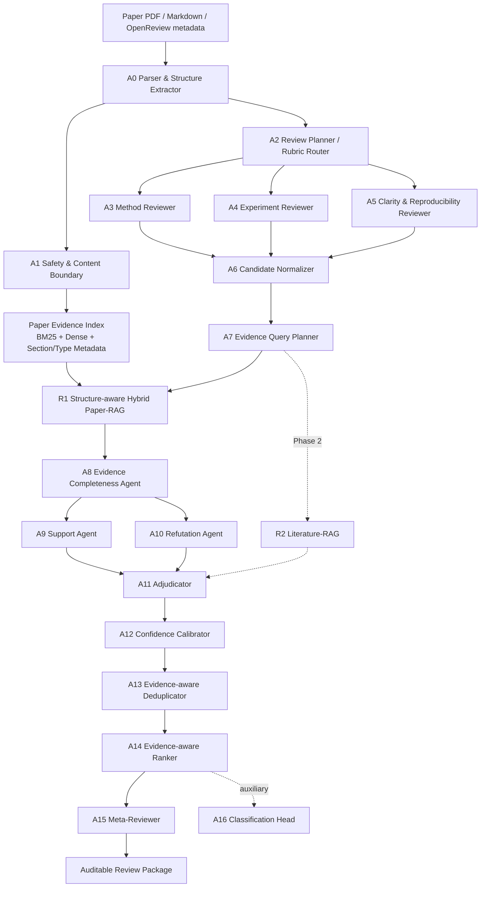

# 最新版开题报告：基于双向证据审计的轻量多 Agent RAG 学术论文自动评审与评估研究

日期：2026-06-12

状态：最新版开题报告。本文结合前期开题报告的研究目标、创新点与工作区 `参考论文/` 文献进行设计，不使用已归档实验结果论证方案有效性。

## 1. 推荐研究定位

### 1.1 推荐题目

> **基于双向证据审计的轻量多智能体 RAG 学术论文自动评审与评估研究**

备选题目：

> **面向可信论文评审的多智能体检索增强生成与证据审计方法研究**

“接收倾向分类”保留为辅助实验，不写入主标题。分类结果容易受到会议偏好、年份、领域和标签噪声影响，不适合作为系统可信性的主要证据。

### 1.2 系统定位

系统面向投稿前自检和人工审稿辅助，不替代审稿人作出接收或拒绝决策。核心任务是：

> 对自动生成的每条原子评审意见，检索论文内证据，固定建立支持与反驳案例并执行统一仲裁，最终输出少量、可追踪、可复核的核心问题。

### 1.3 研究边界

第一阶段主线：

1. 论文结构化解析与安全边界；
2. 多角度候选弱点生成；
3. 结构感知 Hybrid Paper-RAG；
4. 对每条意见固定执行支持、反驳与仲裁；
5. 证据感知去重、排序和报告；
6. 组件级、轨迹级和报告级评价。

第二阶段扩展：

1. Literature-RAG、遗漏 baseline 与逐点新颖性分析；
2. 证据化特征辅助接收倾向分类；
3. 多模态证据、代码执行验证和鲁棒性增强。

不作为主线：

1. 自动替代程序委员会作决策；
2. 大规模训练或强化学习；
3. 无边界的自由辩论或动态角色生成；
4. 仅依赖 LLM-as-a-Judge 宣称系统有效。

## 2. 两份开题报告的融合与改进

两份报告已经形成了正确的基础主线：

```text
候选弱点生成 -> Paper-RAG -> Evidence Verifier -> Meta-Reviewer Ranker
```

新设计保留其可实现性，并做四项改进：

| 原设计优点或问题 | 改进方式 |
| --- | --- |
| weakness-level evidence verification 是最清晰的核心创新 | 保留，以“原子评审意见”为系统最小处理单元 |
| 单一 Evidence Judge 容易遗漏反证或共享生成偏差 | 每条意见均由 Support Agent、Refutation Agent 与 Adjudicator 独立处理 |
| 动态路由和条件启用会降低流程可复现性 | 采用固定证据陪审流水线，通过批处理、缓存和候选预算控制成本 |
| `Supported/Covered/Generic/Unsupported` 混合不同语义 | 拆成证据关系、问题状态、动作、置信度四个独立字段 |
| Literature-RAG 和分类同时进入主线，范围偏大 | Literature-RAG 与分类降为第二阶段或辅助实验 |
| 只评价最终 review，难以定位失败模块 | 增加检索、支持、反驳、仲裁、停止原因和成本的轨迹级评价 |

## 3. 改进后的核心创新点

### 创新点一：评审意见级双向证据审计

普通 RAG 通常是“检索后生成”，原 EviReview-Lite 是“生成后验证”。新设计进一步将验证改为双向证据审计：

```text
候选意见
  -> 支持该意见成立的证据
  -> 反驳该意见或证明论文已覆盖问题的证据
  -> 证据充分性与冲突判断
  -> keep / rewrite / reject / human-check
```

该创新不是增加 Agent 数量，而是为每条候选意见固定建立可独立消融的支持、反驳和仲裁协议。主要验证指标为 Valid-Issue Precision、Covered/Refuted Recall、Evidence Attribution Accuracy 和 Abstention Quality。

### 创新点二：结构感知、证据类型感知的 Hybrid Paper-RAG

Query Planner 不只生成关键词和语义查询，还声明预期证据类型：

```json
{
  "aspect": "experiment",
  "target": "retrieval module",
  "expected_sections": ["Experiments", "Ablation", "Appendix"],
  "expected_evidence_types": ["table", "paragraph", "implementation_detail"],
  "queries": ["retrieval module ablation", "remove retriever component"]
}
```

检索器综合 BM25、dense retrieval、section prior、邻近块扩展和可选 reranker。与普通全文 RAG 的区别是：检索结果必须满足“与意见相关”且“证据类型足以支持判断”。

### 创新点三：固定证据陪审协议与结构化 Agent 协作

每条候选意见均执行同一条可复现流程：

1. Evidence Completeness Agent 检查证据集合是否覆盖目标章节、证据类型和邻近上下文；
2. Support Agent 独立形成支持案例；
3. Refutation Agent 独立形成反驳或已覆盖案例；
4. Adjudicator 对双方证据作统一裁决；
5. Confidence Calibrator 输出置信度和人工复核建议。

该设计避免动态路由造成的流程差异，使每条意见拥有完整且可比较的审计轨迹。效率优化不依赖跳过 Agent，而由候选意见数量上限、批量推理、检索缓存、共享论文索引和统一 token 预算实现。

### 创新点四：证据感知的去重、排序与人工复核

Ranker 不只按 severity 排序，而是在同一论文内部综合：

```text
rank_score =
  evidence_sufficiency
  + validity_probability
  + severity
  + specificity
  + actionability
  - redundancy
  - uncertainty_penalty
```

排序模块必须支持 abstention。证据不足的高风险意见进入 `human-check`，不能被强制写成确定结论。

### 辅助创新：证据化评审特征用于可解释分类

分类仅用于检验中间表示是否有下游价值。使用 `valid_major_count`、`covered_rate`、`evidence_sufficiency`、`experiment_risk`、`abstention_rate` 等结构化特征，与文本特征融合。该实验不得被表述为自动接收决策能力。

## 4. 新 Agent-RAG 总体架构



## 5. 每个 Agent 的用法

| Agent / 组件 | 用法与职责 | 输入 | 输出 | 执行方式 |
| --- | --- | --- | --- | --- |
| A0 Parser & Structure Extractor | 解析章节、段落、表格标题、图注、附录和实体 | PDF/Markdown | `paper_blocks`, `structure` | 固定 |
| A1 Safety & Content Boundary | 将论文文本视为不可信数据，隔离正文指令和自我评分 | blocks | `safe_blocks`, `safety_flags` | 固定 |
| A2 Review Planner | 按 rubric 将评审拆成方法、实验、复现性和一致性任务 | structure, rubric | `review_tasks[]` | 固定 |
| A3 Method Reviewer | 生成方法假设、设计和论证类原子弱点 | method blocks | `candidate_comments[]` | 按任务 |
| A4 Experiment Reviewer | 生成 baseline、数据集、指标、消融和统计类弱点 | experiment blocks | `candidate_comments[]` | 按任务 |
| A5 Clarity & Reproducibility Reviewer | 生成实现细节、表达和复现性弱点 | method/appendix | `candidate_comments[]` | 按任务 |
| A6 Candidate Normalizer | 原子化、去模板化、合并完全重复候选，统一 schema | candidates | `atomic_comments[]` | 固定 |
| A7 Evidence Query Planner | 为每条意见生成查询、预期章节和证据类型 | atomic comment | `query_plan` | 每条意见 |
| R1 Hybrid Paper-RAG | BM25+dense+section/type prior+邻近块扩展 | query, index | `evidence_bundle` | 每条意见 |
| A8 Evidence Completeness Agent | 对每条意见统一合并 Top-K 检索结果、目标章节结果和固定邻近块，检查证据覆盖 | comment, evidence | `complete_evidence_bundle` | 每条意见 |
| A9 Support Agent | 只负责寻找该意见成立的依据，不作最终决策 | comment, evidence | `support_case` | 每条意见 |
| A10 Refutation Agent | 主动寻找已覆盖、反例、矛盾和误读证据 | comment, evidence | `refutation_case` | 每条意见 |
| A11 Adjudicator | 对每条意见的支持与反驳证据作统一动作判定 | cases, evidence | `adjudication` | 每条意见 |
| A12 Confidence Calibrator | 校准置信度并决定是否 abstain | verdict, trace | `calibrated_verdict` | 每条意见 |
| A13 Deduplicator | 只在同一论文内合并语义和证据范围重复意见 | verified comments | `deduped_comments` | 固定 |
| A14 Ranker | 对有效意见排序并控制 Top-K | deduped comments | `ranked_comments` | 固定 |
| A15 Meta-Reviewer | 只组织已验证意见，不新增无证据批评 | ranked comments | `review_package` | 固定 |
| R2 Literature-RAG | 检索外部相关工作、遗漏 baseline 和新颖性证据 | novelty query | `literature_evidence` | 第二阶段 |
| A16 Classification Head | 用证据化特征做辅助 accept/reject tendency 分类 | evidence features | probability, explanation | 辅助实验 |

## 6. 关键数据协议：修正标签语义混合

原方案的 `Supported / Covered / Generic / Unsupported / Contradicted` 同时混合了证据关系、评论质量和处理动作，容易造成标注不一致。新设计采用四轴输出：

### 6.1 证据关系 `evidence_relation`

- `supports_issue`：证据支持该问题成立；
- `refutes_issue`：证据表明问题不成立或已被论文解决；
- `mixed`：支持与反驳证据同时存在；
- `insufficient`：证据不足。

### 6.2 问题状态 `issue_status`

- `valid`：问题成立；
- `partially_valid`：方向成立但表述过强；
- `covered`：论文已处理该问题；
- `generic`：没有明确对象或可检验内容；
- `misread`：误读或与论文事实矛盾；
- `uncertain`：当前无法可靠判断。

### 6.3 处理动作 `action`

- `keep`
- `rewrite`
- `reject`
- `human_check`

### 6.4 置信度与停止原因

```json
{
  "comment_id": "w01",
  "evidence_relation": "mixed",
  "issue_status": "partially_valid",
  "action": "rewrite",
  "confidence": 0.73,
  "evidence_sufficiency": 0.81,
  "support_evidence_ids": ["p045"],
  "refutation_evidence_ids": ["p071"],
  "stop_reason": "adjudicated_rewrite",
  "needs_human_check": false
}
```

合法停止原因包括 `adjudicated_keep`、`adjudicated_rewrite`、`adjudicated_reject`、`adjudicated_human_check` 和 `safety_blocked`。除安全阻断外，每条候选意见均经过 Adjudicator 后结束。

## 7. 完整实验流程

### E0：数据与协议准备

1. 选择 ready-label 主数据；
2. 将论文解析为带章节和证据类型的块；
3. 统一候选意见、证据、判断、动作和 trace schema；
4. 预注册主指标、预算和失败条件。

### E1：候选弱点生成实验

比较 Direct LLM、Structured/Rubric Reviewer、MARG-lite 和 Planner+Specialist Reviewers。目标是获得高召回候选池，不在此阶段宣称最终评论可信。

### E2：Paper-RAG 检索实验

比较 BM25、Dense、Hybrid、Hybrid+Section Prior、Hybrid+Section/Type Prior。以 Evidence Recall@K、MRR、nDCG@K 和 evidence-type match 评价。

### E3：意见验证主实验

比较 No Verification、LLM-only Judge、Single Judge+Paper-RAG、Support-only、Support+Refutation、Support+Refutation+Adjudicator。评价问题状态分类、证据归因和错误意见过滤。

### E4：固定证据陪审与效率实验

比较：

1. 固定单 Judge；
2. Support+Adjudicator；
3. Refutation+Adjudicator；
4. 本文固定 Support+Refutation+Adjudicator；
5. 本文完整方法 + 批处理、缓存和候选预算控制。

同时报告质量、token、调用数、延迟和单条有效意见成本，验证完整证据陪审的收益及工程优化效果。

### E5：去重、排序与最终报告实验

比较 Original Order、Severity-only、Evidence-only 和 Evidence-aware Ranker。评价 Top-K Precision、human weakness coverage、redundancy、actionability、groundedness 和 abstention。

### E6：辅助与扩展实验

1. Literature-RAG：逐点新颖性与遗漏 baseline 案例；
2. 分类：文本特征、证据特征及二者融合；
3. 鲁棒性：提示注入、论文自我评价、仅改变表达不改变证据的 presentation perturbation；
4. 可选多模态和代码执行验证。

## 8. Baseline 设计

### 8.1 主 baseline

| 层级 | Baseline | 对比目的 |
| --- | --- | --- |
| 生成 | Direct LLM Reviewer | 最低单 Agent 基线 |
| 生成 | Structured/Rubric Reviewer | 控制结构化 prompt 贡献 |
| 生成 | MARG-lite / MARG-S functional reproduction | 控制多 Agent 候选生成贡献 |
| 规划 | TreeReview functional reproduction | 对比动态问题树规划 |
| Grounding | ReviewGrounder-lite | 对比 drafting+grounding 编排 |
| 审计 | Single Evidence Judge + Paper-RAG | 原 EviReview-Lite 核心基线 |
| 审计 | Support-only / Refutation-only + Adjudicator | 对比双向核验的必要性 |
| 本文 | Fixed Support+Refutation+Adjudication Evidence Audit | 完整方法 |

“复现”必须区分：

- strict reproduction：原数据、原模型和原配置；
- functional reproduction：复现角色、消息协议和流程，允许统一 backbone；
- component-aligned baseline：只复现可独立比较的关键模块。

### 8.2 数据集建议

| 数据或 benchmark | 主要用途 | 监督边界 |
| --- | --- | --- |
| CLAIMCHECK | weakness-claim 关联、弱点标签、grounded critique | 专家 gold，主验证数据 |
| PeerReview Bench / ReviewBench | correctness、significance、evidence、rubric quality | 按原 benchmark 声明 |
| PeerQA-XT | 论文内证据检索 | ready-label retrieval |
| SubstanReview | 评审主张是否有论证支撑 | 辅助 evidence task |
| ARIES / MARG 数据 | 候选评论覆盖与 MARG 对齐 | 生成任务数据 |
| OpenReview / PRISM | 论文、评审、评分、决策 | 真实但标签噪声需说明 |
| PeerRead / DeepReview-13K | 辅助分类和评分预测 | 不作为可信评审 gold |
| RottenReviews / ReviewEval | 报告质量维度 | 人工或 Judge 边界分别报告 |

优先使用现成标签完成主实验；如需自建数据，只补充小规模冲突、反证和鲁棒性测试集，不把大量人工标注作为项目成立前提。

## 9. 评价标准与成功判定

### 9.1 组件级指标

| 组件 | 指标 |
| --- | --- |
| Candidate Generation | Weakness Recall、Precision、Generic Rate、平均候选数 |
| Retrieval | Evidence Recall@K、MRR、nDCG@K、Evidence-type Match |
| Verification | Macro-F1、Valid-Issue Precision、Covered/Refuted Recall、Evidence Attribution Accuracy |
| Collaboration | Support/Refutation Agreement、Adjudication Accuracy、Stop-reason Accuracy |
| Calibration | ECE、Brier Score、Risk-Coverage、Selective Accuracy |
| Dedup/Ranking | Top-3/5 Precision、nDCG、Redundancy Rate、Human Weakness Coverage |
| Efficiency | Agent Calls、Tokens、Latency、Cost per Retained Valid Issue |
| Robustness | Attack Success Rate、Presentation Invariance、Safety-block Precision |

### 9.2 报告级指标

1. factuality / groundedness；
2. specificity；
3. coverage of major issues；
4. actionability；
5. constructiveness；
6. evidence traceability；
7. compactness；
8. human preference，仅作为综合辅助指标。

### 9.3 最低成功条件

完整系统只有同时满足以下条件，才能支持核心创新：

1. 相比 Single Judge+Paper-RAG，提高有效意见 Precision 或 Covered/Refuted Recall；
2. 相比 Single Judge+Paper-RAG，固定证据陪审在相同候选预算下提高判断质量，并报告其额外成本；
3. Top-K Precision 提升时，human weakness coverage 不出现不可接受的大幅下降；
4. Evidence Attribution Accuracy 提升，而不是只增加 evidence anchor 数量；
5. 置信度或 abstention 能识别高风险错误，不能把所有不确定意见简单删除；
6. 所有主要结果区分 human gold、silver、proxy 和 diagnostic 指标。

## 10. 消融与失败分析

必做消融：

1. 去掉 Refutation Agent；
2. 去掉 Adjudicator；
3. 去掉 Evidence Completeness Agent；
4. 去掉 section prior；
5. 去掉 evidence-type prior；
6. 去掉邻近块扩展；
7. 去掉 confidence calibration；
8. 去掉 evidence-aware dedup；
9. 同 backbone 与异 backbone 支持/反驳对比；
10. 去掉安全边界。

失败类型必须单独统计：

- retrieval miss；
- retrieved-but-not-used；
- wrong evidence attribution；
- support/refutation shared bias；
- adjudicator majority bias；
- over-filtering；
- false certainty；
- budget exhaustion；
- presentation-induced judgment shift；
- prompt injection / untrusted-content failure。

## 11. 参考文献到系统模块的映射

| 参考工作 | 可借鉴内容 | 本文不直接照搬的部分 |
| --- | --- | --- |
| MARG (2024) | 多角色候选意见生成、specificity/coverage | 不把更多 Agent 或更多评论视为最终目标 |
| RAGChecker (2024) | 检索与生成分离诊断 | 指标需改造成意见级证据审计 |
| RefChecker (2024) | 细粒度 claim checking | 验证对象改为评审意见及其证据关系 |
| CLAIMCHECK (2025) | claim-grounded weakness 专家标注与任务 | 不把单一标签预测等同于完整评审 |
| TreeReview (2025) | 动态问题分解与效率对照 | 问题树深度不等于证据可信 |
| ReviewEval (2025) | 完整报告多维评价 | 不用综合 Judge 分数替代组件级事实验证 |
| DeepReview (2025) | 结构化分析、文献检索与论证 | 完整训练不是本课题必要条件 |
| FactReview (2026) | claim-level evidence report、文献与执行验证 | 代码执行验证放第二阶段 |
| ReviewGrounder (2026) | rubric-guided drafting+grounding | 本文进一步为每条意见固定建立支持、反驳与仲裁协议 |
| DeepReviewer 2.0 (2026) | traceable package、evidence/risk ledger、export gate | 保持轻量，不要求大模型全流程 |
| AgenticRAGTracer (2026) | hop/step-level 轨迹诊断 | 将轨迹评价迁移到评审审计流程 |
| EGTR-Review (2026) | 证据状态与多 Agent 教师低成本化 | 蒸馏仅作为后续方向 |

## 12. 可选的新创新方向

以下方向有文献依据，但不建议全部进入主线。

### 方向 A：主动调查式 Reviewer

最新 ProReviewer 将评审建模为主动调查，并维护结构化 review log。可以将本文的 evidence trace 升级为“调查日志”，让 Query Planner 根据已发现证据决定下一步。但该方向涉及策略学习，建议先作为规则驱动扩展，不立即引入 RL。

### 方向 B：表达不变性与证据锚定鲁棒性

近期研究显示，在科学证据不变时，只改写摘要、贡献表述和 related work 也可能显著改变 AI reviewer 判断。可以构造 `presentation-invariance` 测试：同一证据内容的不同表达版本应得到相近的问题状态和置信度。该方向新颖、实验清晰，适合作为鲁棒性扩展。

### 方向 C：多模态证据审计

PaperGuard 强调图像和文本中的攻击与证据风险。可在后续把表格、图注和关键图像加入 evidence bundle；第一阶段先使用表格标题、图注和邻近文本，避免多模态范围失控。

### 方向 D：多 Agent 教师到轻量学生

EGTR-Review 提示可将昂贵的多 Agent 轨迹蒸馏到轻量模型。本文完成可信多 Agent 教师后，可把 query planning、证据状态和动作预测蒸馏为学生模型。该方向适合作为后续论文，不应阻塞硕士主线。

### 方向 E：论文内 claim-evidence-risk ledger

借鉴 DeepReviewer 2.0，可在候选意见生成前建立论文内部 claim-evidence-risk ledger，再让 Reviewer 针对风险缺口提出问题。它可能提高覆盖率和可追踪性，但实现复杂度高于当前 weakness-first 主线，建议作为与 Planner 的消融对照。

## 13. 推荐实施顺序

1. 固定 schema、标签四轴和评估边界；
2. 完成 Direct、Structured、MARG-lite、Single Judge+Paper-RAG 基线；
3. 完成结构/证据类型感知检索实验；
4. 加入 Support 与 Refutation，完成意见验证主实验；
5. 加入固定 Adjudicator，完成完整证据陪审与质量-成本实验；
6. 完成去重、排序、报告与校准；
7. 做表达不变性和安全鲁棒性实验；
8. 最后再做 Literature-RAG 与分类辅助实验。

## 14. 参考文献与可核验入口

核心参考文献均优先使用工作区 `参考论文/` 中的本地 PDF/Markdown，并以以下原始论文入口核验：

1. MARG: Multi-Agent Review Generation for Scientific Papers. https://arxiv.org/abs/2401.04259
2. RAGChecker: A Fine-grained Framework for Diagnosing Retrieval-Augmented Generation. https://arxiv.org/abs/2408.08067
3. RefChecker: Reference-based Fine-grained Hallucination Checker and Benchmark for Large Language Models. https://arxiv.org/abs/2405.14486
4. CLAIMCHECK: How Grounded are LLM Critiques of Scientific Papers? https://arxiv.org/abs/2503.21717
5. TreeReview: A Dynamic Tree of Questions Framework for Deep and Efficient LLM-based Scientific Peer Review. https://arxiv.org/abs/2506.07642
6. ReviewEval: An Evaluation Framework for AI-Generated Reviews. https://arxiv.org/abs/2502.11736
7. DeepReview: Improving LLM-based Paper Review with Human-like Deep Thinking Process. https://arxiv.org/abs/2503.08569
8. FactReview: Evidence-Grounded Reviews with Literature Positioning and Execution-Based Claim Verification. https://arxiv.org/abs/2604.04074
9. ReviewGrounder: Improving Review Substantiveness with Rubric-Guided, Tool-Integrated Agents. https://arxiv.org/abs/2604.14261
10. DeepReviewer 2.0: A Traceable Agentic System for Auditable Scientific Peer Review. https://arxiv.org/abs/2604.09590
11. AgenticRAGTracer: A Hop-Aware Benchmark for Diagnosing Multi-Step Retrieval Reasoning in Agentic RAG. https://arxiv.org/abs/2602.19127
12. EGTR-Review: Efficient Evidence-Grounded Scientific Peer Review Generation via Multi-Agent Teacher Distillation. https://arxiv.org/abs/2606.06025
13. From Passive Generation to Investigation: A Proactive Scientific Peer Review Agent. https://arxiv.org/abs/2606.13349
14. Does AI Reviewer See the Full Picture? Attacking and Defending Multimodal Peer Review. https://arxiv.org/abs/2606.12716
15. No Hidden Prompts Needed! You Can Game AI Peer Review with Presentation-Only Revisions. https://arxiv.org/abs/2606.13044

## 15. 最终建议

最适合作为硕士论文主贡献的组合是：

> **意见级双向证据审计 + 固定证据陪审协议 + 证据感知 Top-K 元评审。**

该组合比“普通 Multi-Agent + RAG + 分类”更集中，也比完整主动调查、强化学习、代码执行和多模态审查更可控。分类、Literature-RAG、蒸馏和多模态应作为辅助实验或后续方向，避免主线因范围过大而无法形成可信结论。
