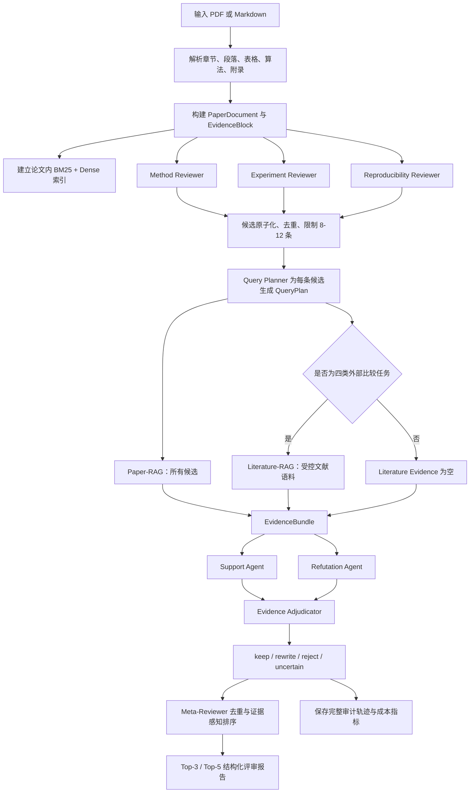

# EviReview-Lite Agent-RAG Experiment Implementation Plan

> **For agentic workers:** REQUIRED SUB-SKILL: Use superpowers:subagent-driven-development (recommended) or superpowers:executing-plans to implement this plan task-by-task. Steps use checkbox (`- [ ]`) syntax for tracking.

**Goal:** 从零实现并验证一套面向单篇学术论文的多 Agent、双 RAG、双向证据审计自动评审后端，并完成 E0-E6 可复现实验。

**Architecture:** 采用 Controller-Service-DAO 后端分层，Agent 与 RAG 作为 Service 编排的独立领域模块；使用固定状态机执行八个 Agent，不进行自由讨论或人工复核。实验先验证 Paper-RAG、双向审计和 Meta-Reviewer 三个核心组件，再运行受控 Literature-RAG 与端到端评审。

**Tech Stack:** Python 3.11、FastAPI、Pydantic v2、LangGraph、httpx、rank-bm25、sentence-transformers、Qdrant Client、pandas、scipy、statsmodels、PyYAML、pytest。

---

## 1. 研究边界与核心结论

本计划以[最新开题报告](最新开题报告.md)为唯一研究设计基准，不复用旧实验结果。

### 1.1 系统最终回答什么问题

给定一篇论文，系统自动生成少量、具体、可追溯的主要弱点。每条最终意见必须同时包含：

- 原子化 weakness；
- 对应论文内部证据；
- 需要时提供受控外部文献证据；
- 支持案例与反驳案例；
- `keep` 或 `rewrite` 自动裁决；
- 置信度、排序分数和证据 ID。

系统不输出自动接收或拒绝决定；`reject` 和 `uncertain` 候选只保留在审计轨迹，不进入最终 Top-K。

### 1.2 固定 Agent 与 RAG 数量

| 类型 | 数量 | 组件 |
| --- | ---: | --- |
| Reviewer Agent | 3 | Method、Experiment、Reproducibility |
| 规划 Agent | 1 | Query Planner |
| 审计 Agent | 3 | Support、Refutation、Evidence Adjudicator |
| 汇总 Agent | 1 | Meta-Reviewer |
| RAG | 2 | Paper-RAG、Literature-RAG |

候选弱点生成是必要上游，不作为独立创新。核心创新是：

1. 每条候选意见固定执行 Support、Refutation、Adjudication 的双向证据审计；
2. Paper-RAG 显式建模章节与证据类型，Literature-RAG 只处理四类外部比较任务；
3. Meta-Reviewer 使用双 RAG 证据、有效性、严重性和重复度完成过滤、改写与 Top-K 排序。

## 2. 给定一篇论文后的完整处理流程

### 2.1 单篇论文状态机



### 2.2 每一步的输入输出

1. **解析与索引**
   - 输入：PDF 或 Markdown。
   - 输出：标准章节、`EvidenceBlock[]`、论文内检索索引。
   - 表格标题、图标题、算法、实现细节和附录必须作为独立证据块。

2. **候选弱点生成**
   - 三个 Reviewer Agent 并行执行。
   - 每条候选只表达一个可验证问题，包含 `aspect`、`target`、`severity`、`weakness`、`suggestion`。
   - 普通 Candidate Normalizer 合并重复意见，将候选池限制为 8-12 条。

3. **查询规划**
   - Query Planner 声明关键词查询、语义查询、期望章节、期望证据类型、是否需要 Literature-RAG。
   - `literature_required` 只能在 `novelty`、`related_work`、`missing_baseline`、`external_comparison` 中为真。

4. **双 RAG 检索**
   - Paper-RAG 固定执行：BM25 + Dense -> RRF -> Section Prior -> Evidence-Type Prior -> Neighbor Expansion。
   - Literature-RAG 按固定类型执行：受控语料 Hybrid Retrieval -> 年份/主题/引用过滤 -> 引用 ID 核验。

5. **双向证据审计**
   - Support Agent 只构建“该弱点成立”的最佳证据链。
   - Refutation Agent 只构建“论文已覆盖、意见误读或存在反例”的最佳证据链。
   - Evidence Adjudicator 比较双方证据，输出 `keep`、`rewrite`、`reject`、`uncertain`。

6. **Meta-Review**
   - 自动排除 `reject` 和 `uncertain`；
   - 对 `rewrite` 生成与证据一致的弱点；
   - 论文内语义去重；
   - 按证据充分性、有效概率、严重性、具体性、可操作性和重复度排序；
   - 输出 Top-3/Top-5，同时保存所有被过滤候选。

## 3. 核心数据协议

以下对象是模块间唯一允许传递的领域模型。

```python
from typing import Literal
from pydantic import BaseModel, Field

Aspect = Literal[
    "method", "experiment", "reproducibility", "novelty",
    "related_work", "missing_baseline", "external_comparison",
]
Decision = Literal["keep", "rewrite", "reject", "uncertain"]
EvidenceType = Literal[
    "paragraph", "table_caption", "figure_caption", "algorithm",
    "implementation_detail", "appendix", "absence_signal",
]

class EvidenceBlock(BaseModel):
    block_id: str
    paper_id: str
    section: str
    evidence_type: EvidenceType
    text: str
    ordinal: int

class CandidateWeakness(BaseModel):
    candidate_id: str
    paper_id: str
    aspect: Aspect
    target: str
    weakness: str
    severity: Literal["minor", "major"]
    suggestion: str
    source_agent: str

class QueryPlan(BaseModel):
    candidate_id: str
    keyword_queries: list[str]
    semantic_query: str
    expected_sections: list[str]
    expected_evidence_types: list[EvidenceType]
    literature_required: bool

class EvidenceItem(BaseModel):
    evidence_id: str
    source: Literal["paper", "literature"]
    text: str
    score: float
    section: str | None = None
    document_id: str | None = None
    url: str | None = None

class EvidenceBundle(BaseModel):
    candidate_id: str
    paper_evidence: list[EvidenceItem]
    literature_evidence: list[EvidenceItem]

class AuditCase(BaseModel):
    candidate_id: str
    stance: Literal["support", "refutation"]
    claim: str
    evidence_ids: list[str]
    strength: float = Field(ge=0, le=1)
    rationale: str

class AdjudicationResult(BaseModel):
    candidate_id: str
    decision: Decision
    confidence: float = Field(ge=0, le=1)
    evidence_ids: list[str]
    reason: str
    rewritten_weakness: str | None = None

class RankedWeakness(BaseModel):
    candidate_id: str
    weakness: str
    evidence_ids: list[str]
    confidence: float
    rank_score: float

class ReviewReport(BaseModel):
    paper_id: str
    summary: str
    top_weaknesses: list[RankedWeakness]
    trace_path: str
```

## 4. 后端架构与项目目录

项目不是传统 MVC：没有前端 View，核心是批处理实验与后端评审服务。因此采用 Controller-Service-DAO 分层，Agent/RAG 是领域能力，Evaluation 是实验能力。

```text
实验/
├── README.md
├── pyproject.toml
├── .env.example
├── conf/
│   ├── base.yaml
│   ├── models.yaml
│   ├── retrieval.yaml
│   └── experiments/
│       ├── e0_data.yaml
│       ├── e1_generation.yaml
│       ├── e2_paper_rag.yaml
│       ├── e3_literature_rag.yaml
│       ├── e4_audit.yaml
│       ├── e5_ranker.yaml
│       └── e6_end_to_end.yaml
├── src/evireview/
│   ├── controller/
│   │   ├── review_controller.py
│   │   └── experiment_controller.py
│   ├── service/
│   │   ├── paper_ingestion_service.py
│   │   ├── review_pipeline_service.py
│   │   └── experiment_service.py
│   ├── agent/
│   │   ├── base.py
│   │   ├── reviewers.py
│   │   ├── query_planner.py
│   │   ├── support_agent.py
│   │   ├── refutation_agent.py
│   │   ├── evidence_adjudicator.py
│   │   └── meta_reviewer.py
│   ├── rag/
│   │   ├── paper_rag.py
│   │   ├── literature_rag.py
│   │   ├── bm25.py
│   │   ├── dense.py
│   │   ├── fusion.py
│   │   ├── priors.py
│   │   └── index_store.py
│   ├── dao/
│   │   ├── dataset_dao.py
│   │   ├── run_dao.py
│   │   └── qdrant_dao.py
│   ├── models/
│   │   ├── paper.py
│   │   ├── weakness.py
│   │   ├── evidence.py
│   │   ├── audit.py
│   │   └── review.py
│   ├── evaluation/
│   │   ├── retrieval_metrics.py
│   │   ├── audit_metrics.py
│   │   ├── ranking_metrics.py
│   │   ├── report_metrics.py
│   │   └── statistics.py
│   └── conf/settings.py
├── scripts/
│   ├── download_claimcheck.py
│   ├── download_peerqa.py
│   ├── download_openreview.py
│   ├── prepare_literature_corpus.py
│   ├── build_indexes.py
│   ├── run_e0.py
│   ├── run_e1.py
│   ├── run_e2.py
│   ├── run_e3.py
│   ├── run_e4.py
│   ├── run_e5.py
│   ├── run_e6.py
│   └── render_thesis_tables.py
├── data/
│   ├── raw/
│   ├── interim/
│   ├── processed/
│   └── indexes/
├── outputs/
│   ├── runs/
│   ├── metrics/
│   ├── reports/
│   └── thesis_tables/
└── tests/
    ├── unit/
    ├── integration/
    └── experiments/
```

### 4.1 技术选择约束

- 固定流程使用 LangGraph，只负责状态转移和追踪，不允许 Agent 自由选择是否跳过审计。
- 所有 LLM 通过 OpenAI-compatible Adapter 调用；API Key 只来自环境变量。
- 第一轮实验使用本地 JSONL/Parquet 和 Qdrant 内存模式，避免先引入 PostgreSQL 运维负担。
- Paper-RAG 的 BM25 与 Dense 结果都持久化，保证 P0-P4 公平复用同一索引。
- Literature-RAG 主实验只使用固定快照，不把在线搜索结果混入主指标。

## 5. 数据源、用途与获取顺序

| 优先级 | 数据源 | 获取入口 | 用途 | 监督等级 |
| ---: | --- | --- | --- | --- |
| 1 | NLPeer / OpenReview | `https://github.com/UKPLab/nlpeer`、`https://docs.openreview.net/getting-started/using-the-api` | 完整原始论文主数据；论文解析、候选生成、端到端运行 | Raw primary |
| 2 | PeerQA | `https://github.com/UKPLab/PeerQA`、`https://huggingface.co/datasets/UKPLab/PeerQA` | E2 Paper-RAG 主实验 | Gold |
| 3 | CLAIMCHECK | `https://github.com/JHU-CLSP/CLAIMCHECK` | E4 双向审计主实验；弱点有效性、客观性、论文 claim | Gold |
| 4 | ReviewCritique | `https://github.com/jiangshdd/ReviewCritique` | 候选生成、Meta-Reviewer 和报告质量严格评价 | Gold auxiliary |
| 5 | 本地成对论文库 | `参考论文/整合去重_论文库/PDF_MD_成对论文库/` | E3 受控 Literature-RAG 固定语料 | Corpus |
| 6 | arXiv 新论文 | `https://info.arxiv.org/help/api/user-manual.html` | 最终未见论文自动评审演示 | Unseen case |
| 7 | SubstanReview / RottenReviews | 官方公开仓库 | E4/E6 辅助评价 | Gold auxiliary |

数据使用规则：

1. 原始完整论文、严格评价数据、外部文献库、未见论文测试集四层必须同时存在；
2. 不新增大规模人工标注；
3. Gold、Silver、Proxy、Case Study 结果分别报告；
4. 同一论文及其版本不能跨数据划分；
5. Literature-RAG 按目标论文投稿日期过滤未来文献；
6. OpenReview 原始 JSON 必须保存 venue、paper id、抓取日期和 API 版本；
7. arXiv 未见集不参与 Prompt、阈值或排序权重调整；
8. NLPEERv2 完整数据未获访问前必须保持 `requires_application`；
9. 本地文献库当前约有 32 个 PDF、33 个 Markdown 和 1 个索引 CSV，先作为 E3 固定候选池，后续只按明确协议扩充。

## 6. 实验矩阵与依赖关系

### 6.1 执行顺序

```text
关键路径：E0 -> E2 -> E4 -> E5 -> E6
次要路径：E0 -> E1
扩展路径：E0 -> E3 -> E5 -> E6
```

| 实验 | 核心问题 | 对比 | 通过后才能开始 |
| --- | --- | --- | --- |
| E0 | 数据、schema、切分和追踪是否可靠 | 数据审计 | E1-E6 |
| E1 | 三 Reviewer 是否形成稳定高召回候选池 | G0-G2 | E6 |
| E2 | 结构与证据类型感知 Paper-RAG 是否有效 | P0-P4 | E4 |
| E3 | 受控 Literature-RAG 是否能提供可核验外部证据 | L0-L3 | E5/E6 外部比较部分 |
| E4 | 双向审计是否优于单 Judge | A0-A4 | E5/E6 |
| E5 | Meta-Reviewer 是否提高 Top-K 质量并减少重复 | K0-K4 | E6 |
| E6 | 完整系统是否优于生成 Baseline | 五个端到端系统 | 论文结论 |

### 6.2 成功标准

- **E2：** P4 相对最强 P0-P2 的 Recall@5 至少提高 5 个百分点，Evidence-Type Match 至少提高 10 个百分点，延迟不超过 P2 的 2 倍。
- **E3：** Citation Validity Rate 至少 95%，L3 的 Recall@10 目标至少 0.70。
- **E4：** A4 相对 A2 的 Valid-Issue Precision 与 Covered/Refuted Recall 均提高至少 5 个百分点，或一项提高至少 8 个百分点且另一项非劣于 2 个百分点；False-Keep 相对下降至少 20%；Evidence Attribution Accuracy 至少 0.75；成本不超过 A2 的 2.5 倍。
- **E5：** K4 相对 K1/K2 的 Top-5 Precision 至少提高 5 个百分点，Redundancy Rate 相对下降至少 20%，Major Weakness Coverage 非劣于 3 个百分点。
- **E6：** Full EviReview-Lite 至少在两项核心报告指标上显著优于 Direct LLM 和 Three Reviewer Agents，且没有无法核验的外部引用。
- **总判定：** E4 必须通过；E2、E3、E5 至少再通过一项。

## 7. 分步骤实施计划

### Task 1: 创建最小可运行项目骨架

**Files:**
- Create: `实验/pyproject.toml`
- Create: `实验/.env.example`
- Create: `实验/conf/base.yaml`
- Create: `实验/src/evireview/__init__.py`
- Create: `实验/src/evireview/conf/settings.py`
- Create: `实验/tests/unit/test_settings.py`

- [ ] **Step 1: 编写配置失败测试**

```python
from evireview.conf.settings import Settings

def test_settings_never_require_a_committed_api_key():
    settings = Settings(llm_base_url="http://localhost:8001/v1", llm_model="test-model")
    assert settings.llm_api_key is None
    assert settings.random_seed == 42
```

- [ ] **Step 2: 运行测试并确认失败**

Run: `cd 实验 && python -m pytest tests/unit/test_settings.py -q`
Expected: FAIL，原因是 `evireview.conf.settings` 尚不存在。

- [ ] **Step 3: 实现最小配置对象与依赖声明**

`Settings` 使用 Pydantic Settings，字段固定为 `llm_base_url`、`llm_model`、`llm_api_key`、`embedding_model`、`random_seed`、`output_root`；`.env.example` 只写变量名，不写真实密钥。

- [ ] **Step 4: 验证骨架**

Run: `cd 实验 && python -m pytest tests/unit/test_settings.py -q`
Expected: `1 passed`。

- [ ] **Step 5: 提交**

```bash
git add 实验
git commit -m "Establish a reproducible experiment workspace"
```

### Task 2: 定义领域模型与跨模块 JSON 协议

**Files:**
- Create: `实验/src/evireview/models/paper.py`
- Create: `实验/src/evireview/models/weakness.py`
- Create: `实验/src/evireview/models/evidence.py`
- Create: `实验/src/evireview/models/audit.py`
- Create: `实验/src/evireview/models/review.py`
- Create: `实验/tests/unit/test_models.py`

- [ ] **Step 1: 编写协议约束测试**

```python
import pytest
from pydantic import ValidationError
from evireview.models.weakness import CandidateWeakness

def test_candidate_rejects_unknown_aspect():
    with pytest.raises(ValidationError):
        CandidateWeakness(
            candidate_id="w1", paper_id="p1", aspect="writing_style",
            target="method", weakness="x", severity="major",
            suggestion="y", source_agent="method_reviewer",
        )
```

- [ ] **Step 2: 运行测试并确认失败**

Run: `python -m pytest tests/unit/test_models.py -q`
Expected: FAIL，模型模块尚不存在。

- [ ] **Step 3: 实现第 3 节全部 Pydantic 模型**

同时增加 `PaperDocument`，字段为 `paper_id`、`title`、`source_path`、`sections`、`blocks`、`metadata`。所有 ID、枚举、分数范围均由模型验证。

- [ ] **Step 4: 导出 JSON Schema 并验证**

Run: `python -m pytest tests/unit/test_models.py -q`
Expected: PASS；非法 aspect 与越界 confidence 均被拒绝。

- [ ] **Step 5: 提交**

```bash
git add 实验/src/evireview/models 实验/tests/unit/test_models.py
git commit -m "Freeze auditable review domain contracts"
```

### Task 3: 建立 E0 数据注册表、下载器与防泄漏审计

**Files:**
- Create: `实验/src/evireview/dao/dataset_dao.py`
- Create: `实验/scripts/download_claimcheck.py`
- Create: `实验/scripts/download_peerqa.py`
- Create: `实验/scripts/download_openreview.py`
- Create: `实验/scripts/run_e0.py`
- Create: `实验/conf/experiments/e0_data.yaml`
- Create: `实验/tests/experiments/test_e0_data_protocol.py`

- [ ] **Step 1: 编写数据注册表测试**

```python
from evireview.dao.dataset_dao import DatasetRegistry

def test_primary_datasets_have_source_license_and_supervision(tmp_path):
    registry = DatasetRegistry.from_yaml("conf/experiments/e0_data.yaml")
    assert {"claimcheck", "peerqa", "openreview", "local_literature"} <= set(registry.names())
    assert all(item.source_url and item.supervision for item in registry.items)
```

- [ ] **Step 2: 运行测试并确认失败**

Run: `python -m pytest tests/experiments/test_e0_data_protocol.py -q`
Expected: FAIL，数据注册表尚不存在。

- [ ] **Step 3: 实现下载器与原始数据不可变规则**

下载器只写入 `data/raw/<dataset>/<snapshot>/`；每个快照生成 `manifest.json`，记录 URL、许可证、抓取时间、文件 SHA256 和样本数。OpenReview 按公开 API 获取固定 venue 子集，不抓取私有内容；manifest 显式记录 API 2 或 legacy API 1，因为二者 JSON 格式不同。

- [ ] **Step 4: 运行 E0 数据审计**

Run: `python scripts/run_e0.py --config conf/experiments/e0_data.yaml`
Expected: 生成 `outputs/reports/e0_data_audit.json`，包含重复论文、版本泄漏、缺失字段和监督等级统计。

- [ ] **Step 5: 提交**

```bash
git add 实验/conf/experiments/e0_data.yaml 实验/src/evireview/dao 实验/scripts 实验/tests/experiments/test_e0_data_protocol.py
git commit -m "Make experiment data provenance auditable"
```

### Task 4: 实现论文解析、章节标准化和证据块构造

**Files:**
- Create: `实验/src/evireview/models/source.py`
- Create: `实验/src/evireview/models/document.py`
- Create: `实验/src/evireview/dao/source_adapter.py`
- Create: `实验/src/evireview/service/document_normalizer.py`
- Create: `实验/src/evireview/agent/document_parsing_agent.py`
- Create: `实验/src/evireview/service/evidence_mapper.py`
- Create: `实验/src/evireview/service/paper_ingestion_service.py`
- Create: `实验/tests/fixtures/paper_sample.md`
- Create: `实验/tests/unit/test_paper_ingestion.py`
- Create: `实验/tests/unit/test_document_parsing_agent.py`

- [ ] **Step 1: 编写统一解析协议测试**

新增 `SourceDocument`、`ParseManifest`、`DocumentBlock` 三类解析协议。所有来源必须先变成
Markdown + manifest，再进入结构切块。

```python
from evireview.models.document import ParseManifest
from evireview.models.source import SourceDocument

def test_source_document_and_parse_manifest_are_auditable():
    source = SourceDocument(
        source_id="p1",
        source_type="markdown",
        local_path="tests/fixtures/paper_sample.md",
        original_url=None,
        metadata={"title": "Paper"},
        checksum="sha256:test",
    )
    manifest = ParseManifest(
        paper_id="p1",
        parser="markdown",
        status="success",
        confidence=1.0,
        warnings=[],
    )
    assert source.source_type == "markdown"
    assert manifest.status == "success"
```

- [ ] **Step 2: 编写结构保留测试**

```python
from evireview.service.paper_ingestion_service import PaperIngestionService

def test_markdown_ingestion_preserves_table_and_appendix_blocks():
    paper = PaperIngestionService().from_markdown("tests/fixtures/paper_sample.md", "p1")
    kinds = {block.evidence_type for block in paper.blocks}
    assert "table_caption" in kinds
    assert "appendix" in kinds
    assert all(block.section for block in paper.blocks)
```

- [ ] **Step 3: 编写 Document Parsing Agent 标签映射测试**

Document Parsing Agent 使用 LLM-first 方案处理章节别名、文本标签和证据类型映射。测试中用 fake
LLM provider，避免外部调用。代码层只做 schema validator 和固定标签集合校验，不使用规则词典优先。

```python
from evireview.agent.document_parsing_agent import DocumentParsingAgent

def test_document_parsing_agent_maps_heading_and_evidence_type_with_llm():
    agent = DocumentParsingAgent(llm_provider=FakeParsingLLM(section="method", evidence_type="paragraph"))
    result = agent.label_block(raw_heading="Technical Overview", text="We define the model.")
    assert result.canonical_section == "method"
    assert result.evidence_type == "paragraph"
    assert result.source_agent == "document_parsing_agent"
    assert result.confidence >= 0.7

def test_invalid_llm_label_falls_back_to_unknown():
    agent = DocumentParsingAgent(llm_provider=FakeParsingLLM(section="new invented label", evidence_type="paragraph"))
    result = agent.label_block(raw_heading="Technical Overview", text="We define the model.")
    assert result.canonical_section == "unknown"
```

- [ ] **Step 4: 运行测试并确认失败**

Run: `python -m pytest tests/unit/test_paper_ingestion.py -q`
Expected: FAIL，解析服务尚不存在。

- [ ] **Step 5: 实现 Source Adapter 与 Document Normalizer**

Source Adapter 只负责接入 PDF、Markdown、OpenReview 和 JSON，不直接生成 `EvidenceBlock`。Document
Normalizer 负责统一转换为 Markdown，并生成 `parse_manifest.json`。

PDF 处理策略：

```text
MinerU 主路径
  -> Docling fallback
  -> OCR / LLM fallback
  -> failed manifest
```

Markdown 是可复现主路径。OpenReview 和 JSON 需要先包装为标准 Markdown。所有 parser 输出都记录
`parser`、`status`、`confidence`、`warnings` 和失败原因。

- [ ] **Step 6: 实现 Document Parsing Agent**

Document Parsing Agent 读取 Markdown、parse manifest 和来源 metadata，完成：

```text
Markdown block proposal
  -> LLM section label
  -> LLM evidence type label
  -> schema validator
  -> DocumentBlock
```

Agent 需要识别 heading、paragraph、table、figure caption、algorithm、equation、appendix、
reference 和 page boundary。长段落按句子边界切块，表格、图注、算法和公式单独成块。

- [ ] **Step 7: 实现 LLM-first 固定标签约束**

章节统一到：

```text
front_matter / abstract / introduction / related_work / method / experiments /
ablation / results / analysis / limitations / discussion / conclusion /
appendix / references / unknown
```

LLM 是章节别名和证据类型标签判断的主路径。LLM 输出必须经过 JSON schema 校验，只能返回固定标签集合。
非法标签、低置信输出或解析失败时回退为 `unknown`，并记录 fallback reason。原始章节名和原始文本
保存在 metadata。

- [ ] **Step 8: 实现 Evidence Mapper 与 PaperIngestionService 编排**

`EvidenceMapper` 将 `DocumentBlock` 映射为 `EvidenceBlock`，保留 `raw_section_title`、
`parse_confidence`、`page_start/page_end`、`parser`、`parsing_agent_source`、`prompt_version`
和 `fallback_reason` 等 metadata。
`PaperIngestionService` 只负责编排 Source Adapter、Normalizer、Document Parsing Agent 和 Mapper。

- [ ] **Step 9: 验证解析**

Run: `python -m pytest tests/unit/test_paper_ingestion.py -q`
Expected: PASS；同一输入重复解析得到相同 block ID。

Run: `python -m pytest tests/unit/test_document_parsing_agent.py -q`
Expected: PASS；LLM 标签映射、固定标签校验、非法标签回退均通过。

- [ ] **Step 10: 提交**

```bash
git add 实验/src/evireview/models 实验/src/evireview/dao 实验/src/evireview/agent 实验/src/evireview/service 实验/tests
git commit -m "Normalize papers through auditable markdown parsing"
```

### Task 5: 实现 P0-P2 基础检索与公平缓存

**Files:**
- Create: `实验/src/evireview/rag/bm25.py`
- Create: `实验/src/evireview/rag/dense.py`
- Create: `实验/src/evireview/rag/fusion.py`
- Create: `实验/src/evireview/rag/index_store.py`
- Create: `实验/tests/unit/test_retrieval_baselines.py`

- [ ] **Step 1: 编写 RRF 确定性测试**

```python
from evireview.rag.fusion import reciprocal_rank_fusion

def test_rrf_rewards_items_retrieved_by_both_methods():
    fused = reciprocal_rank_fusion([["b1", "b2"], ["b2", "b3"]], k=60)
    assert fused[0].item_id == "b2"
```

- [ ] **Step 2: 运行测试并确认失败**

Run: `python -m pytest tests/unit/test_retrieval_baselines.py -q`
Expected: FAIL，融合模块尚不存在。

- [ ] **Step 3: 实现 BM25、Dense 与 RRF**

Dense 模型和索引哈希写入 manifest；P0-P4 必须读取相同 `EvidenceBlock` 集合。索引缓存键固定为 `paper_id + parser_version + embedding_model + block_hash`。

- [ ] **Step 4: 验证基础检索**

Run: `python -m pytest tests/unit/test_retrieval_baselines.py -q`
Expected: PASS；P0、P1、P2 均返回统一 `EvidenceItem`。

- [ ] **Step 5: 提交**

```bash
git add 实验/src/evireview/rag 实验/tests/unit/test_retrieval_baselines.py
git commit -m "Establish fair retrieval baselines"
```

### Task 6: 实现结构与证据类型感知 Paper-RAG

**Files:**
- Create: `实验/src/evireview/rag/priors.py`
- Create: `实验/src/evireview/rag/paper_rag.py`
- Create: `实验/conf/retrieval.yaml`
- Create: `实验/tests/unit/test_paper_rag.py`

- [ ] **Step 1: 编写先验和邻近扩展测试**

```python
from evireview.rag.priors import apply_structure_priors

def test_experiment_query_promotes_ablation_table():
    ranked = apply_structure_priors(
        query_aspect="experiment",
        expected_sections=["experiments", "ablation"],
        expected_types=["table_caption"],
        candidates=[
            {"id": "intro", "section": "introduction", "type": "paragraph", "score": 0.8},
            {"id": "abl", "section": "ablation", "type": "table_caption", "score": 0.7},
        ],
    )
    assert ranked[0]["id"] == "abl"
```

- [ ] **Step 2: 运行测试并确认失败**

Run: `python -m pytest tests/unit/test_paper_rag.py -q`
Expected: FAIL，结构先验尚不存在。

- [ ] **Step 3: 实现 P3/P4**

分数计算固定为：

```text
final_score = rrf_score + section_weight + evidence_type_weight
```

Neighbor Expansion 只添加命中块前后各一个块，且不跨章节；所有增益权重从 YAML 读取并写入 manifest。

- [ ] **Step 4: 运行组件测试**

Run: `python -m pytest tests/unit/test_paper_rag.py -q`
Expected: PASS；可以通过配置关闭 Section Prior、Evidence-Type Prior 和 Neighbor Expansion。

- [ ] **Step 5: 提交**

```bash
git add 实验/src/evireview/rag 实验/conf/retrieval.yaml 实验/tests/unit/test_paper_rag.py
git commit -m "Make paper retrieval structure and evidence aware"
```

### Task 7: 实现三个 Reviewer Agent 与候选归一化

**Files:**
- Create: `实验/src/evireview/agent/base.py`
- Create: `实验/src/evireview/agent/reviewers.py`
- Create: `实验/src/evireview/service/candidate_normalizer.py`
- Create: `实验/tests/unit/test_reviewers.py`

- [ ] **Step 1: 编写原子化与候选上限测试**

```python
from evireview.service.candidate_normalizer import CandidateNormalizer

def test_normalizer_caps_and_deduplicates_candidates(candidate_factory):
    candidates = [candidate_factory(weakness="Missing retrieval ablation") for _ in range(15)]
    normalized = CandidateNormalizer(max_candidates=12).normalize(candidates)
    assert len(normalized) == 1
```

- [ ] **Step 2: 运行测试并确认失败**

Run: `python -m pytest tests/unit/test_reviewers.py -q`
Expected: FAIL，Reviewer 与 Normalizer 尚不存在。

- [ ] **Step 3: 实现结构化 Agent Adapter**

三个 Reviewer 使用同一模型与 token 预算，输入章节范围不同，输出严格解析为 `CandidateWeakness[]`。每条意见禁止同时包含两个独立问题；Normalizer 先规则归一化，再使用 embedding 阈值去重。

- [ ] **Step 4: 验证 G0-G2 可公平切换**

Run: `python -m pytest tests/unit/test_reviewers.py -q`
Expected: PASS；Direct、Structured、Three Reviewer 都输出相同 schema。

- [ ] **Step 5: 提交**

```bash
git add 实验/src/evireview/agent 实验/src/evireview/service/candidate_normalizer.py 实验/tests/unit/test_reviewers.py
git commit -m "Generate a bounded atomic weakness pool"
```

### Task 8: 实现 Query Planner 与双 RAG 路由约束

**Files:**
- Create: `实验/src/evireview/agent/query_planner.py`
- Create: `实验/tests/unit/test_query_planner.py`

- [ ] **Step 1: 编写固定 Literature-RAG 路由测试**

```python
from evireview.agent.query_planner import requires_literature

def test_literature_rag_only_runs_for_fixed_external_aspects():
    assert requires_literature("missing_baseline") is True
    assert requires_literature("experiment") is False
    assert requires_literature("reproducibility") is False
```

- [ ] **Step 2: 运行测试并确认失败**

Run: `python -m pytest tests/unit/test_query_planner.py -q`
Expected: FAIL，Query Planner 尚不存在。

- [ ] **Step 3: 实现 QueryPlan 生成与验证**

Planner 输出 1-3 条关键词查询、1 条语义查询、期望章节和证据类型。代码层强制覆盖 LLM 返回的错误 `literature_required`，保证只有四类外部任务进入 Literature-RAG。

- [ ] **Step 4: 验证路由**

Run: `python -m pytest tests/unit/test_query_planner.py -q`
Expected: PASS；所有 aspect 的路由行为固定可复现。

- [ ] **Step 5: 提交**

```bash
git add 实验/src/evireview/agent/query_planner.py 实验/tests/unit/test_query_planner.py
git commit -m "Constrain dual RAG routing by review task"
```

### Task 9: 实现受控 Literature-RAG 与引用核验

**Files:**
- Create: `实验/src/evireview/rag/literature_rag.py`
- Create: `实验/scripts/prepare_literature_corpus.py`
- Create: `实验/tests/unit/test_literature_rag.py`

- [ ] **Step 1: 编写时间过滤与引用 ID 测试**

```python
from datetime import date
from evireview.rag.literature_rag import LiteratureRAG

def test_literature_rag_excludes_future_and_unverifiable_documents(corpus):
    results = LiteratureRAG(corpus).retrieve("retrieval baseline", cutoff=date(2024, 1, 1), top_k=10)
    assert all(item.published_at <= date(2024, 1, 1) for item in results)
    assert all(item.document_id or item.url for item in results)
```

- [ ] **Step 2: 运行测试并确认失败**

Run: `python -m pytest tests/unit/test_literature_rag.py -q`
Expected: FAIL，Literature-RAG 尚不存在。

- [ ] **Step 3: 构建固定语料与 L0-L3**

从本地成对论文库提取标题、摘要、章节、年份、DOI/arXiv ID 和引用；元数据缺失的文献保留在语料但不能作为可核验引用进入最终报告。

- [ ] **Step 4: 验证 Literature-RAG**

Run: `python -m pytest tests/unit/test_literature_rag.py -q`
Expected: PASS；未来文献和无 ID/URL 文献不会进入最终证据包。

- [ ] **Step 5: 提交**

```bash
git add 实验/src/evireview/rag/literature_rag.py 实验/scripts/prepare_literature_corpus.py 实验/tests/unit/test_literature_rag.py
git commit -m "Keep external evidence controlled and verifiable"
```

### Task 10: 实现 Support 与 Refutation Agent

**Files:**
- Create: `实验/src/evireview/agent/support_agent.py`
- Create: `实验/src/evireview/agent/refutation_agent.py`
- Create: `实验/tests/unit/test_audit_cases.py`

- [ ] **Step 1: 编写证据引用约束测试**

```python
def test_audit_cases_can_only_cite_bundle_evidence(audit_agents, candidate, evidence_bundle):
    support, refutation = audit_agents.run(candidate, evidence_bundle)
    allowed = {item.evidence_id for item in evidence_bundle.paper_evidence + evidence_bundle.literature_evidence}
    assert set(support.evidence_ids) <= allowed
    assert set(refutation.evidence_ids) <= allowed
```

- [ ] **Step 2: 运行测试并确认失败**

Run: `python -m pytest tests/unit/test_audit_cases.py -q`
Expected: FAIL，双向审计 Agent 尚不存在。

- [ ] **Step 3: 实现固定双向审计**

每条候选都调用两个 Agent；不得根据争议程度跳过任一 Agent。输出解析器删除不属于 EvidenceBundle 的证据 ID，并将空证据案例的 strength 限制为不高于 0.2。

- [ ] **Step 4: 验证双向执行**

Run: `python -m pytest tests/unit/test_audit_cases.py -q`
Expected: PASS；任何候选都得到一份 Support Case 和一份 Refutation Case。

- [ ] **Step 5: 提交**

```bash
git add 实验/src/evireview/agent/support_agent.py 实验/src/evireview/agent/refutation_agent.py 实验/tests/unit/test_audit_cases.py
git commit -m "Audit every weakness in both evidence directions"
```

### Task 11: 实现 Evidence Adjudicator 与 CLAIMCHECK 标签映射

**Files:**
- Create: `实验/src/evireview/agent/evidence_adjudicator.py`
- Create: `实验/src/evireview/evaluation/label_mapping.py`
- Create: `实验/tests/unit/test_adjudicator.py`

- [ ] **Step 1: 编写自动动作测试**

```python
def test_strong_refutation_rejects_candidate(adjudicator, candidate, strong_refutation, weak_support):
    result = adjudicator.decide(candidate, weak_support, strong_refutation)
    assert result.decision == "reject"
    assert result.confidence >= 0.5

def test_uncertain_is_a_machine_decision_not_human_check(adjudicator, candidate, weak_refutation, weak_support):
    result = adjudicator.decide(candidate, weak_support, weak_refutation)
    assert result.decision == "uncertain"
```

- [ ] **Step 2: 运行测试并确认失败**

Run: `python -m pytest tests/unit/test_adjudicator.py -q`
Expected: FAIL，Adjudicator 尚不存在。

- [ ] **Step 3: 实现 A0-A4 与固定标签映射**

CLAIMCHECK 标签映射版本写入配置；无法映射样本进入 `excluded_with_reason`，不得静默丢弃。裁决只有 `keep/rewrite/reject/uncertain`，不存在 human-check。

- [ ] **Step 4: 验证裁决**

Run: `python -m pytest tests/unit/test_adjudicator.py -q`
Expected: PASS；相同输入与固定温度得到相同动作。

- [ ] **Step 5: 提交**

```bash
git add 实验/src/evireview/agent/evidence_adjudicator.py 实验/src/evireview/evaluation/label_mapping.py 实验/tests/unit/test_adjudicator.py
git commit -m "Turn evidence conflict into reproducible decisions"
```

### Task 12: 实现 Meta-Reviewer 过滤、去重和 Top-K 排序

**Files:**
- Create: `实验/src/evireview/agent/meta_reviewer.py`
- Create: `实验/src/evireview/evaluation/ranking_metrics.py`
- Create: `实验/tests/unit/test_meta_reviewer.py`

- [ ] **Step 1: 编写过滤和去重测试**

```python
def test_meta_reviewer_excludes_reject_and_uncertain(meta_reviewer, adjudicated_candidates):
    report = meta_reviewer.build_report("p1", adjudicated_candidates, top_k=5)
    assert all(item.candidate_id not in {"rejected", "uncertain"} for item in report.top_weaknesses)
    assert len(report.top_weaknesses) <= 5
```

- [ ] **Step 2: 运行测试并确认失败**

Run: `python -m pytest tests/unit/test_meta_reviewer.py -q`
Expected: FAIL，Meta-Reviewer 尚不存在。

- [ ] **Step 3: 实现可消融排序公式**

```text
rank_score =
  0.30 * evidence_sufficiency
  + 0.25 * validity_probability
  + 0.20 * severity
  + 0.10 * specificity
  + 0.10 * actionability
  + 0.05 * literature_support
  - 0.20 * redundancy
  - 0.15 * uncertainty
```

各项权重进入实验配置；去重只在同一论文内运行；`rewrite` 使用 Adjudicator 的改写结果。

- [ ] **Step 4: 验证 K0-K4**

Run: `python -m pytest tests/unit/test_meta_reviewer.py -q`
Expected: PASS；关闭各特征即可复现 K0-K4 和消融。

- [ ] **Step 5: 提交**

```bash
git add 实验/src/evireview/agent/meta_reviewer.py 实验/src/evireview/evaluation/ranking_metrics.py 实验/tests/unit/test_meta_reviewer.py
git commit -m "Rank only evidence-backed nonredundant weaknesses"
```

### Task 13: 编排固定 Agent-RAG 状态机与后端接口

**Files:**
- Create: `实验/src/evireview/service/review_pipeline_service.py`
- Create: `实验/src/evireview/controller/review_controller.py`
- Create: `实验/src/evireview/dao/run_dao.py`
- Create: `实验/tests/integration/test_review_pipeline.py`

- [ ] **Step 1: 编写完整轨迹测试**

```python
def test_every_candidate_has_complete_audit_trace(pipeline, sample_paper):
    result = pipeline.review(sample_paper)
    for trace in result.traces:
        assert trace.query_plan is not None
        assert trace.paper_evidence is not None
        assert trace.support_case is not None
        assert trace.refutation_case is not None
        assert trace.adjudication is not None
```

- [ ] **Step 2: 运行测试并确认失败**

Run: `python -m pytest tests/integration/test_review_pipeline.py -q`
Expected: FAIL，流程服务尚不存在。

- [ ] **Step 3: 实现固定 LangGraph**

状态图节点固定为 `ingest -> generate -> normalize -> plan -> retrieve -> support_and_refute -> adjudicate -> meta_review -> persist`。Literature-RAG 可按类型返回空列表，但双向审计节点不可跳过。

- [ ] **Step 4: 验证 API 与 CLI 共用 Service**

Run: `python -m pytest tests/integration/test_review_pipeline.py -q`
Expected: PASS；API 与实验脚本调用同一 `ReviewPipelineService`，不复制流程逻辑。

- [ ] **Step 5: 提交**

```bash
git add 实验/src/evireview/service/review_pipeline_service.py 实验/src/evireview/controller 实验/src/evireview/dao/run_dao.py 实验/tests/integration/test_review_pipeline.py
git commit -m "Make the review pipeline fixed and traceable"
```

### Task 14: 实现统一评价指标、统计检验和运行 Manifest

**Files:**
- Create: `实验/src/evireview/evaluation/retrieval_metrics.py`
- Create: `实验/src/evireview/evaluation/audit_metrics.py`
- Create: `实验/src/evireview/evaluation/report_metrics.py`
- Create: `实验/src/evireview/evaluation/statistics.py`
- Create: `实验/tests/unit/test_metrics.py`

- [ ] **Step 1: 编写手算样例测试**

```python
from evireview.evaluation.retrieval_metrics import recall_at_k
from evireview.evaluation.audit_metrics import false_keep_rate

def test_metrics_match_hand_computed_examples():
    assert recall_at_k(["a", "b", "c"], {"b", "d"}, 3) == 0.5
    assert false_keep_rate(predicted_keep=["w1", "w2"], invalid={"w2"}) == 0.5
```

- [ ] **Step 2: 运行测试并确认失败**

Run: `python -m pytest tests/unit/test_metrics.py -q`
Expected: FAIL，指标尚不存在。

- [ ] **Step 3: 实现统一指标与配对统计**

所有主结果输出样本级分数、均值、标准差、95% CI、配对 bootstrap p-value、模型版本、Prompt 哈希、索引哈希、随机种子、token、成本、延迟和失败数。

- [ ] **Step 4: 验证指标**

Run: `python -m pytest tests/unit/test_metrics.py -q`
Expected: PASS；手算样例完全匹配。

- [ ] **Step 5: 提交**

```bash
git add 实验/src/evireview/evaluation 实验/tests/unit/test_metrics.py
git commit -m "Make every experimental claim measurable"
```

### Task 15: 运行 E1 与 E2，先建立候选生成和 Paper-RAG 证据

**Files:**
- Create: `实验/conf/experiments/e1_generation.yaml`
- Create: `实验/conf/experiments/e2_paper_rag.yaml`
- Create: `实验/scripts/run_e1.py`
- Create: `实验/scripts/run_e2.py`
- Create: `实验/tests/experiments/test_e2_acceptance.py`

- [ ] **Step 1: 编写 E2 产物验收测试**

```python
import json

def test_e2_reports_all_baselines_and_ablations():
    result = json.load(open("outputs/metrics/e2_paper_rag.json"))
    assert {"P0", "P1", "P2", "P3", "P4"} <= set(result["systems"])
    assert {"no_section_prior", "no_evidence_type_prior", "no_neighbor_expansion"} <= set(result["ablations"])
```

- [ ] **Step 2: 先运行小样本 smoke test**

Run: `python scripts/run_e2.py --config conf/experiments/e2_paper_rag.yaml --limit 20`
Expected: 生成 P0-P4、消融和错误日志；任何失败样本带明确原因。

- [ ] **Step 3: 运行正式 E1/E2**

Run: `python scripts/run_e1.py --config conf/experiments/e1_generation.yaml && python scripts/run_e2.py --config conf/experiments/e2_paper_rag.yaml`
Expected: E1 输出 G0-G2；E2 输出 PeerQA/CLAIMCHECK 分数据源结果和合并结果。

- [ ] **Step 4: 执行 E2 成功判定**

Run: `python -m pytest tests/experiments/test_e2_acceptance.py -q`
Expected: 测试报告明确给出 `passed` 或 `failed_with_metrics`，不得只因指标未达目标而丢失结果。

- [ ] **Step 5: 提交**

```bash
git add 实验/conf/experiments/e1_generation.yaml 实验/conf/experiments/e2_paper_rag.yaml 实验/scripts/run_e1.py 实验/scripts/run_e2.py 实验/outputs/metrics
git commit -m "Measure candidate generation and paper retrieval"
```

### Task 16: 运行 E3 与 E4，完成 Literature-RAG 和双向审计主实验

**Files:**
- Create: `实验/conf/experiments/e3_literature_rag.yaml`
- Create: `实验/conf/experiments/e4_audit.yaml`
- Create: `实验/scripts/run_e3.py`
- Create: `实验/scripts/run_e4.py`
- Create: `实验/tests/experiments/test_e4_acceptance.py`

- [ ] **Step 1: 编写 E4 主实验验收测试**

```python
import json

def test_e4_contains_primary_comparisons_and_costs():
    result = json.load(open("outputs/metrics/e4_audit.json"))
    assert {"A0", "A1", "A2", "A3", "A4"} <= set(result["systems"])
    assert "A2_vs_A4" in result["paired_comparisons"]
    assert result["systems"]["A4"]["cost_per_candidate"] >= 0
```

- [ ] **Step 2: 运行 E3 固定 20-30 查询**

Run: `python scripts/run_e3.py --config conf/experiments/e3_literature_rag.yaml`
Expected: 输出 L0-L3、Citation Validity、Temporal Validity 和每个查询的候选池。

- [ ] **Step 3: 运行 E4 smoke test 后再跑正式实验**

Run: `python scripts/run_e4.py --config conf/experiments/e4_audit.yaml --limit 20 && python scripts/run_e4.py --config conf/experiments/e4_audit.yaml`
Expected: 输出 CLAIMCHECK 主结果、SubstanReview 辅助结果、A0-A4、A2-vs-A4、A3-vs-A4 和错误分析输入。

- [ ] **Step 4: 执行 E4 强制成功判定**

Run: `python -m pytest tests/experiments/test_e4_acceptance.py -q`
Expected: 生成明确 E4 verdict；若未通过，停止扩大 E6，先做 Prompt、标签映射和错误类型诊断。

- [ ] **Step 5: 提交**

```bash
git add 实验/conf/experiments/e3_literature_rag.yaml 实验/conf/experiments/e4_audit.yaml 实验/scripts/run_e3.py 实验/scripts/run_e4.py 实验/outputs/metrics
git commit -m "Test controlled literature retrieval and bidirectional audit"
```

### Task 17: 运行 E5 与 E6，完成排序和端到端评审

**Files:**
- Create: `实验/conf/experiments/e5_ranker.yaml`
- Create: `实验/conf/experiments/e6_end_to_end.yaml`
- Create: `实验/scripts/run_e5.py`
- Create: `实验/scripts/run_e6.py`
- Create: `实验/tests/experiments/test_e6_acceptance.py`

- [ ] **Step 1: 编写最终报告可追溯性测试**

```python
import json

def test_final_reports_only_cite_persisted_evidence():
    run = json.load(open("outputs/runs/e6/latest/run.json"))
    evidence_ids = set(run["evidence_store"])
    for report in run["reports"]:
        for weakness in report["top_weaknesses"]:
            assert set(weakness["evidence_ids"]) <= evidence_ids
```

- [ ] **Step 2: 运行 E5**

Run: `python scripts/run_e5.py --config conf/experiments/e5_ranker.yaml`
Expected: 输出 K0-K4、四项消融、Top-3/Top-5、重复率和覆盖率。

- [ ] **Step 3: 运行 E6 小样本与正式固定样本**

Run: `python scripts/run_e6.py --config conf/experiments/e6_end_to_end.yaml --limit 3 && python scripts/run_e6.py --config conf/experiments/e6_end_to_end.yaml`
Expected: 输出五个端到端系统、3-5 个完整审计案例、成本、延迟、失败率和外部引用核验结果。

- [ ] **Step 4: 验证端到端**

Run: `python -m pytest tests/experiments/test_e6_acceptance.py -q`
Expected: 最终报告无无效证据 ID、无不可核验外部引用、无 `reject/uncertain` 候选。

- [ ] **Step 5: 提交**

```bash
git add 实验/conf/experiments/e5_ranker.yaml 实验/conf/experiments/e6_end_to_end.yaml 实验/scripts/run_e5.py 实验/scripts/run_e6.py 实验/outputs
git commit -m "Validate ranked end-to-end automated reviews"
```

### Task 18: 生成论文表格、误差分析和最终复现验收

**Files:**
- Create: `实验/scripts/render_thesis_tables.py`
- Create: `实验/tests/experiments/test_thesis_artifacts.py`
- Create: `实验/README.md`

- [ ] **Step 1: 编写论文产物完整性测试**

```python
from pathlib import Path

def test_all_thesis_tables_and_case_studies_exist():
    root = Path("outputs/thesis_tables")
    expected = {
        "e1_generation.csv", "e2_paper_rag.csv", "e3_literature_rag.csv",
        "e4_audit.csv", "e5_ranker.csv", "e6_end_to_end.csv",
        "ablation.csv", "cost_latency.csv", "error_analysis.csv",
    }
    assert expected <= {path.name for path in root.glob("*.csv")}
```

- [ ] **Step 2: 生成表格与错误类型**

Run: `python scripts/render_thesis_tables.py`
Expected: 生成 E1-E6 主表、消融、成本延迟、失败类型、数据统计和案例索引；每个表格包含来源 run ID。

- [ ] **Step 3: 运行完整验证**

Run: `python -m pytest -q`
Expected: 全部测试通过。

Run: `python -m pip check`
Expected: `No broken requirements found.`

Run: `git diff --check`
Expected: 无输出。

- [ ] **Step 4: 执行最终研究结论门禁**

检查：

1. E4 是否通过；
2. E2/E3/E5 是否至少一项通过；
3. E6 是否至少两项核心报告指标显著优于生成 Baseline；
4. 所有主结论是否有 run ID、配置、样本级结果、CI、p-value 和失败案例；
5. 是否严格区分 Gold、Silver、Proxy 和 Case Study。

- [ ] **Step 5: 提交**

```bash
git add 实验
git commit -m "Make thesis experiment claims reproducible"
```

## 8. 一点一点完成时的停止点

每完成一个停止点再进入下一阶段，避免同时铺开所有模块。

| 停止点 | 必须存在的产物 | 可以开始下一步的条件 |
| --- | --- | --- |
| S0 设计冻结 | 本计划、开题报告、数据注册表草案 | Agent 数量、RAG 路由、指标不再变动 |
| S1 数据可用 | E0 审计、固定 split、数据 manifest | 无论文版本泄漏，主数据可读取 |
| S2 Paper-RAG 可用 | P0-P4 与 E2 表格 | 检索链路稳定；即使未达目标也有错误分析 |
| S3 审计主实验可用 | A0-A4 与 E4 verdict | E4 通过，或完成一次基于错误类型的有限优化 |
| S4 排序可用 | K0-K4 与 E5 表格 | Top-K 可追溯且无 reject/uncertain |
| S5 端到端可用 | E6 五系统结果、3-5 个案例 | 无不可核验引用，运行失败可解释 |
| S6 论文可写 | 全部论文表格、统计和复现说明 | 满足总体成功判定或按预案收窄结论 |

## 9. 预算与优化纪律

1. 所有 Baseline 与本文方法使用相同基础模型、候选上限和最大 token；
2. 每个正式实验至少三次重复，先以 20 条 smoke test 检查流程；
3. 只允许根据验证集和错误类型调整 Prompt/权重，测试集只运行冻结配置；
4. 每次调整必须形成新的配置版本和 run ID；
5. 若 E4 未通过，优先检查标签映射、EvidenceBundle 质量和裁决错误，不增加 Agent；
6. 若成本超标，优先使用批量推理、缓存、减少候选上限和缩短证据包，不跳过双向审计；
7. Literature-RAG 不扩大为 Web-scale 搜索，避免偏离主线。

## 10. 最终论文实验章节对应关系

| 论文内容 | 实验依据 |
| --- | --- |
| 系统设计与 Agent 协作 | Task 1-13、固定状态机轨迹 |
| 创新点一：双向证据审计 | E4、A0-A4、错误分析 |
| 创新点二：结构与证据类型感知双 RAG | E2、E3、P0-P4、L0-L3 |
| 创新点三：双 RAG Meta-Reviewer Ranker | E5、K0-K4、排序消融 |
| 完整系统有效性 | E6 五系统对比与案例研究 |
| 工程可用性 | 成本、延迟、失败率、manifest、复现测试 |
