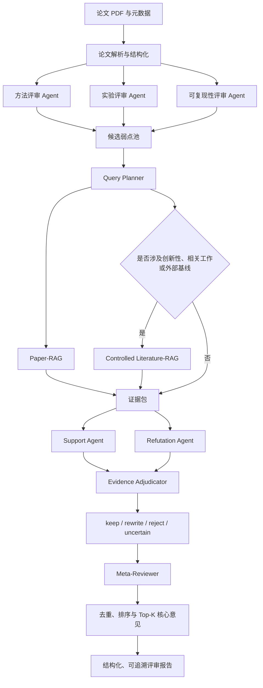

## 摘要

随着学术论文投稿数量持续增长，传统同行评审面临评审资源不足、反馈质量不稳定以及审稿意见缺乏证据支撑等问题。大语言模型能够生成形式完整的论文评审，但仍容易产生泛化意见、错误理解论文内容、遗漏关键实验问题，以及引用无法由论文或外部文献支持的批评。

本课题拟设计并实现 EviReview-Lite 自动化学术论文评审系统。系统以论文中的具体弱点为基本处理单元，首先由方法、实验和可复现性评审智能体生成候选评审意见；随后通过结构感知的 Paper-RAG 检索论文内部证据，并在涉及创新性、相关工作或基线完整性时，受控调用 Literature-RAG 获取外部文献证据；之后由 Support Agent 与 Refutation Agent 分别构建支持和反驳证据链，由 Evidence Adjudicator 将候选意见判定为 `keep`、`rewrite`、`reject` 或 `uncertain`；最终由 Meta-Reviewer 对有效意见进行去重、排序和压缩，生成可追溯的结构化论文评审报告。

课题重点研究多智能体协作、双重 RAG、双向证据审计与证据感知意见排序。系统不直接自动决定论文录用或拒稿，而是提供具有证据出处、审计过程和置信度的辅助评审结果。

**关键词：** 自动化同行评审；多智能体系统；检索增强生成；证据审计；学术论文评估

---

## 一、研究背景与意义

现有大语言模型已经能够生成语言流畅、结构完整的论文评审，但“形式合理”并不等同于“意见有效”。自动评审系统仍存在以下核心问题：

1. **评审意见缺乏证据追踪。** 模型可能指出论文不存在的问题，或忽略论文已经提供的实验、定义和解释。
2. **长文档理解不稳定。** 论文的研究动机、方法定义和实验结论分散在不同章节，简单分块检索容易丢失跨章节关系。
3. **外部知识调用缺乏边界。** 直接使用开放网络检索可能引入时间泄漏、不可靠来源和不可复现实验结果。
4. **多智能体系统容易放大错误。** 增加智能体数量并不必然提高评审质量，可能造成意见重复、成本增长和错误共识。
5. **自动评审评价方式不足。** 仅使用文本相似度或总体评分，无法判断意见是否由真实证据支撑。

因此，本课题不以“生成更多评审意见”为主要目标，而是研究如何对每条候选评审意见进行证据检索、支持与反驳、裁决和排序，从而提高自动评审意见的有效性、可解释性和可追溯性。

截至 **2026 年 6 月 15 日**，最新研究已开始从被动评审生成转向主动调查、文献定位、代码执行和可审计证据链。例如 FactReview、DeepReviewer 2.0 与 ProReviewer 均强调证据获取和过程控制，但相关方法仍主要处于预印本阶段。本课题将在可控的硕士毕业设计范围内，聚焦论文内部证据、受控外部文献证据和候选评审意见的双向审计。

---

## 二、国内外研究现状

### 2.1 大语言模型自动论文评审

MARG 使用多个智能体分别处理论文内容并进行讨论，能够降低泛化评审意见比例，但其重点仍是提高评审生成质量，而非逐条验证评审意见是否成立。ReviewAgents 模拟审稿人和领域主席的多阶段评审流程，并使用相关论文增强创新性判断。

CLAIMCHECK 将自动论文评审进一步转化为主张关联、弱点分类和主张验证任务。其研究表明，即使先进大语言模型能够生成合理批评，也仍难以稳定识别被批评的具体论文主张并完成可靠验证。

### 2.2 RAG 与科学文档检索

传统 RAG 将参数化语言模型与外部非参数知识库结合，为生成结果提供知识来源。对于学术论文评审，普通语义相似度检索不足以区分“方法定义”“实验结果”“消融研究”和“局限性说明”等不同证据类型。

PeerQA 提供了由真实同行评审问题构成的科学文档问答数据集，适合评估论文内部证据检索能力。RAGChecker 则提供了针对检索模块和生成模块的细粒度诊断指标，为本课题的 Paper-RAG 评价提供方法基础。

### 2.3 证据支撑与评审质量评价

SubstanReview 研究评审意见中的主张与证据关系，强调评审意见是否得到充分论证。ReviewCritique 对人工和模型评审中的误解、遗漏、越界和表面化意见进行细粒度标注。CLAIMCHECK 进一步提供论文弱点、对应论文主张、有效性、客观性和弱点类型标注。

现有研究尚未充分解决：如何同时检索“支持该批评成立”的证据和“证明该批评不成立”的证据，并基于两类证据输出结构化裁决。

---

## 三、研究目标

本课题的总体目标是实现一个能够生成、检索、审计和排序论文评审意见的自动化评审系统。

具体目标如下：

1. 构建面向论文评审的多智能体协作架构。
2. 实现结构感知、证据类型感知的 Paper-RAG。
3. 实现具有调用边界和来源控制的 Literature-RAG。
4. 构建候选评审意见级别的双向证据审计机制。
5. 构建证据感知的弱点过滤、去重与 Top-K 排序方法。
6. 建立模块化实验体系，分别评价候选生成、检索、审计和最终评审质量。
7. 输出带证据位置、审计状态和置信度的结构化评审报告。

### 研究问题

- **RQ1：** 结构和证据类型先验能否提升 Paper-RAG 的证据检索质量？
- **RQ2：** 双向证据审计能否减少错误评审意见和论文已有答案型意见？
- **RQ3：** 受控 Literature-RAG 能否提高创新性与缺失基线相关意见的可靠性？
- **RQ4：** 证据感知排序能否提高 Top-K 核心弱点的准确率与覆盖率？
- **RQ5：** 多智能体审计带来的质量增益是否能够覆盖其成本与延迟开销？

---

## 四、系统总体架构





---

## 五、Agent 架构设计

|智能体|输入|主要职责|输出|
|---|---|---|---|
|Method Reviewer|方法、理论、算法章节|检查方法合理性、定义完整性和技术缺陷|方法类候选弱点|
|Experiment Reviewer|实验、结果、消融章节|检查实验设计、基线、公平性和统计结论|实验类候选弱点|
|Reproducibility Reviewer|全文及附录|检查数据、参数、实现和复现信息|可复现性候选弱点|
|Query Planner|候选弱点与论文结构|生成内部检索查询、证据类型和外部检索路由|检索计划|
|Support Agent|候选弱点与证据包|寻找能够证明候选意见成立的证据|Support Case|
|Refutation Agent|候选弱点与证据包|寻找论文已回应或能够推翻候选意见的证据|Refutation Case|
|Evidence Adjudicator|支持与反驳证据链|判断意见是否保留、改写、拒绝或不确定|审计结果|
|Meta-Reviewer|全部审计结果|去重、排序、控制意见数量与整体一致性|最终评审报告|

系统对每条候选意见固定执行支持、反驳和裁决流程，不依赖争议触发器，也不引入人工复核节点。

---

## 六、双重 RAG 架构

### 6.1 Paper-RAG

Paper-RAG 仅检索当前被评审论文，负责验证候选意见能否由论文内部内容支持或反驳。

处理流程：

1. 将 PDF 解析为标题、摘要、章节、段落、表格描述和附录。
2. 为每个文档块保存章节路径、段落位置和证据类型。
3. 使用 BM25 与 Dense Retrieval 分别进行关键词和语义检索。
4. 使用 Reciprocal Rank Fusion 合并检索结果。
5. 根据目标章节和期望证据类型施加先验。
6. 对高排名段落进行邻接扩展，保留上下文。
7. 返回带来源位置的证据包。

候选弱点应映射至期望证据类型，例如：

|弱点类型|优先证据类型|
|---|---|
|方法定义不完整|方法定义、公式、算法描述|
|缺乏实验支持|实验结果、表格、消融实验|
|缺乏基线|实验设置、基线列表、相关工作|
|结论夸大|摘要、结论、结果数据|
|无法复现|参数、数据处理、附录、代码说明|

### 6.2 Controlled Literature-RAG

Literature-RAG 只在以下情况调用：

- 判断创新性或工作差异；
- 检查相关工作遗漏；
- 检查缺失的重要基线；
- 验证论文中的外部比较性主张。

检索流程为：查询规划 → 本地固定文献库检索 → 年份与主题过滤 → 文献元数据核验 → 证据片段返回。

为避免时间泄漏，外部文献按照被评审论文投稿时间进行过滤；所有外部证据必须保存标题、作者、年份、来源和检索位置。

---

## 七、双向证据审计方法

双向审计的基本单位不是整篇评审报告，而是单条候选弱点。

设候选弱点为 \(w_i\)，Paper-RAG 与 Literature-RAG 返回证据集合 \(E_i\)。Support Agent 构建支持证据链 \(S_i\)，Refutation Agent 构建反驳证据链 \(R_i\)。裁决器输出：

\[ d_i \in \{\text{keep},\text{rewrite},\text{reject},\text{uncertain}\} \]

- **keep：** 批评成立，且具有充分、直接证据；
- **rewrite：** 批评方向合理，但原始表述过强、不具体或证据不足；
- **reject：** 论文已经回应该问题，或证据表明该批评不成立；
- **uncertain：** 当前证据无法支持可靠结论。

每条最终意见包含：弱点描述、严重程度、对应论文主张、支持证据、反驳证据、证据位置、裁决结果、置信度和修改建议。

---

## 八、创新点

### 创新点一：评审意见级双向证据审计

不同于仅使用单一 Judge 判断意见正确与否，本研究显式分离支持证据链和反驳证据链。其核心价值是发现“看似合理但论文已经回答”的错误批评，并降低单向确认偏差。

### 创新点二：结构与证据类型感知的 Paper-RAG

在混合检索基础上，引入论文章节结构、期望证据类型和邻接上下文扩展。研究重点不是单纯检索相关文本，而是检索足以判断候选意见是否成立的证据。

### 创新点三：证据感知弱点过滤与 Top-K 排序

Meta-Reviewer 综合候选意见有效概率、证据充分性、严重程度、具体性、可操作性、重复程度与不确定性进行排序，减少大量低价值或重复意见。

### 创新点四：具有调用边界的 Literature-RAG

外部文献检索仅用于必须依赖外部知识的评审维度，并使用固定文献库、时间过滤和来源追踪控制检索风险。

### 创新点五：基于证据特征的辅助分类

系统可基于有效弱点数量、严重程度、证据覆盖率和不确定率形成辅助评估特征，但不将该模块描述为自动录用或拒稿系统。

---

## 九、数据来源

|数据源|用途|当前规模或说明|
|---|---|---|
|OpenReview 论文与 Official Reviews|完整论文评审生成与端到端测试|当前种子集含 10 篇论文、41 条正式评审|
|PeerQA|Paper-RAG 证据检索评价|579 个 QA 对；当前映射 136 个评价样本|
|CLAIMCHECK|弱点与论文主张关联、有效性评价|当前 60 个论文评审对、168 条弱点|
|SubstanReview|评审主张与证据支撑分析|550 条记录|
|ReviewCritique|人工与模型评审质量错误分析|100 篇人工评审论文、20 篇 LLM 评审论文|
|NLPeer|完整论文与同行评审扩展数据|需遵守访问与许可要求|
|本地固定文献库|Literature-RAG|当前 65 组文献文件|
|冻结 arXiv 未见论文|最终系统展示|当前 5 篇 PDF|

数据集将按照论文或论文评审对进行划分，避免同一论文的不同片段跨训练集与测试集造成泄漏。CLAIMCHECK 不直接提供 `covered/refuted` 金标准，因此相关指标必须使用额外标注集或明确标记为代理指标。

---

## 十、研究方法与项目流程

1. **文献研究法：** 分析自动论文评审、多智能体、RAG 和证据验证相关研究。
2. **系统设计法：** 将自动评审拆分为候选生成、检索、审计和排序模块。
3. **对照实验法：** 为每个模块设置简单基线、增强方法和完整方法。
4. **消融实验法：** 分别移除结构先验、证据类型先验、反驳 Agent 和排序特征。
5. **错误分析法：** 对错误意见、错误证据、错误裁决和重复意见进行分类。
6. **成本分析法：** 记录 token、模型请求次数、延迟和失败率。
7. **可复现研究法：** 固定配置、模型版本、随机种子、数据快照和实验输出。

具体项目流程为：

`数据准备 → 论文解析 → 候选生成 → 查询规划 → 双重检索 → 双向审计 → Meta-Reviewer → 模块实验 → 端到端实验 → 错误分析 → 报告撰写`

---

## 十一、Baseline 与实验设计

### 11.1 候选生成实验

- G0：Direct LLM Review
- G1：Structured Prompt Reviewer
- G2：Method、Experiment、Reproducibility 三评审 Agent

评价指标：Valid Candidate Precision、Weakness Coverage、Specificity、Generic Rate、Redundancy Rate、成本与延迟。

### 11.2 Paper-RAG 实验

- P0：BM25
- P1：Dense Retrieval
- P2：BM25 + Dense + RRF
- P3：P2 + Section Prior
- P4：P3 + Evidence-Type Prior + Neighbor Expansion

评价指标：Recall`@3/5/10`、MRR、nDCG@5、Section Match、Evidence-Type Match 和延迟。

### 11.3 Literature-RAG 实验

- L0：关键词与元数据检索
- L1：Dense Retrieval
- L2：Hybrid Retrieval
- L3：Hybrid + 年份、主题与引用过滤

评价指标：Recall`@5/10`、MRR、文献相关性、Citation Validity、Temporal Validity。

### 11.4 双向审计实验

- A0：No Verification
- A1：LLM-only Judge
- A2：Single Judge + Paper-RAG
- A3：Support-only + Adjudicator
- A4：Support + Refutation + Adjudicator

评价指标：Valid-Issue Precision、Adjudication Macro-F1、Evidence Attribution Accuracy、False-Keep Rate、`uncertain` 比例、成本和延迟。

### 11.5 Meta-Reviewer 实验

- K0：原始生成顺序
- K1：仅按严重程度排序
- K2：仅按证据充分性排序
- K3：Evidence-aware Ranker
- K4：Dual-RAG Meta-Reviewer

评价指标：Top-3/Top-5 Precision、nDCG@5、Major Weakness Coverage、Redundancy Rate、Evidence Coverage 与压缩率。

### 11.6 端到端实验

对比 Direct LLM、Structured Prompt、MARG-lite、Single Judge + Paper-RAG 和完整 EviReview-Lite。

主要成功标准包括：

- P4 相对最强 P0–P2 的 Recall@5 提升至少 5 个百分点；
- A4 相对 A2 的有效意见精度和审计相关指标取得明确提升；
- Evidence Attribution Accuracy 不低于 0.75；
- A4 成本不超过 A2 的 2.5 倍；
- 最终 Top-K 意见具有更高有效性、更低重复率和更完整证据来源。

---

## 十二、技术栈与工程架构

- **语言与环境：** Python 3.12、虚拟环境、pytest
- **数据建模：** Pydantic、Pydantic Settings
- **模型调用：** OpenAI-compatible API、httpx
- **当前实验模型：** Agnes `agnes-2.0-flash`
- **检索：** BM25、Sentence Transformers、BAAI/bge-base-en-v1.5、RRF
- **配置：** YAML、环境变量
- **数据与结果格式：** JSON、JSONL、CSV、Markdown
- **可选扩展：** Qdrant、Redis
- **系统形态：** 后端实验系统，不建设前端

分层工程结构：

```
实验/
├── conf/                   # 模型、检索和实验配置
├── dataset/                # 原始数据、处理数据和数据说明
├── src/evireview/
│   ├── agent/              # Reviewer、Support、Refutation、Adjudicator
│   ├── conf/               # 配置加载
│   ├── dao/                # 数据访问
│   ├── evaluation/         # 指标和评价器
│   ├── models/             # 结构化数据模型
│   ├── rag/                # Paper-RAG 与 Literature-RAG
│   └── service/            # 工作流编排
├── scripts/                # 实验执行与数据准备脚本
├── tests/                  # 单元测试与实验验证测试
├── outputs/                # 实验原始输出
└── reports/                # 实验分析报告
```

---

## 十三、已有工作与初步实验结果

当前工程已完成基础目录、数据集引导、Paper-RAG 正式实验和 CLAIMCHECK 审计 Pilot，并通过现有自动化测试与实验验证器。

但初步结果尚未证明完整创新方案有效：

- Paper-RAG 中，P2 与 P4 的 Recall@5 均为 **0.2863**，P4 未超过混合检索基线；
- CLAIMCHECK 主张关联任务中，BM25 Recall@5 为 **0.7656**，优于 Dense 和简单 Hybrid；
- Agnes Pilot20 中，A1 的 Macro-F1 为 **0.3439**，A4 仅为 **0.1739**；
- A4 的 Evidence Attribution Accuracy 达到 **1.0000**，但 token 成本为 A2 的 **3.1516 倍**；
- 当前 A4 实验结论为 `failed_with_metrics`，不应直接扩大实验规模。

这些负结果说明结构先验和增加智能体并不会自然提高性能。后续研究应重点改进查询规划、证据压缩、审计提示词和裁决输入结构，并在正式扩展前进行一次受控优化验证。

---

## 十四、进度安排

|阶段|主要任务|
|---|---|
|第 1–2 周|完善文献综述、数据许可和评价协议|
|第 3–5 周|优化 Paper-RAG、完成检索消融实验|
|第 6–8 周|完成双向证据审计优化与正式实验|
|第 9–10 周|实现 Literature-RAG 与外部证据评价|
|第 11–12 周|实现 Meta-Reviewer 与端到端实验|
|第 13–14 周|完成错误分析、成本分析和案例研究|
|第 15–16 周|撰写论文、整理代码与实验复现材料|

---

## 十五、风险与限制

1. 现有数据集不能完整覆盖所有评审弱点类型。
2. CLAIMCHECK 不提供直接的 `covered/refuted` 标签，不能虚构对应金标准。
3. LLM 裁决器可能继承模型偏差，必须结合代理指标和人工数据集标签分析。
4. Literature-RAG 存在时间泄漏和引用错误风险。
5. 双向审计成本较高，当前 Pilot 已超过预设成本目标。
6. 最新的 FactReview、DeepReviewer 2.0 和 ProReviewer 为近期预印本，其结论仍需谨慎引用。
7. 系统定位为辅助评审工具，不替代领域专家和正式同行评审流程。

---

## 十六、预期成果

1. 一个可运行、可配置的 EviReview-Lite 自动评审原型系统。
2. 一套结构感知 Paper-RAG 与受控 Literature-RAG 实现。
3. 一套候选评审意见级双向证据审计方法。
4. 一套模块化 Baseline、消融实验和评价指标体系。
5. 一份包含证据出处、审计状态和置信度的结构化评审报告。
6. 完整实验代码、配置、数据说明、实验结果与毕业论文。

---

## 参考文献

1. Lewis, P. et al. [Retrieval-Augmented Generation for Knowledge-Intensive NLP Tasks](https://arxiv.org/abs/2005.11401). 2020.
2. D’Arcy, M. et al. [MARG: Multi-Agent Review Generation for Scientific Papers](https://arxiv.org/abs/2401.04259). 2024.
3. Dycke, N. et al. [NLPeer: A Unified Resource for the Computational Study of Peer Review](https://aclanthology.org/2023.acl-long.277/). 2023.
4. Shang, G. et al. [Automatic Analysis of Substantiation in Scientific Peer Reviews](https://aclanthology.org/2023.findings-emnlp.684/). 2023.
5. Ru, D. et al. [RAGChecker: A Fine-grained Framework for Diagnosing Retrieval-Augmented Generation](https://arxiv.org/abs/2408.08067). 2024.
6. Du, J. et al. [LLMs Assist NLP Researchers: Critique Paper (Meta-)Reviewing](https://arxiv.org/abs/2406.16253). 2024.
7. Ou, J. et al. [CLAIMCHECK: How Grounded are LLM Critiques of Scientific Papers?](https://arxiv.org/abs/2503.21717). 2025.
8. Baumgärtner, T. et al. [PeerQA: A Scientific Question Answering Dataset from Peer Reviews](https://aclanthology.org/2025.naacl-long.22/). 2025.
9. Wang, Y. et al. [Bridging the Gap Between Human and AI-Generated Paper Reviews](https://arxiv.org/abs/2503.08506). 2025.
10. Xu, H. et al. [FactReview: Evidence-Grounded Reviews with Literature Positioning and Execution-Based Claim Verification](https://arxiv.org/abs/2604.04074). 2026.
11. Weng, Y. et al. [DeepReviewer 2.0: A Traceable Agentic System for Auditable Scientific Peer Review](https://arxiv.org/abs/2604.09590). 2026.
12. Fang, H. et al. [From Passive Generation to Investigation: A Proactive Scientific Peer Review Agent](https://arxiv.org/abs/2606.13349). 2026.

**Autoresearch 验收结论：** 本报告已覆盖 Agent 架构、双重 RAG 架构、创新点、研究目标、数据源、研究方法、项目流程、Baseline、评价指标、技术栈、实验目录、初步结果、风险与参考论文。报告保留了当前 P4 与 A4 的负实验结果，未虚构 CLAIMCHECK 的 `covered/refuted` 金标准，也未将辅助评估描述为自动录用决策。